# 如何用线性回归对时间序列数据建模

> 原文：<https://towardsdatascience.com/how-to-model-time-series-data-with-linear-regression-cd94d1d901c0?source=collection_archive---------0----------------------->

## [探索时间序列建模](https://towardsdatascience.com/tagged/time-series-modeling)

## 用 Python 代码进行时间序列建模


在 [Unsplash](https://unsplash.com?utm_source=medium&utm_medium=referral) 上 [tangi bertin](https://unsplash.com/@tangib?utm_source=medium&utm_medium=referral) 拍摄的照片

欢迎回来！这是[专栏](https://towardsdatascience.com/tagged/time-series-modeling)的第 4 篇文章，探讨用 Python 代码分析和建模时间序列数据。在前三篇文章中，我们已经介绍了[](/fundamental-statistics-7770376593b)**[**单个时间序列变量的分析**](/how-to-analyse-a-single-time-series-variable-11dcca7bf16c) 和 [**多个时间序列变量的分析**](/how-to-analyse-multiple-time-series-variable-5a8d3a242a2e) 。从这篇文章开始，我们将进一步探索使用线性回归建模时间序列数据。**

# **1.普通最小二乘法(OLS)**

**我们在学校都学过线性回归，线性回归的概念似乎很简单。给定因变量 y 对自变量 x 的散点图，我们可以找到一条与数据非常吻合的直线。但是等一下，我们如何衡量一条线是否很好地符合数据？我们不能只是将图形可视化，然后说某条线比其他线更符合数据，因为不同的人可能会做出不同的评估决策。如何才能量化评价？**

**普通最小二乘法(OLS)是一种量化评价不同回归线的方法。根据 OLS，我们应该选择使观察到的因变量和预测的因变量之间的差的平方和最小化的回归线。**

**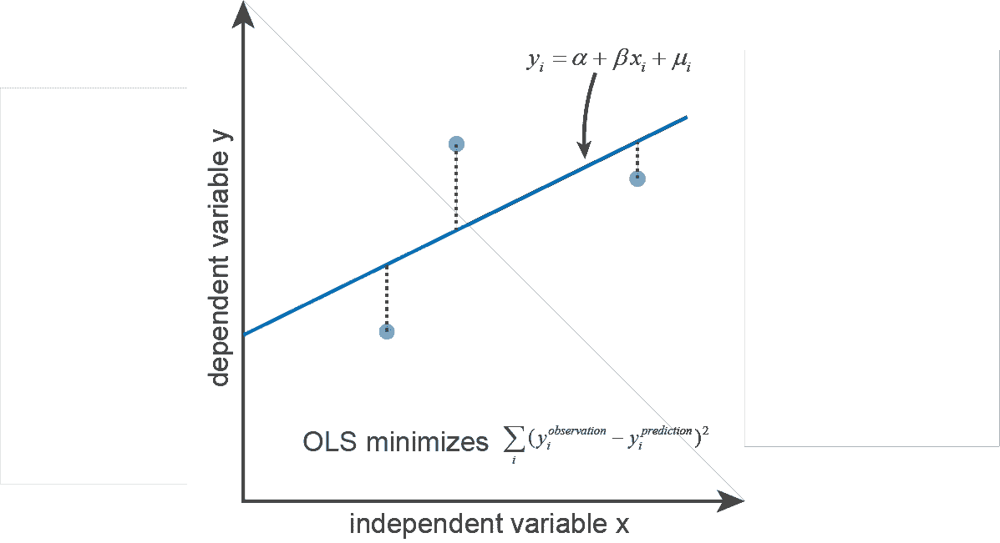**

**OLS 回归图解**

# **2.高斯-马科夫假设**

**根据 OLS 的评价标准，我们可以找到一条最符合观测数据的直线。该行的一般格式是:**

****

**在这里，μᵢ是剩余的术语，是 yᵢ的一部分，xᵢ.无法解释我们可以根据 OLS 的要求找到这条最好的回归线，但是我们能肯定 OLS 产生了最好的估计量吗？一个例子是，当存在异常值时，根据 OLS 计算出的“最佳”回归线显然不符合观察到的数据。**

**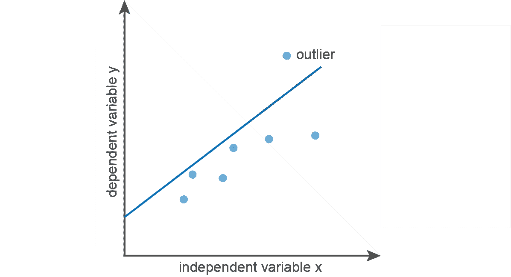**

**OLS 没有生成描述数据的最佳回归线的情况**

****2.1 截面数据的高斯-马尔可夫假设****

**事实证明，只有当某些假设得到满足，OLS 计算出最好的线性无偏估计量(蓝色)，很好地估计人口参数。对于横截面数据，高斯-马科夫假设有六个假设，确保使用 OLS 计算的估计量是蓝色的。当任何一个高斯-马科夫假设被违反时，使用 OLS 计算的样本参数不再能很好地代表总体参数。**

1.  **参数的线性。这个假设要求参数β是线性的。然而，对自变量的线性没有要求。yᵢ=α + βxᵢ +μᵢ和 yᵢ=α + βIn(xᵢ) +μᵢ都有线性β。**
2.  **自变量 x 和因变量 y 都是随机变量。值得一提的是，如果 x 和 y 都是随机变量，则余项μ不会自相关。**
3.  **多个独立变量 x₁和 x₂.之间不存在完美的共线性如果存在完美的共线性，线性回归结果将是随机的，因为它不能区分 x₁和 x₂.的贡献通常，当 R 结果很好，但每个独立变量的 t 检验很差时，这表明存在共线性。**
4.  **剩余项μ是内生的。要内生性，μᵢ不随 xᵢ.而变它可以表达为 cov(μᵢ，xᵢ)=0.内生性可能产生于反向因果关系或 x 中的测量误差，导致 cov(μᵢ，xᵢ)！=0.**
5.  **剩余项μᵢ.的同方差性它要求μᵢ的方差不随 xᵢ.而变**
6.  **剩余项μᵢ.没有自相关它可以表达为 cov(μᵢ，μⱼ)=0.μᵢ的自相关可由遗漏的独立变量、错误指定的回归函数、独立变量中的测量误差和聚类误差引起。**

****时间序列数据的 2.2 高斯-马尔可夫假设****

**时间序列数据与横截面数据略有不同。对于横截面数据，我们从总体中获取样本，高斯-马尔可夫假设要求自变量 x 和因变量 y 都是随机变量。对于时间序列数据，我们是从同一个过程中得到样本，不能再假设自变量 x 是随机变量。因此，高斯-马尔可夫假设对于时间序列数据在内生性、同方差性和无自相关性方面更为严格。由于 x 不再是一个随机变量，需要满足所有时间点的所有 xₖ的要求，而不仅仅是剩余项μᵢ.在该时间点的 xᵢ**

# **3.线性回归的假设检验**

****3.1 Python 中的线性回归****

**这里，我们继续使用从[雅虎财经](https://sg.finance.yahoo.com/quote/AAPL/)获得的历史 AAPL 价格和间谍价格。我们先把 AAPL 价格和间谍价格分开。然后，为了发现 AAPL 价格在多大程度上可以由整体股票市场价格来解释，我们将建立以 SPY 价格为自变量 x 和 AAPL 价格为因变量 y 的线性回归模型**

**使用 Python 中的 statsmodels 库可以轻松完成线性回归。**

```
import numpy as np
import pandas as pd
import matplotlib.pyplot as plt
import statsmodels.api as smAAPL_price = pd.read_csv('AAPL.csv',usecols=['Date', 'Close'])
SPY_price = pd.read_csv('SPY.csv',usecols=['Date', 'Close'])X = sm.add_constant(SPY_price['Close'])
model = sm.OLS(AAPL_price['Close'],X)
results = model.fit()plt.scatter(SPY_price['Close'],AAPL_price['Close'],alpha=0.3)
y_predict = results.params[0] + results.params[1]*SPY_price['Close']
plt.plot(SPY_price['Close'],y_predict, linewidth=3)plt.xlim(240,350)
plt.ylim(100,350)
plt.xlabel('SPY_price')
plt.ylabel('AAPL_price')
plt.title('OLS Regression')print(results.summary())
```

**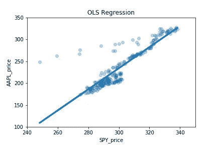**

**连同可视化 OLS 线性回归结果的绘图，我们可以打印一个汇总表，如下所示:**

**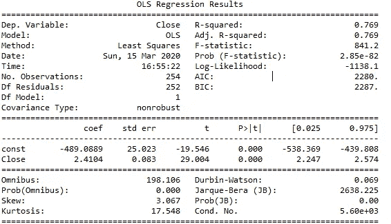**

**我们为什么要做这些复杂的假设检验？我们如何解释这些假设检验结果？我们将在接下来的会议中回答这些问题。**

****3.2 为什么要对线性回归进行假设检验？****

**由于我们使用样本来估计总体，我们需要评估样本参数估计总体参数的效果。对样本参数进行假设检验，需要知道样本参数分布。**

**根据中心极限定理，当样本量足够大时，β的样本分布为正态分布:**

****

**然而，我们不知道确切的总体剩余方差(σ)。我们可以用样本残差方差(σʰᵃᵗ)来估计总体残差方差，但这样样本β分布就不再是正态分布了。它变成了 t 分布:**

******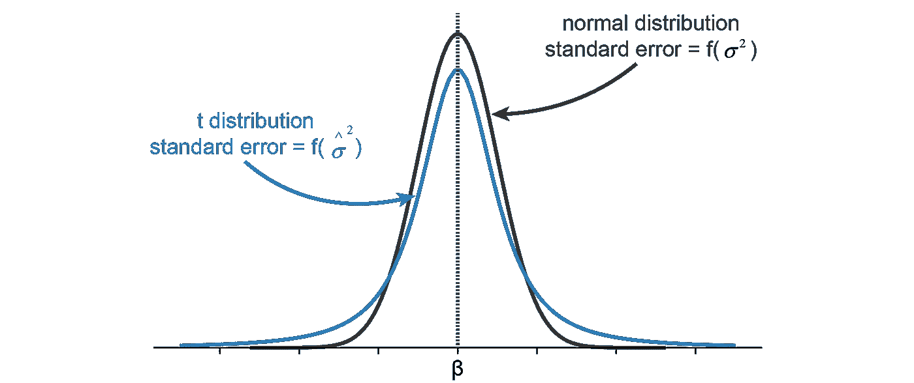**

**β的样本分布服从 t 分布，因为我们不确切知道总体残差方差的方差。标准误差是样本参数的方差。**

****3.3 如何解读 OLS 统计摘要？****

**现在是时候回到 OLS 回归结果表，并尝试解释汇总结果。**

**汇总表的第一部分有 R 和 F 统计量，它们衡量自变量对因变量的总体解释能力。**

**r 是解释的误差平方和除以误差平方和。R 介于 0 和 1 之间，R 越大，说明自变量能更好地解释因变量。R =解释的误差平方和/误差平方和。自变量越多，得到的 R 将越接近 1，但同时，自变量越多可能导致过拟合。通过惩罚多余的自变量，调整后的 R 偏好较少的自变量。**

**独立变量联合效应的统计检验。F 统计检验的低 p 值表明自变量不能很好地解释因变量。**

**汇总表的第二部分是 t 统计量，对每个独立变量进行测试。同时使用 F 统计量和 t 统计量有助于检查自变量中是否存在共线性。好的 F 统计量和差的 t 统计量表示共线性。**

**Durbin-Watson 和 Jarque-Bera 在第三次会议的汇总表中报告了残差项的平稳性和正态性，这将在下面的会议中详细讨论。**

# **4.线性回归残差**

**剩余项很重要。通过使用残差项检查高斯-马科夫假设是否成立，我们可以推断线性回归的质量。**

**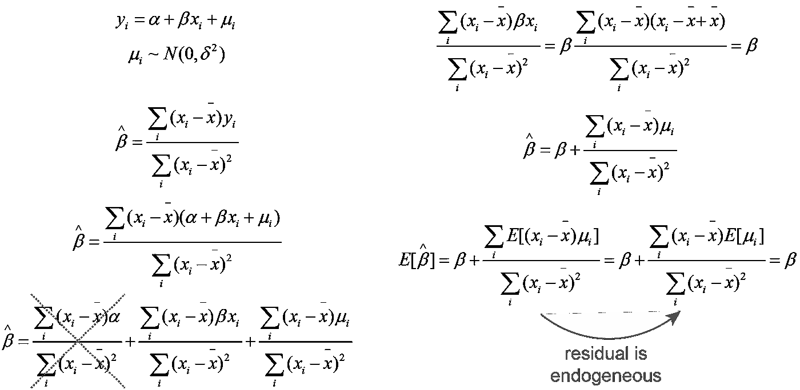**

**样本β的期望值**

**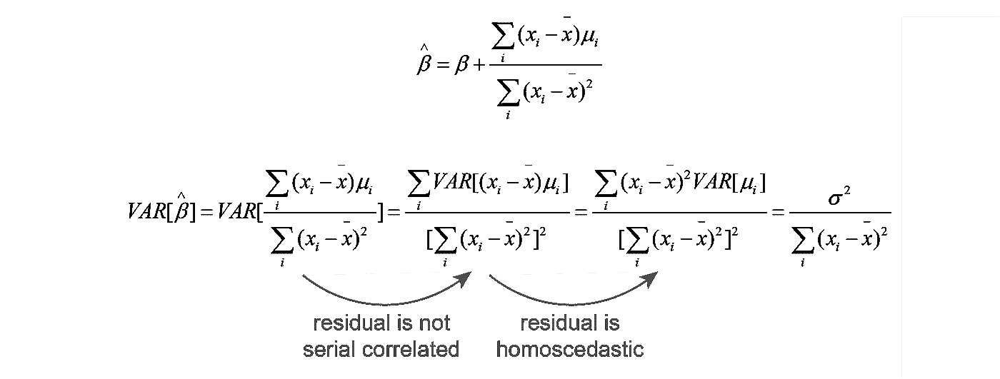**

**样本β的方差**

**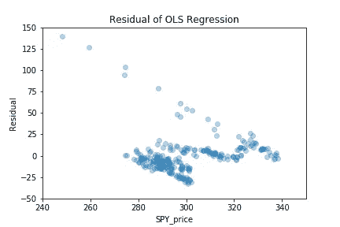**

****4.1 常态测试****

**检验残差是否正态分布是很重要的。如果残差不是正态分布的，则残差不应用于 z 检验或任何其他从正态分布导出的检验，如 t 检验、f 检验和 chi2 检验。**

**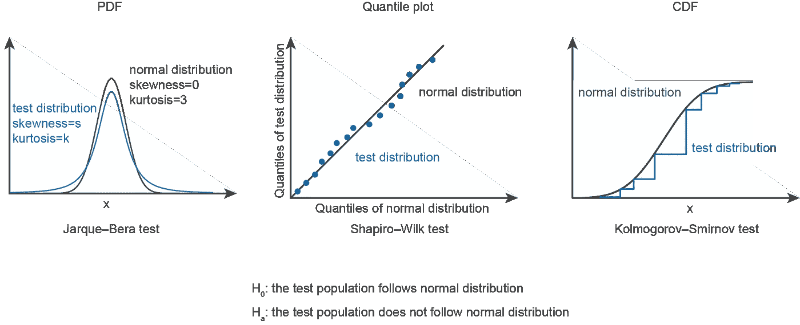**

```
import pandas as pd
import statsmodels.api as sm
from scipy import statsAAPL_price = pd.read_csv('AAPL.csv',usecols=['Date', 'Close'])
SPY_price = pd.read_csv('SPY.csv',usecols=['Date', 'Close'])X = sm.add_constant(SPY_price['Close'])
model = sm.OLS(AAPL_price['Close'],X)
results = model.fit()residual = AAPL_price['Close']-results.params[0] - results.params[1]*SPY_price['Close']print('p value of Jarque-Bera test is: ', stats.jarque_bera(residual)[1])
print('p value of Shapiro-Wilk test is: ', stats.shapiro(residual)[1])
print('p value of Kolmogorov-Smirnov test is: ', stats.kstest(residual, 'norm')[1])
```

**输出:**

**雅尔克-贝拉检验的 p 值为:0.0
夏皮罗-维尔克检验的 p 值为:9.164991873555915e-20
科尔莫戈罗夫-斯米尔诺夫检验的 p 值为:1.134826980654097 e-55**

**如果我们选择 0.05 的显著性水平，那么所有三个正态性检验都表明残差项不遵循正态分布。**

****4.2 同质性测试****

**三种常用的异方差统计检验是 Goldfeld-Quandt 检验、Breusch-Pagan 检验和 White 检验。在同样的序列中，检验更一般的同质性。**

**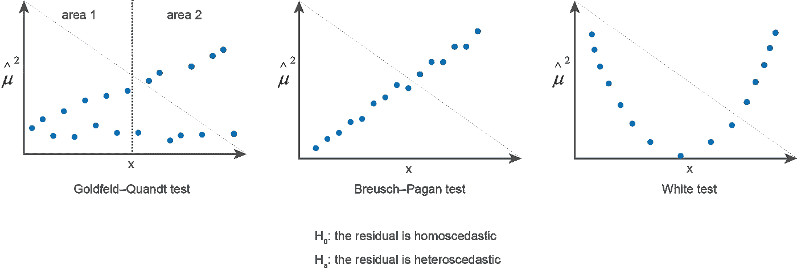**

```
import numpy as np
import pandas as pd
import matplotlib.pyplot as plt
import statsmodels.api as sm
import statsmodels.stats.api as smsAAPL_price = pd.read_csv('AAPL.csv',usecols=['Date', 'Close'])
SPY_price = pd.read_csv('SPY.csv',usecols=['Date', 'Close'])X = sm.add_constant(SPY_price['Close'])
model = sm.OLS(AAPL_price['Close'],X)
results = model.fit()residual = AAPL_price['Close']-results.params[0] - results.params[1]*SPY_price['Close']print('p value of Goldfeld–Quandt test is: ', sms.het_goldfeldquandt(results.resid, results.model.exog)[1])
print('p value of Breusch–Pagan test is: ', sms.het_breuschpagan(results.resid, results.model.exog)[1])
print('p value of White test is: ', sms.het_white(results.resid, results.model.exog)[1])
```

**输出是:**

**Goldfeld–Quandt 试验的 p 值为:2.3805273535080445 e-38
breus ch–Pagan 试验的 p 值为:2.599557770260936e-06
白色试验的 p 值为:1.0987132773425074e-22**

**如果我们选择 0.05 的显著性水平，那么所有三个正态性检验都表明残差项不遵循正态分布。**

****4.3 平稳性测试****

**Durbin-Watson 测试检测滞后为 1 的残差项的自相关，而 Breusch-Godfrey 测试检测滞后为 N 的残差项的自相关，具体取决于测试中的设置。**

```
import numpy as np
import pandas as pd
import matplotlib.pyplot as plt
import statsmodels.api as smAAPL_price = pd.read_csv('AAPL.csv',usecols=['Date', 'Close'])
SPY_price = pd.read_csv('SPY.csv',usecols=['Date', 'Close'])X = sm.add_constant(SPY_price['Close'])
model = sm.OLS(AAPL_price['Close'],X)
results = model.fit()import statsmodels.stats.api as sms
print('The Durbin-Watson statistic is: ', sms.durbin_watson(results.resid))
print('p value of Breusch-Godfrey test is: ', sms.acorr_breusch_godfrey(results,nlags=1)[3])
```

**输出:**

**德宾-沃森统计量为:0.06916423461968918
布氏-戈弗雷检验的 p 值为:4.6463126097712 e-150**

**Durbin-Watson 和 Breusch-Godfrey 检验都表明滞后为 1 的剩余项存在自相关。当德宾-沃森统计量为 2 时，不存在自相关。当德宾-沃森统计量趋向于 0 时，存在正自相关。**

# **5.解决违反高斯-马科夫假设的问题**

****5.1 违反高斯-马科夫假设****

**当违反高斯-马科夫假设时，从样本计算出的估计量不再是蓝色的。下表显示了违反 Gauss-Marcov 假设如何影响线性回归质量。**

**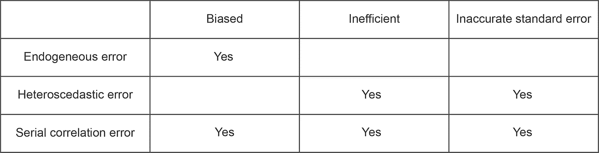**

****5.2 加权最小二乘法(WLS)****

**为了解决异方差误差，可以使用加权最小二乘法(WLS)。WLS 变换自变量和因变量，因此 OLS 在变换后保持蓝色。**

****

****5.3 广义最小二乘法(GLS)****

**为了考虑异方差误差和序列相关误差，可以使用广义最小二乘法(GLS)。GLS 转换自变量和因变量的方式比 WLS 更复杂，因此 OLS 在转换后仍为蓝色。**

**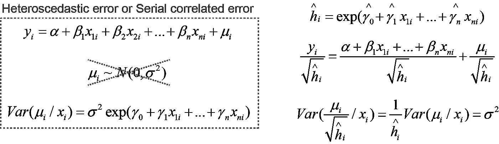**

# **摘要**

**在这篇文章中，我们了解到只有当高斯-马科夫假设成立时，OLS 才能产生好的估计量。因此，线性回归后，检查残差项以确保不违反高斯-马科夫假设总是很重要的。幸运的是，使用 Python 中的 statsmodels 库，在线性回归过程中会自动进行许多统计测试。OLS 线性回归汇总表的简单打印使我们能够快速评估线性回归的质量。如果违反了高斯-马科夫假设，WLS 和 GLS 的进一步解决方案也可用于转换自变量和因变量，使 OLS 保持蓝色。**

**希望您喜欢使用线性回归学习时间序列数据建模！**