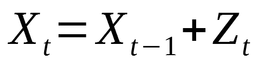
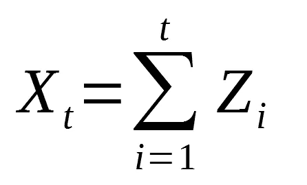
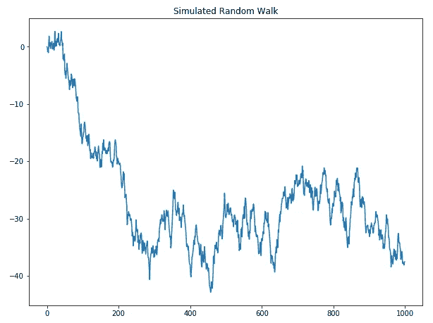
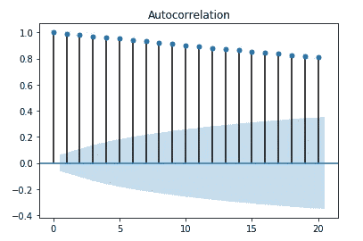
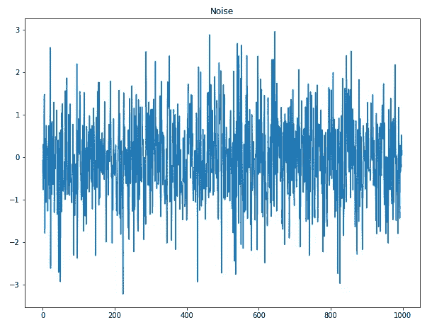
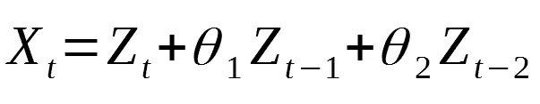
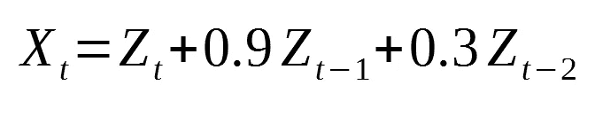
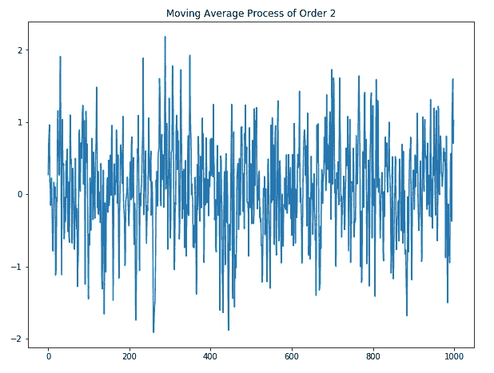
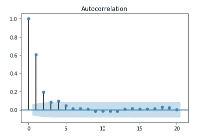

# 如何用 Python 建模时间序列

> 原文：<https://towardsdatascience.com/how-to-model-time-series-in-python-9983ebbf82cf?source=collection_archive---------29----------------------->

## 理解随机游走模型和移动平均过程


在 [Unsplash](https://unsplash.com?utm_source=medium&utm_medium=referral) 上由[尹新荣](https://unsplash.com/@insungyoon?utm_source=medium&utm_medium=referral)拍摄的照片

在本文中，我们引入两个模型来开始建模时间序列:

*   随机游动
*   移动平均过程

这篇文章旨在实践。所以，一定要开始你的 Jupyter 笔记本，并遵循！

完整的笔记本可以在[这里](https://github.com/marcopeix/time-series-analysis/tree/master/2.%20Basic%20Modelling)找到。

我们开始吧！

> 深入时间序列分析，应用高级模型，如 SARIMAX、VARMAX、CNN、LSTM、ResNet、自回归 LSTM 等，并使用 Python 中的[应用时间序列分析。](https://www.datasciencewithmarco.com/offers/tdU2mtVK)

# 随机行走模型

随机行走模型由以下公式表示:



随机游动

换句话说，这意味着当前时间 *t* 的位置是先前位置和噪声之和，用 *Z* 表示。这里，我们假设噪声是正态分布的(均值为 0，方差为 1)。

当然，我们从 0 开始随机行走，我们可以说任何时间点都是到那时为止所有噪声的总和。数学上:



从 0 开始的随机漫步

让我们用 Python 模拟一次随机漫步。

首先，我们将导入本文这一部分和下一部分所需的所有库:

```
from statsmodels.graphics.tsaplots import plot_acf
from statsmodels.tsa.arima_process import ArmaProcess
from statsmodels.tsa.stattools import acfimport matplotlib.pyplot as plt
import numpy as np%matplotlib inline
```

然后，我们生成一个包含 1000 个数据点的数据集。起点为 0，我们将随机噪声添加到上一个点，以生成下一个点:

```
steps = np.random.standard_normal(1000)
steps[0]=0
random_walk = np.cumsum(steps)
```

绘制数据集时，我们看到以下内容:

```
plt.figure(figsize=[10, 7.5]); # Set dimensions for figure
plt.plot(random_walk)
plt.title("Simulated Random Walk")
plt.show()
```



模拟随机行走

现在，你的随机游走可能与上面的图不同，因为噪声是完全…随机的。因此，也许你的随机漫步实际上是在时间中向上移动。

现在，让我们来看看随机游走的自相关图(或相关图):

```
random_walk_acf_coef = acf(random_walk)
plot_acf(random_walk, lags=20);
```



随机游走的相关图

不管你的随机漫步看起来像什么，你应该得到一个非常相似的相关图。如你所见，即使有 20 的滞后，相关性也是非常重要的。因此，该过程不是静止的。

现在，一切都表明我们的数据集中存在一种趋势。有可能消除这种趋势吗？

是啊！

知道一个随机游走给前一个点增加了一个随机噪声，如果我们取每个点和它前一个点的差，就应该得到一个纯随机的随机过程。

让我们用 Python 来验证一下。为了区别对待，我们做到了:

```
random_walk_diff = np.diff(random_walk, n=1)
```

然后，我们绘制结果，我们应该得到:

```
plt.figure(figsize=[10, 7.5]); # Set dimensions for figure
plt.plot(random_walk_diff)
plt.title('Noise')
plt.show()
```



噪音

如你所见，上面的图在趋势和方差上没有系统的变化，也没有季节性。因此，我们肯定有一个纯粹的随机过程。

查看差异的相关图:

```
plot_acf(random_walk_diff, lags=20);
```


随机过程的相关图

我们看到这是一个纯随机过程的相关图，自相关系数在滞后 1 时下降。

# 移动平均过程

让我们从什么是均线过程的直觉开始。

假设你将一块石头扔进一池水中，并且随着时间的推移，你正在追踪水面上单个水滴的位置。当然，当岩石撞击表面时，会形成波纹，所以我们的水滴会上下移动。现在，让我们假设表面上的波纹只持续两秒钟，之后表面就完全变平了。

那么，我们可以说，我们的水滴的位置可以表示为:



二阶移动平均过程

上式表示，时间 *t* 的位置 X 取决于时间 *t* 的噪声，加上时间 *t-1* 的噪声(具有一定权重*θ*)，加上时间 *t-2* 的一些噪声(具有一定权重)。

这称为二阶移动平均过程，也可以表示为 MA(2)。

广义的符号是 MA(q)。在上面的例子中，q = 2。

让我们用 Python 来模拟这个过程。

具体来说，我们将模拟以下过程:



这又是一个 2 阶移动平均过程，但是我们指定了权重。您可以随意更改它们并试验参数。

我们从指定滞后开始。这里，我们使用的是滞后 2。

```
ar2 = np.array([2])
```

然后，我们指定权重。在本例中，权重为[1，0.9，0.3]。

```
ma2 = np.array([1, 0.9, 0.3])
```

最后，我们模拟该过程并生成一千个数据点:

```
MA2_process = ArmaProcess(ar2, ma2).generate_sample(nsample=1000)
```

现在，让我们想象一下这个过程及其相关图:

```
plt.figure(figsize=[10, 7.5]); # Set dimensions for figure
plt.plot(MA2_process)
plt.title('Moving Average Process of Order 2')
plt.show()plot_acf(MA2_process, lags=20);
```



二阶模拟移动平均过程

同样，由于噪声是随机产生的，您的图形可能与我的不同。然而，相关图应该类似于下图:



MA 的相关图(2)

正如你注意到的，在滞后 2 之前，相关性是显著的。之后，相关性不再显著。这是有意义的，因为我们指定了一个滞后为 2 的公式。

这意味着你可以使用相关图来推断时间序列的滞后。如果您发现在特定的滞后 *q* 之后，相关性不显著，那么您可以将您的时间序列建模为 MA(q)过程。

就是这样！你现在了解了什么是随机漫步以及如何模拟它。此外，您还学习了移动平均线过程，如何对它们建模，最重要的是，如何确定移动平均线过程的顺序。

通过以下实践课程了解有关时间序列的更多信息:

*   [在 Python 中应用时间序列分析](https://www.datasciencewithmarco.com/offers/tdU2mtVK)

干杯！