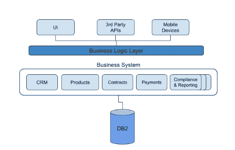
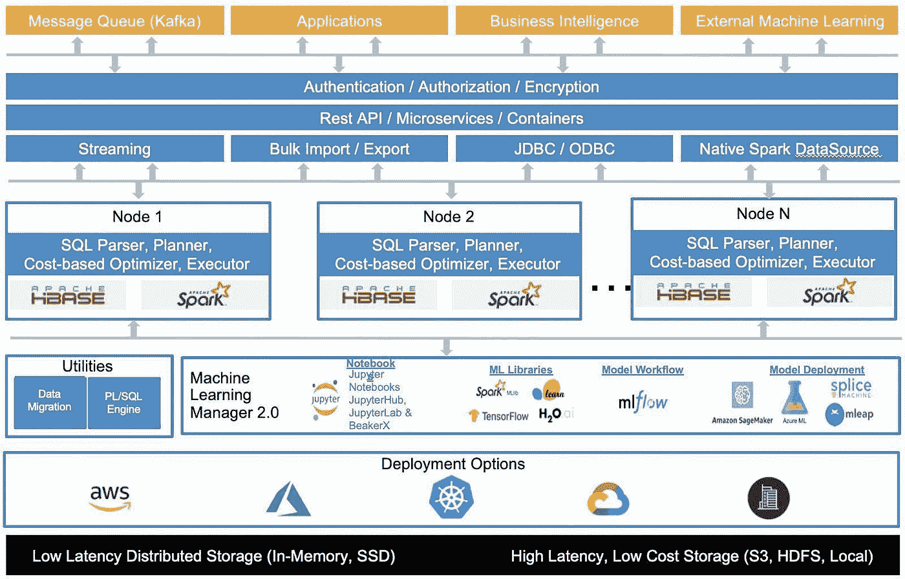
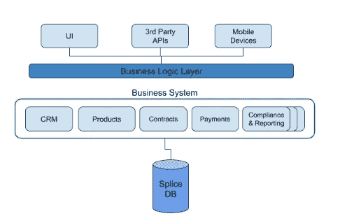
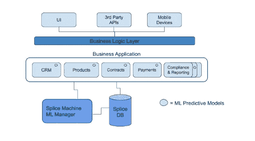

# 如何削减 Db2 但保留您的代码

> 原文：<https://towardsdatascience.com/how-to-modernize-a-legacy-db2-application-d7f56bb6d21c?source=collection_archive---------23----------------------->

蒙特·兹韦本，吉恩·戴维斯和卡罗尔·皮尔森

资料来源:BillionPhotos.com/Adobe

这是一个关于由 DB2 支持的遗留应用程序现代化的故事。它描绘了一个将应用程序迁移到云并使用人工智能扩展它的旅程——无需更改该遗留应用程序中的任何应用程序或 SQL 代码。

# 背景

我们最近与埃森哲合作，会见了世界上最具标志性的金融服务公司之一，该公司意识到，为了快速进入新兴市场，它需要使其企业业务系统更加灵活。该应用程序运行其业务的重要部分。它管理多个企业和国家的客户、接触点、产品、合同和支付/支出。几十年来，该公司在应用程序的业务逻辑和底层 SQL 代码上投入了大量资金，不想丢掉这一极具竞争力的资产。

来源:拼接机

该公司面临的问题是，它希望迅速扩张到新兴市场。为了最大限度地加快上市速度，该公司需要在创纪录的时间内实施这一全面的应用程序，使用新配置的产品和服务来满足当地需求和新市场的法规。不幸的是，这传统上需要在每个地区建立一个新的数据中心，但这限制太多了。

此外，该公司向全球其他公司推出了新的 SaaS 商务产品。随着他们获得新的 SaaS 客户，他们现在面临着快速扩展应用程序的实施和运营的需求。

# 解决方案:云迁移

资料来源:ktsdesign/Adobe

基于云的架构将使企业能够根据本地需求配置其产品和服务，从而实现显著加快上市时间的目标。对于 IT 组织来说，迁移到云的好处也是显而易见的。它希望避免供应商锁定并保持云主权，即时提升存储和计算资源而无需采购新硬件，并从各种即时可用的服务中进行选择。通过迁移到云，该公司将拥有基于消费的定价的可预测性和灵活性，因此它可以避免扩大 it 预算。

基于云的架构可以独特地解决业务和 IT 问题，而无需在每个市场都建立新的数据中心。

# 扩展应用:注入人工智能

但该公司有更大的抱负，不仅仅是云敏捷性。他们希望在实时业务应用中直接使用机器学习(ML)。他们已经投资了人工智能和人工智能，并建立了几个预测模型，在检测欺诈、个性化营销报价、风险定价等方面与人类团队相媲美。但是由于体系结构的限制，他们不能将这些模型直接操作到企业业务系统中。

大多数 ML 部署都有独立的计算阶段。通常，原始运营数据是从交易系统中提取的，通过分析引擎转化为客户和相关数据的摘要，然后发送到统计机器学习框架来训练模型。这本来就是一个缓慢的过程，并且由于通常与业务应用程序分离的模型部署的延迟而加剧。有时这个过程可能太长，以至于运行数据变化太快，模型无法准确预测。

该公司有更广阔的视野。如果您可以将预测模型直接注入到业务应用程序中，以便在第一次通知损失时直接预测索赔欺诈，或者在客户就计费问题致电呼叫中心时向他们提供非常及时和个性化的报价，情况会怎样？

为此，他们想探索一种新的方法。称之为“应用程序翻新”。云迁移将为他们带来灵活性，但也可能成为一个新的可扩展平台的基础，该平台可以支持内嵌智能，而 ML 是业务应用的原生产品。

所以他们的问题是，是否有现代数据库可以促进这种云和人工智能的旅程。

# 从 DB2 到云

几十年来，DB2 数据库在行业中占据了至高无上的地位，这是有充分理由的:DB2 为应用程序提供了可靠的、符合 ACID 的性能和强大的动力。架构师和开发人员喜欢它的可靠性、全面的 SQL 和低延迟操作。

该公司意识到，如果它想利用多样化数据、人工智能和云可用性的结构性转变，可能还有其他现代数据库选项。除了不是云原生解决方案之外，扩展 DB2 的成本可能很快变得难以承受。即使对于能够承担这些成本的公司来说，他们仍然需要在可操作的 DB2 实例、分析性 DB2 实例和独立的 ML/AI 框架之间构建和维护 ETL 管道。在一个独立的平台上构建 ML 模型会使其操作化变得很麻烦，并妨碍其大规模采取即时行动的能力。

# 云锁定问题

除了这些功能需求，该公司不希望被一家云基础架构供应商所束缚。每个云供应商都提供无数的计算和存储原语，他们引诱公司将它们组合在一起，直到他们意识到他们只是陷入了专有水泥中。他们留下了大量集成脚本和连接专有云服务的延迟，用于运营、分析和机器学习工作负载。该公司想要一个多云解决方案，即他们的新“智能”业务系统可以在任何云上轻松灵活地配置、操作和维护。

# 评估现代解决方案:拼接机

该公司的战略技术咨询合作伙伴埃森哲向该公司引入了 Splice Machine 的横向扩展 SQL 数据库，作为一种全新的现代解决方案，它可以:

1.  运行最初为 DB2 设计的企业业务应用程序，几乎不做任何修改；
2.  支持多种云；
3.  弹性伸缩。

作为一个额外的奖励，Splice Machine 的 ML Manager 可以让他们直接将人工智能注入到他们的应用程序中，使其更加智能，或许可以使整个数据科学过程更加高效。

因此，该公司与埃森哲和 Splice Machine 合作，对云迁移和应用程序现代化进行了技术评估。

考虑到修改原始遗留应用程序的成本和风险，该公司希望在不做任何修改的情况下运行企业应用程序。

我们认为任何其他数据库都可能需要大量重写。

# 概念验证

为了最大限度地降低任何严重阻塞的风险，该公司使用拼接机进行了概念验证(POC)。POC 的目标是验证 Splice Machine 作为现有 DB2 平台的可行替代方案，为某些应用程序提供支持。该公司为其企业应用程序提供了测试数据库的 DB2 备份，以及大约 5，000 个最常见的 SQL 查询的执行查询日志，这些查询涉及创建用户、合同和更新客户信息等。他们还提供了一些绩效目标。

Splice Machine 使用其数据迁移工具来提取模式、数据、索引、触发器、键等。进入我们的平台。这代表了数百个表和数千个索引。在某些情况下，在此过程中发现了一些缺口，并为此创建了解决方法。我们将在下面更详细地讨论这些。

一旦拼接机数据库创建完毕，该公司就可以对其进行 5000 次查询。这些查询中的大多数具有“事务”性质，并且由拼接机的事务引擎处理，尽管当拼接机的基于成本的优化器基于统计认为合适时，一些由分析引擎处理。请参考下面拼接机的双引擎架构。我们将开源组件与由独特的分布式 ACID 事务引擎包围的优化接口无缝集成。

来源:拼接机

POC 揭示了我们需要调整查询以简化性能的几个地方。例如，团队分析并改进了涉及连接的语句中最昂贵部分的性能。有时系统会将查询误认为是分析性的，并选择了错误的连接算法。POC 团队使用了一种变通方法，即暗示使用嵌套循环连接，这对于快速执行 OLTP 风格的操作至关重要。他们还创建了额外的索引，并向优化器提供提示，以实现某些查询的特定连接顺序。

在调优这些查询之后，Splice Machine 能够在除了一个查询之外的所有查询上达到或超过性能目标。该测试数据库的数据量相对较小(约 1.5TB)，因此测试没有展示 Splice Machine 在较大数据集(5TB-PB)上的横向扩展架构，我们认为我们在这方面的性能远远优于传统数据库。

但是，我们必须用额外的索引、语法重写和提示来修改应用程序代码。

由于 POC 的成功，该公司要求我们解决已确定的差距，并展示 Splice Machine 可以在没有额外索引、语法重写和提示的情况下运行其应用程序。

如果这个后续的“launchpad”项目成功，我们将有可能在新兴市场甚至大型现有运营实体中推动他们的应用。这是一个巨大的挑战，但非常值得去做。

# 无需修改即可启动应用——真正的考验

资料来源:Mariusz Blach/Adobe

“launchpad”项目比 POC 更具挑战性，因为该公司要求在不更改应用程序中任何 SQL 的情况下运行应用程序。

在概念验证期间，Splice Machine 被允许修改一些查询，甚至在极少数情况下提示优化器正确执行或实现目标性能。但在项目实施阶段，这些选项不再适用于拼接机。

如前所述，在概念验证期间，Splice Machine 的团队发现了平台中的许多差距。其中包括:

*   SQL 语法的简单扩展(例如，某些内置函数、标识符中的特殊字符)
*   完全外部连接支持
*   尚不支持更复杂的触发处理功能(条件逻辑、信号、每个触发多个动作等)。)
*   错误代码支持匹配遗留数据库错误代码和处理

“launchpad”项目的第一阶段解决了 Splice Machine 数据库引擎中的这些缺口。

在这个阶段，Splice Machine 从公司数据库的最近备份开始，并再次应用其数据库迁移工具来创建托管在 AWS 中的新 Splice 数据库。数据库迁移包括映射全套外键、触发器和值约束，因为维护应用程序内的引用完整性至关重要。

该客户的应用程序是一个“富客户端”Windows 应用程序，这意味着填充表单和创建用户选择选项所需的大部分数据也存储在数据库中，并且需要在应用程序正常运行之前进行检索。

“不改变应用程序”的要求引发了额外的挑战，因为该团队遇到了 Splice Machine 当时不支持的新 SQL 语法，并且在最初的 POC 中没有公开。例如，这需要特定的查询简写，以便在 UNION 语句中为多个子查询指定别名。拼接机解决了遇到的这些异常情况。在将应用程序配置为使用 Splice Machine 作为数据存储后不到三周的时间内，应用程序无需修改即可成功运行。

为了验证功能等效性，该公司确定了 22 个反映其核心业务功能的多步骤测试场景。然后，他们执行这些复杂的多语句工作流，包括值约束、多个触发器和外键，而无需更改应用程序中的一行 SQL 语句。这些场景都被公司成功验证。

虽然应用程序现在运行在 Splice Machine 上而没有进行任何更改，但仍有一些工作流运行速度明显慢于运行版本。这并不奇怪，因为 Splice Machine 现在正在执行许多超出原始 POC 中所见的新查询，并且这些查询是在考虑现有数据库优化器的情况下编写的。在一个例子中，有一个应用程序广泛使用的涉及左外连接的查询模式。原始数据库可以在不到一秒钟的时间内运行这个查询模式，而 Splice Machine 需要 60 秒或更长时间。但是 Splice Machine 优化团队很快就为这类查询更新了优化器的解决方案搜索逻辑，也实现了亚秒级时间。此时，一些查询的执行速度仍然比最初的查询稍慢，但是性能通常被认为很容易在以后的优化器中进行调整。此外，Splice Machine 将全外连接查询提高了 50 倍以上的能力让该公司相信，以后的性能调优(必要时)应该不成问题。

来源:拼接机

# 下一阶段:运营准备

"发射台"项目如期成功交付，尽管项目有所发展，需求和实施优先事项也有所调整。该公司现在正与我们讨论一个新项目，以使拼接机在操作上做好准备，部署在他们选择的地点和时间。这将需要在真实的环境条件下对应用程序进行广泛的测试和跟踪，并执行操作程序，如备份、复制、故障转移和升级。

# 扩展应用程序:整合实时人工智能

将某些应用程序迁移到可扩展的分布式云原生平台将加速公司扩展到新的高增长市场的主要业务目标。但故事并没有就此结束:在将其应用程序迁移到 Splice Machine 平台后，该公司将能够利用它已经建立的 ML 模型，并在数据库中执行它们，从而大大减少阻止这些模型在应用程序中运行的数据延迟。它将能够在廉价的基于云的环境、内部环境或混合环境中，无限扩展为这些模型存储和使用的数据量。使用 Splice Machine 的触发器和存储程序，该公司将能够立即采取行动来检测欺诈性交易，交叉销售/追加销售个性化产品和服务，所有这些都基于实时信息，等等。在运营就绪项目的同时，我们计划与该公司的数据科学团队合作，将他们的 ML 模型直接注入业务系统，以证明这一点，然后在稍后阶段使其投入运营。这是拼接机器 ML 管理器的[描述](https://splicemachine.com/product/ml-manager/?utm_source=medium&utm_medium=db2&utm_campaign=ml_manager)和[演示](https://info.splicemachine.com/ml-manager-2-0-demo.html?utm_source=medium&utm_medium=db2&utm_campaign=ml_manager)，将在项目中发挥作用。

来源:拼接机

# 摘要

这只是应用程序现代化之旅的一个例子。在这里，我们展示了将遗留数据库应用程序迁移到 Splice Machine 并使其无需修改即可运行的初始步骤。

要获得 Splice Machine 的演示或您自己在云上的试验，以调查您的现代化之旅，请单击[此处](https://cloud.splicemachine.io/register?utm_source=medium&utm_medium=db2&utm_campaign=trial)。