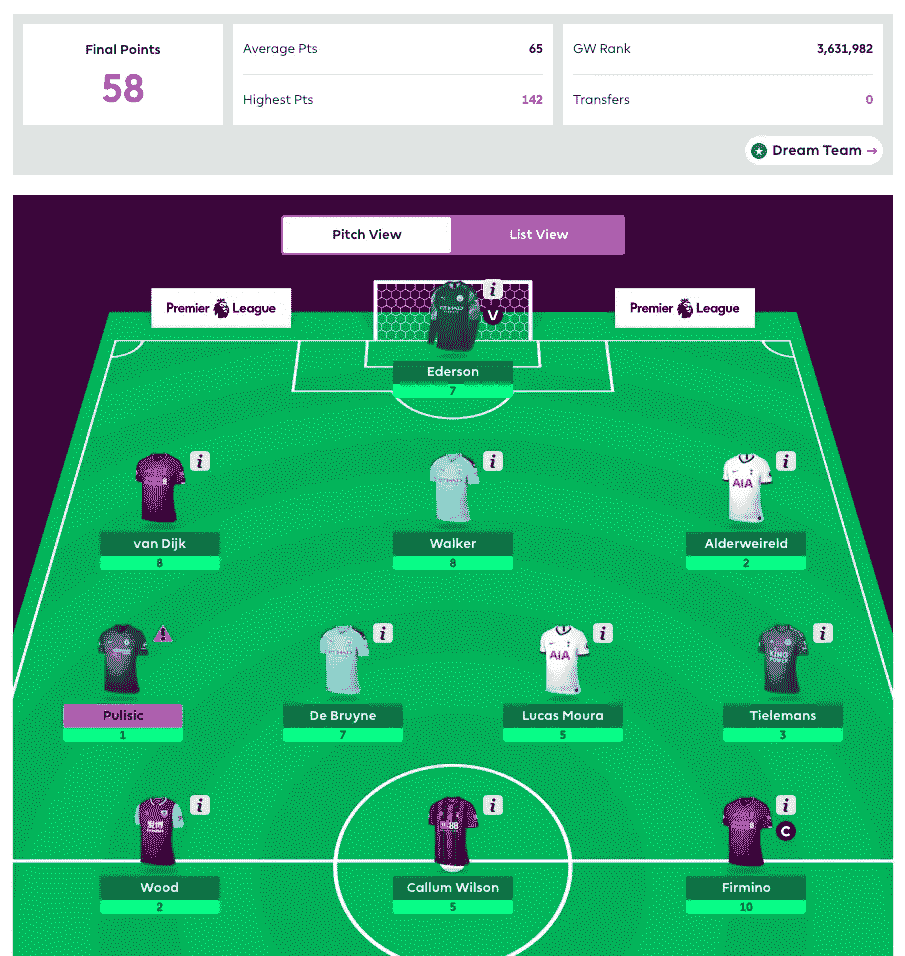
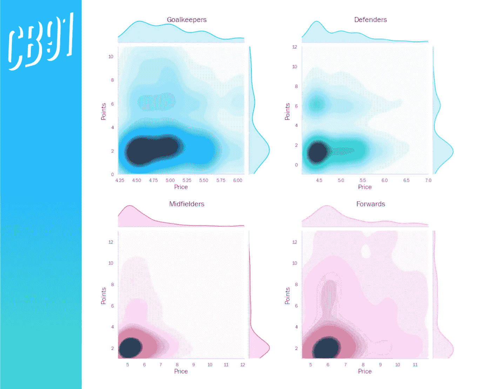

# 如何赚钱足球

> 原文：<https://towardsdatascience.com/how-to-moneyball-soccer-46b589429748?source=collection_archive---------13----------------------->

## [按目标](https://towardsdatascience.com/tagged/on-target)

## 足球协会开始意识到数据科学的潜力，以及国际象棋大师的选择

利物浦赢得欧洲冠军联赛——世界上最负盛名的足球赛事之一

[利物浦足球俱乐部](https://www.premierleague.com/clubs/10/Liverpool/overview)不仅仅赢得了[英格兰超级联赛](https://www.premierleague.com/tables)。他们完全绝对地控制着它。

在前 25 场比赛中取得了 24 场胜利和一场平局，他们是顶级足球 133 年历史上最快达到 70 分的球队。唯一一支在英超联赛中保持不败的球队在整个 38 个赛季中取得了 26 场胜利。简单来说，他们现在的表现是没有先例的。

所有这些对于热情的球迷群体来说都是非常受欢迎的，他们的球队在 30 年内没有赢得过联赛冠军——对于足球鉴赏家来说更是如此，他们在这个过程中享受到了一些真正出色的足球。

欧洲足球史上最伟大的比赛之一…

鉴于利物浦相对节俭，他们最近的成功或许更令人惊讶。当然,“相对”是一个关键词——足球是一项充斥着金钱的运动，许多欧洲顶级球队都被极其富有的财团所拥有，这些财团为他们注入了大量资金。例如，利物浦最接近的竞争对手曼城足球俱乐部(Manchester City FC)归阿布扎比王室成员所有，价值至少 170 亿英镑。在过去的十年里，曼城在球员净值(即买入球员的成本减去出售给其他俱乐部的球员的价格)上花费了令人眼红的 10.7 亿英镑。

利物浦在同一时期的花费减少了 70%,甚至在过去五个赛季中的三个赛季在球员转会上实现了净利润。在有史以来最昂贵的 50 次转会中，利物浦只占了三次(他们过去两个赛季的最佳射手穆罕默德·萨拉赫甚至没有出现在名单中，他曾经被英格兰对手切尔西以微不足道的 1350 万英镑卖掉)。Trent Alexander-Arnold 和 Andy Robertson，可以说是目前世界上最好的[边后卫](https://en.wikipedia.org/wiki/Defender_(association_football)#Full-back)，他们两人的身价只有 810 万英镑。他们现在被认为价值 1 . 71 亿英镑[。](https://www.transfermarkt.co.uk/fc-liverpool/kader/verein/31/saison_id/2019)

那么利物浦是如何做到这一点的呢？正如 Bruce Schoenfeld 为《纽约时报》撰写的精彩文章所详述的，该俱乐部最近的成功至少部分归功于数据和分析的广泛使用。

利物浦主帅于尔根·克洛普——AMA/盖蒂图片社

这方面的一个早期例子是收购了尤尔根·克洛普，利物浦神秘的经理和他们高效的“葛根普斯”踢球风格的设计师。带着多特蒙德在他的祖国德国获得德甲荣誉后，克洛普的股票在 2014-15 赛季下跌，当时球队获得了相对较低的第七名——这是八年来最差的成绩。

尽管这个明显的失败，他在从多特蒙德辞职后的几个月内被钦点为利物浦的新经理。利物浦的共同所有者([约翰·w·亨利](https://en.wikipedia.org/wiki/John_W._Henry)，他的芬威体育集团也拥有波士顿红袜队)没有依靠公众声誉来做出招聘决定，而是求助于剑桥物理学家伊恩·格雷厄姆。格雷厄姆建立了一个广泛的世界足球数学模型，并发现多特蒙德令人失望的赛季远没有受到糟糕管理的影响，而是运气不好的结果。

足球是一项靠一点运气就能左右比赛的游戏。得分通常很低(3-3 平局是“高分”)，只有 10-15%的射门得分。因此，一场比赛的最终得分可能并不代表一支球队的实际表现。格雷厄姆回忆起 2014 年的一场比赛，克洛普的多特蒙德队以 2 比 0 输掉了比赛，尽管他们在其他各方面都占据了比赛的主导地位——他们在 64%的时间里控制着球，角球次数是他们的七倍，射门次数是他们的两倍多。

当然，数据和体育的最初联姻是《T2 金钱球》(Moneyball )，这本书讲述了奥克兰运动家队(Oakland Athletics)2001 年棒球赛季的故事，奥克兰运动家队的经理[比利·比恩](https://en.wikipedia.org/wiki/Billy_Beane)组建了一支由廉价的“不适应”球员组成的非常成功的球队，并提供了吸引人的基本统计数据。后来芬威体育集团的约翰·w·亨利找到了比恩，他热衷于在波士顿红袜队复制这种方法(红袜队继续赢得了 2004 年世界系列赛——这是他们自 1918 年以来的第一次——使用了比恩开创的许多方法)。

虽然统计数据可以帮助职业球队在体育史上占有一席之地，但热情的业余爱好者也开始受益…

12 月 16 日，[有史以来最伟大的国际象棋大师之一芒努斯·卡尔森](https://en.wikipedia.org/wiki/Magnus_Carlsen)，发现自己在一个拥有 750 多万棋手的全球联赛中[名列榜首。不过，不是象棋联赛，而是](https://www.theguardian.com/sport/2019/dec/16/chess-champion-magnus-carlsen-top-of-world-fantasy-football-rankings-premier-league)[梦幻超级联赛](https://fantasy.premierleague.com/)。

梦幻超级联赛(又名 FPL，或梦幻足球)是一款在线游戏，跟随现实世界的超级联赛赛季。给定 1 亿虚拟英镑的预算，每个球员(或“经理”)必须召集一个现实世界的球员团队，然后根据他们在现实生活游戏中的表现[获得 FPL 积分](https://fantasy.premierleague.com/help/rules)(例如，前锋每进一个球将获得 4 分 FPL 积分，后卫每不失球将获得 4 分，守门员每 3 次扑救将获得 1 分，以此类推)。

在赛季的第一周，我自己的团队(严重不足)

问题是不同的球员有不同的价格——像穆罕默德·萨拉赫这样的明星球员可能要 1250 万英镑，而在一个较小的球队相对不知名的球员可能只要 400 万英镑。因此，不可能让你的球队充斥着每周都占据头条的超级巨星。

作为一个额外的复杂因素，经理们可以每周从他们的团队中换出一名球员(当然，保持在预算之内)，带来一名替代球员，他可能状态更好，或者有更轻松的比赛。通常在几周前计划这些转会“步骤”以获得这样的球员，这使得这项运动被比作国际象棋(尽管卡尔森坚持认为运气也起了很大的作用)。

因此，成功的 FPL 经理人最能发现基本面良好的廉价球员，他们有潜力每周“在雷达下”获得 FPL 积分。显然，这是一个赚钱时机已经成熟的游戏。

这就是我的新项目的全部内容。计划是建立一个分类算法(可能是一个神经网络)。它将获取关于一名球员的基本表现，以及他们将要比赛的球队的表现的数据。然后它会告诉我们他们是否会是 FPL 队的好选择。

每周玩家 FPL 积分的热图，以及他们在游戏中的价格(按玩家位置)。

初步分析确实表明这应该是可能的——上面的热图显示，价格较低的玩家完全有能力获得大量积分(见每个图左上角的彩色斑块)。当然，视觉效果也显示，许多更便宜的玩家在每场比赛中得分很少(见左下角更暗的补丁)。

没人说赚钱容易——这就是利物浦的首席数据科学家拥有哈佛大学粒子物理学博士学位的原因。

> 这是一个新的博客系列'[的第一篇，在这个博客系列中，我将尝试为梦幻英超建立一个模型。我很乐意听到关于这个博客的任何评论，或者这篇文章涉及的任何概念。欢迎在下面留言，或者通过](https://towardsdatascience.com/tagged/on-target) [LinkedIn](https://www.linkedin.com/in/callum-ballard/) 联系我。