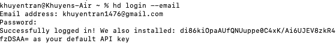
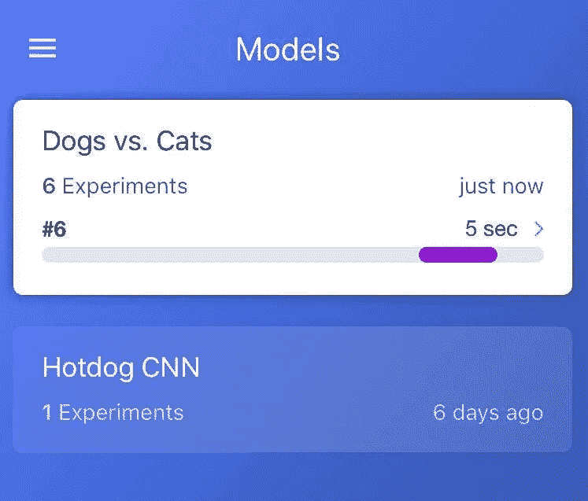
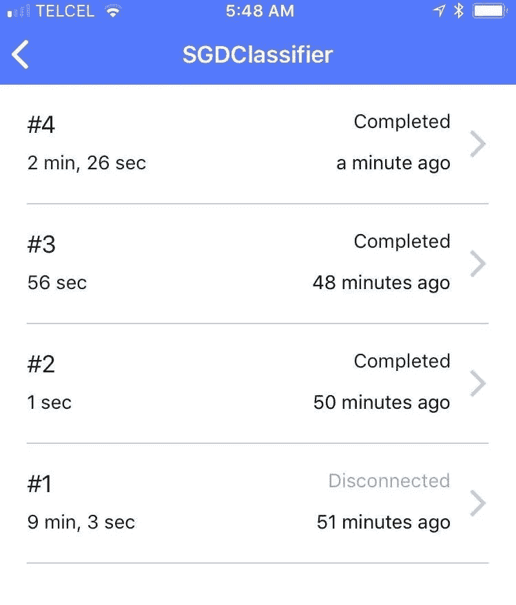
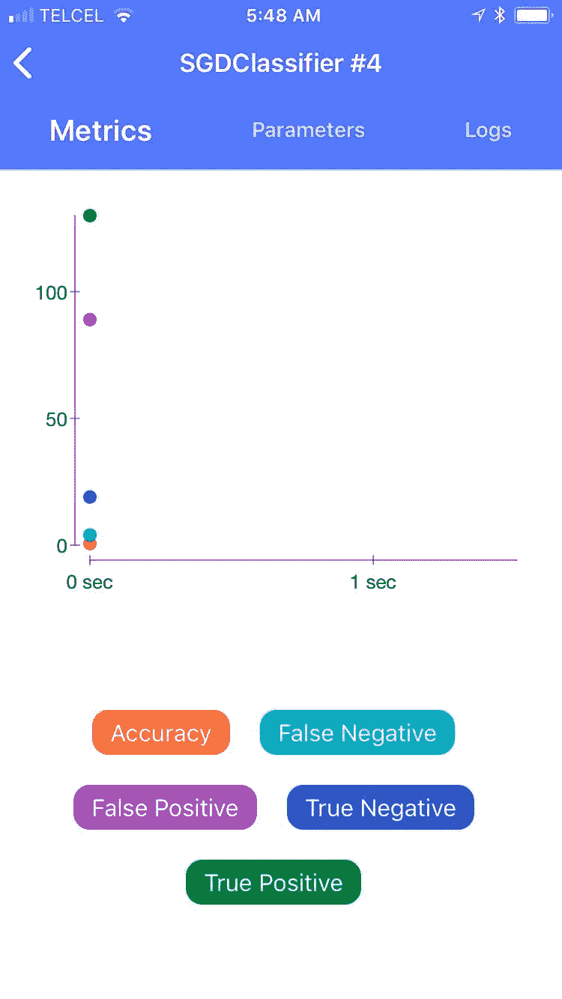
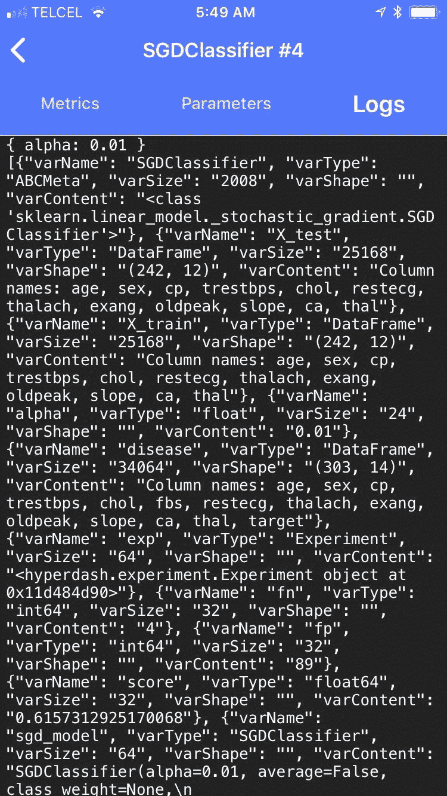
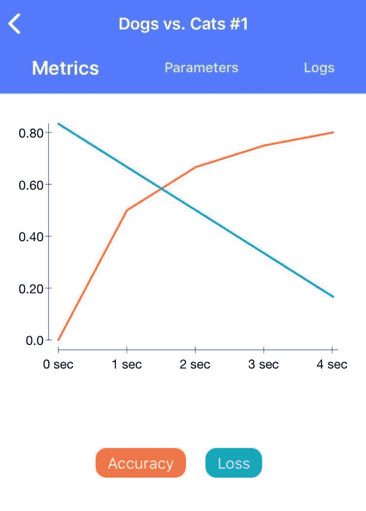

# 如何使用 HyperDash 远程监控和记录您的机器学习实验

> 原文：<https://towardsdatascience.com/how-to-monitor-and-log-your-machine-learning-experiment-remotely-with-hyperdash-aa7106b15509?source=collection_archive---------34----------------------->

## 培训需要很长时间才能完成，但你需要去洗手间休息一下…

# 动机

你有没有发现自己在训练一个机器学习模型的时候，眼睛长时间盯着笔记本电脑屏幕？尤其是在 Google Colab 上训练深度学习模型的时候，你想知道训练什么时候完成，这样你就可以在失去连接之前在笔记本电脑前。


史蒂夫·哈拉马在 [Unsplash](https://unsplash.com?utm_source=medium&utm_medium=referral) 上拍摄的照片

如果实验需要几个小时才能完成，想象一下在这段时间里你能做什么？散步、做饭、上厕所时不要把笔记本电脑带进浴室。如果有一种工具可以帮助你远程监控实验，那岂不是很神奇？

# 超破折号

幸运的是，有了 [Hyperdash](https://github.com/hyperdashio/hyperdash-sdk-py/blob/master/README.md) ，你可以远程监控你的**训练**(网络、iOS 和 Android)。你可以**看到进度**并且**在实验完成时得到通知**。更好的是，**记录你实验的结果**和**超参数**！

## 装置

```
$ pip install --upgrade pip && pip install hyperdash
```

注册 Hyperdash 帐户

```
$ hd signup
```

你可以选择注册电子邮件或 GitHub。然后使用您刚刚创建的帐户登录

```
$ hyperdash login
```

如果你决定用电子邮件联系。这是你将会看到的



# 在您的手机上安装

Hyperdash 在 Appstore 和 Google Play 中都有。您可以下载并登录您的帐户。

一旦您登录，您在笔记本电脑上的实验将会显示并保存到您的手机上！让我们通过运行来确保它有效

```
$ hd demo
```

你可以看到程序同时在终端和你的应用程序中运行



酷！那么我们如何利用这一点呢？Hyperdash 的伟大之处在于它非常易于使用和入门。让我们看看如何在您的数据科学项目中使用它。

# 监控你的机器学习实验

我将使用来自 Kaggle 的心脏病数据集。我们的任务是预测病人是否有心脏病。为了快速了解 Hyperdash 是如何工作的，你可以在[这个资源库](https://github.com/khuyentran1401/Hyperdash-exp/tree/master)中运行笔记本，观察你手机上的 Hyperdash 应用程序是如何变化的！

首先将数据分成训练集和测试集

使用 Hyperdash 记录你的实验

使用超级破折号的步骤:

*   名称:用`Experiment(name)`声明你每次运行的实验对象
*   参数:用`exp.param('name', value)`记录任意超参数的值
*   指标:用`exp.metric('name', score)`记录您希望看到的任何指标的值
*   结束:用`exp.end()`结束实验

就是这样。当运行上面的代码时，您应该能够看到在您的手机上运行的实验



在指标选项卡中，您可以看到您在`exp.metric()`中记录的指标



观察超参数


在日志中，您还可以看到有关用于训练的模型的更多信息，如大小、形状以及有关原始数据的信息。这些信息被写入。json 格式。



# 室内装饰实验

用上面的方法，你的实验不会在没有代码`exp.end().`的情况下停止运行。你可以通过将你的实验包装在一个函数中来避免记住这个代码的麻烦

当你运行这段代码的时候，这个实验已经在你的手机上完成了！

# 你还能用这些指标做些什么？

您还可以通过记录每个迭代中的度量来观察每个迭代的度量

您会看到一个漂亮的图表，其中显示了精度和损耗函数随时间的变化



# 结论

Hyperdash 确实是一个很酷的 app，但是除非你使用它，否则它不会有用。当你想远程监控实验并快速保存你得到的结果和度量时，我推荐你使用它。但是为了记录更多关于实验的复杂信息，我推荐使用 M[lf flow](https://mlflow.org/)或 W [eights 和 bias](https://www.wandb.com/)。如果你对如何使用这些工具感到好奇，请关注我关于这些神奇工具的下一篇教程。

我喜欢写一些基本的数据科学概念，并尝试不同的算法和数据科学工具。你可以在 LinkedIn 和 Twitter 上与我联系。

如果你想查看我写的所有文章的代码，请点击这里。在 Medium 上关注我，了解我的最新数据科学文章，例如:

[](/how-to-solve-analogies-with-word2vec-6ebaf2354009) [## 如何用 Word2Vec 解决类比问题

### 美国之于加拿大，就像汉堡之于 _？

towardsdatascience.com](/how-to-solve-analogies-with-word2vec-6ebaf2354009) [](/how-to-match-two-people-with-python-7583b51ff3f9) [## 如何找到和 Python 很好的搭配

### 给定个人偏好，如何匹配使得总偏好最大化？

towardsdatascience.com](/how-to-match-two-people-with-python-7583b51ff3f9) [](/how-to-create-fake-data-with-faker-a835e5b7a9d9) [## 如何用 Faker 创建假数据

### 您可以收集数据或创建自己的数据

towardsdatascience.com](/how-to-create-fake-data-with-faker-a835e5b7a9d9) [](/convex-hull-an-innovative-approach-to-gift-wrap-your-data-899992881efc) [## 凸包:包装数据的创新方法

### 如何利用包装算法实现数据可视化

towardsdatascience.com](/convex-hull-an-innovative-approach-to-gift-wrap-your-data-899992881efc) [](/how-to-create-interactive-and-elegant-plot-with-altair-8dd87a890f2a) [## 如何用 Altair 创建交互式剧情

### 在 5 行简单的 Python 代码中利用您的数据分析

towardsdatascience.com](/how-to-create-interactive-and-elegant-plot-with-altair-8dd87a890f2a)