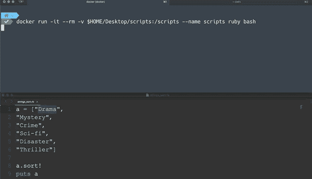
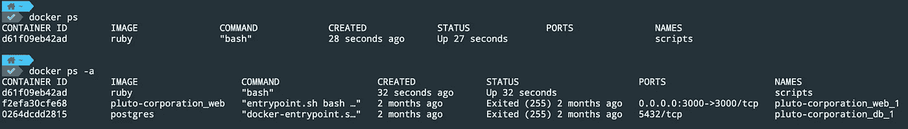
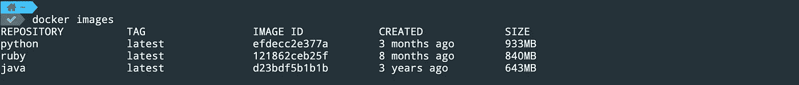
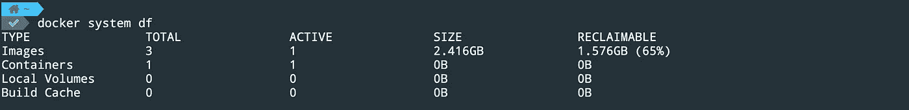
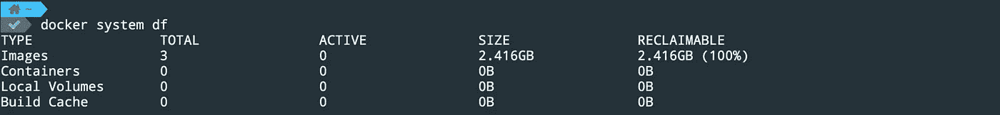

# 如何在 Docker 容器中挂载目录

> 原文：<https://towardsdatascience.com/how-to-mount-a-directory-inside-a-docker-container-4cee379c298b?source=collection_archive---------2----------------------->

## 专注于编写代码，无需担心环境管理


马克斯·威廉姆斯在 [Unsplash](https://unsplash.com?utm_source=medium&utm_medium=referral) 上的照片

它在我的机器上工作；那么让我们运送你的机器吧！简而言之，那就是码头工人。它允许我们通过使用容器化技术在任何计算机上运行 Docker 映像中的应用程序。Docker 容器是一个基础 OS ( [alpine](https://alpinelinux.org/) 、 [ubuntu](https://ubuntu.com/) 等)的包。)和其他必要的软件依赖项，您可以在 docker 映像中定义它们。现在，您可以使用该映像创建一个容器，在不同的机器上运行您的应用程序，甚至在云平台上运行( [AWS](https://aws.amazon.com/) 、 [GCP](https://cloud.google.com/) 、 [Azure](https://azure.microsoft.com/en-au/) 等)。)而不用担心环境管理(开发、测试和生产)。

Docker 因其可移植性、安全性和性能而成为 DevOps 的流行工具之一。在这篇文章中，您将学习 Docker 的一些基本概念和命令，它们将教您如何在 Docker 容器中挂载一个目录。我几乎每天都使用 Docker 进行本地开发——例如，你可以在这里看到我是如何为一个个人项目[Docker 化一个 Ruby on Rails 应用程序的。](https://github.com/lifeparticle/Heroku-with-Rails-using-Docker)

# 设置

首先，你需要安装 [Docker](https://docs.docker.com/engine/install/) 。出于演示的目的，我们将使用预先构建的 Ruby 和 macOS 的官方映像。

*   **Docker Image:** 这是一个包含创建容器指令的模板。
*   **Docker 容器:**容器是图像的运行实例。

`docker run`命令用于从图像运行容器。这里我们使用 ruby 映像创建容器，但是您也可以使用自己的映像。如果主机上不存在 ruby 映像，Docker 将从 [Docker Hub](https://hub.docker.com/) 中获取该映像。一旦下载到本地机器上，Docker 将使用相同的映像来连续创建容器。要装载一个卷，只需在终端中运行以下代码:

```
docker run -v /host/directory:/container/directory
```

现在，您将在容器的脚本文件夹中挂载脚本文件夹。这是最佳实践，因为您不必担心不同机器上的环境管理。

```
docker run -it --rm -v $HOME/Desktop/scripts:/scripts --name scripts ruby bash
```

标志`-i -t`(通常写为`-it`)用于以交互模式访问容器。`--rm`标志(可选)在您退出或停止容器以释放系统资源(CPU、内存)时移除容器。如果您在停止或退出容器后不使用它，如果您想释放磁盘空间，必须手动删除它。`-v`标志用于挂载一个主机文件夹，它由冒号分隔的两个字段组成。第一部分是主机中的路径。第二部分是容器中的路径。

```
-v /host/directory:/container/directory
```

`--name`标志(可选)用于给容器一个特定的名称。如果你不想提供一个，Docker 会随机分配一个名字，所以如果你想更容易地跟踪你的容器，你可以选择一个。`ruby`命令用于加载图像。如果你想使用 [Ruby](https://hub.docker.com/_/ruby) 的`2.5`版本，使用`ruby:2.5`命令。

```
docker run -it --rm -v $HOME/Desktop/scripts:/scripts --name scripts ruby:2.5 bash
```

最后但同样重要的是，`bash`命令用于获取容器内部的 bash shell。



在 Mac 上运行

要运行 python 代码，请使用 Python 映像。

```
docker run -it --rm -v $HOME/Desktop/scripts:/scripts --name scripts python bash
```

## 停止和移除容器

正如我在上面解释的，如果您想要释放系统资源和磁盘空间，您需要停止并删除容器。您可以在主机上运行`docker ps`命令来查看正在运行的容器列表。要停止容器，使用带有容器 id 或容器名称的`docker stop`命令。您可以使用`-a`标志来查看所有停止或退出的容器。

```
docker stop d61f09eb42ad
# or
docker stop scripts
```



docker ps VS docker ps -a

要手动删除容器，请使用以下命令之一。

```
docker rm d61f09eb42ad
# or
docker rm scripts
```

## 移除图像

如果您想要删除一个图像来释放磁盘空间，例如，您刚刚创建的 Ruby 图像，使用`docker rmi`命令。但是首先，让我们试着去理解引擎盖下到底发生了什么。为此，我们将使用`docker images`和`[docker system df](https://docs.docker.com/engine/reference/commandline/system_df/)`命令来显示 Docker [守护进程](https://en.wikipedia.org/wiki/Daemon_(computing))的磁盘空间使用信息。`docker images`命令列出您机器上的所有图像。



在这种情况下，我的机器上有三个图像



一个活动容器正在使用一个活动图像

`[docker system df](https://docs.docker.com/engine/reference/commandline/system_df/)`命令告诉我，我只能要求 65%的磁盘空间，因为我仍在运行**脚本**容器，而该容器正在使用 ruby 映像。如果您添加剩余的两个映像，您将获得 65%的可回收磁盘空间。

```
933MB (python) + 643MB (java) = 1.576GB (65%)
```

好了，通过在停止容器后运行`[docker system df](https://docs.docker.com/engine/reference/commandline/system_df/)`命令，告诉我们现在可以要求 100%的磁盘空间。



没有活动容器和活动图像

请注意，如果您试图删除一个容器正在使用的图像，您会得到以下错误。

```
Error response from daemon: conflict: unable to delete 121862ceb25f (cannot be forced) - image is being used by running container d61f09eb42ad
```

最后，我们可以使用带有图像 id 的`docker rmi`命令来删除图像。

```
docker rmi 121862ceb25f
# remove multiple images by putting a space between them
docker rmi efdecc2e377a d23bdf5b1b1b
```

# 包裹

现在您知道了如何在 docker 容器中挂载一个目录。Docker 极大地帮助了我在多台机器上轻松创建本地开发环境，而无需任何额外的努力和时间。这是一项你想放在包里的技能，无论是为了个人还是工业目的。我希望这能帮助你开始接触 Docker 的神奇世界。


GIF by [GIPHY](https://giphy.com/)