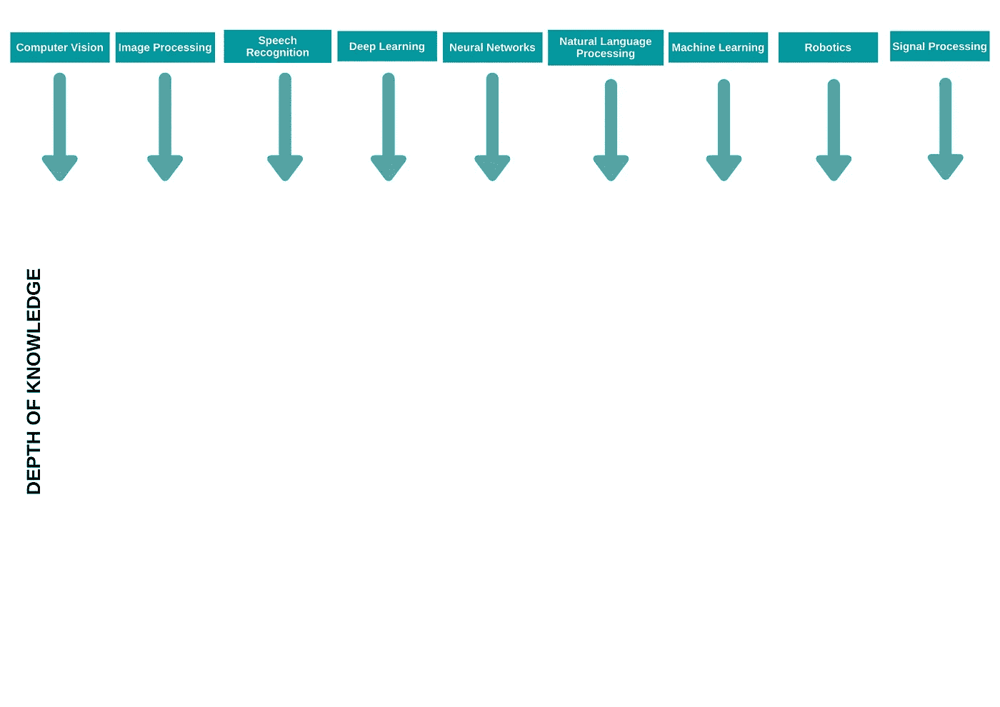
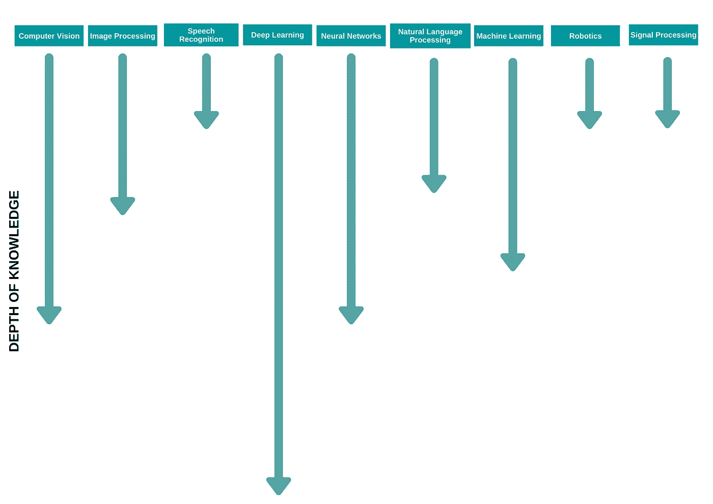

# 根据吴恩达的观点，如何在机器学习的职业生涯中导航

> 原文：<https://towardsdatascience.com/how-to-navigate-a-career-in-machine-learning-according-to-andrew-ng-stanford-lectures-9e10f09047f0?source=collection_archive---------19----------------------->

约瑟夫·巴里恩托斯在 [Unsplash](https://unsplash.com/s/photos/navigation?utm_source=unsplash&utm_medium=referral&utm_content=creditCopyText) 上拍摄的照片

## 报告的

## 了解如何在机器学习领域取得成功

> “找一份你不会厌倦的工作”

# 介绍

今天，许多人都希望以某种形式参与人工智能(AI)。你不能责怪他们。AI 是很多行业的未来。

对许多人来说，进入人工智能领域的直接途径是在机器学习(ML)领域寻求职业生涯。

因此，这篇文章涵盖了 YouTube 上众多斯坦福讲座之一[吴恩达](https://www.linkedin.com/in/andrewyng/)的教导。

更具体地说， **Andrew 为你如何在机器学习的职业生涯中成功导航提供了极好的建议**。

## 在本文中，我将为您提供以下内容:

*   如何在机器学习领域找到工作
*   招聘人员和员工在他们的理想候选人身上寻找什么
*   成功人工智能实践者的模式
*   如何选择工作
*   导航机器学习职业的错误方法

> 这篇文章与大多数处于职业生涯不同阶段的机器学习从业者相关。

# 方向

照片由 [Aron 视觉效果](https://unsplash.com/@aronvisuals?utm_source=unsplash&utm_medium=referral&utm_content=creditCopyText)在 [Unsplash](https://unsplash.com/s/photos/direction?utm_source=unsplash&utm_medium=referral&utm_content=creditCopyText) 上拍摄

在完成学术研究后，机器学习学生通常会从事机器学习工作，或者以博士的形式进行进一步的研究。

拿我来说，在获得机器学习硕士学位后，我很快就进入了一个 ML 角色。通常情况下，人工智能角色存在于两种类型的公司中:要么是大型科技公司，如脸书、谷歌，要么是年轻、令人兴奋的初创公司。

安德鲁提到的一件事是，无论你选择哪个方向，你都必须确保你进行的是重要而有意义的工作。我将在本文后面详述安德鲁提到的重要而有意义的工作。

但是首先，让我们先弄清楚如何找到一份工作。

# 如何找到工作

照片由[在](https://unsplash.com/@freetousesoundscom?utm_source=unsplash&utm_medium=referral&utm_content=creditCopyText) [Unsplash](https://unsplash.com/?utm_source=unsplash&utm_medium=referral&utm_content=creditCopyText) 上免费使用声音

机器学习领域的工作竞争非常激烈，但你已经知道了。

你可能没有意识到招聘人员和员工在他们理想的候选人身上寻找的品质和技能。

Andrew 拥有多年在人工智能团队中工作的经验，并领导过大大小小公司的团队。

> “作为谷歌大脑团队的创始领导者，斯坦福人工智能实验室的前主任，以及百度约 1200 人人工智能团队的总领导者，我有幸培养了许多世界领先的人工智能团队，并开发了许多人工智能产品，供数亿人使用。”—吴恩达

现在，安德鲁建议招聘人员在招聘人工智能角色时应该寻找什么:

## 1.编码/技术技能

机器学习研究工作要求个人至少具有已经获得的平均水平的技术技能。

你一般的程序员都懂两到三种编程语言，都是中级水平。

机器学习从业者往往拥有编程技能，并被期望能够理解一套常用的编程语言，如 [Python](https://www.python.org/) 、 [Java](https://docs.oracle.com/javase/7/docs/technotes/guides/language/) 、 [JavaScript](https://developer.mozilla.org/en-US/docs/Web/JavaScript) 和 [R](https://www.r-project.org/about.html) 。

你可能会问，为什么你需要掌握这么多种语言的实用知识。

嗯，作为一名计算机视觉工程师，我在三种不同的编程语言之间周旋。我用 Python 实现模型( [TensorFlow](https://www.tensorflow.org/) )，写脚本；我还使用 javascript 来实现模型( [tfjs](https://www.tensorflow.org/js/) )，最后，我将模型和计算机视觉技术集成到 iOS 应用程序中，因此我利用 [Swift](https://developer.apple.com/swift/) 语言来开发 iOS 应用程序。

## 2.回答技术问题的能力

在你的简历被审核后，你就进入了面试的下一阶段，接下来的阶段通常是电话面试和现场面试。

在两个面试阶段，你都可以期待被问到机器学习相关的话题。期望解释梯度下降变量之间的差异；或者新颖的神经网络结构的独特特征是什么。

## 3.理论知识的实际应用

你可能已经在某种形式的学术机构呆了几年或更长时间，习惯了大学和学院采用的基于理论的考试方法。

另一方面，招聘人员正在寻找优秀的候选人，他们不仅理解机器学习中的主题理论，而且可以适当地应用概念、技术和想法。

例如，确保你在概念层面上理解批量标准化的描述和好处，但是为了在招聘人员面前脱颖而出，一定要准备好 Jupyter 笔记本或 GitHub repos，记录你使用批量标准化的地方。

> ***方项目***

证明你理论知识应用的一个实用方法是在你的文件夹里有两个或更多的副业项目。兼职项目是你展示技术、创造力和解决问题能力的为数不多的机会之一。

## 4.不断学习的能力

一些传统的角色不需要你更新你所在领域或行业的知识。

在机器学习中，这是完全相反的，新技术每天都在开发，更多的工具和库每周都在更新，大量的研究论文每月都在发表。

在机器学习中，你永远不会停止学习。我目前参与了深度学习领域，并利用了研究和开源项目中的技术。然而，通常情况下，有一种新的闪亮的神经网络似乎已经推动了特定计算机视觉任务的前 5 名精度，并且现在是最新的艺术技术。

招聘人员和雇主希望看到你不会满足于一个角色而停止求知。机器学习从业者通常处于人工智能行业新兴技术的前沿。

# 成功人工智能实践者的模式

照片由 [Iswanto Arif](https://unsplash.com/@iswanto?utm_source=unsplash&utm_medium=referral&utm_content=creditCopyText) 在 [Unsplash](https://unsplash.com/s/photos/admiration?utm_source=unsplash&utm_medium=referral&utm_content=creditCopyText) 拍摄

人工智能是一个包含其他子领域的领域，如机器学习、自然语言处理、语音识别、神经网络、计算机视觉、图像处理和许多其他子领域。

根据 Andrew 的说法，工作角色的最强候选人和成功的人工智能实践者都有一个跨越人工智能子领域的“T”形学习方法。

这意味着他们在人工智能的大多数子领域都有广泛的知识，在少数领域有深入的知识。

以我自己为例，我从事了机器学习、计算机视觉和机器人学方面的高级研究。通过学习，我获得了人工智能一些关键子领域的基础知识。通过我的论文、个人项目和职业道路，我专注于三个主要领域，即计算机视觉、自然语言处理和深度学习。

学术机构将通过引入跨子领域的基础知识来进行机器学习的教学。他们将为学生提供通过选修课、论文和课程作业获得深入知识的能力。

下面是我大学毕业后，开始我的 pwn 项目和职业生涯后，我的 T 形知识路径的例子。

在完成了我在 ML，CV 和机器人学硕士学位的所有必修课程后，我获得了人工智能主要子领域的基础知识。

**大学毕业后的 AI 领域知识**

随着我完成论文并在职业生涯中继续前进，我的学习道路已经成型为你在下面看到的 T 形路径。

我的专业是深度学习，这是计算机视觉的一个子领域。

碰巧你在神经网络，机器学习，NLP(图像字幕)和图像处理方面学到了更多的知识，这是子领域重叠和有相关主题的结果。

*就个人而言，在我认为自己是深度学习和计算机视觉专家之前，我还有很长的路要走。*

**AI 领域知识完成后的学位论文和职业生涯开始**

## 深入的知识

我已经多次提到“深入的”知识，但是它意味着什么和包含什么。根据 Andrew 的说法，深入的知识由以下因素指导和定义:

*   ✅项目
*   开源捐款✅
*   研究✅
*   实习✅

再说一次，在特定的子领域从事个人项目会加深你的知识和专长。这不仅会让你成为一名成功的人工智能实践者，而且你更有可能被考虑担任更多的人工智能角色。

# 如何选择工作

塞萨尔·阿布纳·马丁内斯·阿吉拉尔在 [Unsplash](https://unsplash.com/s/photos/magnifying?utm_source=unsplash&utm_medium=referral&utm_content=creditCopyText) 上的照片

安德鲁认识到这样一个事实，即具有机器学习专业知识的个人是有需求的。

这一事实可能会使大量的选择对一些人来说是一种相当紧张的经历，而对另一些人来说，这可能会导致做出错误的决定。

下面的陈述和列表来自安德鲁对他的学生的建议，关于他们应该如何选择工作来拥有一个快乐而有意义的职业生涯。

## 在一个好的团队中工作

在他的讲座中，Andrew 专注于他认为个人在选择工作角色时需要考虑的具体要点和提示，他关注的一个特定领域是选择优秀的团队。

在选择团队时，您需要考虑一些因素，它们是:

*   互动
*   沟通
*   成长。

安德鲁建议，你应该在一个团队中工作，在那里你可以很容易地与其成员互动。通常，这样的团队包含(10-30)个人。他建议你应该关注团队有多努力，以及他们的个性和职业道德是否能对你产生积极影响。

团队中的个人往往是你大部分时间与之相处的人。根据行为研究，你最终是和你相处时间最长的五个人的平均值。

## 了解你的角色

在决定接受一个提供的角色之前，确保你了解你将要从事的工作。

通常情况下，职位公告栏上的职位描述并不能反映实际工作中的角色和职责。

有时候，工作岗位上的责任被过分夸大了，这会导致失望。

其他时候，招聘广告低估了新员工被期望承担的工作量，这可能会导致职业生涯过早耗尽精力。

避免失望和筋疲力尽的最好方法是直接与你的上司交谈，了解对任务和交付时间的期望。

此外，与类似角色的团队成员交谈，询问他们日常活动中的问题。

## 忽略公司

当安德鲁第一次提到忽略你正在考虑工作的公司时，我有点困惑。但是经过进一步的澄清，这个信息变得清晰了。

公司拥有外部声誉和认可度，这通常被称为公司的品牌。公司的品牌一般是公司如何向外界传达自己。这样做的问题是，你通常只会向外界展示你最好的一面，这让你在选择公司时的决定有点偏差。

正如 Andrew 所说，从一般经验来看，一家公司的品牌与你在该公司的个人经历的相关性很弱。

在选择人工智能的角色时，团队的考虑比公司的选择更重要。在选择工作行业时，也可以这么说。

简单来说，石油公司和医疗中心的图像分类机器学习项目之间的差异只是用于训练 ML 模型的数据集及其应用的问题。ML 技能可以跨行业转移。

## 对工作机会感到兴奋，并考虑长期目标。

卢克·斯塔克波尔在 [Unsplash](https://unsplash.com/s/photos/jumping?utm_source=unsplash&utm_medium=referral&utm_content=creditCopyText) 上拍摄的照片

人类是受到内部和外部因素激励的生物，当两者都缺乏时，我们就会开始后悔、担忧，在某些情况下，会进入抑郁状态。

安德鲁直截了当地说:

*在*找一份你不会厌倦的工作。

我真的很喜欢安德鲁关于为什么过早扮演一个角色不一定是最好的主意的演讲。

利用他学生的个人轶事和经验，使他所有的观点和关注非常相关。

在我找工作的时候，我拒绝了几份看起来不错的工作，但是需要一定程度的个人牺牲，这是我不愿意接受的。

此外，我拒绝的一些角色可能在短期内听起来很棒，但看看我在未来十年的职业生涯中想要达到的目标，它们并不是最佳选择。

我渴望成为一家成功公司的人工智能领导者，这要求我比平常更快地投身其中。因此，在一个大团队中，我的知名度很低，没有明显的影响，对我来说不是最好的选择。然而，在一家为我提供自主权和学习环境的初创公司工作(*更像是*)意味着我的职业发展和成长会加快。

*一般来说，选择一个最适合你个人目标和长期发展的角色。*

# 机器学习生涯的错误导航方式

照片由 [NeONBRAND](https://unsplash.com/@neonbrand?utm_source=unsplash&utm_medium=referral&utm_content=creditCopyText) 在 [Unsplash](https://unsplash.com/s/photos/wrong-way?utm_source=unsplash&utm_medium=referral&utm_content=creditCopyText) 上拍摄

## 做一个万事通

人工智能是一个不一定值得成为“万金油”的领域，这意味着在人工智能的所有子领域都拥有浅薄的知识并不是确保你在人工智能或机器学习领域拥有长期成功职业生涯的最佳方法。

从长远来看，注意获得深入的知识是有回报的，尤其是在像人工智能这样的领域，规范往往是首选。

## 没有耐心

我为没有耐心而感到内疚，但老实说，在机器学习这样一个快速发展的领域，你几乎会觉得自己吸收信息的速度不够快。

但是，通过对拥有长期成功职业生涯的个人进行更深入的观察，我意识到，在任何人工智能子领域中建立真正的技能、专长和知识都需要时间。

也就是说，我们这一代人习惯于即时满足，获取知识的速度也是我们渴望看到快速、切实结果的受害者。

## 没有真正的实质性项目

在整篇文章中，拥有一个辅助项目的要求被认为对你的机器学习生涯有很多好处。兼职项目的问题在于，它们必须足够强大，以展示打动外部评审所需的技能水平。能够创建具有这种影响力的附带项目需要大量的努力和时间。

因此，拥有 10 个平庸的副业项目并不比完成 2-3 个真正有影响力的项目更好，并能很好地展示你的技术能力。

安德鲁认为，在这件事上，质量胜于数量。

# 结论

Andrew 的讲座以关注有助于个人在机器学习领域获得成功和长期职业生涯的关键要素而结束；它们是:

*   **确保在促进学习的环境中工作**
*   **确保你正在以一种积极的方式从事对他人的生活有意义的项目和任务。一般而言，在提高他人生活质量的领域内开展业务。**
*   **做出有助于你个人目标的决定，这将为你的长期成功奠定基础。**

我在看讲座和写这篇文章中学到了很多，我希望你能从这篇文章中得到一两个可操作的项目。如果你有任何其他的提示和建议想分享，那么我邀请你使用评论区。

 [## 根据吴恩达(斯坦福深度学习讲座)，你应该如何阅读研究论文

### 关于如何通过知名人士发表的研究论文获取知识的指导。

towardsdatascience.com](/how-you-should-read-research-papers-according-to-andrew-ng-stanford-deep-learning-lectures-98ecbd3ccfb3)  [## AlexNet 给深度学习世界带来了什么

### 花一分钟来了解琐碎的技术和神经网络架构，革命性的如何深入…

towardsdatascience.com](/what-alexnet-brought-to-the-world-of-deep-learning-46c7974b46fc) 

# 我希望这篇文章对你有用。

要联系我或找到更多类似本文的内容，请执行以下操作:

1.  订阅我的 [**YouTube 频道**](https://www.youtube.com/channel/UCNNYpuGCrihz_YsEpZjo8TA) 了解即将推出的视频内容
2.  跟着我上 [**中**](https://medium.com/@richmond.alake)
3.  在 [**LinkedIn**](https://www.linkedin.com/in/richmondalake/) 上连接并联系我