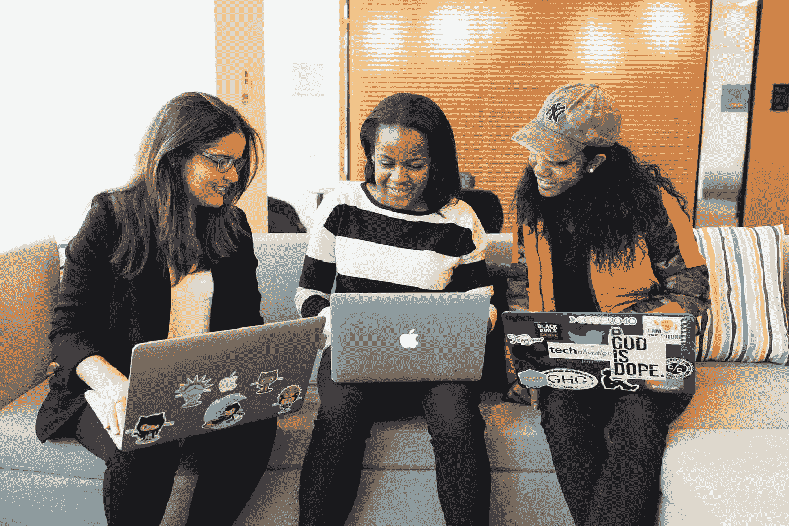

# 如何中和量子安全威胁

> 原文：<https://towardsdatascience.com/how-to-neutralize-quantum-security-threats-1f2efd8889e6?source=collection_archive---------45----------------------->

## 随着量子计算的加速，我们可能会面临对当今安全协议的巨大威胁。为了找到解决办法，我们需要迅速行动。

如果我们想免受量子计算机的攻击，我们需要快速行动。在 [Unsplash](https://unsplash.com/s/photos/computing?utm_source=unsplash&utm_medium=referral&utm_content=creditCopyText) 上拍摄的 [ThisisEngineering RAEng](https://unsplash.com/@thisisengineering?utm_source=unsplash&utm_medium=referral&utm_content=creditCopyText)

一种新型计算机有可能打破当今的安全协议，不管它有多复杂。量子计算机正处于成熟的边缘，它们非常强大，可以在几分钟内解决复杂的数学问题，而传统计算机需要几千年才能解决。

解决这些问题有助于在人类努力的每个领域取得巨大进步，从揭开宇宙的奥秘到改进金融工具到在癌症研究中找到突破。不幸的是，它们也是今天的加密方法所依赖的那种问题。如果量子计算机能够解决这些问题，它们也可以侵入互联网上的任何账户。

专家们一致认为，量子计算达到这一点还需要几年时间，甚至可能超过十年。这些新机器将需要能够部署数百万个量子位来破解今天的密码。在这种情况下，[谷歌最近在 2019 年末建造的具有 53 个量子位的量子计算机听起来微不足道。](https://www.nature.com/articles/d41586-019-03168-1)

谷歌机器的量子体积为 32，量子体积是衡量量子计算能力的指标。到 2020 年 6 月，霍尼韦尔[宣布](https://www.techrepublic.com/article/honeywell-claims-to-surpass-ibm-with-the-worlds-fastest-quantum-computer/)已经将他们自己机器中的量子容量增加了一倍，达到 64。两个月后， [IBM](https://www.zdnet.com/article/ibm-hits-new-quantum-computing-milestone/) 也达到了那个里程碑。

有了这些进步的迹象，[专家](https://www.techrepublic.com/article/why-quantum-volume-is-vital-for-plotting-the-path-to-quantum-advantage/)预计量子用例，如医学、金融或其他领域的研究模拟，最早将于 2022 年出现。成熟的应用程序应该在 2026 年投入使用，量子计算的商业应用应该在 2030 年普及。

这些预测还意味着，到这个十年结束时，我们今天使用的几乎任何加密技术都可能是无用的。在最糟糕的情况下，一个不负责任的量子计算先锋可能会闯入政府、企业或全球组织的系统，造成严重破坏。

在这种情况下，人们生活所依赖的 IT 系统，如电力网络、医院资源、物流供应链和许多其他系统可能会在几秒钟内停机。尽管这样的未来仍需数年才能实现，但我们必须现在就开始努力，防止这一威胁成为现实。我们需要考虑建立比量子计算机更聪明的加密技术，这样我们就可以获得这些机器的好处，而不会让它们危及我们的安全。

 [## 我们会看到量子计算革命吗？

### 在技术成熟的边缘，初创公司正在将量子计算推向下一个阶段。但这是一场革命还是泡沫？

towardsdatascience.com](/will-we-see-a-quantum-computing-revolution-a16b6d677308) 

# 当今的安全协议

自[达芬奇密码](https://www.wired.com/2003/04/da-vinci-father-of-cryptography/)时代以来，加密的基本原理就没有改变过:在算法的帮助下，一条信息被转换成胡言乱语。当消息到达它的目的地时，它通过反向使用相同的算法被解密。

例如，我可以通过将字母表中的每个字母向后移动四位，并转换大写和小写来加密短语“达芬奇密码”。由此产生的乱码将是“高清 zMRGM GSHI。”为了确保接收者理解消息，我需要告诉他们解密密钥是什么:再次转换大写和小写，并将字母表中的每个字母上移四位。

当然，这是一把非常简单的钥匙，一个 10 岁的孩子只要有足够的雄心就能打开它。今天的 IT 系统使用复杂得多的数学公式。这些密钥以位的形式存储，就像传统计算机上的任何东西一样。有了这些复杂的公式，即使是今天的超级计算机——已经比今天的量子计算机慢了数万倍——也无法破解你在手机上发送的无聊短信。更重要的是，他们无法破解你的银行账户和其他所有可能存储敏感数据的地方的密码。

今天有两种不同的加密系统[T3。第一种是对称或私钥加密，即使用同一个密钥来加密和解密数据。这种类型用于各种通信和存储数据。第二种加密系统，非对称或公钥加密，是两个密钥不相同但在数学上联系在一起。它用于交换私钥，也用于任何类型的数字认证。例如，当您访问一个 HTTPS 站点时，公钥被用来交换私钥，这反过来又确保了与该站点的安全通信。公钥从不单独使用；为了实现安全连接，您还需要一个私钥。](https://www.americanscientist.org/article/is-quantum-computing-a-cybersecurity-threat)

使用量子计算机，今天的加密密钥可以更快地被破解。 [LinkedIn 销售导航员](https://unsplash.com/@linkedinsalesnavigator?utm_source=unsplash&utm_medium=referral&utm_content=creditCopyText)在 [Unsplash](https://unsplash.com/collections/9496691/tech-workers?utm_source=unsplash&utm_medium=referral&utm_content=creditCopyText) 上的照片

# 量子威胁

如果你想破解私钥，你需要尝试每一种可能的位组合。由于每一位都可以取两个值，要么是 0，要么是 1，所以一个比另一个长一位的键将有两倍多的可能值。因此，有了一把多一点的钥匙，你将需要两倍的时间来尝试所有的可能性，直到你找到正确的。

[Grover 的算法](https://qiskit.org/textbook/ch-algorithms/grover.html)是量子密码术的重要元素，它预测量子计算机破解私钥的时间将是经典计算机的一半。但这意味着反应很直接。只要将所有私钥的长度增加一倍，您就恢复了旧的安全级别。

真正的问题是，您可以使用公钥从数学上计算私钥。公钥是公开的。对于经典计算机来说，如果公钥很长，例如 2048 位，执行这种计算就非常困难。但是未来的量子计算机可以在几个小时内从公共密钥中获得私人密钥。[肖尔的算法](https://medium.com/@jonathan_hui/qc-cracking-rsa-with-shors-algorithm-bc22cb7b7767)提供了一个可能的途径，原因很简单，量子计算能力如此强大。

想象一下，如果一个外国特工计算出美国政府系统的密钥，会发生什么。使这个问题变得更糟的是，今天的 IT 系统经常依赖于共享架构。因此，当黑客侵入一个系统时，他们可能会进入更多的系统。

 [## 量子计算解释！

### 在亚原子水平上，我们所知道的关于经典物理学的每一件事都破裂了，不仅仅是小幅度的破裂，而是大规模的破裂…

towardsdatascience.com](/quantum-computing-explained-a114999299ca) 

# 迄今为止的反应

美国政府意识到了量子计算对密码学造成的威胁。2018 年，白宫发布了量子信息技术的[国家战略](https://www.whitehouse.gov/wp-content/uploads/2018/09/National-Strategic-Overview-for-Quantum-Information-Science.pdf)，其中包括关于量子安全的目标。国会随后通过了国家量子倡议法案，该法案要求总统也要了解该领域的发展。此外，该法案让国家标准与技术研究所(NIST)负责检查量子开发，特别是量子网络安全。

NIST 认真对待自己的角色:到 2022 年，它的目标是为后量子密码术发布一套新的标准。这些标准将包括甚至量子计算机都无法破解的算法。幸运的是，我们已经知道许多不同的可能有效的方法。来自不同公司的研究人员，如 [IBM](https://www.scientificamerican.com/article/new-encryption-system-protects-data-from-quantum-computers/) 、[微软和谷歌](https://frodokem.org/)，已经提交了他们的算法，现在正在审查中。一旦这套标准公之于众，量子安全密码术将需要包含在网络浏览器、应用程序以及企业和政府部门的所有 IT 系统中。

这一发展听起来好像美国正在为量子计算时代的到来做准备。但是这种反应越早越好:在医疗保健、卫星、运输和工业控制等领域，IT 系统的寿命可以持续几十年。在最后一刻更新这些系统以实现后量子安全既昂贵又危险。这就是为什么在量子计算到来之前准备好这些标准是至关重要的。

我们需要在开发量子安全加密技术上有所创新。照片由[克里斯蒂娜@ wocintechchat.com](https://unsplash.com/@wocintechchat?utm_source=unsplash&utm_medium=referral&utm_content=creditCopyText)在 [Unsplash](https://unsplash.com/collections/9496691/tech-workers?utm_source=unsplash&utm_medium=referral&utm_content=creditCopyText) 上拍摄

# 政府仍然需要做什么

向总统和其他政府官员提供量子安全方面的建议，让 NIST 负责安全协议，无疑是迈向安全未来的极其重要的步骤，但我们不能止步于此。与人工智能一样，成立全球委员会监督技术的发展，并制定一系列指导进一步发展的原则，将是一项重要举措。这一战略还将加强国际合作，并激励所有参与者不要利用未来的安全漏洞。

正如世界经济论坛建议的那样，我们还需要在政府官员中建立所谓的量子素养。这种培训会让他们减少对持续建议的依赖，并让他们更快地做出根本性的决定。然而，这一指导方针不仅仅适用于政府。企业领导人也应该精通量子技术。

最后，像 NIST 那样建立一套标准是不够的。即使政府和企业领导人意识到了这一威胁，他们也可能很晚才采用后量子加密，甚至可能为时已晚，因为这在他们的优先事项列表中还不够高。因此，我们需要考虑为早期采用新的安全协议设置激励措施，例如通过税收优惠或美国政府的特别拨款。

# 企业需要做什么

对于企业来说，除了培训领导和采用安全协议之外，还有一些重要的准备步骤。企业应该致力于让他们的整个基础设施和他们的产品[加密敏捷](https://www.cmswire.com/information-management/quantum-computing-brings-potential-and-risk-to-the-enterprise/)，也就是说，一旦新的安全协议可用，就能够采用它们。

实现这一点的一个方法是使用一个[证书管理平台](https://securityboulevard.com/2020/08/4-steps-to-prepare-for-quantum-computing/)，提醒用户证书即将到期，并帮助实施新的证书。记录你的努力将有助于你和你的员工了解你在后量子安全的学习曲线上的位置。此外，您应该检查任何合作企业是否也保持最新的安全性。

如果你的软件有很长的生命周期，投资量子安全的硬件安全模块也是值得的。这些模块是特殊的硬件部件，即使在面临量子攻击时，也能保证加密密钥的安全。一些已经可以从像 Ultimaco 和 ISARA 这样的公司买到。

此外，公司应该接受 SSL 永远在线的原则，即使没有量子威胁。这意味着，除了别的以外，员工只能访问 HTTPS 的网站，并确保你的通信更难被破解。这一过程最终不会防止量子威胁，但它会让量子计算机更难拦截你的连接。

最后，确保您定期测试您的安全策略，并在必要时进行调整。这包括在白帽黑客试图闯入的虚拟环境中定期测试您的 IT 系统。这在短期内可能看起来昂贵且不必要，但它是值得的，因为可以提前发现并修复安全风险。

 [## 量子计算及其应用入门指南

### 了解量子计算，它背后的物理和数学，基本量子电路的基础，以及更多…

towardsdatascience.com](/the-ultimate-beginners-guide-to-quantum-computing-and-its-applications-5b43c8fbcd8f) 

# 不要惊慌，做好准备

和大多数最坏的情况一样，量子安全末日并不是所有情况中最有可能发生的。美国政府在后量子安全领域投入巨资，顶级科技公司参与新协议的开发，这一事实令人欣慰。尽管如此，你不应该假装威胁对你来说不存在。

根据 TechRepublic 的[调查](https://www.techrepublic.com/article/71-of-organizations-view-quantum-computing-as-dangerous/)，71%的全球组织将量子计算视为主要威胁，95%的组织表示他们正在讨论至少一种策略来保护自己免受危险。超过一半的组织，确切地说是 56 %,已经开始投资后量子加密技术。

他们这样做是对的。即使破解密码的量子计算机还有几年的时间，如果我们现在不采取行动，其影响可能是相当灾难性的。

*本文原载于* [*内置*](https://builtin.com/cybersecurity/how-neutralize-quantum-security-threats) *。*