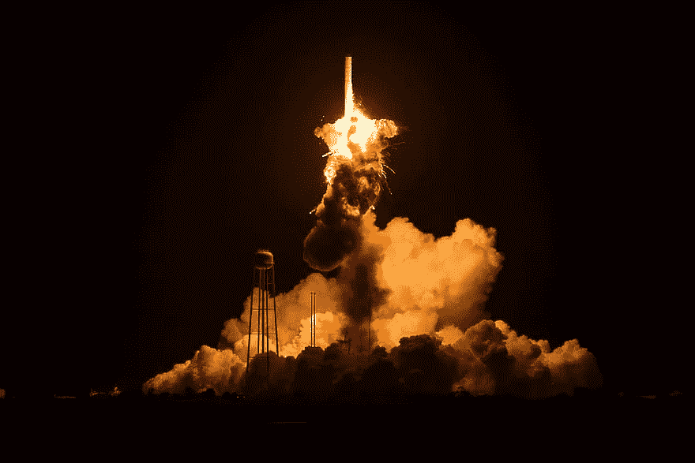

# 如何不部署 Keras/TensorFlow 模型

> 原文：<https://towardsdatascience.com/how-to-not-deploy-keras-tensorflow-models-4fa60b487682?source=collection_archive---------14----------------------->

## 以及如何使用模型服务器来实现智能化



火箭发射失败—[www.pikist.com](http://www.pikist.com)

虽然大多数关于深度学习的文章都集中在建模部分，但关于如何将这种模型部署到生产中的文章也很少。他们中的一些人说“生产”，但是他们经常简单地使用未优化的模型并将其嵌入 Flask web 服务器。在这篇文章中，我将解释为什么使用这种方法不能很好地扩展并且浪费资源。

# “生产”方法

如果您搜索如何将 TensorFlow、Keras 或 Pytorch 模型部署到生产中，有很多好的教程，但有时您会遇到非常简单的例子，声称生产就绪。这些例子经常使用原始的 keras 模型，一个 Flask web 服务器，并将其封装到 docker 容器中。这些例子使用 Python 进行预测。这些“生产”Flask 服务器的代码如下所示:

```
from flask import Flask, jsonify, request
from tensorflow import keras
app = Flask(__name__)
model = keras.models.load_model("model.h5")
@app.route("/", methods=["POST"])
def index():
    data = request.json
    prediction = model.predict(preprocess(data))   
    return jsonify({"prediction": str(prediction)})
```

此外，他们经常展示如何封装 Flask 服务器，并将其与您的模型捆绑到 docker 中。这些方法还声称，它们可以通过增加 docker 实例的数量来轻松扩展。

现在让我们回顾一下这里发生了什么，以及为什么它不是“生产”级的。

# 没有优化模型

首先，通常模型按原样使用，这意味着示例中的 Keras 模型只是由 model.save()导出。该模型包括所有参数和梯度，这些参数和梯度是训练该模型所必需的，但不是推断所必需的。此外，该模型既不修剪也不量化。因此，使用未经优化的模型会有更高的延迟，需要更多的计算，并且文件也更大。

B5 Efficientnet 示例:

*   h5 keras 型号:454 兆字节
*   优化的张量流模型(无量化):222 兆字节

# 使用 Flask 和 Python API

下一个问题是使用普通 Python 和 Flask 来加载模型和提供预测。这里有很多问题。

首先让我们看看您能做的最坏的事情:为每个请求加载模型。在上面的代码示例中，当调用脚本时使用模型，但是在其他教程中，他们将这一部分移到了预测函数中。这就是每次你做预测的时候都要加载模型。请不要这样做。(这里的比较不能与那种方法相比)

话虽如此，我们还是来看看 Flask。Flask 包含一个强大且易于使用的 web 服务器用于开发。在[官方网站](https://flask.palletsprojects.com/en/1.1.x/deploying/)上，你可以读到以下内容:

> 虽然轻量级且易于使用， **Flask 的内置服务器不适合生产**，因为它没有很好的扩展性。

也就是说，你可以在谷歌应用引擎中使用 Flask 作为 WSGI 应用。然而，许多教程并没有使用 Google App Engine 或 NGIX，他们只是照原样使用它，并将其放入 docker 容器中。但是，即使他们使用 NGIX 或任何其他 web 服务器，他们通常也会完全关闭多线程。

让我们更深入地研究一下这个问题。如果您使用 TensorFlow，它会为您处理计算资源(CPU、GPU)。如果加载模型并调用 predict，TensorFlow 将使用计算资源来进行这些预测。发生这种情况时，资源正在使用中，也就是被锁定。当您的 web 服务器当时只服务于一个请求时，您就没事了，因为模型是在这个线程中加载的，predict 是从这个线程中调用的。但是一旦您同时允许多个请求，您的 web 服务器就会停止工作，因为您无法从不同的线程访问 TensorFlow 模型。也就是说，在这个设置中，您不能一次处理多个请求。听起来不像是可扩展的，对吧？

示例:

*   Flask 开发 web 服务器:1 个并发请求
*   TensorFlowX 模型服务器:并行度可配置

# 用 docker 扩展“低负载”实例

好吧，web 服务器不能扩展，但是扩展 web 服务器的数量呢？在很多例子中，这种方法解决了单个实例的伸缩问题。没什么好说的，它确实有效。但是以这种方式扩展会浪费金钱、资源和能源。这就像有一辆卡车，放入一个包裹，一旦有更多的包裹，你会得到另一辆卡车，而不是更聪明地使用现有的卡车。

延迟示例:

*   长颈瓶服务如上所示:每张图片约 2 秒
*   Tensorflow 模型服务器(无批处理，无 GPU):每个图像约 250 毫秒
*   Tensorflow 模型服务器(无批处理，GPU):每个图像约 100 毫秒

# 不使用 GPU/TPU

GPU 使深度学习成为可能，因为它们可以大规模并行进行操作。当使用 docker 容器将深度学习模型部署到生产中时，大多数例子都没有利用 GPU，他们甚至没有使用 GPU 实例。每个请求的预测时间在 CPU 机器上要慢得多，所以延迟是一个大问题。即使使用强大的 CPU 实例，您也无法获得与小型 GPU 实例相当的结果。

只是一个旁注:一般来说，如果主机安装了正确的驱动程序，在 docker 中使用 GPU 是可能的。Docker 完全可以放大实例，但是要放大正确的实例。

成本示例:

*   2 个 CPU 实例(16 核，32gb，1.4x 大):0，816 美元/小时
*   1 个 GPU 实例(32G 内存，4 个内核，Tesla M60，g3s . xlarge):0.75 美元/小时

# 已经解决了

如您所见，加载训练好的模型并将其放入 Flask docker 容器并不是一个优雅的解决方案。如果你想在生产中进行深度学习，从模型开始，然后考虑服务器，最后考虑扩展实例。

# 优化模型

不幸的是，优化推理模型并不像它应该的那样简单。但是，它可以轻松地以倍数减少推理时间，所以毫无疑问是值得的。第一步是冻结重量，去除所有的训练开销。这可以通过 TensorFlow 直接实现，但如果您来自 Keras 模型，则需要将您的模型转换为估计量或 Tensorflow 图(保存的模型格式)。TensorFlow 本身对此有一个[教程](https://www.tensorflow.org/guide/saved_model)。为了进一步优化，下一步是应用模型[修剪](https://www.tensorflow.org/model_optimization/guide/pruning/)和[量化](https://www.tensorflow.org/model_optimization/guide/quantization/post_training)，其中不重要的权重被移除，模型大小被减小。

# 使用模型服务器

当你有一个优化的模型时，你可以查看不同的模型服务器，这意味着生产中的深度学习模型。对于 TensorFlow 和 Keras，TensorFlowX 提供了 [tensorflow 模型服务器](http://digital-thinking.de/how-to-deploy-keras-cnns-with-tensorflow-serve-including-jpeg-decoding/)。还有其他像 TensorRT，Clipper，MLFlow，DeepDetect。

[TensorFlow 模型服务器](https://github.com/tensorflow/serving/blob/master/tensorflow_serving/g3doc/architecture.md)提供了几个特性。同时为多个型号提供服务，同时将开销降至最低。它允许您对模型进行版本化，在部署新版本时无需停机，同时仍然能够使用旧版本。除了 gRPC API 之外，它还有一个可选的 REST API 端点。吞吐量比使用 Flask API 高很多，因为它是用 C++编写的，并且使用多线程。此外，您甚至可以启用批处理，在这种情况下，对于非常高的负载设置，服务器会将多个单个预测批处理为一批。最后，您可以将它放入 docker 容器中，并进一步扩展。

提示:tensorflow_model_server 在每个 AWS-EC2 深度学习 AMI 映像上都有，有了 TensorFlow 2 就叫 tensorflow2_model_server。

# 使用 GPU 实例

最后，我建议在推理环境中使用 GPU 或 TPU。这种加速器的延迟和吞吐量要高得多，同时节省了能源和资金。请注意，只有当您的软件栈能够利用 GPU(优化模型+模型服务器)的能力时，它才会被利用。在 AWS 中，您可以查看[弹性推理](https://aws.amazon.com/de/machine-learning/elastic-inference/)或只使用 Tesla M60 (g3s.xlarge)的 GPU 实例。

最初发布于 [digital-thnking.de](http://digital-thinking.de/how-to-not-deploy-tensorflow-models-and-how-do-it-better/)