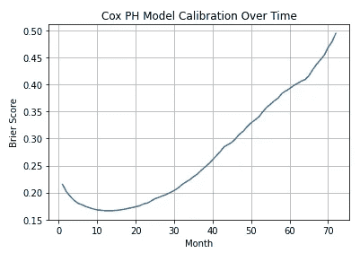

# 如何不预测和防止客户流失

> 原文：<https://towardsdatascience.com/how-to-not-predict-and-prevent-customer-churn-1097c0a1ef3b?source=collection_archive---------6----------------------->

## 学习生存分析技术，预测客户是否以及何时可能流失，以及预期的潜在损失

奥斯汀·凯梅尔在 [Unsplash](https://unsplash.com?utm_source=medium&utm_medium=referral) 上的照片

顾客是任何企业的面包和黄油。无论是 B2B 商业模式还是 B2C，每个公司都在努力争取一个流失最小的粘性客户群，以确保持续的、经常性的收入流。

但是，如何确定确保客户长寿的具体客户特征呢？如何识别“风险”客户，即那些可能流失的客户？给定客户流失的概率，我们什么时候能期待他流失？更重要的是，我们能在“风险”客户身上投资多少来留住他们？

如果一个企业对最大限度地减少客户流失感兴趣，这些都是理想情况下应该回答的问题。我会尽力帮你找到这些问题的答案。

分析非合同环境(如零售)中的客户流失是一项重要的工作，因为这里无法对流失进行单独定义。到目前为止已经购买了 X 次的顾客可以再次购买，也可以永远不再购买。已经提出了各种方法来解决这个问题，包括异常检测和寿命价值(LTV)分析。我曾在[的另一篇文章](/what-is-your-customers-worth-over-their-lifetime-dfae277fd166)中以非合同的形式报道过 LTV 分析。

然而，合同或基于订阅的模型更容易分析，因为在这些场景中，客户流失是在给定时间点的二元分类问题。如果一个客户不更新他的订阅，那么他毫无疑问已经发生了变化。对此不可能有两种选择:要么客户是活跃的，要么客户已经变得活跃。在本帖中，我们将介绍适用于订阅模式的客户流失分析。

传统的客户流失建模方法利用逻辑回归、随机森林或梯度下降推进来分析和预测客户流失。但是，我们将利用生存分析技术来获得与客户流失相关的更多信息。这将有助于我们回答本文开头提出的进一步的问题。

# 但是什么是生存分析呢？

生存分析是统计分析的一个分支，它解决诸如“特定事件发生前多久”的问题，即，它是一个“事件发生时间”模型(与事件发生的概率相比)。传统上，生存分析大量用于医学和生命科学领域，以确定个体或其他生物有机体的预期寿命。

生存分析适用于我们可以定义的情况:

*   “诞生”事件:对我们来说，这将是客户与公司签订合同
*   “死亡”事件:对我们来说，“死亡”发生在客户不再续订时

虽然逻辑回归和决策树适用于二元分类问题(客户是否会流失？)，生存分析不止于此来回答客户什么时候会流失。如果我们不希望客户马上流失，这并不意味着他永远不会流失。如果不是现在，他以后很有可能会流失。在这种情况下，生存分析可以通过预测他们在未来不同时间点的生存(或流失)来揭示这些“被审查”的客户。

这种处理数据“审查”的能力使生存分析成为优于其他回归和基于树的模型的技术。

## 经过检查的数据

在传统意义上，审查是指在观察期内失去对个人的跟踪，或者在此期间没有观察到感兴趣的事件。这些数据被“审查”,因为每个人都会在未来某个时间点死亡或离开/取消订阅；我们只是错过了那个信息。仅仅因为我们没有观察到他们取消联系或订阅并不意味着他们永远不会。我们不能等到他们取消订阅才开始分析。这就是所谓的权利审查。

其他类型的审查包括左审查和间隔审查。前者是指我们不知道一个人何时成为我们的客户，因为他的“出生”事件发生在我们的观察时间段之前。相比之下，间隔-审查发生在数据以特定的时间间隔收集，不构成一个连续的观察期。因此，一些生命/死亡事件可能会在数据中被遗漏。

## 术语

*   事件时间:感兴趣的事件发生的时间——在我们的例子中是订购的流失或不续订
*   起始时间:客户开始服务/订阅的时间
*   事件发生时间:事件发生时间和起源时间之差
*   生存函数:这给出了我们感兴趣的事件在时间`t`之前没有发生的概率。换句话说，它为我们提供了事件发生时间值大于`t`的人口比例
*   危险函数:这给出了我们感兴趣的事件在特定时间发生的概率。生存函数可以从风险函数中导出，反之亦然
*   风险比是我们感兴趣的事件在两个不同协变量组(如已婚或未婚)中发生的概率比。例如，风险比为 1.10 意味着协变量的存在会使风险事件的概率增加 10%
*   协变量是指生存分析中的预测因子、变量或特征

生存分析技术被设计成通过两个主要的数据点来识别生存函数:持续时间或事件发生的时间，以及一个二元标志，即对于每个观察，我们感兴趣的事件是否已经发生。生存分析并不真正关心事件发生的时间或起源的时间。相反，事件信息的时间是最重要的。

## 生存分析和信用风险分析

已经进行了几项研究来确定生存分析是否也可以预测客户违约的概率和预期时间。但是，相对于传统的逻辑回归方法，没有观察到显著的改善。此外，银行监管机构和巴塞尔协议要求一种易于理解和解释的信贷决策方法，这一事实使得逻辑回归在这些情况下成为更好的选择。

# 生存/风险函数估计

我们将涵盖两个最完善的，有文件证明的，实践中的模型，通过观察到的数据来估计生存和风险函数。

## 卡普兰-迈耶生存分析

虽然我们没有人口的真实生存曲线，但我们可以通过一种称为 Kaplan-Meier 估计量的强大的非参数方法，根据观察到的数据来估计人口的生存函数。KM 存活曲线在 x 轴上绘制时间，在 y 轴上绘制估计的存活概率。

KM 生存分析只需要两个输入来预测生存曲线:事件(搅动/非搅动)和事件发生时间。请注意，KM 没有使用其他特征或预测因子来评估生存函数。

## 考克斯比例风险(CPH)模型

在现实生活中，除了事件和持续时间数据，我们还有人口中个体的各种其他协变量(特征或预测因素)。很有可能这些额外的协变量也会影响我们感兴趣的事件在未来特定时间点不发生的概率(称为生存概率)。例如，在电信环境中，这些附加特征可以包括性别、年龄、家庭规模、月费等。CPH 模型既可以处理分类协变量，也可以处理连续协变量。

CPH 模型决定了协变量的单位变化对观测值生存概率的影响。CPH 是一个半参数模型，由两部分组成:

*   基线风险函数是模型的非参数部分。回想一下，危险函数显示了未来某一事件发生的风险或概率。基线风险函数在协变量的“基线”水平(通常是平均值)估计这种风险，通常类似于 KM 曲线
*   协变量与基线风险函数的关系，是模型的参数部分。这种关系表现为一个不随时间变化的因素(或系数),直接影响基线危害。

半参数模型的真正本质在于它允许我们拥有两个世界的最佳部分:一个可解释和可操作的模型(参数部分)，同时仍然提供真实生活数据的公平表示，而不做任何与其函数形式相关的假设(非参数部分)。

然而，CPH 模型有一个很强的假设，叫做比例风险假设。这一假设表明，协变量的相关风险可能会随着时间的推移而变化，但风险比率会随着时间的推移保持不变。考虑一下二元协变量:已婚个体死亡的风险可能会随着时间而改变。但是下面两者的比率被假定为随时间保持不变:

*   已婚个体在时间`t`死亡的风险
*   未婚个体死亡的风险`t`

我们将在本帖后面的实际例子中详细讨论这一假设，以及在实际应用中是否可以容忍任何偏差。

# 生存分析案例研究——客户维系

理论讲够了，现在让我们转向一个实际的案例研究，我们将利用电信客户数据集上的生存分析技术来预测特定客户何时会流失，以及我们能够支付多少费用来留住他们。

所有相关的生存分析技术都包含在 Python 可用的`lifelines`包中。我们将使用电信客户的公开可用的[数据集](https://github.com/finlytics-hub/churn_model-survival-analysis/blob/master/churn_data.csv)，除其他协变量外，该数据集还包含个人在公司的任期/持续时间信息，以及一个二进制标志，该标志表示在数据收集之日他是否有过不愉快经历:

我们最初的数据研究揭示了以下内容:

*   除了一个协变量之外，所有协变量都是`object`数据类型，这意味着我们需要对它们进行一次性编码
*   `TotalCharges`属于`object`数据类型，而不是`float64`。原因似乎是一些用于特定观察的空白
*   对于模型训练，唯一标识符(在本例中为`customerID`)通常会被删除。然而，我们在这里的最终目标也是确定和规划客户层面的策略，以减少我们当前未流失客户的流失。因此，我们将把活跃的和被审查的个人的`customerID` & `MonthlyCharges`划分到一个单独的数据框架中，以便以后在设计客户层面的策略时使用
*   连续变量的 KDE 图描绘了偏态分布

然后，我们将执行以下特征工程步骤，为生存分析准备数据:

*   用`MonthlyCharges`列的值替换`TotalCharges`中的空格，并将其转换为数值数据类型。
*   分别用 1 和 0 替换目标`Churn`列的 Yes 和 No 值。
*   同样，对于其他特定功能，将“是”替换为 1，将“0”替换为其他值(例如，否，无互联网服务)。
*   创建剩余分类特征的虚拟变量。

**注**:对于每个虚拟变量，我们通常会删除其中一个编码特征，以消除多重共线性的风险。但是，我们将手动删除一个特定的虚拟变量，该变量通常代表我们的订户群体。当我们删除一个虚拟列时，该删除列的值会在基线危险函数中出现。手动控制应该删除哪个虚拟变量可以确保我们的基线风险函数代表典型的订户。其他一切都偏离了这个公认的基线，从而被业务直观地理解。因此，我们将去掉样本中出现频率最高的虚拟变量。

生命线中的 CPH 模型实施不适用于高度共线的协变量，因此让我们通过热点图来检查是否存在多重共线性:

由于上面的热图没有显示任何高的成对相关性，我们将继续我们的生存分析。

除了可视化和数据浏览之外，到目前为止执行的步骤的代码如下:

**注意**:我们很幸运，因为我们的数据已经有了一个持续时间或任期列。通常，您可能会遇到每个观察的开始和结束时间，而不是这些持续时间。`lifelines`有一个方便的实用函数，可以将开始和结束日期转换成一个表示持续时间的 NumPy 浮点数组和一个事件观察的布尔数组:`[datetimes_to_durations](https://lifelines.readthedocs.io/en/latest/lifelines.utils.html#lifelines.utils.datetimes_to_durations)`

# KM 曲线

我们将通过首先绘制样本的 KM 曲线来开始我们的生存分析，该曲线向我们显示了在特定时间点平均客户的历史生存概率。请记住，协变量的存在对 KM 曲线没有影响，因为它只与持续时间和事件标志有关。通常，在实践中，在通过 CPH 模型进行更深入的分析之前，首先会查看 KM 曲线以了解我们的数据。

我们针对所有客户的第一条 KM 曲线，置信区间为 5%，如下所示:

以上应该让我们对客户有了一些基本的直觉。正如我们对电信业务的预期，客户流失率相对较低。即使过了 72 个月(我们数据中的最大期限)，公司也能留住 60%或更多的客户。

图底部的行显示了一些要解释如下的附加信息:

*   有风险:观察到的期限超过该时间点的客户数量。例如，532 名客户的租期超过 70 个月
*   已审查:任期等于或小于该时间点且未被搅动的客户数量。例如，3，860 名客户的租期为 60 个月或更短，但他们当时并未流失
*   事件:任期等于或小于该时间点的客户数量，该时间点之前已经发生了变动。例如，1，681 名客户的租期为 50 个月或更短，到那时已经流失了

在这一点上，我们不知道我们的哪些协变量对我们客户的生存机会有实质性的影响(CPH 模型将在这方面帮助我们)。然而，凭直觉我们知道，更长的定期合同会影响客户的生存概率。为了检验这种潜在影响，我们将为合同列的每个唯一值绘制 KM 曲线:

我们这里有本质上不同的生存曲线，如预期的那样，月合同客户的生存概率随时间急剧下降。即使在三年后(准确地说是 40 个月):

*   2 年合同的客户几乎有 100%的生存概率
*   一年期合同的客户有超过 95%的生存概率
*   月合同的客户只有大约 45%的生存概率

# CPH 模型

现在更有趣的事情来了，我们将分析数据中生存曲线和其他协变量之间的相互作用。拟合 CPH 模型就像 scikit-learn 中的任何其他 ML 模型一样。下面的模型摘要是通过模型的`print_summary`方法访问的:

上面的模型总结列出了 CPH 模型分析的所有一次性编码协变量。让我们看看这里提供的关键信息:

*   模型系数(`coef`列)告诉我们每个协变量如何影响风险。协变量的正`coef`表明具有该特征的客户更有可能流失，反之亦然
*   `exp(coef)`是危害比，解释为变量每增加一个单位的危害风险的标度，1.00 为中性。例如，`StreamingMovies`的 1.332 风险比意味着订阅了流媒体电影服务的客户取消服务的可能性增加了 33.2%。从我们的角度来看，`exp(coef)`低于 1.0 是好的，这意味着客户在有协变量的情况下不太可能取消订单
*   模型一致性 0.929 的解释类似于逻辑回归的 AUROC:
    — 0.5 是随机预测的预期结果
    —越接近 1.0 越好，1.0 显示出完美的预测一致性。

因此，我们的模型的 0.929 的一致性是一个非常好的一个！

**但是什么是和谐指数呢？**

0.929 的一致性基本上意味着我们的模型在未经审查的**数据的 100 对**中正确预测了 92.9 对**。它基本上评估了模型的区分能力，即它在区分活着的和被搅动的受试者方面有多好。比较两种不同的模型是有用的。然而，concordance 并没有说我们的模型校准得有多好——这是我们稍后将评估的内容。**

这里的一对指的是我们数据中所有可能的客户对。考虑一个例子，其中我们有五个未经审查的客户:A、B、C、D & E。从这五个客户中，我们可以有总共十个可能的对:(A、B)、(A、C)、(A、D)、(A、E)、(B、C)、(B、D)、(B、E)、(C、D)、(C、E)和(D、E)。如果 E 被删截，则一致性指数计算将排除与 E 相关的对，并将考虑分母中剩余的八对。

## 确认比例危险(PH)假设

回想一下上面解释的 CPH 模型的比例风险假设。PH 值假设可以使用基于缩放舍恩菲尔德残差的统计测试和图形诊断进行检查。该假设由残差和时间之间的非显著关系(例如，p > 0.05)支持，并由显著关系(例如，p < 0.05)反驳。

我不会深入许多技术细节，而是只关注实际应用。可以通过`lifelines`’`check_assumptions`方法在拟合的 CPH 模型上检查 PH 假设。执行此方法将返回不满足 PH 假设的协变量的名称、关于如何潜在地纠正 PH 违反的一些通用建议，以及对于违反 PH 假设的每个变量，缩放的舍恩菲尔德残差相对于时间变换的可视化图(一条扁平线确认 PH 假设)。更多详情请参考[本](https://lifelines.readthedocs.io/en/latest/jupyter_notebooks/Proportional%20hazard%20assumption.html)。

在检查我们模型的 PH 假设时，我们发现 3 个协变量不符合它。然而，就项目的目的而言，我们将忽略这些警告，因为我们的最终目标是生存预测，而不是确定推断或相关性来理解协变量对生存持续时间和结果的影响。关于我们为什么可以安全地忽略这些偏差的更多细节，请参考[和](https://lifelines.readthedocs.io/en/latest/jupyter_notebooks/Proportional%20hazard%20assumption.html#Do-I-need-to-care-about-the-proportional-hazard-assumption?)。

## CPH 模型验证

`lifelines` library 有一个内置函数，可以对我们拟合的模型进行 k 重交叉验证。使用和谐指数作为评分参数运行它，结果在十个折叠中平均和谐指数为 0.928。

和谐指数没有说任何关于模型校准的事情，例如，预测的概率与实际的真实概率有多远？我们可以绘制一条校准曲线来检查我们的模型在任何给定时间正确预测概率的倾向。现在让我们使用`sklearn`的`calibration_curve`函数绘制 t = 12 时的校准曲线:

考虑到我们的数据在被搅动和未被搅动的客户之间的偏斜分布，我们将`calibration_curve`的`strategy`参数设置为`‘quantile’`。这将确保基于第 12 个月的预测流失概率，每个箱将具有相同数量的样本。这是可取的，否则，我们将有等宽的仓，这在搅动的/未搅动的客户之间不平衡的类别分布下是不具有代表性的。

上述校准图表明，对于绘制的前七个十分位数，我们的 CPH 模型低估了流失风险，而对于后两个十分位数，我们的模型高估了流失风险。

总的来说，校准曲线看起来不算太差。让我们通过计算 Brier 分数来确认一下，我们发现它是 0.17 (0 是一个理想的 Brier 分数)，一点也不差！

我们还可以绘制每个月的 Brier 分数，如下所示:

我们可以看到，我们的模型在 5 到 20 个月之间进行了合理的校准，然后随着我们开始预测更远的时间而恶化。

## CPH 模型可视化

现在让我们将 CPH 模型中分析的所有协变量的系数和风险比可视化:

通过该图，我们可以快速识别对预测客户流失至关重要的特定客户特征。

可能导致流失的协变量:

*   流媒体电视和电影订阅
*   多条电话线
*   设备保护订阅
*   独居的人
*   邮寄支票付款

可能有助于留住客户的协变量:

*   有 1 年或 2 年的合同期限(非常明显)
*   自动支付方式
*   没有网络和电话服务
*   DSL 互联网服务

现在让我们绘制并想象在特定水平下改变生存曲线上的协变量以及基线生存曲线的效果:

很明显，总支出接近零的客户比总支出接近 3000 英镑或更多的客户更有风险(他们的生存曲线急剧下降)。此外，拥有长期合同提高了客户的生存概率。

与 CPH 建模、验证和可视化相关的所有代码如下:

# 流失预测和预防

因此，现在我们知道我们可以关注哪些协变量来降低现有右删失客户的流失风险，即那些尚未流失的客户。让我们首先绘制出`Contract`、`PaymentMethod`、`InternetService`和`PhoneService`的分类 KM 曲线:

见解:

*   鼓励客户通过银行转账或信用卡设置自动支付
*   与客户签订 1 年或 2 年的合同是非常明确的
*   关于互联网服务，首先，我们应该分析拥有 DSL 或光纤互联网订阅的客户流失率相对较高的根本原因，可能是服务质量差、价格高、客户服务不足等。我们还应该对互联网服务进行盈利能力分析。最佳行动方案将取决于这一分析
*   有或没有电话服务的客户的生存曲线似乎没有太大的统计差异

## 分析被审查的客户

现在，我们将把我们的重点放在审查和仍然活着的客户，以确定未来的一个月，他们可能会与我们一起做些什么来增加他们的保留机会。

在对所有客户的数据进行过滤后，我们将使用`[predict_survival_function](https://lifelines.readthedocs.io/en/latest/fitters/regression/CoxPHFitter.html#lifelines.fitters.coxph_fitter.SemiParametricPHFitter.predict_survival_function)`方法预测这些客户的**未来**生存曲线，给出他们各自的协变量。也就是说，估计我们客户的**剩余**寿命。

`predict_survival_function`的输出将是一个矩阵，包含每个剩余客户在特定未来时间点的生存概率，直到我们数据中的最大历史持续时间。因此，如果我们数据中的最大持续时间是 70 个月，`predict_survival_function`将预测从今天开始的未来 70 个月。该方法还允许我们通过`times`参数计算未来特定月份的生存概率(有助于回答我们希望在未来 3 个月和 6 个月结束时保留多少客户等问题)。

两个特定客户的`predict_survival_function`输出示例:

列 15 中的客户在从现在起的 73 个月后预期有 99.9%存活，而列 16 中的客户在仅 4 个月后预期有 74.4%存活的概率。

**计算预期损失**

我们可以使用这些生存概率来确定每个客户的生存可能性低于某个阈值的具体月份。根据用例，我们可以选择任何百分比，但是对于我们的项目，我们将通过`median_survival_times`方法使用中间值。`qth_survival_times`可用于任何其他百分位数。

`median_survival_times`方法的输出是代表未来一个月的单行，在该月中，每个被审查/存活客户的存活概率低于中值存活概率:

`inf`基本上意味着这个客户几乎肯定是活着的。

接下来，我们将执行以下操作:

*   将`median_survival_times`的转置输出与 CustomerID 和相应的 MonthlyCharges 连接起来(我们在最开始时将其放在一边)。这将使我们能够将我们的预测与每个特定客户及其每月费用联系起来
*   计算每个客户的预期损失，如果他们今天流失，用他们每月的费用乘以他们预期流失的月份
*   对于预期流失月份为`inf`的客户，将`inf`替换为启发式的，可能是 24，对应于 2 年的合同。这将使我们能够估计这些客户的相关预期损失，如果他们今天离开我们，假设他们将与我们在一起至少 24 个月

我们的数据，按照预期损失的降序排列，现在看起来像这样:

我们现在已经确定了如果客户今天离开我们，会给我们带来最高货币风险的客户。

**计算预计收入提升**

我们能做什么来留住他们？来自我们的 CPH 模型和相关的知识管理生存曲线的系数表明我们需要关注什么特征来留住我们当前的客户。但是，现在让我们尝试估计一下，如果我们能够说服客户注册这些防止客户流失的特定功能(如果他们还没有订阅这些功能的话),将会带来多大的经济效益。

因此，如果我们能让一个没有以下内容的客户订阅/注册这些功能，我们将估计以下功能的潜在收入提升。

*   一年的合同
*   两年的合同
*   数字式用户线路
*   通过银行转账自动支付
*   通过信用卡自动支付

我们现在将通过假设情景下的嵌套`for`循环计算上述每个协变量和每个客户的潜在提升。例如，如果他签订了一年的合同，而他没有签订一年的合同，我们可以计算修改后的预期流失月份。

我们最初的隆起分析得出如下结果:

现在，如果我们可以注册一个特定的功能，*其他条件不变*，我们就有了每个客户的预期流失月。例如，如果我们能让客户 7590-VHVEG 与我们签订一年的合同，在其他条件不变的情况下，我们可以期望他再与我们合作 11 个月。或者，如果他建立了自动支付系统，在其他条件不变的情况下，预计他会再呆 4 个月。

如前所述，我们有一些非常好的客户，他们的流失风险很低，表现为基准月份的`inf`值。我们暂时不需要把我们的营销努力集中在他们身上。所以我们将它们排除在进一步的分析之外。

让我们更进一步，看看每个潜在升级对客户的财务影响**超过预期的修改寿命，而不仅仅是预期的额外月份。这是一个简单的计算方法，我们将每个协变量的基线和修订流失月之间的差异乘以每月费用。**

现在我们知道了客户 7590-VHVEG 的以下信息:

*   如果他签订一年期合同，在其他条件不变的情况下，他的预期寿命将增加 328.35 美元的收入
*   *如果他签订了 2 年的合同，在其他条件不变的情况下，他的预期寿命将增加 925.35 美元的额外收入*
*   **如果他转换为自动支付方式之一，在预期寿命增加的情况下，他将获得 119.4 美元的额外收入*其他条件不变***

**与流失预测和预防分析相关的所有代码如下:**

# **结论**

**现在，我们不仅对哪些客户面临流失风险有了一些可操作的见解，而且对客户流失的预期时间和通过引入客户特定策略可能带来的收入增长也有了一些可操作的见解。**

**完整的 Jupyter 笔记本可以在 GitHub [这里](https://github.com/finlytics-hub/churn_model-survival-analysis/blob/master/Customer_Churn_Model_Survival_Analysis.ipynb)找到。**

**一如既往，如果您想讨论任何与数据分析、机器学习、金融和信贷风险分析相关的问题，请随时联系 [me](https://www.finlyticshub.com) 。**

**下次见，继续！**