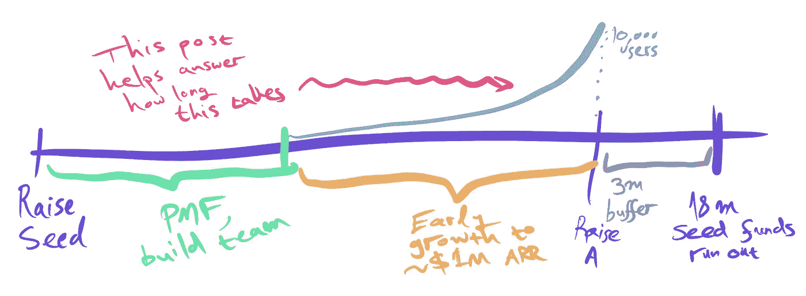

# 如何不跑出跑道:种植种子的简单方法

> 原文：<https://towardsdatascience.com/how-to-not-run-out-of-runway-the-simple-way-to-plan-your-seed-ef2f2c79548?source=collection_archive---------61----------------------->

到处都有很多创业建议。我给大家讲一个经常被忽略的非常实用的——如何规划自己的早期成长。种子期通常致力于寻找你的产品与市场的契合度，也就是说，你开始时没有或只有很少的产品，到最后应该会有一个明显的持续增长的用户群。我将告诉你如何规划这个成长阶段，一旦你这样做了，你就会有一个清晰的种子时间表:

经典种子期的三个步骤:寻找 PMF、早期成长和筹资。图片作者。

虽然存在差异，但当你有早期牵引力时，通过**增长率**和 **ARR** 或潜在货币化用户群进行评估，首轮融资被广泛筹集。

*   什么是好的用户群？一个可能或正在产生约 100 万美元收入的项目。
*   为什么是 100 万美元？因为你的 A 轮会在 1000 万美元估值附近，而 x10 一般是这个阶段使用的倍数。有许多变化，但很少数量级的变化。
*   什么是好的增长率？保罗·格拉厄姆[说 5%-7% w/w](http://www.paulgraham.com/growth.html) 大卫萨克斯[说每月 15%-20%](https://soundcloud.com/twistartups/twist-e1084#t=44:49)(稍微慢一点)。你可以很容易地在 Twitter 和 VC 博客/播客上找到上述数字的 100 个其他基准——但除非你打算投资，否则花这么多时间是没有用的，只是用这些数字作为指南，然后尽你所能。

综合起来，所有这些数字意味着你的种子成长计划应该是这样的:你筹集了足够 X 个月的资金，比如 18 个月。就在这笔钱用完之前，你最好开始筹集 100 万美元左右的首轮资金。也许你想要一个 3 个月的缓冲期，以防万一你错过了你的成长目标。以 5% w/w 的增长率，需要多长时间才能制造出 100 万美元的 ARR？你应该在播种后的第 12 个月开始吗？还是第三个月？你还有多长时间到达 PMF？如果你错过了增长的起点几个月，你现在需要增长多快才能赶上？这意味着你每周需要带来多少用户？[这个简单的互动模型将回答所有这些问题。](https://grid.is/@np/basic-startup-growth-model-mQY7d56JT5qeYNljnSmSfg)(这个在 grid.is 上，让电子表格互动。我和他们没有关系，我只是喜欢这个工具)。

网格模型。是我们用来规划我们的成长。我们用 getradical.co 来谈论工作。图片作者。

要使用它，你填写你的目标结束日期(3 个月前你用完现金，所以你需要提高你的下一轮)。输入你将从第一次发布中获得的初始用户数量(可能是你的等待列表中的用户或主要的第一次推送——比如 100 个左右)。然后，设定你的目标用户数量，以及你预测的每周流失率。只有这样，才可以开始玩“场地开始”游戏。如果给自己 4 个月的成长时间会怎么样？这是一个现实的增长率吗？还是你需要达到罕见的 10%以上的 w/w 增长率？10 个月怎么样？你还有 10+3 个月的时间吗？或者你应该从今天就开始实现每周目标吗？

您可以找到一个表格，为您提供准确的每周增长目标，您可以打印出来并与您的团队分享。你可以填写你每周实际实现了多少，以及你是领先还是落后于目标。正如保罗·格拉厄姆所说，专注于这一点将会引导你走向成功，或者给你的创业带来更好的想法。

> 专注于达到一个增长率会把创业的繁杂问题简化成一个单一的问题。——p·格雷厄姆

底部的表格是你每周的目标。图片作者。

这是一个基本的模式，你可以去想象和添加更多的选项——按照有机和付费增长，按照渠道，或者增加不同的收入；你可以很容易地对一些低的和有上限的病毒率建模(例如，每个人可能以 15%的概率导致 3 个以上的人)。请随意联系我，让 Excel 来完成这些，我特别想知道这是否改变了你对种子期的计划。以上截图来自[互动模式](https://grid.is/@np/basic-startup-growth-model-mQY7d56JT5qeYNljnSmSfg)。