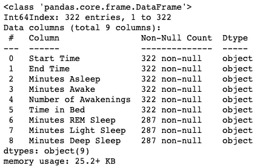
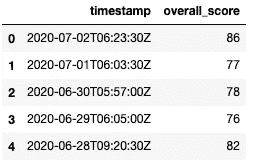
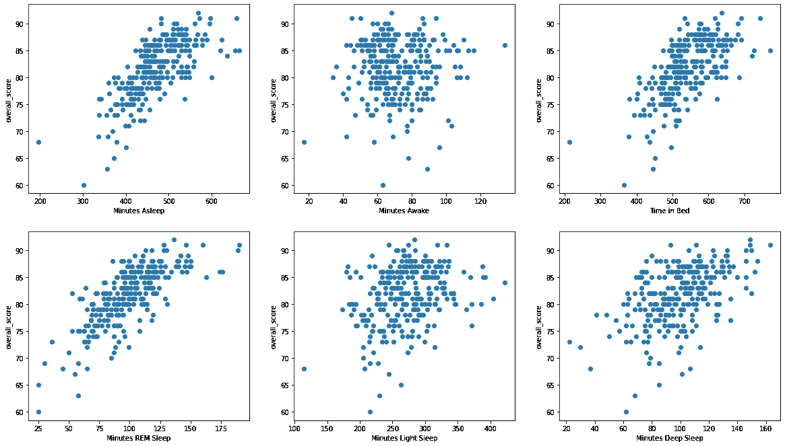

# 如何获取和分析 Fitbit 睡眠评分

> 原文：<https://towardsdatascience.com/how-to-obtain-and-analyse-fitbit-sleep-scores-a739d7c8df85?source=collection_archive---------7----------------------->

凯利·西克玛在 [Unsplash](https://unsplash.com?utm_source=medium&utm_medium=referral) 上的照片

## 准备用于机器学习模型的 Fitbit 睡眠数据并了解睡眠评分的工作原理

智能手表和其他可穿戴设备在过去几年里越来越受欢迎，并催生了“量化自我”的文化现象。Apple Watch 或 Fitbit 等设备让任何人都有可能轻松地自我跟踪，从而以某种方式量化他们的生活。流行的自我量化包括消耗的卡路里，白天走的步数或睡眠质量。

在本文中，我将使用使用 Fitbit 大约一年的真实生活数据，重点关注后者，即睡眠质量。Fitbit 为用户提供了一个睡眠评分，这应该是衡量睡眠质量的一个指标。我将使用 Python 训练和测试不同的机器学习模型，试图尽可能准确地预测 Fitbit 睡眠分数，同时解释不同的指标，如 REM 睡眠分钟数，如何影响分数。

这篇文章的结构如下:

1.  Fitbit 睡眠评分简介
2.  从 Fitbit 获取睡眠数据
3.  数据清理和准备
4.  探索性数据分析
5.  将数据分为训练集、验证集和测试集
6.  扩展功能和定义性能指标
7.  使用套索回归的特征选择
8.  多元线性回归
9.  随机森林回归量
10.  极端梯度推进回归器
11.  交叉验证
12.  超参数调谐
13.  最终模型评估
14.  结论意见

因为涉及的内容很多，所以我把这篇文章分成三部分。第 1 部分包括第 1 点到第 4 点，重点是获取睡眠数据、预处理和可视化。[第 2 部分](https://medium.com/@bennerjonas10/using-machine-learning-to-predict-fitbit-sleep-scores-496a7d9ec48)涵盖了第 5 点至第 10 点，即基于第 1 部分的预处理数据实际构建机器学习模型。[第 3 部分](https://medium.com/@bennerjonas10/cross-validation-and-hyperparameter-tuning-how-to-optimise-your-machine-learning-model-13f005af9d7d)涵盖了剩下的部分，全部是关于改进第 2 部分的模型，以获得最准确的预测。

# Fitbit 睡眠评分到底是多少？

Fitbit 睡眠评分最好通过一个例子来描述，所以这里有两个应用程序提供给用户的截图:

Fitbit 提供的睡眠统计数据

在 Fitbit 应用程序中，用户会得到一个睡眠分数，在这种情况下为 78 分，这是一个睡眠窗口中睡眠阶段的图形表示，这些睡眠阶段的具体细分为分钟和百分比，以及估计的氧气变化。

这本身似乎相当简单明了。Fitbit 只是有一些算法，他们插入相关的睡眠统计数据，如快速眼动睡眠的分钟数，并给出睡眠分数。

对于任何一个有 Fitbit 的人来说，如果他曾经试图理解他们睡眠分数的模式，很明显这远非一目了然。下面的截图会让你明白困惑是从哪里来的:

Fitbit 提供更多睡眠统计数据

将这些睡眠统计数据与最初的数据进行比较，我们可以得出以下结论:

*   睡眠时间比一小时长
*   快速眼动睡眠的时间几乎是一样的
*   深度睡眠的时间更长

基于这些观察，人们会认为第二次睡眠得分会比第一次高，但实际上是一样的。这是怎么回事？不同的统计数据在睡眠分数的计算中起什么作用？只看提供的睡眠统计数据，有可能自己预测睡眠分数吗？

本文回答了所有这些问题，并详细介绍了一个机器学习项目。我希望你喜欢它！

# 从 Fitbit 获取睡眠数据

Fitbit 允许用户通过他们的在线仪表盘导出 CSV 文件形式的睡眠数据。这个过程需要一些手工劳动，因为 Fitbit 一次最多只能导出 31 天的数据。几分钟后，我得到了所有的数据，并迅速将它们合并成一个 CSV 文件。

有一个问题。手动导出的 CSV 文件包括所有睡眠统计数据(睡眠分钟数、清醒分钟数、自由睡眠分钟数等)。)但不包括实际的睡眠分数。搞什么鬼？！

经过一番挖掘，我发现还有另一个名为“终身导出”的导出选项，它可以导出 Fitbit 从你开始佩戴他们的手表以来收集到的所有数据。在下载之前，你必须从 Fitbit 请求这个导出，一旦获得批准，你就可以下载一个包含各种不同文件的 zip 文件夹。该 zip 文件夹中包含一个 CSV 文件，其中包含额外的睡眠统计数据，包括睡眠评分。

我将包含睡眠统计数据的 csv 文件保存为 sleep_stats.csv，将包含睡眠分数的 CSV 文件保存为 sleep_score.csv。

# 数据清理和准备

本节解释了如何从 CSV 文件获取可用于机器学习模型的数据帧。在这个过程中，我遇到了一些将数据导入 Python 时可能出现的常见问题，我解释了如何处理这些问题，以便最终得到一个经过整齐预处理的数据集。

导入所有相关的库后(参见[完整笔记本](https://github.com/JoBe10/Fitbit-Sleep-Score/blob/master/Sleep_Scores/Fitbit_Sleep_Score_Prediction.ipynb)中的库),第一步是使用 pd.read_csv()函数将 CSV 文件中的睡眠数据导入 Python:

我只导入 sleep_score.csv 的前两列，因为它们包含日期和实际睡眠分数，所有其他相关数据都可以在 sleep_stats.csv 中找到。让我们来看看 sleep_stats_data 中的前五行:

这是第一个常见问题:由于 CSV 文件的结构方式，列名位于第一行。有一种方法可以解决这个问题:

使用。info()函数我们可以获得数据帧中数据的高级摘要，在我们的例子中，它看起来像这样:

这里，我们遇到了第二个常见问题:最后三列中有 NaN 值(缺失数据)。上面的信息摘要告诉我们有 322 个条目(行),但是最后三行的非空计数是 287，这表明了这一点。让我们使用下面的代码来看看包含缺失数据的行:

如果我们查看“入睡时间”或“开始和结束时间”一栏，就会清楚地看到这些行指的是 Fitbit 记录的午睡。小睡时间太短，Fitbit 无法可靠地测量重要的睡眠统计数据，因此我们将从数据集中删除所有这些行:

在上面的数据摘要中，我们还遇到了第三个常见问题，它与第一个问题相关:所有列的数据类型都是“object ”,但索引为 2 到 8 的列显然应该是数值型的，即数据类型要么是“int ”,要么是“float”。这些列的数据类型为“object”的原因很可能是因为列标题最初放在第一行，从而导致整个列被归类为“object”。让我们将这些列转换为数据类型“float”:

现在让我们看看前几行和 sleep_score_data 的摘要:

这个数据框架看起来好多了，列标题被自动识别，没有丢失值。

出于进一步分析的目的，我想将两个数据帧合并成一个，这意味着我想将它们合并。为了确保睡眠分数最终出现在对应睡眠统计数据的行中，我需要一个在两个数据帧中都相同的列，它将被用作合并的列。

在我们的例子中，两个数据帧都有一个带有某种时间戳的列。睡眠统计数据帧具有开始和结束时间，睡眠分数数据帧具有时间戳。因为睡眠分数总是在醒来后提供，所以睡眠统计数据帧中相关的日期是结束时间，我们可以去掉开始时间。但是还有一个问题:睡眠统计数据帧中结束时间的格式不同于睡眠分数数据帧中时间戳的格式。如果我们试图合并这些列上的数据帧，这些行将不会匹配。我的解决方案是在两个数据帧中创建一个只包含日期的“Date”列，合并这些列上的数据帧，删除多余的列，并在合并后删除一个包含缺失值的行。以下代码实现了这一点:

生成的组合数据帧如下所示:

合并和预处理的数据

我删除了所有与日期相关的列，因为这不是时间序列分析，我们不需要未来的日期。Fitbit 应用程序没有提供醒来的次数，因为我想只使用应用程序中提供的数据来预测睡眠分数，所以我也放弃了它。

有了经过组合和预处理的数据框架，我们可以继续进行一些探索性的数据分析。

# 探索性数据分析

在这一节中，我将使用可视化来提供对底层数据的更好理解。这些初步的见解将成为以后分析的基础。

首先让我们来看看睡眠分数的分布:

睡眠得分的分布向左倾斜，这是有道理的，因为由于多种原因，如熬夜或不得不早起，晚上睡不好比晚上睡得特别好更容易发生。此外，平均睡眠分数已经相对较高，为 82 分(满分为 100 分)，因此不太可能(基本上不可能)出现许多远高于平均值的异常值。

让我们也来看看每个特征与睡眠分数的关系，以了解哪些特征可能是重要的，以及它们与睡眠分数的关系。我已经定义了一个函数，它将一个数据帧作为输入，该数据帧包含最后一列中的目标变量以及整个绘图中包含的列数。列的数量决定了每行有多少支线剧情。下面是函数:

使用 sleep_data 数据帧和 num_cols=3 作为输入来调用此函数会产生以下图形:

单独来看，睡眠分钟数和快速眼动睡眠分钟数似乎与睡眠得分有最强的正相关。一般来说，这是有道理的，因为当考虑睡眠质量和睡眠分数时，更多的睡眠时间应该是一件积极的事情。快速眼动睡眠时间延长也是如此。

为了完整地描述不同特征和睡眠评分之间的关系，我们来看看相关矩阵:

事实上，睡眠分数与快速眼动睡眠分钟数相关性最高，紧随其后的是睡眠分钟数。另一个需要注意的重要事情是，许多特性是高度相关的。这是有道理的，因为更多的睡眠时间应该导致更多的时间花在睡眠的各个阶段，并且这些特征将会一起移动。虽然这可能是此处包含的要素的性质不可避免的副产品，但它可能会导致多重共线性问题。稍后将详细介绍。

第二部分基于预处理数据和探索性数据分析的见解，建立了两个不同的预测睡眠分数的机器学习模型。第 2 部分可以在这里找到:

 [## 使用机器学习来预测 Fitbit 睡眠分数

### 随机森林、极端梯度推进以及它们在预测 Fitbit 睡眠分数时的表现

medium.com](https://medium.com/@bennerjonas10/using-machine-learning-to-predict-fitbit-sleep-scores-496a7d9ec48)