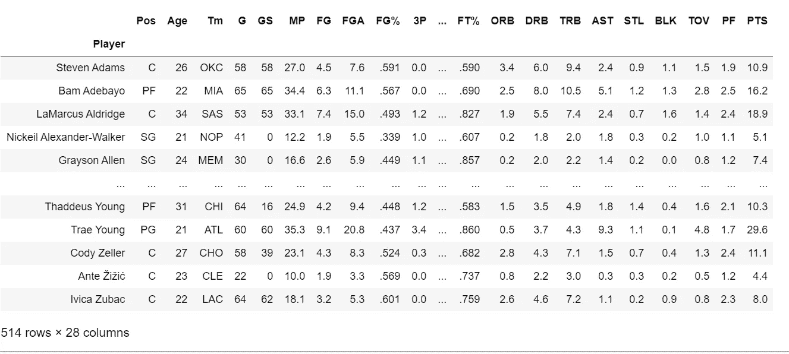

# 如何用 Python 函数获得你最喜欢的球员的 NBA 统计数据

> 原文：<https://towardsdatascience.com/how-to-obtain-nba-statistics-for-your-favorite-players-with-a-python-function-8947516af286?source=collection_archive---------18----------------------->

## 直接从命令行查询 70 年的 NBA 统计数据


TJ·德拉戈塔在 [Unsplash](https://unsplash.com?utm_source=medium&utm_medium=referral) 上的照片

# 介绍

本文将向您展示部署 Python 函数来模拟一项任务的方法之一，这项任务就像搜索您喜爱的篮球运动员在给定 NBA 赛季的统计数据一样简单。

作为一个 NBA 篮球迷，我经常在网上查找某个特定球员的表现，并想知道我是否可以尝试使用 Python 复制这个过程，简单地从笔记本电脑的命令行启动搜索并获得结果，而不需要实际打开浏览器并上网。

让 Python 为您进行 web 搜索对于许多不同类型的应用程序来说是非常强大的，我希望这个简单的例子能够让它变得有用，并启发您将这些概念应用到自己的个人项目中。

# 步骤 1:确定你的统计网站

在篮球分析社区的例子中，[BasketballReference.com](https://www.basketball-reference.com/)是一座数据的金矿，因为它拥有对许多篮球分析项目有用的各种相关游戏内统计数据。我将使用这个网站来收集相关数据。

特别是对于 NBA 的统计数据，该网站有一个“[每场比赛](https://www.basketball-reference.com/leagues/NBA_2020_per_game.html)”部分，人们可以在这里获得任何相关类别的每场比赛表现统计数据，包括参加任何给定赛季的大约 500 名 NBA 球员。

我们的目标是编译和执行一个 Python 程序，它可以返回任何球员在任何给定赛季的每场比赛的完整统计数据。该网站从 20 世纪 50 年代开始记录每场比赛的统计数据，所以给你大约 70(！)年的数据，你可以搜索。

# 第二步:编写 Python 函数

现在让我们来看一下实现这一点所需的函数代码，并一步一步地分解它。

1.  **导入相关的包**:作为第一步，您需要导入相关的 Python 包并定义指向在线数据源的 *url* 变量。您还应该导入熊猫包(" *import pandas as pd* ")，因为您稍后会需要它。

```
import requests
from bs4 import BeautifulSoup
import pandas as pd
```

**2。定义功能并获取用户输入**

你用 *def* 关键字定义函数，给它一个有代表性的名字，比如*get _ NBA _ stats；*该函数不接受任何参数，而是让用户通过两个*输入*命令来定义它们，其中程序提示输入年份和球员姓名，以返回每场比赛的统计数据。

```
def get_NBA_stats():year=input("Which NBA season are you interested in?: ")
player=input("For which player do you want to get stats?: ")
```

**3。抓取并保存数据**

然后，您需要用 *request.get* 方法获取相关的 url 内容。请注意*年*变量是如何用于将搜索指向*年*季统计数据所在的网页的。然后，您可以用*提取它的文本。text 方法，*最后把它解析成一个 Beatiful Soup 对象。

```
url = '[https://www.basketball-reference.com/leagues/NBA_{}_per_game.html'.format(year)](https://www.basketball-reference.com/leagues/NBA_{}_per_game.html'.format(year))

r = requests.get(url)
r_html = r.text
soup = BeautifulSoup(r_html,'html.parser')
```

为了在 BasketballReference 网页的 HTML 中定位包含球员数据集的表格，您可以检查页面的代码(这可以通过在 Google Chrome 上单击 Ctrl + Shift + I 来完成)，并看到您感兴趣的表格元素有一个与 *full_table* 相等的*类*，您可以使用该类通过 *soup.find_all* 命令将表格内容存储到 *table* 变量中。

然后，您可以使用 *soup.find* 来定位页面中的元素，其中*类*等于 *table_head* ，因为该类存储我们的玩家数据集的列名。您可以将它们保存在一个名为 *head，*的变量中，然后该变量用于提取和清理最终数据集的相关列名，例如每个球员的姓名、每场比赛的得分、每场比赛的篮板数等..如下图所示。

```
table=soup.find_all(class_="full_table")

""" Extracting List of column names"""
head=soup.find(class_="thead")
column_names_raw=[head.text for item in head][0]
    column_names_polished=column_names_raw.replace("\n",",").split(",")[2:-1]print(column_names_polished)['Player',
 'Pos',
 'Age',
 'Tm',
 'G',
 'GS',
 'MP',
 'FG',
 'FGA',
 'FG%',
 '3P',
 '3PA',
 '3P%',
 '2P',
 '2PA',
 '2P%',
 'eFG%',
 'FT',
 'FTA',
 'FT%',
 'ORB',
 'DRB',
 'TRB',
 'AST',
 'STL',
 'BLK',
 'TOV',
 'PF',
 'PTS']
```

然后，您可以遍历整个*表*元素，对于每一行数据(与单个玩家相关并由 *td* HTML 标签标识)，您可以提取所有玩家的统计数据，并将它们存储到一个名为 *players 的列表中。一旦完成，你所要做的就是将所有玩家的信息存储到一个熊猫数据框中，该数据框采用先前定义的列名，你可以将玩家的全名设置为索引。*

**注意:**获得一个给定赛季的球员的完整名单对于完成手头的特定任务来说不是必要的，我只是展示如何这样做，因为通常最好的做法是存储所有潜在有用的数据(例如，如果以后你想将单个球员的表现与其同行进行比较，拥有 NBA 球员的完整样本将是有益的)。

```
"""Extracting full list of player_data"""
players=[]

    for i in range(len(table)):

        player_=[]

        for td in table[i].find_all("td"):
            player_.append(td.text)

        players.append(player_)df=pd.DataFrame(players, columns=column_names_polished).set_index("Player")#cleaning the player's name from occasional special characters
df.index=df.index.str.replace('*', '')
```



NBA 2019-2020 赛季球员场均数据

**4。通过返回您请求的玩家统计数据**来关闭该功能

然后你可以通过显示我们请求的*玩家*的全部统计数据来结束这个函数，玩家的名字是你在函数体开始时指定的，并将其打印到屏幕上。

```
print(df.loc[player])if __name__ == "__main__":
    get_NBA_stats()
```

# 步骤 3:从命令行启动并执行函数

您的功能现在已经设置好了！你现在所要做的就是保存 python 文件(我把我的文件命名为 *NBA_per_game.py* )并在任何你想要的时候执行这个文件，对于任何你想要的球员和年份组合，直接从你的 PC 命令行执行。

请记住将文件保存在一个可以从命令行轻松访问的目录中，以便在心跳中启动程序。

我把我的保存在我的桌面上，这样就很容易访问，然后在下面的[视频](https://www.youtube.com/watch?v=SU-MHXWwYLs)中记录了几个执行过程。

从命令行调用这个函数来获得迈克尔·乔丹(1998 年)和比尔·拉塞尔(60 年代的统计数据！)

# 后续步骤

您的功能已正式设置好，并可立即运行。如果你发现自己在一遍又一遍地搜索这类信息，这是一个非常好的解决方案，它显示了网络抓取对于加速甚至是最简单的任务是多么有帮助。

我是网络抓取软件包的忠实粉丝，也曾将它们用于其他目的，例如[使用 API](/how-to-automate-financial-data-collection-with-python-using-tiingo-api-and-google-cloud-platform-b11d8c9afaa1) s 提取金融股票数据

希望下次你想浏览一些 NBA 的统计数据时，你会发现这很有用(也许在准备你的梦幻篮球阵容时！).

**访问我的免费数据科学资源清单** [**这里**](https://landing.mailerlite.com/webforms/landing/k1n3r2)

[](https://edo-romani1.medium.com/membership) [## 通过我的推荐链接加入 Medium-Edoardo Romani

### 作为一个媒体会员，你的会员费的一部分会给你阅读的作家，你可以完全接触到每一个故事…

edo-romani1.medium.com](https://edo-romani1.medium.com/membership)