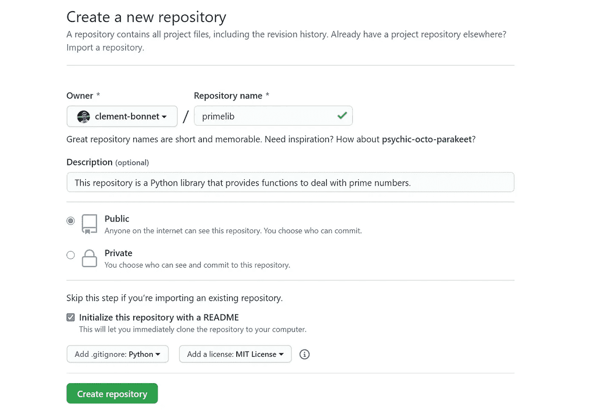

# 如何开源你的第一个 Python 包

> 原文：<https://towardsdatascience.com/how-to-open-source-your-first-python-package-e717444e1da0?source=collection_archive---------16----------------------->

## Python 打包的初学者友好分步指南


开源软件的世界很棒！照片由[克拉克·蒂布斯](https://unsplash.com/@clarktibbs?utm_source=medium&utm_medium=referral)在 [Unsplash](https://unsplash.com?utm_source=medium&utm_medium=referral) 上拍摄

# 为什么是 Python 包？

Python 是一种直观的通用语言，具有易于理解的语法。它使得原型开发、web 开发、数据科学等等比其他任何编程语言都要简单得多。这要归功于它庞大的支持性社区和众多的软件库。

你有没有发现自己在不同的项目中多次编写相同的代码行？或者，您可能已经编写了一些有用的库，希望其他人也能使用？或者，你只是对 [Python 打包](https://packaging.python.org/)或者对 Python 社区有贡献感兴趣？

在本文中，我们将创建一个小的包，然后将其上传到 [Python 包索引(PyPi)](https://pypi.org/) ，这样任何人都可以使用`pip install`下载并使用您的代码作为软件库。

当我用 Python 构建我的第一个包时，我发现这个过程有些乏味。这促使我写了这篇文章，这篇文章将带你了解如何构建一个 Python 包的基础知识，并与世界其他地方分享。

# 要求

如果你有一个 GitHub 帐户并且安装了 Python，你可以跳到项目概述。

## Git 储存库

要成为开源社区的一员，您必须在版本控制托管服务上公开托管一个项目。最常见的选择是使用 Git 存储库主机，它保存项目的虚拟存储。它允许您协调程序员之间的工作，并保存您的代码版本，您可以在需要时访问这些版本。使用最多的托管服务是 [GitHub](https://github.com/) 。如果您还没有帐户，第一步是在这里创建一个权限[。](https://github.com/join)

## 计算机编程语言

我们将使用 Python 3。Python 3.5 的任何版本都可以用于该项目。如果你没有 Python，可以从 python.org 的[下载页面](https://www.python.org/downloads/)下载。我将在 Windows 上使用 Python 3.7，但这个项目使用什么版本或操作系统并不重要。如果你是 Python 的新手，我可以建议你做一些[教程](https://www.learnpython.org/en/Hello%2C_World%21)的练习。

## 集成驱动电子设备

集成开发环境(IDE)是一个源代码编辑器，为您提供调试和自动化工具。只要你喜欢，用什么代码编辑器或者 IDE 都没关系。我将亲自使用一个叫做 [Visual Studio Code](https://code.visualstudio.com/) 的轻便而强大的代码编辑器。


准备深潜！由 [Max Duzij](https://unsplash.com/@max_duz?utm_source=medium&utm_medium=referral) 在 [Unsplash](https://unsplash.com?utm_source=medium&utm_medium=referral) 上拍摄的照片

# 项目概述

现在让我们构建一个简单的处理质数[的包。如果您已经有了一些代码想要使用，在将您的代码组织成与项目相似之后，可以随意跳过这一部分。](https://en.wikipedia.org/wiki/Prime_number)

你要做的第一件事是为你的库取一个合适的名字。因为我们的图书馆处理质数，所以我选了`primelib`。

下面是项目结构的样子。你可以和我一起创建文件，或者直接下载 GitHub 上的整个[库。](https://github.com/clement-bonnet/medium-first-package)

```
primelib/
    primelib/
        __init__.py
        prime_numbers.py
    tests/
        test_prime.py
    .gitignore
    LICENSE
    README.md
    setup.py
```

这可能看起来像很多文件，但不要担心，我们将一个接一个地制作和解释它们。

# 逐步构建项目

## 启动并克隆 GitHub 存储库

首先要做的是在 GitHub 中启动一个存储库。登录 GitHub，点击绿色的“*新建*”*按钮。您应该会看到一个标题为“*创建新存储库*”的页面。选择自述文件 Python 时，请填写下面的空白处。gitignore 文件和 MIT 许可证。当你准备好了，点击*创建库*。*

**

*一旦在 GitHub 上创建了存储库，就必须在本地计算机上克隆它。为此，你应该在你的机器上安装 Git 和终端。在 Windows 中，我推荐使用新的 [Windows 终端](https://www.microsoft.com/en-us/p/windows-terminal/9n0dx20hk701?activetab=pivot:overviewtab),尽管你肯定可以使用命令提示符。打开一个终端，通过运行`git --version`确保 git 安装正确。然后使用`cd`将你的项目存储到你想存储的地方。终于可以跑`git clone https://github.com/YOUR-USERNAME/primelib.git`了。点击绿色的“*代码*”按钮时提供链接。*

*现在，您应该已经将项目复制到您的计算机上了。在您喜欢的代码编辑器中随意打开`primelib`文件夹。您应该具有以下结构。*

```
*.gitignore
LICENSE
README.md*
```

*   *的。gitignore file 使您能够在跟踪和上传代码到存储库时忽略一些文件。*
*   *许可证文件只是一个包含项目许可证的. txt 文件。您可以在这里找到您的需求，尽管 MIT 许可证对于几个项目来说是一个很好的默认选择。*
*   *README.md 文件是一个包含项目描述的 Markdown 格式文件。您可以为您的库将提供的模块和函数编写文档。*

**

*我们都爱 Python。克里斯·里德在 [Unsplash](https://unsplash.com?utm_source=medium&utm_medium=referral) 拍摄的照片*

## *Python 代码*

*在`primelib/`文件夹中，你现在可以添加一个名为`primelib`的新文件夹，它将包含你所有的代码。在这个新文件夹中，创建两个名为`prime_numbers.py`和`__init__.py`的 Python 文件(带有两个前导下划线和两个尾随下划线)。*

```
*primelib/
    __init__.py
    prime_numbers.py
.gitignore
LICENSE
README.md*
```

*让我们从包含我们将使用的 Python 代码的`prime_numbers.py`开始。您可以将这段代码复制并粘贴到您的`prime_numbers.py`文件中。*

*Python 代码包含两个函数:*

*   *`_divides`是私有函数，因此以前导下划线开头。它被下一个函数`is_prime`使用，当且仅当`div`除以`n`时返回`True`。*
*   *`is_prime`检查一个数`n`是否有一个不同于 1 和它自身的除数，如果有，它返回`True`。*

*`__init__.py`文件是将 primelib 转换成一个包所必需的。它将是您的 Python 解释器在运行`import primelib`或`from primelib import ...`时执行的文件。要使用命令`primelib.is_prime(n)`从库中直接访问函数`is_prime`，必须在`__init__.py`文件中写入以下内容:*

## *试验*

*好了，现在是时候创建一些测试来确保我们的函数按预期工作了。现在，您可以在项目目录中创建一个`tests`文件夹，并在其中添加一个`test_prime.py`文件。*

```
*primelib/
    __init__.py
    prime_numbers.py
tests/
    test_prime.py
.gitignore
LICENSE
README.md*
```

*您可以简单地复制以下测试。*

*然后就可以用 Python 标准库的一部分 [*Pytest* 库](https://docs.pytest.org/en/stable/)了，所以 Python 自带的，不用安装。Pytest 会自动检查你在任何`test_*.py`文件中的断言语句。在您的终端中，您可以运行以下命令。*

```
*python -m pytest*
```

*现在您应该看到您的两个测试成功通过了。这意味着您已经准备好构建包并与社区共享您的库。*

**

*是时候建造你的图书馆了。照片由[马特·阿特兹](https://unsplash.com/@mattartz?utm_source=medium&utm_medium=referral)在 [Unsplash](https://unsplash.com?utm_source=medium&utm_medium=referral) 上拍摄*

## *建造图书馆*

*我们将使用三个库`setuptools`、`wheel`和`twine`。确保它们在您的环境中可用。*

```
*pip install --upgrade setuptools wheel twine*
```

*构建包需要最后一个文件。您必须在目录的根目录下添加一个`setup.py`文件。这告诉`setuptools`如何实际构建这个包。让我们添加最后一个文件来获得最终的树结构。*

```
*primelib/
    primelib/
        __init__.py
        prime_numbers.py
    tests/
        test_prime.py
    .gitignore
    LICENSE
    README.md
    setup.py*
```

*这里是`setup.py`文件。您可以复制并粘贴它，同时用您的名字替换您的-USERNAME 以使库名唯一。*

*三个强制参数是*名称*、*版本*和*包*。您现在可以用下面的代码构建这个库。*

```
*python setup.py sdist bdist_wheel*
```

*这将在`dist/`目录中生成分发档案。现在你可以在你的本地环境中安装这个库，执行`python setup.py install`。可以尝试在 Python shell 中导入`primelib`。*

```
*python
>>> import primelib
>>> primelib.is_prime(13)
True*
```

# *上传到 PyPi*

*现在您有了一个工作库，您可以将它上传到 Python 包索引(PyPi)上，以便与 Python 社区共享。出于本教程的目的，我们将使用 [*TestPyPi*](http://test.pypi.org) ，它的工作方式与 *PyPi* 完全一样，但它是为测试包而设计的，以便尽可能保持真实服务器的干净。*

*首先你必须在 *TestPypi* 上[注册一个账户](https://test.pypi.org/account/register/)并验证你的电子邮件。最后，您可以使用下面的代码将您的包作为归档文件上传。*

```
*python -m twine upload **--**repository**-**url https:**//**test**.**pypi**.**org**/**legacy**/** dist**/****
```

*就这么定了！您的包现在可供社区使用。如果它被上传到 *PyPi* 上，你可以直接用`pip install primelib`安装包，但是因为它现在在 *TestPyPi* 上，你可以用下面的代码安装包:*

```
*pip install **--**index**-**url https:**//**test**.**pypi**.**org**/**simple**/** primelib-YOUR-USERNAME*
```

*如果你遇到任何关于打包的问题，请参考 [Python 打包教程](https://packaging.python.org/tutorials/packaging-projects/#generating-distribution-archives)。*

*您的库现在可以在 Python 环境中使用了。我强烈推荐使用`virtualenv`来管理不同的环境。*

# *结论*

*恭喜你。你已经学会了如何创建一个 Python 包来包装你的一些代码，然后如何与社区共享你的库，这样任何人都可以使用你的作品。*

*我希望您现在已经准备好为 Python 社区做出贡献，并与世界其他地方分享您的伟大代码！*

*如果你有兴趣继续深入，我推荐这些重要但更高级的主题:*

*   *使用虚拟环境*
*   *使用持续集成工具( [Travis CI](https://travis-ci.org/) )*
*   *版本管理工具( [SemVer](https://semver.org/) )*
*   *自动测试氮氧化物([氮氧化物](https://nox.thea.codes/en/stable/))*
*   *自动化 HTML 文档( [Sphinx](https://www.sphinx-doc.org/en/master/) )*