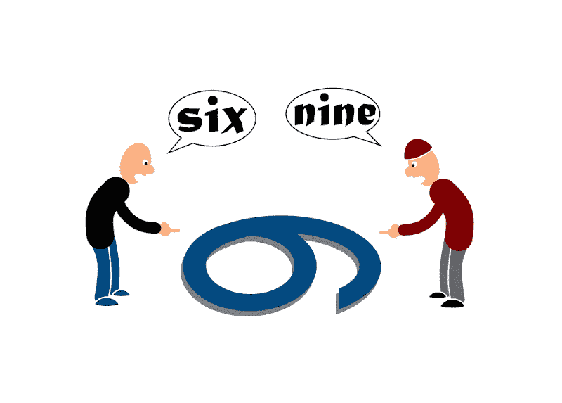
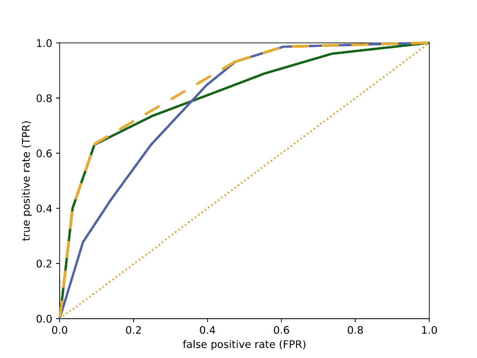
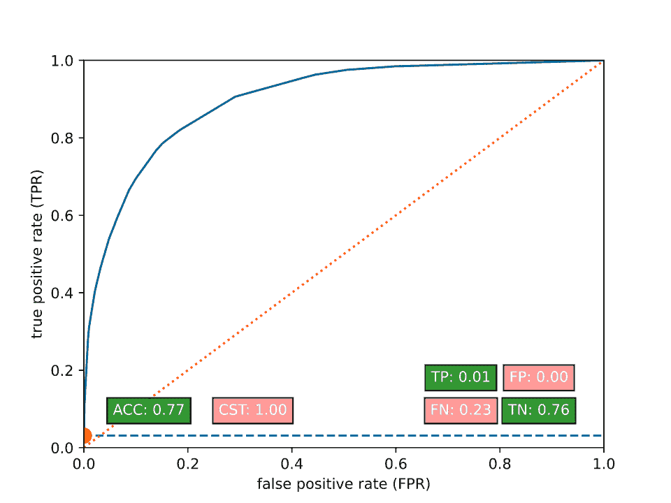
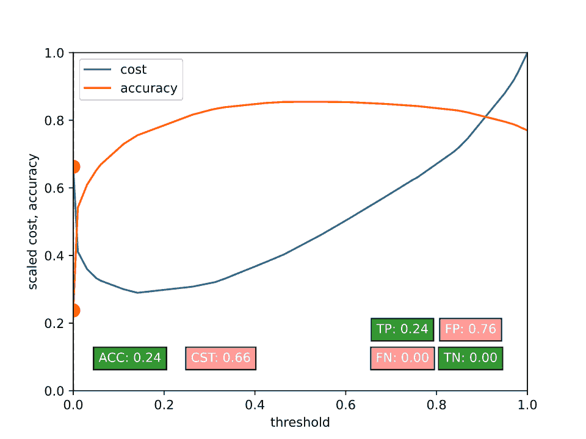
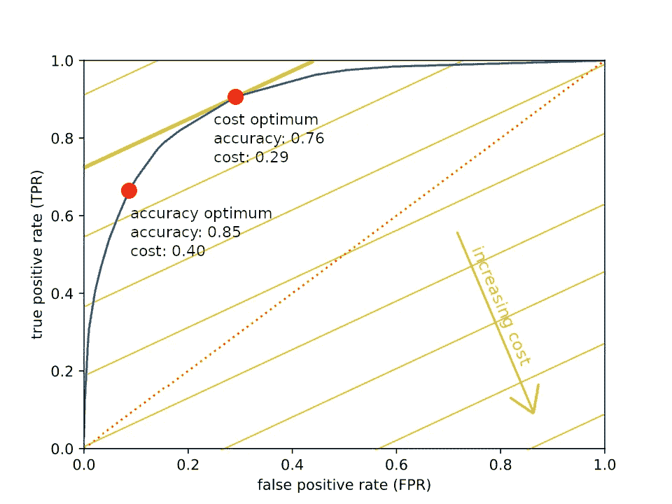
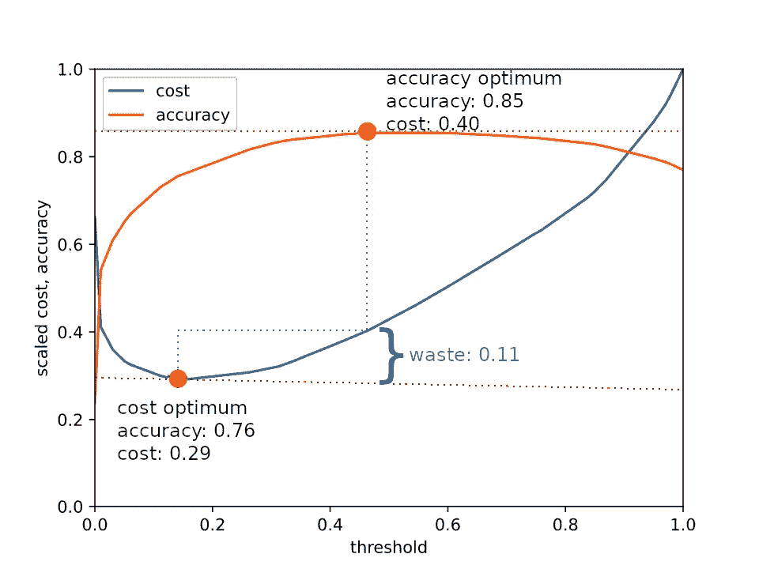
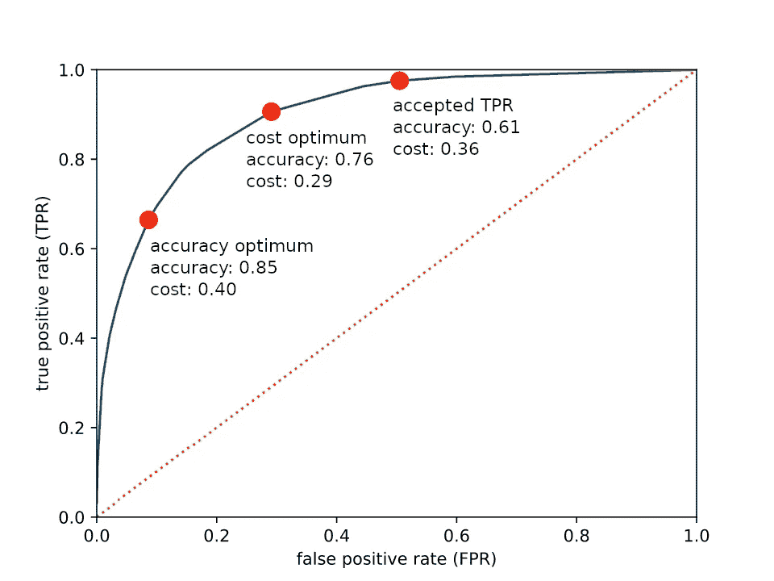

# 如何最佳地操作人工智能是一个视角问题

> 原文：<https://towardsdatascience.com/how-to-operate-an-ai-optimally-is-a-matter-of-perspective-d1d1d28f74ec?source=collection_archive---------53----------------------->

不是每个问题都可以用数学和算法来回答。当谈到人工智能的可操作性时，视角很重要，每个利益相关者衡量成功的方式都不同。接下来，是时候让领导层站出来，做出高层决策了。(来源:Shutterstock)

当你将人工智能引入企业时，数学是简单的部分。它很简单，因为它可以用普遍接受的标准客观地判定。但是许多重要的决定不属于这一类。当要做出这样的决定时，争论就开始了:十几个利益相关者带来了尽可能多的意见，每个都有合理的论据支持。为了防止不必要的混乱，现在是领导必须站出来的时候了，这些问题迟早会不可避免地成为高层决策。

一个人工智能项目要取得成功，数学、经济学、战略和心理学都必须考虑在内。为了说明这是如何实现的，在本帖中，我们将看看机器学习在德国汽车保险领域的应用。

想象一个被训练来验证汽车保险索赔的机器学习系统。汽车保险的运作方式因国家而异。在德国，索赔通常附有认证专家的损坏评估，或维修店的报价或发票。基于这些文件，机器学习系统将索赔分为两类:要么它建议直接支付，要么如果发票似乎部分或完全不合理，技术上不正确，或在任何其他方面有问题，它会将案件发送给人类主题专家进行进一步调查。

正如安盛和 Controlexpert 在一份联合声明中对德国汽车保险业务的重量级人物报告的那样，完全合法的索赔比例约为 40% [1]。因此，一个能够让人类专家专注于剩余 60%的*相关*案例的人工智能，有望节省大量时间和金钱。为了充分实现这一优势，必须对系统进行配置，以最好地满足用户的需求。

这就是问题的开始。对用户来说什么是最好的？

人们可能会想，在高度数学化和定量化的机器学习世界中，肯定有这种单一的神奇度量可以用来找到最佳配置。没有。

但在我们看到为什么之前，让我们先从简单的开始，看看*能客观地说什么。*

# 如何量化分类器性能

当然，有*种*客观的方法来评估机器学习模型的性能。事实上，像我们的声明分类器这样的系统是一个特别简单的情况，即所谓的二元分类器。二进制，因为它回答非此即彼的问题，有两种可能的结果:是或否，零或一，砰-上或砰-下。或者，在我们的具体场景中:保险索赔看起来可疑吗？

使用历史案例数据训练分类器。为了评估它在新的、*未知的*情况下的性能，你拿出一部分所述数据，并且不使用它进行训练。相反，一旦模型被定型，您就可以用它来测试模型。从模型的角度来看，这些数据是未知的，就像全新的数据一样，但是你，测试者，知道每个样本在过去是如何被人类专家决定的，所以你知道它*应该如何*被分类。

有了这些知识，您可以将分类器的测试集结果分成四类。

1.如果分类器建议对该索赔进行进一步调查，并且根据记录，该索赔确实令人反感，那么您就有了一个**真阳性(TP)** 。
2。如果分类器建议直接支付索赔，并且根据记录该索赔是罚款的，则您有一个**真负数(TN)** 。
3。如果分类器建议调查，但记录显示索赔是罚款，那么这是一个**假阳性(FP)** 。
4。如果分类器建议直接支付，但记录显示索赔是不良的，那么这是一个**假阴性(FN)** 。

这四类中的数字通常以二乘二矩阵的形式表示，即所谓的 [*混淆矩阵*](https://en.wikipedia.org/wiki/Confusion_matrix) :

虽然混淆矩阵由 TP、FP、FN、TN 四个数字组成，但实际上只有两个数字是独立的。这是因为数据本身，或者更具体地说是测试集，有一定数量的 P 个实际上为正的样本和一定数量的 N 个实际上为负的样本。所以，不管分类器工作的有多好，最后我们总会有 TP + FN = P 和 TN + FP = N，两个含有四个未知数的方程留给我们两个自由度。参数化这些自由度的一种常见方式(但不是唯一的方式)是通过**真阳性率(TPR)** 和**假阳性率(FPR)** 。

数学上，它们被定义为

从这些定义出发，你可以很容易地用很少的代数说服自己，TPR 和 FPR 足以确定所有四个 TP、FP、FN 和 TN，注意

然而，在现实中，一个案件很难 100%清楚。相反，决策是在或多或少的自信下做出的，这取决于证据——但也取决于个体决策者的个人倾向(理解为:偏见)。

想象一下，我们的分类任务将不得不由人类专家而不是人工智能来完成。此外，假设有两个求职者。一方面，有极端怀疑的主题专家。对她来说，任何要求都是无可置疑的。尽管案件细节，她只是标记每一个索赔进行进一步调查。有趣的是，甚至不需要考虑一秒钟的证据，她就可以肯定一定比例的案例是正确的:她正确地建议对每一个不合理的主张进行调查。然而，与此同时，她错误地推荐每一个正确的主张进行更仔细的检查。

第二个候选人与她完全相反。他对索赔者的信任是无限的。因此，他建议每一项索赔都进行直接赔付。这位专家也有一些成功可以展示，因为他正确地对待每一个合理的主张——但错误地对待每一个不合理的主张。

在这些虚构人物所代表的两个极端立场之间，人们可以想象出一系列或多或少严格的决策者。为了表示这个光谱，我们可以引入一个“严格参数”p，更正式的名称是*鉴别阈值*，其值可以在 0%和 100%之间选择。如果给定案例数据，索赔有 70%的可能性是可疑的，那么如果 *p* < 70%，则严格程度为 p 的专家将建议进一步调查，如果 p > =70%，则直接赔付。

这正是我们的分类器在内部工作的方式。它计算一个概率，并根据一个配置参数 p(鉴别阈值)将其转换成一个二进制判决。

**图一。**蓝色曲线代表的分类器优于绿色曲线代表的分类器。(来源:作者)

因此，TPR 和 FPR 以及混淆矩阵中的所有四个数字都依赖于阈值。TPR 和 FPR 如何随着阈值的变化而变化可以通过查看 ROC 曲线来理解。通过将 0%和 100%之间的所有 p 值的点(FPR(p)，TPR(p))标绘到 FPR-TPR 坐标系中，可以获得该曲线。

ROC 曲线可用于比较两个分类器。一般来说，对于每个 FPR，如果一个分类器的 TPR 大于另一个分类器，那么这个分类器就比另一个好。在 ROC 图中，上级分类器的 ROC 曲线处处都在另一个分类器的 ROC 曲线上方(见图 1)。

**图二。**两个(或多个)模型可以组合成一条 ROC 曲线，对应于它们各自的 ROC 曲线的凸包。(来源:作者)

所以你可以系统地比较各种模型，直到找到 ROC 曲线最好的那个。结果可能是，最佳曲线不是来自单个分类器，而是来自两个或几个不同分类器的组合。重要的是，最后你总会有一条单一的最佳 ROC 曲线。(在分类器组合的情况下，该曲线是每个单独分类器的 ROC 曲线的上凸包[3]，见图 2。)

此时，我们仍处于一个简单的世界。您可以客观地选择 ROC 曲线击败竞争对手的模型，并且您确定您将最佳球员带到了赛场。

不幸的是，选择了最佳分类器之后，您还远远没有完成。你还是要选择曲线上最好的*点*。那么问题是:哪个阈值最适合用户？

# 最佳精确度

(在本文的剩余部分，我们将展示一个训练好的二元分类模型的 ROC 曲线和其他特征。该模型仅被理解为一个示例——它是*而不是*在实际保险数据上训练的，而是在“成人”数据集上训练的[4]。)

乍一看，寻找最佳阈值似乎是一项微不足道的任务。追求最大的准确性，即尽可能多的预测是正确的。每一个其他的选择都会导致更多的错误。当然，我们希望避免这种情况，对吗？

准确性正式定义为所有预测中正确预测的比率，即

**图三。**在我们的例子中，可能的最佳精度是 85%。(来源:作者)

当我们计算本例中 ROC 曲线上每个点的 ACC 时，我们发现最大准确度为 85%(见图 3 和图 4)。那是我们能做的最好的吗？

有可能是这样，但只是在一种特殊的情况下，也就是说，当两种错误，假阳性和假阴性，从用户的商业角度来看是同样痛苦的。然而，在大多数情况下，这两种错误有着明显不同的影响，正如我们将看到的，我们的汽车保险索赔例子也不例外。

**图 4。沿着我们示例的 ROC 曲线的准确性、成本和完全混淆矩阵。CST 已被重新调整以增强可视化，因此最大可能成本为 1。(来源:作者)**

# 成本最优

错误决策造成的损失并不总是容易量化。权衡假阳性和假阴性是一个经典的难题:判一个无辜的人入狱(假阳性)比让一个杀人犯逍遥法外(假阴性)更糟糕吗？差多少？

幸运的是，在商业世界里，事情并没有那么戏剧化，只要付出一些努力，错误决策造成的损失就可以用金钱来量化。这让我们想到了成本估算。为了给假阳性和假阴性这两种可能的错误定价，我们必须检查在每种错误的情况下到底发生了什么。

在假阳性的情况下，完全正确的账单被不必要地发送给专家，然后专家花费一些宝贵的时间试图在没有错误的地方找到错误。为了简化计算，我们假设这个过程花费他 12 分钟，他的劳动总成本是每小时 100 €。那么，每个假阳性浪费 20 €。

在假阴性的情况下，支付带有不合理项目的发票。这意味着，保险公司不必要地损失了所述项目的相应货币价值。不合理索赔的平均值可以从历史案例数据中计算出来，这些数据已经过人类主题专家的检查和纠正。让我们假设，每箱是 100 €。

当然，这是成本估算的一种过于简化的表示，但它足以理解这一思想:最终，您将获得每种错误类型的明确的货币价值。在我们的例子中，它看起来像这样:

或者，换句话说，根据 TPR 和 FPR:

由于 FP 和 FN(或者等效地，TPR 和 FPR)取决于我们的阈值参数 p 的值，我们可以将成本绘制为 p 的函数，即 CST(p)。在同一张图中标出成本和精确度是有启发性的。为此，我们显示成本不是绝对值，而是最大可能成本的百分比(见图 5)。

**图 5。**准确度和成本相对于辨别阈值作图。作为参考，完整的混淆矩阵显示在右下角。(来源:作者)

具有最佳成本的操作点也可以从 ROC 曲线几何地确定。从上述将 CST 与 TPR 和 FPR 联系起来的等式中，我们注意到

**图六。**我们示例中的 ROC 曲线(蓝色)有几条等性能线(黄色)，每条线对应一个固定成本。从左上到右下，成本垂直于等性能线增加。(来源:作者)

这意味着等价点排列在具有 0.2⋅(N/P).斜率的直线上这些线被称为*等性能线*【3】。成本随着错误率的增加而增加，也就是在 ROC 图右下角的方向。因此，在 ROC 曲线与最高等性能线相切的地方，成本最低(见图 6)。

**图 7。**精度最优和成本最优之间的成本差异会导致大量浪费。(来源:作者)

我们发现，在 76%的准确率水平下，最优成本为 29%。相比之下，最大准确率 85%水平的成本是 40%。因此，准确率提高 9 个百分点，每个案例的成本就会增加 11 个百分点(见图 7)。以高得多的最佳精度有效地操作系统*会毁掉*您客户的钱！

准确性(以及 F1 或 Matthews 相关系数等替代分数)本身没有价值。只有在与实际成本相联系时，基于彻底的成本估算，这些指标才有意义。

# 战略决策

既然已经找到了对应于最优成本的阈值，您是否应该相应地配置 AI？这取决于这样的配置如何适应用户更广泛的策略。例如，考虑经营保险业务的两家公司的不同观点。

第一家公司是传统的保险公司。他们从人工智能中获得的潜在好处是提高了索赔验证流程的成本效益。第二家公司是一家服务公司，向保险公司提供主题专业知识。

许多德国保险公司已将其各种损害类型的专业知识外包给专业公司，如 CarExpert、ControlExpert、Dekra、Eucon 和其他公司[5]，并向他们支付费用以确定不合理的索赔。乍一看，专业公司似乎也可以简单地应用人工智能来最大化成本效率。然而，他们受到一个额外的约束:他们的客户不关心专家提供者端的不必要的工作(由误报导致)，但他们非常关心*由于未被发现的不合理索赔(由误报导致)而造成的金钱损失。根据上面定义的指标，保险公司根据 TPR 来衡量提供商的服务质量，除了非常高的价值之外，不愿意接受任何东西。正如我们在上面看到的，最优成本的 TPR 大约是 90%。从保险公司的角度来看，这个值是不可接受的，因为它意味着 10%的不合理索赔没有被注意到。*

因此，供应商必须在成本效率和提供足够高的 TPR 之间取得平衡，而不是简单地以最佳成本运营。这给他们留下了两个基本选择。他们可以优先考虑降低运营成本，同时降低服务价格，以在 TPR 较低的情况下保持市场吸引力。或者，他们可以故意将产品质量置于价格之上，例如，以维持高质量服务的声誉，并以长期客户满意度为目标。如果他们选择后者，机器学习解决方案必须在非常高的 TPR 下运行(见图 8)。通过这种方式，提供商可以从适度的自动化率中获益，同时保持非常低的错误率，接近人类水平的性能。

**图 8。**优先考虑 TPR 减少了假阴性，但同时也损失了金钱和准确性。(来源:作者)

不利的一面是，与以最佳成本运行相比，以高 TPR 运行会导致每箱成本增加和准确度降低。实际上，所有这种准确性损失都可以归因于误报，遵循的逻辑是，只要找到大多数不合理的主张，人类专家做更多的工作是可以接受的。

不可能从数学上证明哪个选择是正确的。如何在市场中定位自己是一个超越任何公式的决定。困难不止于此。需要考虑的其他因素还有很多，例如公司战略、合规和监管问题、政治和道德考量等等。所有这些点的共同点是它们很难量化——如果有的话。单靠数学无法解决这些困难，在这种复杂的情况下，需要强大而聪明的领导才能找到正确的方法。这是经验丰富的高管(以及他们身边的顾问)能够大放异彩的时刻。

# 结论

现实并不像 Kaggle 竞赛那样清晰，人工智能在现实世界应用中的表现也不能简单地自动评分。这个问题在战略和人的层面上的成功是无法用公式计算的。从这个意义上说，AI 与商业运营的任何其他重大变革没有什么不同。在现实世界中实施人工智能是一个涉及众多利益相关者的过程，他们根据非常不同的指标评估解决方案的成败，这些指标通常无法用数学方法形式化。例如，由不满意的员工或客户造成的间接成本可能会延迟数月或数年才显现出来，从而使相关风险难以量化。由于这些原因，技术性能指标通常在变更管理过程中扮演重要但最终是次要的角色。

# 参考

[1] [团队力量，C€-简介 2019](https://www.controlexpert.com/fileadmin/pdf/de-de/CE_Profile_2019_Teampower_DE.pdf) ，第 21 页，2020 年 5 月 30 日检索

[2] T. Fawcett，[ROC 分析介绍](https://doi.org/10.1016/j.patrec.2005.10.010) (2006)，*模式识别字母*， **27** ，861–874 页

[3] F. Provost 和 T. Fawcett，[不精确环境的稳健分类](https://link.springer.com/article/10.1023/A:1007601015854) (2001)，*机器学习*， **42** ，第 203–231 页(也可在 [arχiv](https://arxiv.org/abs/cs/0009007) 上找到)

[4] [成人数据集](http://archive.ics.uci.edu/ml/datasets/Adult) (1996)，通过 Dua，d .和 Graff，C. (2019)， [UCI 机器学习知识库](http://archive.ics.uci.edu/ml)提供

[5]k . Braun worth，[Wertorientiertes prozess management von Dienstleistungsprozessen](https://opus.bibliothek.uni-augsburg.de/opus4/frontdoor/deliver/index/docId/1563/file/Dissertation_Braunwarth.pdf)(2009 年)，博士论文，第二节。B1–8

*原载于 2020 年 6 月 6 日*[*https://consilica . de*](https://consilica.de/blog/)*。*