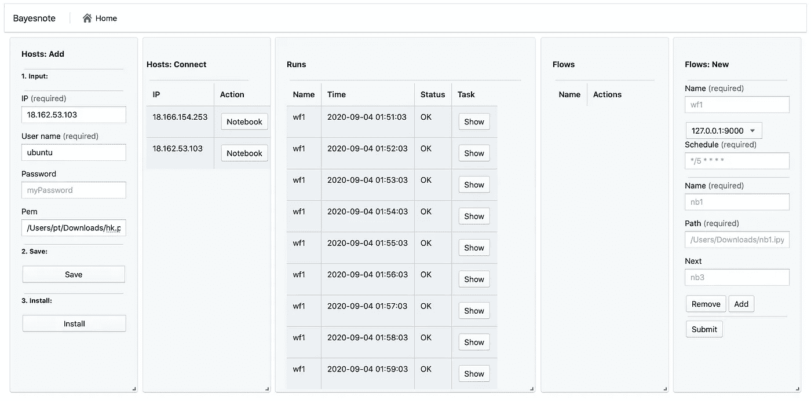
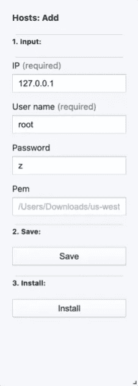
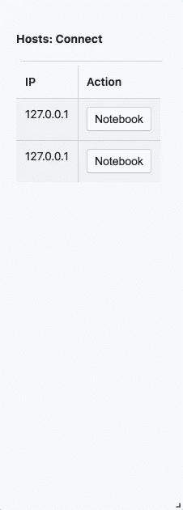
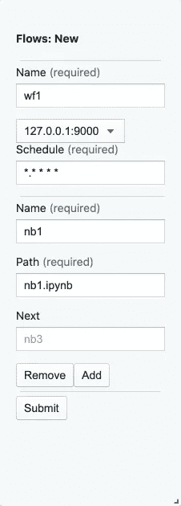
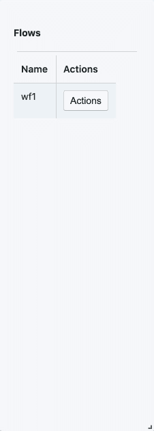
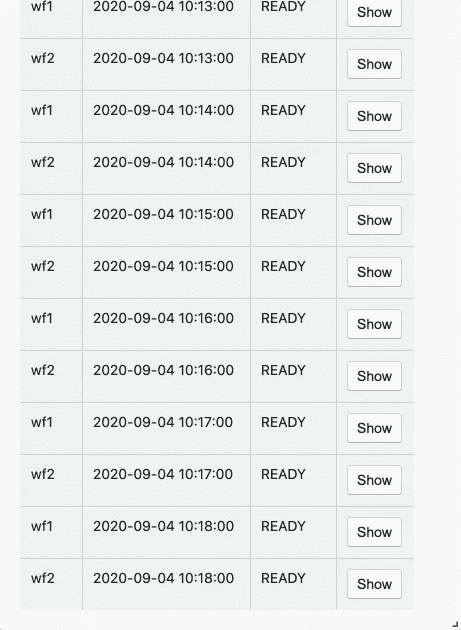
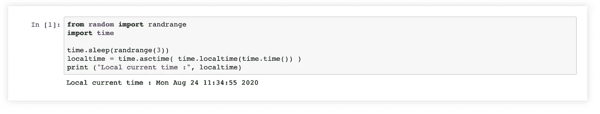

# 在 5 分钟内编排 Jupyter 笔记本

> 原文：<https://towardsdatascience.com/how-to-orcestrate-jupyter-notebooks-752aa8081208?source=collection_archive---------31----------------------->

## 用 Bayesnote 替代笔记本用户的气流

Jupyter notebook 是数据科学家中最受欢迎的交互式开发环境。虽然有一次性任务，例如 Jupyter 笔记本电脑就足够了的数据探索，但许多数据科学家很难维护他们长期运行的数据管道，以刷新报告、仪表板和机器学习模型。他们的解决方案非常有限:

1.  **克朗**。这是最古老和最常用的解决方案。数据科学家在服务器上设置 cron 时间表，以触发笔记本电脑按照固定的时间表运行，例如每天早上 5 点。Cron 不足以完成这样的任务。

> 然而，随着数据团队开始编写更多的 cron 作业，不断增长的数量和复杂性变得难以管理。特别是，管理作业之间的依赖关系非常困难。其次，故障处理和警报必须由作业来管理，因此作业或随叫随到的工程师必须处理重试和上游故障，这很麻烦。最后，对于回顾团队来说，必须手动筛选日志来检查某一天的工作执行情况，这是一个时间陷阱。由于这些挑战，数据编排解决方案应运而生。(由[阿斯塔西亚·迈尔斯](https://medium.com/memory-leak/data-orchestration-a-primer-56f3ddbb1700)

2.[**气流**](https://github.com/apache/airflow) ，及其竞争对手([**路易吉**](https://github.com/spotify/luigi) 和 [**达格斯特**](https://github.com/dagster-io/dagster/) )。这种解决方案解决了 cron、处理故障以及用户定义的任务的依赖性等问题。下面的代码是一个 bash 任务，打印 Airflow 官方教程提供的数据。

```
t1 = BashOperator(
    task_id='print_date',
    bash_command='date',
    dag=dag,
)
```

Airflow 及其竞争对手的目标用户主要是数据工程师或 ETL 工程师，他们可能习惯也可能不习惯对实际执行的代码进行强制抽象(例如“print_date”)。一方面，这种抽象对于实现 Airflow 及其竞争对手的设计目标，减少维护数据管道的成本和麻烦是必不可少的。另一方面，这种抽象或“外部代码”本身会引发新的问题:数据科学家需要付出学习成本，他们不得不在调试中的精确问题上花费更多时间。

3. [Argo](https://github.com/argoproj/argo) 和其他基于 Kubernetes 的解决方案。Argo 及其竞争对手在 Kubernetes 上编排 Docker 容器，而不是编排通常是 python 函数的气流任务。它们解决了维护数据管道和环境的问题，而不用担心从本地开发环境转移到生产环境时会丢失一些系统级的依赖。然而，即使有像 AWS 这样的云平台的帮助，运营 Kubernetes 集群也是昂贵且耗时的。对于大多数公司来说，雇佣一个有经验的 Kubernetes 工程师是不可行的。有针对 docker 的学习曲线:如何启动/停止 docker 容器，将 shells 附加到正在运行的容器，重置 root 密码，构建、推送和维护 docker 映像。


照片由[蒂姆·阿特伯里](https://unsplash.com/@tim_arterbury?utm_source=unsplash&utm_medium=referral&utm_content=creditCopyText)在 [Unsplash](https://unsplash.com/s/photos/notebook?utm_source=unsplash&utm_medium=referral&utm_content=creditCopyText) 拍摄

工作流编排考虑的基本设计考虑是由这样的系统解决的问题必须比产生的问题大得多。否则，它只会帮助数据科学家简单地将他们修复 cron 问题的时间转移到修复工作流编排系统的问题上。

为了实现这个目标，这种系统必须做出比上述当前解决方案弱得多的假设。这就是我们开发 Bayesnote 的原因。我们做一个最弱的假设:即使数据团队仅由一名数据科学家组成，他们也可以在 5 分钟内开始在不同的集群上编排笔记本电脑。那儿有

1.  没有学习曲线。不需要学习抽象概念，也不需要 docker/Kubernetes 知识。
2.  无运营成本。没有额外的数据库安装，没有端口打开。它可以毫无困难地将自己安装到集群中。



Bayesnote

**主持人:**

1.  添加要用来运行笔记本的主机。确保 Jupyter 笔记本已经安装。



2.一键打开远程笔记本，浏览器会在随机端口打开 Jupyter 笔记本。



3.写你的代码。`print("Hello bayesnote")`

**流程:**

1.  **创建**一个新流程。在`next`中添加 depdency。



2.**启动** a 流程。



3.**点击显示查看**笔记本。浏览器将打开一个新的选项卡来显示输出笔记本。



就是这样。



输出笔记本

我全职从事这个项目。让我知道你的想法。欢迎提问、评论、功能请求和拉动请求。

该项目正在快速增加新功能:[https://github.com/Bayesnote/Bayesnote](https://github.com/Bayesnote/Bayesnote)