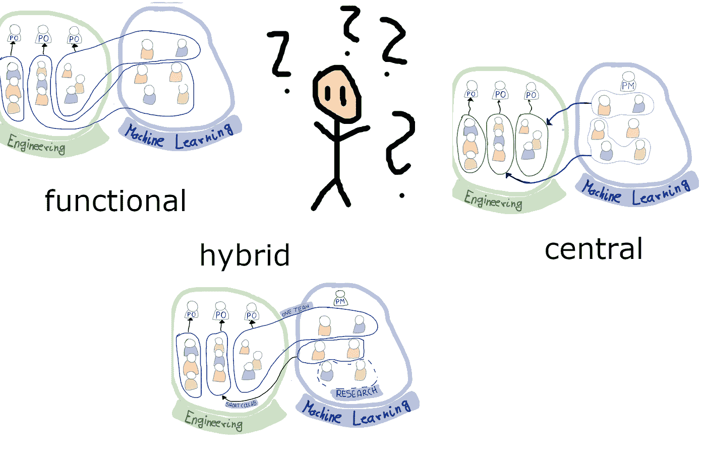
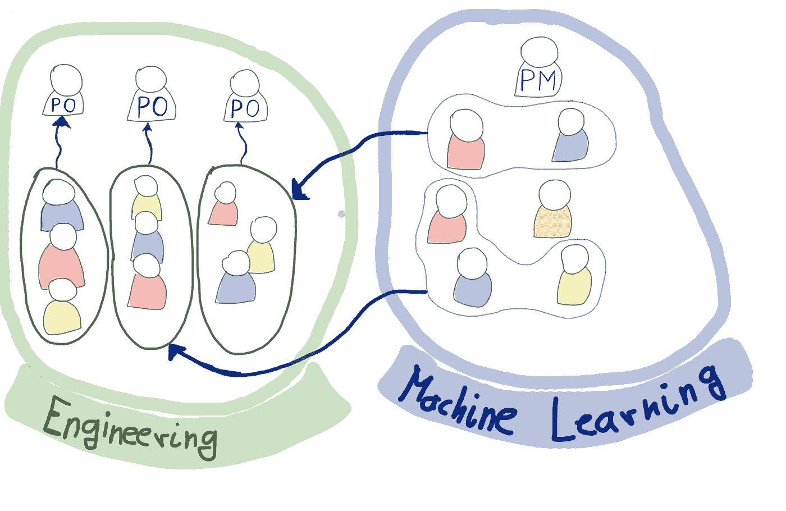
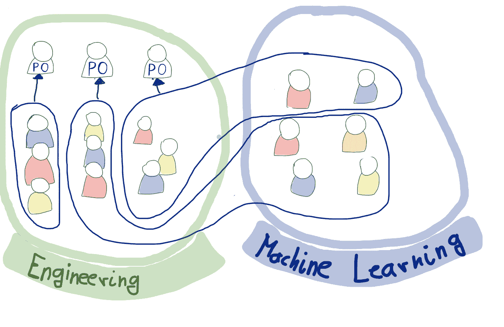
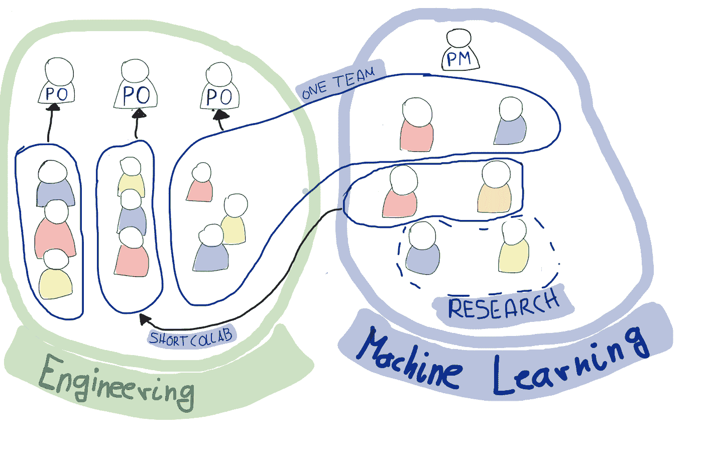

# 如何组织机器学习团队取得成功

> 原文：<https://towardsdatascience.com/how-to-organise-your-machine-learning-teams-for-success-199f544afd20?source=collection_archive---------21----------------------->

## *优步、Linkedin 和 AirBnb 探索将机器学习融入组织的三种组织形式*

职能团队组织、中央团队组织还是混合团队组织？图片由作者提供。

优步、LinkedIn 和 Airbnb 都是**大规模机器学习的成功故事**，不是因为它们产生了很酷的研究或有很多人才，而是因为它们实际上成功地**将数据转化为金钱**和很多钱。

这三家公司都花了数年时间探索组织机器学习工作的不同方式。

我想分享我从他们的努力中获得的关键见解，这样你就不必花费数年来探索不同的模式。

# 组织机器学习工作的三种方式

组织机器学习工作的方式实际上只有三种，这三种方式各有优缺点，要么让你的机器学习工程师失业，要么让他们成为你最有价值的资产。

因此，让我们来看看三种不同的方式:**功能上的** —在一个大型机器学习或数据科学或分析功能中，**分散的** —在一个产品/工程团队中，或者两者的**混合形式**。

**功能上**有组织的机器学习工作可能涉及一个拥有十几名数据科学家的分析部门，或者几个生产 API 的机器学习团队。**分散化**机器学习工作可能会将机器学习工程师直接整合到产品工程团队中，也可能会将一个机器学习团队与其产品团队一起置于一个单一的产品经理之下。

公司通常从集中的、功能性的方法开始，并且经常失败。有些人设法过渡到分散或混合模式，有些人干脆停止亏损，少数幸运儿坚持下去。

所以让我们从一个工作功能模型的例子开始吧！

# AirBnB &优步的功能数据科学团队

尽管许多公司都放弃了功能性的中央模型，但优步公司在多年的机器学习后仍然采用了这种模型。所以我发现看一看它们非常有用。

优步有一大批机器学习工程师、数据科学家等。艾尔。他们在只有机器学习工程师和数据科学家的大型团队环境中，从功能上组织它们的一部分。如果产品工程团队需要他们不能做的事情，这需要机器学习/数据科学专业知识，产品工程团队可以与专家机器学习者和数据科学家合作一段固定的时间，例如三个月。

两个功能组织单元(工程和机器学习)之间的协作，例如基于项目的协作。图片由作者提供。

这个模型有一堆关键优势，首先，它最大限度地减少了公司中数据科学/机器学习功能的空闲时间。这反过来意味着公司可以非常早地启动这样的功能。例如，Airbnb 聘请了一名数据科学家作为其第八名工程师，并在此后相当长的一段时间内使用中央模型来分配工作。

第二，它最大化了跨职能部门的知识共享，从而允许开发知识深度、设定标准、创建共享技术堆栈。所有这些都使评估功能需求的时间最小化。

因此，选择采用这种组织形式的公司旨在通过采用共享的技术堆栈、定期研讨会和跨职能部门的大量知识共享工具来释放这些优势，并由一个中央产品经理跨职能部门分配工作量。他们在与工程团队的合作上有明确的界限，比如“3 个月的项目”,如果合理的话，他们会移交代码、所有权和专业知识，以免产生耦合。

# LinkedIn 的去中心化方法

LinkedIn 公司也是从一个中心模式开始的，这是一个我称之为“数据科学家”的职能团队，目的是通过为其他团队开发酷的东西来“创造伟大的东西”。

但他们很快意识到这在 LinkedIn 不起作用。引用前 Linkedin 的 DJ Patil 的话:*“那些家伙(数据科学家)提出伟大的想法，展示数字，然后被告知这不在[产品团队]的路线图上……*

他们会设计一个“推荐引擎”的原型，展示大量的数据，但无法让一个工程团队合作并为其构建一个前端。解决办法？他们转向了一个分散的模式，一个全栈团队。他们把他们变成了一个完整的产品团队，然后创建了 PYMK，他查看了我的个人资料、技能和职业探索。该团队包括设计、网络、产品营销、工程，PYMK 功能成为 Linkedin 团队有史以来最成功的产品之一，将 LinkedIn 的北极星指标提升了 50%。

*“矛盾的是，建立一个数据团队的结果是，你会看到公司的各个部门都在生产数据产品。当公司看到数据可以创造什么，当它看到数据的力量，你会看到数据产品无处不在。这就是你知道自己何时赢了的方法。”(***)**

**

*强大的全栈去中心化团队，将机器学习工程师整合到需要他们的团队中。图片由作者提供。*

*Spotify 从一开始就采用了这种模式，将机器学习工程师整合到产品团队中。在 Spotify Weekly 工作的机器学习工程师坐在同样的单位里，也创建了前端，使他们在这个产品上完全授权。*

*这种模式的第一个优势是产品所有权的集中。这导致了快速的循环时间。将一个新的机器学习想法投入生产所花的时间与添加一个新的下拉选项所花的时间一样长。无需整合不同团队的路线图。这当然释放了机器学习的真正潜力，因为它真的是唯一允许实验的东西，而这在协作环境中几乎是不可能的。*

*有没有尝试过说服另一个团队构建一个前端特性，这样你就可以运行一个“实验”,并有可能再次杀死前端特性？*

*第二个优势是产品知识的集中。机器学习者和前端开发人员参与所有的团队活动，并获得他们需要的所有知识，以高速交付正确的东西。*

# *优步的混合模型及其研究*

*优步虽然是一个工作职能部门的好例子，但实际上是一个混合模型。但优步认识到，团队中的机器学习工程师、从事项目工作的专家机器学习工程师和数据科学家，以及旨在提供公司相关研究的研究团队之间需要明确的区分。*

*混合模型的优势从单个模型的优势中显而易见。它具有所有的优势，但在组织和沟通方面增加了很多开销。因此，它最适合工程方面的大型功能或异构需求。*

**

*混合全栈团队、项目专家协作和研究团队的混合模型。图片由作者提供。*

*如果一家公司有 1-2 个产品团队有很多机器学习需求，20 个其他团队有一些需求，那么混合模式可能是有意义的。*

*致力于混合模式的公司试图通过开发通用的机器学习框架来减轻可能的弱点，比如优步与 [Ludwig](https://eng.uber.com/introducing-ludwig/) 一起开发的框架。像 Spotify 一样聚合技术，将所有机器学习的努力集中在 [TFX 和 Kubeflow 管道](https://engineering.atspotify.com/2019/12/13/the-winding-road-to-better-machine-learning-infrastructure-through-tensorflow-extended-and-kubeflow/)上。*

# *不要利用弱点*

*人工智能、机器学习、数据科学都是热门的新趋势，但最终唯一重要的是将这些新东西转化为商业价值。*

*Airbnb 是深度数据驱动的，并且总是试图最大化他们数据的商业价值。Airbnb 也认识到了职能数据科学组织的弱点。他们意识到，一个核心职能部门既缺乏产品专业知识，也缺乏产品工程团队的工程技能。因此，他们为他们的数据科学家创造了一种教育形式，使他们能够培养这两种技能。*

*为你的公司选择错误的模式，你的努力将浪费金钱，并最终关闭努力。选择正确的模型，释放模型的优势，而不是迎合它的弱点，你将能够将机器学习和数据科学深入整合到公司中，远远超出分析功能。*

# *进一步阅读*

*在写这篇文章时，我参考了上述公司提供的一堆不同的文章和文件。我会试着把它们都列在这里，这样你就可以深入了解这些公司的个人经历。*

*   *[Airbnbs 计划教授数据科学家](https://medium.com/airbnb-engineering/empowering-data-science-with-data-engineering-education-ef2acabd3042)工程技能。*
*   *一篇深入[优步机器学习结构](https://medium.com/@jamal.robinson/how-uber-organizes-around-artificial-intelligence-machine-learning-665cdeb946bc)的中等帖子。*
*   *一篇文章解释了 Airbnbs 从中央车型到混合动力车型的旅程。*
*   *2011 年，DJ Patil，[建立数据科学团队](https://www.oreilly.com/data/free/files/building-data-science-teams.pdf)，讲述了他在 Linkedin 的经历以及更多内容，解释了 Linkedin 的历程以及更多内容。*

**对如何建立伟大的数据公司、伟大的数据密集型产品、成为伟大的数据团队感兴趣，还是对如何利用开源构建伟大的东西感兴趣？然后考虑加入我的* [*免费简讯《三个数据点周四》*](http://thdpth.com/) *。它已经成为数据初创企业、风投和数据领导者值得信赖的资源。**