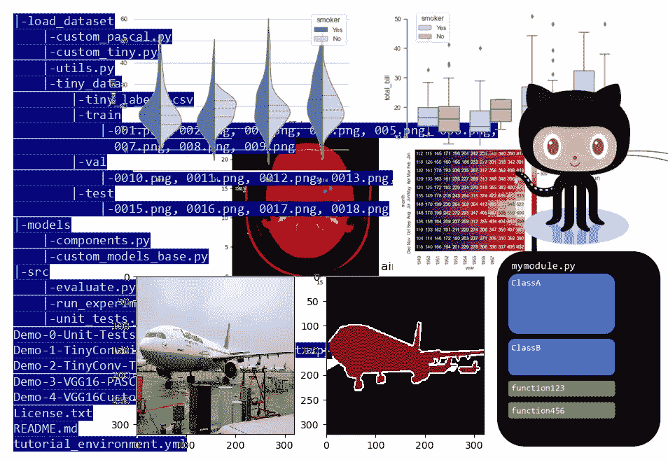
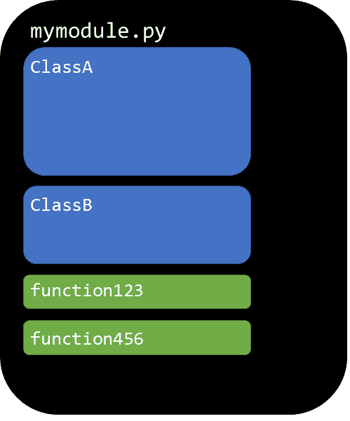
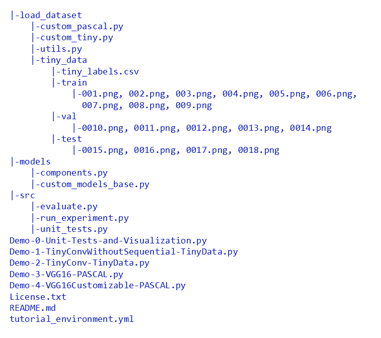
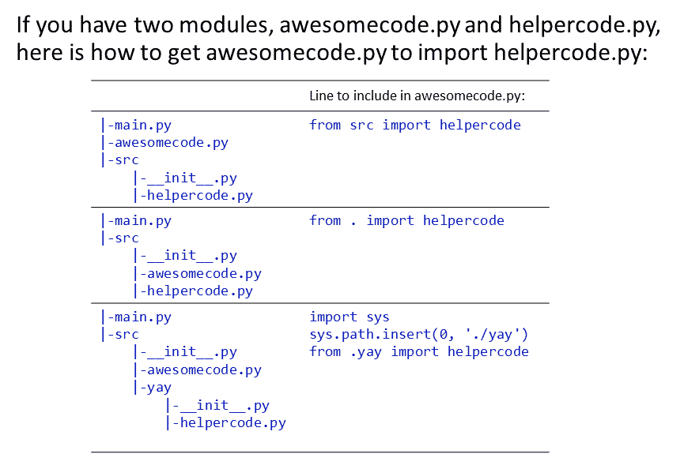
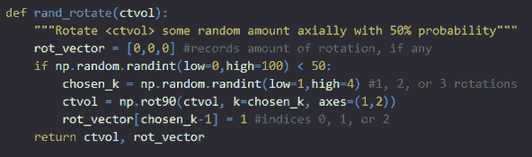
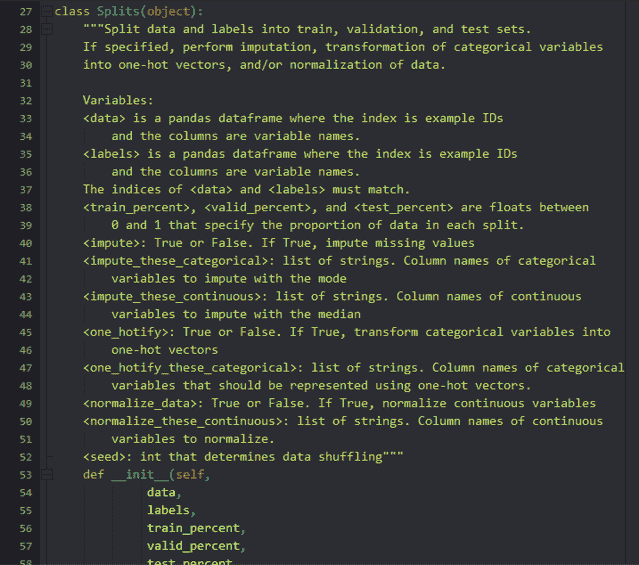
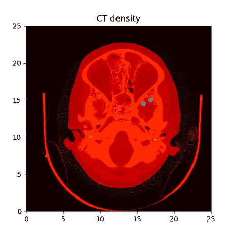
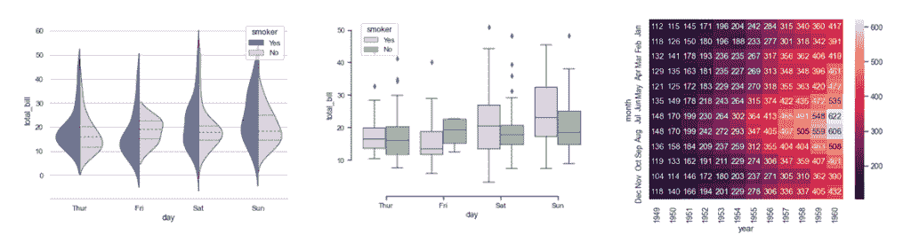
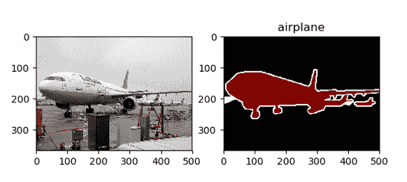
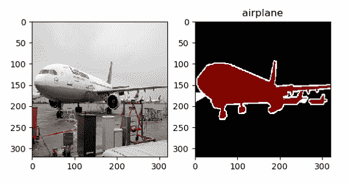

# 如何组织机器学习项目

> 原文：<https://towardsdatascience.com/how-to-organize-machine-learning-projects-babd04f7a679?source=collection_archive---------29----------------------->

## Python，Git，Anaconda，Code，没有 Jupyter 笔记本



图片作者。子图片都是由作者或允许(见个人链接后)。

这篇文章描述了组织机器学习项目的最佳实践，我在攻读机器学习博士学位期间发现这些实践非常有效。

# **Python**

Python 是一种很棒的机器学习语言。Python 包含了一系列对 ML 非常有用的库:

*   [numpy](https://numpy.org/) : n 维数组和数值计算。对数据处理有用。
*   [熊猫](https://pandas.pydata.org/):数据分析库。pandas 数据帧本质上是用描述性字符串作为行和列标签的 numpy 数组。它们可以被排序、过滤、分组、连接等。对数据处理有用。
*   PyTorch :构建神经网络。包括许多预训练的模型和干净的计算机视觉数据集。PyTorch 是我最喜欢的神经网络库，因为它鼓励使用面向对象的编程(模型是一个类，数据集是一个类，等等。)，用 PyTorch 写代码很快，PyTorch 默认支持急切执行，所以可以和 Python 调试器一起使用。
*   [tensor flow](https://www.tensorflow.org/):py torch 的替代品，在业界更受欢迎。几年前，我使用 TensorFlow，但在改用 PyTorch 后，我再也没有回头。我发现 PyTorch 更适合做研究。如果你想使用 TensorFlow，并且你想要一个更高级别的接口，你可以使用 [Keras](https://keras.io/) 。
*   这是一个很好的库，用于回归、支持向量机、k 近邻、随机森林、计算接收器工作特性下的面积、计算混淆矩阵等。
*   matplotlib 和 [seaborn](https://seaborn.pydata.org/) :制作可爱的可视化效果！我将在后面的章节中介绍这些库。

# **Git**

Git 版本控制对于保持机器学习项目的有序非常有用。

Git 是一个工具，可以用来跟踪您对代码所做的所有更改。Git“存储库”是包含代码文件的目录。Git 使用节省空间的技术，因此它不会存储代码的多个副本，而是存储旧文件和新文件之间的相对变化。Git 有助于保持您的代码文件目录整洁有序，因为只有最新版本“明显”存在(尽管您可以随时轻松访问任何版本的代码)。您可以选择何时标记已经发生的更改，使用“提交”将特定的代码更改与您提供的书面描述捆绑在一起。Git 存储库也使得代码共享和协作变得容易。总的来说，与在“myscript_v1.py”、“dataprocessing_v56.py”、“utils_73.py”等下保存一百万个不同版本的代码相比，Git 是保留旧代码功能的更好的解决方案。

Git 版本控制可以通过 GitHub、GitLab 和 Bitbucket 获得。我最常使用 GitHub。一旦你设置好 GitHub 并习惯了使用它，建立一个新的资源库大约需要 2 分钟。


Octocat，允许在博客帖子中使用 [GitHub 徽标和用法](https://github.com/logos)

以下是在您的机器上安装 GitHub 的步骤:

1.  安装 Git:【https://git-scm.com/downloads】T2
2.  制作 GitHub 账号【www.github.com 
3.  通过 SSH 密钥将您的 GitHub 帐户与您的机器连接起来。这一步使您能够将代码从您的机器推送到 GitHub 的云存储中。参见[生成新的 SSH 密钥](https://docs.github.com/en/github/authenticating-to-github/generating-a-new-ssh-key-and-adding-it-to-the-ssh-agent)，[向您的 GitHub 帐户添加新的 SSH 密钥](https://docs.github.com/en/github/authenticating-to-github/adding-a-new-ssh-key-to-your-github-account)
4.  在 GitHub 上创建一个新的资源库，方法是在您的个人资料的“资源库”部分点击绿色的“新建”按钮。
5.  使您的计算机能够推送至该存储库(请注意，在您创建存储库之后，GitHub 会立即为您提供这些说明以及存储库的正确 URL 以下命令只是一个示例):

```
echo "# pytorch-computer-vision" >> README.md 
git init 
git add README.md 
git commit -m "first commit" 
git branch -M master 
git remote add origin https://github.com/rachellea/pytorch-computer-vision.git 
git push -u origin master
```

假设您现在已经更改了 myeditedscript.py .中的一些代码，以“提交”到存储库(即记录该更改):

```
git add myeditedscript.py 
git commit -m 'added super useful functionality' 
git push origin master
```

# **蟒蛇**

Anaconda 是一个包管理器。它允许创建不同的计算环境，这些计算环境可能包含不同的 Python 版本和/或不同的包和/或不同的包版本。当您处理多个具有冲突依赖关系的项目时，Anaconda 尤其有用。

Anaconda 很容易使用。步骤:

首先，安装 Anaconda:[https://docs.anaconda.com/anaconda/install/](https://docs.anaconda.com/anaconda/install/)

接下来，创造一个环境。我发现以项目命名环境很有用。例如，如果项目是关于[胸部 x 光分类](https://glassboxmedicine.com/2019/05/11/automated-chest-x-ray-interpretation/)使用神经网络，环境可以被称为 chestxraynn:

```
conda create --name chestxraynn python=3.5
```

请注意，您不希望在环境名称两边加上引号，否则引号字符本身将成为环境名称的一部分。此外，您可以选择任何想要的 Python 版本。它不一定是 Python 3.5。

一旦创建了环境，就该激活环境了。“激活”仅仅意味着你将被“放入环境中”,这样你就可以使用安装在环境中的所有软件。

要在 Windows 上激活环境，请运行以下命令:

```
activate chestxraynn
```

在 Linux 或 macOS 上，

```
source activate chestxraynn
```

您可以使用“conda install”命令在环境内部安装软件包。

例如，安装 matplotlib 的 conda 命令是:

```
conda install -c conda-forge matplotlib
```

你可以谷歌“conda install packagename”来找到告诉你运行什么 conda 命令来安装该软件包的页面。从技术上讲，在 conda 环境中，你也可以使用 pip 安装包，但是[这会导致问题](https://www.anaconda.com/blog/using-pip-in-a-conda-environment)，所以如果可能的话应该避免。

Anaconda 将负责确保环境中所有内容的版本都是兼容的。更多命令见 [Conda 备忘单](https://docs.conda.io/projects/conda/en/4.6.0/_downloads/52a95608c49671267e40c689e0bc00ca/conda-cheatsheet.pdf)。

也可以从别人放在一起的文件中创建一个 conda 环境。在 GitHub 库[https://github.com/rachellea/pytorch-computer-vision](https://github.com/rachellea/pytorch-computer-vision)中，有一个名为 tutorial_environment.yml 的文件，这个文件指定了运行教程代码所需的依赖关系。要基于该文件创建 conda 环境，您只需在 Anaconda 提示符下运行以下命令:

```
conda env create -f tutorial_environment.yml
```

# **组织你的代码:类和函数**

代码组织非常重要。在过去的不同时期，我遇到过研究代码被数千行代码塞进一个模块，没有文档，重复的代码块到处复制粘贴，一些代码块没有解释就被注释掉，还有奇怪的变量名。代码不会运行，即使运行了，也可能是不正确的。

我也遇到了许多优秀的代码——例如，我在 PyTorch 实现中看到的所有代码都是有组织的，并且有良好的文档记录。

从长远来看，如果你为自己的项目编写高质量的代码，将会节省你很多时间。高质量代码的一个方面是它在模块中的组织。

建议:

*   使用面向对象的编程。我强烈推荐 PyTorch 作为机器学习框架，因为它有助于在任何事情上使用面向对象编程。模型就是一个类。数据集是一个类。等等。
*   使用函数。如果你写的东西不能很好地作为一个类，那么就把代码组织成函数。功能是可重用的。全局命名空间中的代码块是不可重用的。



有组织代码的示意图。图片作者。

# **组织你的代码:目录**

使用多个模块来组织代码，并将这些模块组织到目录中。

我喜欢的一个简单的示例组织展示在我为这篇文章和其他相关文章整理的 GitHub 库中:【https://github.com/rachellea/pytorch-computer-vision

整体组织如下:

*   一个用于训练/评估/测试循环的模块(src/run_experiment.py)
*   一个用于计算绩效指标的模块(src/evaluate.py)
*   一个(或多个)数据处理模块:(load_dataset/custom_pascal.py 和 load_dataset/custom_tiny.py)
*   模型的一个(或多个)模块:models/custom_models_base.py

以下是存储库的整体组织结构:



组织[py torch-计算机视觉](https://github.com/rachellea/pytorch-computer-vision)。图片作者。

请注意，虽然这个存储库中存储了一个数据集(这些 png 位于“train”、“val”和“test”目录中)，但一般来说，将数据集放入存储库并不是一个好主意。这个存储库中有一个数据集的唯一原因是因为它是一个很小的假数据集，是为了举例而创建的。除非您的数据非常小，否则不应该放在存储库中。

# **导入**

请注意，您需要一个名为 __init__ 的空文件。py，以便模块可以从这些目录中导入文件。

下面是如何让一个名为 awesomecode.py 的模块导入一个名为 helpercode.py 的模块，这是基于它们相对于彼此所处的目录:



作者图片

# **文档**

写很多文档是有好处的。评论一切。用 docstrings 记录所有的函数、方法和类。有时候，在编写函数之前对它进行文档化是很有帮助的。如果文档有时比代码长也没关系。“过于清晰”总比不够清晰好。



作者图片

上图是一个简单的函数 rand_rotate()，它随机旋转一个代表 CT 体积的 3D numpy 数组。可以通过指定<ctvol>是一个 3D numpy 数组来改进 docstring。这些注释很有帮助，因为它们解释了为什么指示所执行旋转的向量使用(k-1)-这是因为 chosen _ k 是 1、2 或 3，但 Python 是零索引的。像这样简单的注释可以防止以后混淆。</ctvol>



作者图片

上图显示了我的[数据处理教程](https://glassboxmedicine.com/2019/06/01/everything-you-need-to-know-about-preparing-tabular-data-for-machine-learning-code-included/) [代码](https://github.com/rachellea/glassboxmedicine)中的一些文档。

文档将确保当你回顾旧代码时，你能很快记住它做了什么。当你看到一些看起来很奇怪的东西并本能地改变它时，文档将防止你意外地破坏你自己的代码——如果它旁边有一个注释解释为什么奇怪的东西是必要的，你就不去管它。文档也能让其他人使用你的代码。

# **命名变量**

总是使用描述性的变量名。“volumetric_attn_gr_truth”是比“truth”更好的变量名(什么 truth？)，而且比“gt”或“g”好得多。如果你的变量有很长的名字也没关系。他们不应该有单字母的名字。

即使你正在对行和列进行迭代，也要使用“row”和“col”作为你的变量名，而不是“I”和“j”。我曾经花了一整天的时间寻找一个非常奇怪的 bug，结果发现它是由于错误地迭代了一个 2D 数组引起的，因为我在数百行代码中的一行代码中调换了“I”和“j”。那是我最后一次使用单字母变量名。

# **单元测试**

很多人声称他们没有时间为他们的代码编写测试，因为“这只是为了研究。”我认为测试研究代码甚至更重要，因为研究的全部意义在于你不知道什么是“正确的答案”——如果你不知道你的代码产生的答案是否正确，你怎么知道你是否得到了正确的答案？

每次我花一天时间为我的代码编写单元测试时，我都会发现错误——有些很小，有些更严重。如果你写单元测试，你*将*捕捉你代码中的错误。如果你为别人的代码编写单元测试，你也会在他们的代码中发现错误。

除了促进代码的正确性，单元测试还有助于执行良好的代码组织，通过阻止你编写一次做太多事情的“神函数”。God 函数通常是测试的噩梦，应该被分解成更小、更易管理的函数。

至少，对代码中最关键的部分进行单元测试是个好主意，比如复杂的数据处理或者模型中奇怪的张量重排。确保你的代码是正确的从来都不是浪费时间。

你可以在这里看到一个非常简单的单元测试的例子。这些单元测试包括出于演示目的对一些内置 PyTorch 函数的测试。

# **用可视化检查代码**

特别是在计算机视觉中，使用可视化来执行健全性检查是非常有用的。

matplotlib 非常适合查看图像、分割图、带边框的图像等。以下是通过将 matplotlib 的 imshow()函数应用于输入图像而生成的可视化示例:



matplotlib imshow 生成的示例图像，来自[图像演示](https://matplotlib.org/3.1.0/gallery/images_contours_and_fields/image_demo.html)。Matplotlib 使用一个 [BSD 许可证](https://matplotlib.org/users/license.html#:~:text=Matplotlib%20only%20uses%20BSD%20compatible,are%20acceptable%20in%20matplotlib%20toolkits.)，这是一个许可的自由软件许可证。

[seaborn](https://seaborn.pydata.org/) 专为统计数据可视化而设计。它非常适合制作热图和制作复杂的性能指标可视化。以下是一些在 seaborn 中用大约一行代码就可以绘制出的图形示例:



分别由[seaborn group violin plots](https://seaborn.pydata.org/examples/grouped_violinplots.html)、[seaborn group box plots](https://seaborn.pydata.org/examples/grouped_boxplot.html)和 [seaborn heatmap](https://seaborn.pydata.org/generated/seaborn.heatmap.html) 制作的示例图像。seaborn 使用一个 [BSD 许可证](https://github.com/mwaskom/seaborn/blob/master/LICENSE)，这是一个许可的自由软件许可证。

matplotlib 和 seaborn 都可以用于创建可视化效果，即时显示输入数据是否合理，基础事实是否合理，数据处理是否没有意外出错，模型的输出是否有意义，等等。

# **演示 0:单元测试和可视化**

在[教程存储库](https://github.com/rachellea/pytorch-computer-vision)中，[Demo-0-Unit-Tests-and-visualization . py](https://github.com/rachellea/pytorch-computer-vision/blob/master/Demo-0-Unit-Tests-and-Visualization.py)将运行 [src/unit_tests.py](https://github.com/rachellea/pytorch-computer-vision/tree/master/src) 中的单元测试，然后将运行 PASCAL VOC 2012 数据集图像和分段基础事实的可视化。

为了运行演示的可视化部分，将 Demo-0-Unit-Tests-and-visualization . py 中的路径更改为您的计算机上的路径，您可以在该路径中存储 PASCAL VOC 2012 数据集，并取消注释路径下的行以下载数据集。一旦数据集被下载，您就可以运行可视化。进行可视化的代码在[load _ dataset/custom _ Pascal . py](https://github.com/rachellea/pytorch-computer-vision/blob/master/load_dataset/custom_pascal.py)中。此刻，在演示文件中，images_to_visualize 的总数被设置为 3；如果您想要可视化更多的图像，您可以进一步增加该数字，例如增加到 100。

这是可视化效果的样子:



图片作者。原帕斯卡 VOC 2012 年飞机验证集图像。



图片作者。PASCAL VOC 2012 验证集已重新采样为 320 x 320 像素的飞机图像。图像重采样使用 torch . nn . functional . interpolate(mode = ' bicubic ')，而分割基本事实重采样使用 PIL 调整大小(重采样=PIL。Image.NEAREST)即最近邻重采样。

从这些图像中，我们可以推断出一些有用的东西:

*   输入图像和地面实况分割之间的映射是正确的。
*   用于定义逐像素分割基础事实的整数和标签描述字符串之间的映射是正确的。例如，1 正确映射到“飞机”
*   重采样步骤不会“破坏”输入图像或分割基础事实，也不会导致它们严重错位。

# **终端中的可视化**

如果您处于“非交互式环境”(即没有图形用户界面的终端)，那么您需要关闭交互式绘图并保存您的图形，以便您可以在其他地方打开它们:

```
import seaborn 
import matplotlib 
matplotlib.use('agg') 
import matplotlib.pyplot as plt 
plt.ioff() #seaborn figure: 
heatmap = seaborn.heatmap(some_dataframe, cmap = 'Blues', square=True, center=0)
heatmap.get_figure().savefig('Descriptive_Figure_Name.png',bbox_inches='tight') 
plt.close() #matplotlib figure: 
plt.imshow(chest_x_ray,cmap='gray')
plt.savefig('Other_Descriptive_Figure_Name.png') 
plt.close()
```

# **Python 调试器**

[Python 调试器](https://docs.python.org/3/library/pdb.html)是一个非常有用的工具，因为它允许你在程序崩溃的地方检查状态中的一切，并在程序崩溃的地方运行代码片段，这样你就可以尝试可能的解决方案。使用 Python 调试器比使用 print 语句进行调试要高效得多，它将为您节省大量时间。Python 调试器也可以与 PyTorch 一起使用；您可以检查张量、梯度、测井数据帧等。

要使用 Python 调试器在终端中交互式运行脚本，请使用以下命令:

```
python -m pdb myscript.py
```

您将看到一个(Pdb)提示符出现。键入“c”继续。(这只是一个单独的小写字母 c，表示继续)。

要退出 Python 调试器，请使用‘q’(这是一个单独的小写字母 q，表示退出)。您可能需要使用 q 两次才能完全退出。

如果你想在程序的某个特定点停止，那么你可以在相关模块中[导入 pdb，然后在你想停止的特定点放置“pdb . set _ trace()”](https://realpython.com/python-debugging-pdb/)。或者，如果你不想麻烦导入 pdb，你可以只在你想停止的地方写“assert False ”,这将保证程序在你想它死的地方死亡(尽管这不是使用 Python 调试器的正式方式)。

# **不要用 Jupyter 笔记本**

鉴于前面的所有章节，我现在必须推荐*永远不要*使用 jupyter 笔记本进行机器学习项目，或者实际上进行任何需要花费你几天以上时间的编码项目。

为什么？

1.  笔记本鼓励你在全局名称空间中保存所有的东西，这产生了一个巨大的模块，它做所有的事情，没有函数，没有类，也没有任何结构。
2.  笔记本使得重用你的代码更加困难。功能可重复使用；“单元格 5、10 和 13 中的代码”不可重复使用。
3.  笔记本使单元测试变得困难。函数和方法可以进行单元测试。“单元格 5、10 和 13 中的代码”不能进行单元测试。
4.  你的代码越有组织(比如，越细分成类和函数)，笔记本的交互性就越差——而交互性是人们喜欢笔记本的主要原因。笔记本吸引人的交互性本质上与高度结构化、组织良好的代码相反。
5.  笔记本很难正确使用 Git 版本控制。笔记本只是大量的 JSON 文件，所以正确地合并它们或者用它们做拉请求基本上是不可能的。
6.  笔记本使与其他人合作变得困难。您必须“轮流”在笔记本上工作(而不是像“常规代码”那样从同一个回购中推/拉)。
7.  笔记本有一个非线性的工作流程，这与可复制的研究完全相反。你不必“以特定的顺序运行单元格”来复制别人的工作。

笔记本有什么用？一些可能可接受的用例是初始数据可视化、家庭作业、“演示风格”软件和交互式演示。(然而，我认为所有这些都可以不使用 jupyter 笔记本来完成。)

我不是现存的唯一一个认为机器学习项目最好避免使用 jupyter 笔记本的人。如需进一步阅读/参考，请参见 Daoud Clarke 的[为什么我不用 Jupyter 笔记本，你也不应该用](https://datapastry.com/blog/why-i-dont-use-jupyter-notebooks-and-you-shouldnt-either/)；【jupyter 笔记本烂的 5 个理由亚历山大穆勒著；克里斯蒂娜·杨的《T4》和《笔记本反模式》。

# **目标**

两个有用的目标是:

1.  编写正确易懂的代码。如果你的代码是正确的，你的模型更有可能产生好的结果，你的研究结论将是正确的，并且你将创造一些实际有用的东西。
2.  确保任何人都可以通过在终端中运行一个命令(例如“python main.py”)来复制您所做的一切，例如您的模型、结果、图形。这将有助于他人建立在你的工作之上，也将有助于“未来的你”建立在你自己的工作之上。

# **总结**

*   Python 是一种优秀的机器学习语言
*   Git 版本控制有助于跟踪不同版本的代码。它可以通过 GitHub 获得。
*   Anaconda 是一个包管理器，可以创建不同的环境，其中可能包含不同的 Python 版本和/或包。当处理多个具有冲突依赖关系的项目时，这很有用。
*   将代码组织成模块中的类和函数。在 Git 存储库中以分层目录结构组织模块。
*   用注释和文档字符串记录您的代码
*   使用描述性的变量名。不要使用单字母的变量名。
*   编写单元测试，尤其是对于数据处理和模型中最复杂或最关键的部分。
*   使用 matplotlib 和 seaborn 可视化工具可视化您的数据集、模型输出和模型性能
*   使用 Python 调试器进行快速、高效的调试
*   不要将 jupyter 笔记本用于机器学习项目

机器学习快乐！


维基百科的微笑猫，知识共享许可

*原载于 2020 年 9 月 22 日*[*【http://glassboxmedicine.com】*](https://glassboxmedicine.com/2020/09/22/how-to-organize-machine-learning-projects-python-git-anaconda-code-and-no-jupyter-notebooks/)*。*