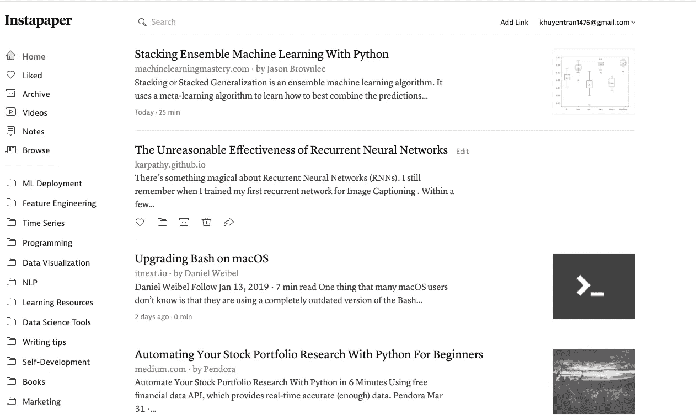
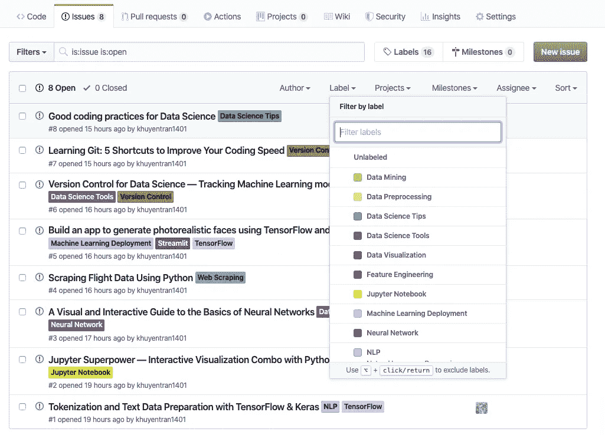
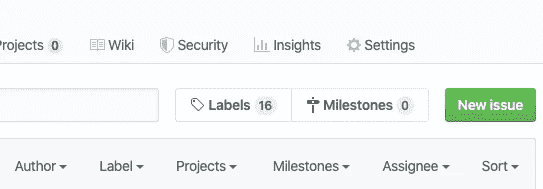
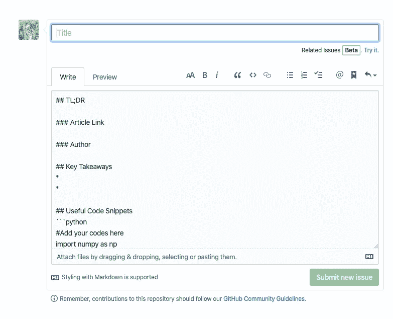
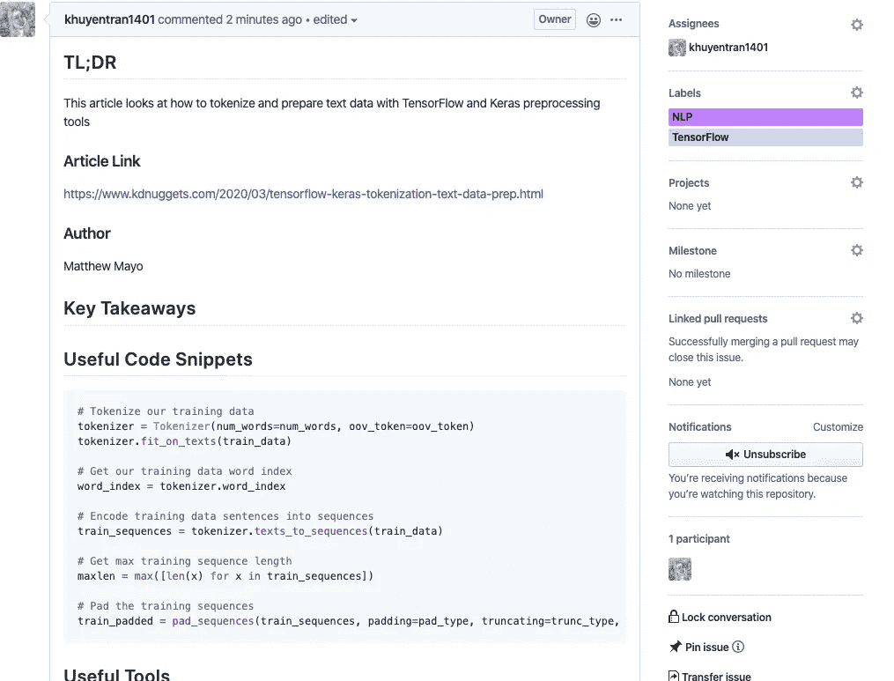
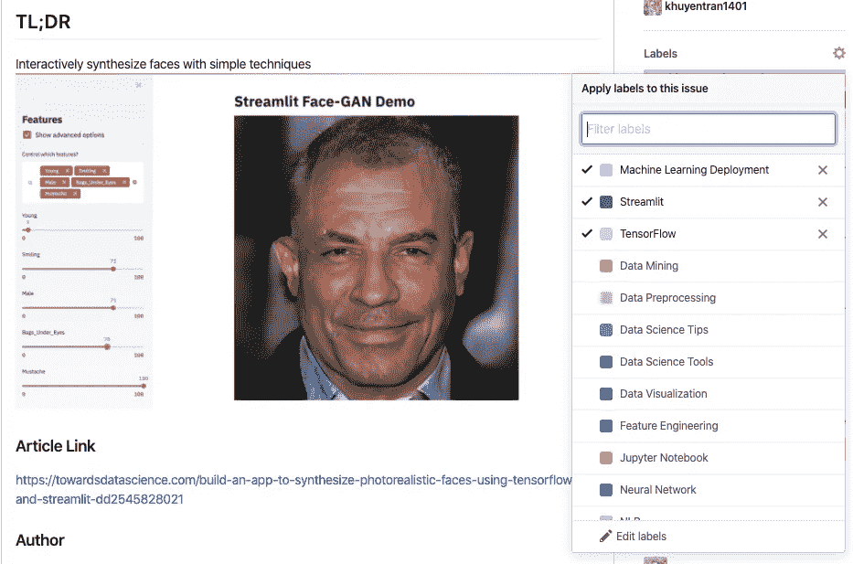
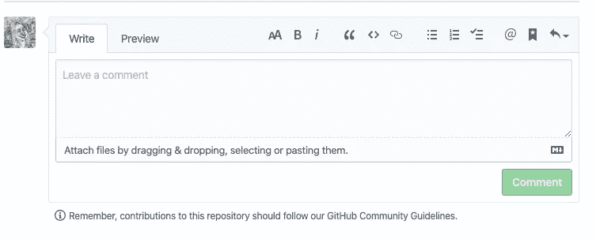

# 如何用 Github 组织你的数据科学文章

> 原文：<https://towardsdatascience.com/how-to-organize-your-data-science-articles-with-github-b5b9427dad37?source=collection_archive---------20----------------------->

## 被新信息淹没？现在，您可以轻松地跟踪文章并为其创建自定义注释

从[下一个网页](https://thenextweb.com/security/2018/03/02/how-github-braved-the-worlds-largest-ddos-attack/)中检索

# 动机

在数据科学领域，每天都有大量的论文和文章发表。许多像 Medium 这样的网站都有一个高效的推荐系统，可以很好地推荐那些我们无法抗拒点击的文章。一篇接一篇的文章似乎都很有用。所以我们继续阅读，要么关闭标签，要么保存文章以备将来参考。既然我们每天都会碰到很多文章，那我们一定是被新的信息所告知，对吗？不完全如此。

> 质量比数量更重要。一个本垒打比两个双打好得多。—史蒂夫·乔布斯

我们吸收新知识的最好方式是使用它。无论我们读了多少技术文章，如果我们不应用新知识，我们将几乎什么都不会保留。我们现在可能会记住一些东西，但一周后就会忘记。但是仔细想想。在快节奏、超负荷的社会，我们阅读一篇文章的常用策略是什么？

我的文章堆在我的 Instapaper 文件夹里

当我们阅读一篇有用的文章时，我们通常不会马上尝试代码、探索工具和深入概念，而是保存它。要么是因为我们正在使用手机阅读文章，要么是因为我们想在需要时试用代码和工具。当我们回顾我们保存的大量文章时，我们会不知所措，并发现浏览这些文章以找到一篇对我们当前项目有用的文章非常耗时。那么什么是解决方案呢？

# 现有工具的问题

有很多工具可以让我们保存你的文章，并对它们进行分类。但是使用这些工具保存文章有几个缺点:

*   我们只是保存这些文章，因为它们很有趣，但不太确定如何以及何时应用它们
*   我们需要重读某一特定类别中的文章，以找到包含我们要寻找的信息的文章，而这些信息可能是一些很小的东西，比如代码片段
*   如果我们对文章有一些问题或意见，我们要么回到文章的网站，要么在网上发布问题，这很费时间，等等

好消息是，我们不需要花太多时间来组织你的文章！有了 Github，并在平台的使用上稍加改动，我们可以高效地组织文章。

# 欢迎来到 Github 及其问题选项卡

Github 是一个轻量级平台，它将开发者聚集在一起，发现、共享代码并构建更好的软件。Github 有一个 Issues 选项卡，允许用户请求关于现有代码的问题。我们将把这个选项卡用于另一个目的:组织和总结我们的文章。大概是这样的:

探索这个仓库[这里](https://github.com/khuyentran1401/machine-learning-articles)。这就是为什么您应该开始使用和贡献这个库的原因:

*   整理你的文章，以便**很容易找到你的文章以备将来参考**
*   **不看整篇文章，快速复习文章重点**
*   总结的艺术将帮助你更好地**保留和理解信息**
*   通过看别人喜欢的文章来节省阅读低质量文章的时间
*   **对问题评论区的文章提问或发表意见**

# 我是 Github 的新手。我还能用吗？

是的，当然！这个存储库的构建使得任何人都可以轻松开始。每当您找到一篇想要保存的有趣文章时，请单击左上角“代码”旁边的“问题”按钮，然后单击右上角的“新问题”。

将显示一个模板。你需要做的就是填写模板。想象一下，就像你的笔记本一样，你想快速保存一篇文章的基本信息，这样你就可以很容易地在将来快速保留这些信息，或者让其他人看到并知道这篇文章的内容。

模板

以下是该模板中各部分的简要描述:

*   **TL；博士**——论文的简短摘要。
*   **文章链接。**
*   **作者**
*   **关键要点**——文章中你觉得有用的部分。
*   **有用的代码片段**——您希望保存以备后用的有用代码
*   **有用的工具** —你想尝试或整合到你的工作流程中的有用工具
*   **评论/问题** —您对文章的想法或问题。
*   图像(可选)—为您提供文章内容的直观描述

这是点击“提交新问题”后模板的外观

[Github 链接](https://github.com/khuyentran1401/machine-learning-articles/issues/1)

请随意**跳过任何与您正在寻找的内容无关的部分**。记住，把这个当成自己的文件夹。把你认为对自己回顾会有用的东西写下来就行了！如果一篇文章有很多条信息，有些你已经知道了，懒得写在模板里。写下你想写的任何东西。写点东西总比一路放弃好。

最后但同样重要的是，使用标签相应地标记文章的类别。

您也可以使用评论部分作为讨论、评论、提问或对文章给出反馈的地方。

# 结论

> 花在组织上的每一分钟，都是一小时的收获。—本杰明·富兰克林

在这个信息超载的社会，我们不需要成为那些被新信息淹没而一路放弃的人。我们只需要改变我们的方法，这样我们就可以更有效地做我们经常做的事情。开始使用[这个存储库](https://github.com/khuyentran1401/machine-learning-articles)来组织和保留更多信息。我希望通过这个平台，我们可以一起建立一个社区，在那里每个人都渴望学习和分享有用的知识。

我喜欢写一些基本的数据科学概念，并尝试不同的算法和数据科学工具。你可以在 [LinkedIn](https://www.linkedin.com/in/khuyen-tran-1401/) 和 [Twitter](https://twitter.com/KhuyenTran16) 上和我联系。

如果你想查看我写的所有文章的代码，请点击这里。在 Medium 上关注我，了解我的最新数据科学文章，例如:

 [## 如何用 Ngrok 用 3 行代码分享你的 Jupyter 笔记本

### 想象一下，让你的朋友在远程机器上使用你的本地 Jupyter 笔记本

towardsdatascience.com](/how-to-share-your-jupyter-notebook-in-3-lines-of-code-with-ngrok-bfe1495a9c0c)  [## 如何使用 HyperDash 远程监控和记录您的机器学习实验

### 培训需要很长时间才能完成，但你需要去洗手间休息一下…

towardsdatascience.com](/how-to-monitor-and-log-your-machine-learning-experiment-remotely-with-hyperdash-aa7106b15509)  [## 当生活不给你喘息的机会，如何学习数据科学

### 我努力为数据科学贡献时间。但是发现新的策略使我能够提高我的学习速度和…

towardsdatascience.com](/how-to-learn-data-science-when-life-does-not-give-you-a-break-a26a6ea328fd)  [## 使用 Python 最大化您的生产力

### 你创建了一个待办事项清单来提高效率，但最终却把时间浪费在了不重要的任务上。如果你能创造…

towardsdatascience.com](/maximize-your-productivity-with-python-6110004b45f7)