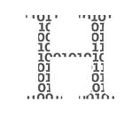

# 如何克服编码障碍

> 原文：<https://towardsdatascience.com/how-to-overcome-coders-block-51ece9dafe00?source=collection_archive---------8----------------------->

## 当你害怕你的游戏机时

游戏机可能会令人生畏。Patrick Amoy 在 [Unsplash](https://unsplash.com/s/photos/programmer?utm_source=unsplash&utm_medium=referral&utm_content=creditCopyText) 上拍摄的照片

  H   *你有没有觉得自己完全被堵住了？你曾经盯着你的空白屏幕几个小时，不能记下任何东西吗？欢迎加入俱乐部。*

当我走进房间时，你正在滔滔不绝地谈论你的计算机科学作业。你的桌子上堆满了脚本和条款清单。你的电脑屏幕是一个黑色的大空间，除了左上角闪烁的白色指针。整个房间似乎都在尖叫着说出你的绝望。

“一切都好吗，”

不——我计算机科学课的作业快把我逼疯了。明天就要交了，而我连一行代码都没写！

“你现在已经做了多长时间了，”

“三个小时，”

好了，该休息了。“你想喝杯茶吗？”

编码很难。一杯热饮料会有帮助。 [Goran Ivos](https://unsplash.com/@goran_ivos?utm_source=unsplash&utm_medium=referral&utm_content=creditCopyText) 在 [Unsplash](https://unsplash.com/s/photos/programmer?utm_source=unsplash&utm_medium=referral&utm_content=creditCopyText) 上拍摄的照片

是的，但是——”

之后你就可以回去完成你的任务了。

你跟着我下楼，我打开水壶。一旦我们的茶倒了，我们回到你的房间。

只是——我什么也不懂。我坐在那里，想了又想，就是做不到。

有什么问题？“你知道你应该做什么吗，”

原则上，是的。但是我不知道如何告诉电脑它应该做什么。“我该怎么开始呢，”

你害怕游戏机。

呃。“是的，我想是的，”

这就像作家的块。有时当你写作时，你会在一张白纸前坐几个小时，一个字也记不住。在某些时候，你会害怕那张纸，因为你已经看了很久了。

同样的情况也发生在编码器的区块。你盯着你的控制台，什么也做不了，直到控制台吓到你。

是的，听起来很熟悉。

> 一段复杂的代码由许多简单的子程序组成

让我们一步一步来。我们将从编写一个 Hello-World 程序开始。

“但这很简单，我们五周前就这么做了，”

这正是我们再次这么做的原因。很简单，所以你不会被屏蔽。

好吧，等等……

你打开一个新的文本文件。

在打印 Hello-World-message 之前，我必须包含一些包吗？

你当然知道。“Hello-World-message 是什么样的对象？”

一根绳子？啊，等等！我需要包含字符串包…好的，知道了。

好了，现在输入信息并执行。

从简单的事情开始。你总是可以呆会儿……安妮·斯普拉特在 [Unsplash](https://unsplash.com/s/photos/programmer?utm_source=unsplash&utm_medium=referral&utm_content=creditCopyText) 上拍摄的照片

“耶，它起作用了！”

太好了！在你的作业中，你还必须在屏幕上打印一些东西。“先写那部分怎么样，”

好吧，但那更复杂，”

我们将一步一步地做它。你需要打印什么？

一些变量的值。但我还没算过。“那我怎么能把它们打印出来呢，”

你现在可以放入虚拟值。请务必留下评论来标记这些假人。通过这种方式，我们会记得以后用实际价值来替换它们。

好吧，等等……我想我已经做到了。

让我们检查一下！请执行程序。

哎呀，输出没有我们预期的那样。让我们来解决这些问题吧。

“但我看不出代码中有任何错误！”

“你在那里打了一个小错字……”

该死的。好了，现在它正常工作了。

厉害！“现在我们还需要做什么，”

计算变量的值。

“好吧，就这么办！”

半小时后，程序启动并运行。

> 永远不要忘记进行测试和调试

哇，谢谢你！你救了我的命。

嗯，基本上是你自己写的代码。我只是给了你一些指导。顺便说一下，你可以删除 Hello-World 程序。

哦，当然，我忘了那部分。但是说真的——我在那里坐了几个小时。然后你进来，几分钟就解决了。“你是个天才，”

好吧，花几个小时解决一个问题通常不是办法。

当我开始写代码的时候，我经常太害羞而不敢向别人寻求帮助，因为我觉得这样会显得很愚蠢。所以我会在屏幕前坐几个小时，无法解决问题，越来越焦虑。

当我最终去寻求帮助时，问题通常是一个小小的打字错误或另一个小错误。

“这就教会了你遇到困难时要寻求帮助，”

是的，你应该经常寻求帮助。不要等几个小时才问。设法在合理的时间内解决这个问题。如果这段时间过去了，却没有取得很大进展，那就去问。

就我而言，我已经解决了问题，但我无法告诉电脑该怎么做。

既然如此，那就做点傻事吧。没有什么是完全没有意义的，而是非常简单的——比如 Hello-World 程序。你知道如何让计算机做事情。但是某种程度的复杂性在开始时可能会令人生畏。

您可以使用这个简单的代码来构建您的程序。“从最简单的部分开始，然后再进行最难的部分，”

 [## 在编码器的块上

### 编码很难。有时候感觉你一点进步都没有。尼尔·科斯拉有一些振奋人心的话给那些与编码障碍作斗争的人。

medium.com](https://medium.com/@nealkhosla/on-coders-block-72125ff9f50f) 

所以下次我不知道如何开始的时候，我会做一些真正简单的事情——即使它看起来与手头的任务无关。然后先做我任务中最简单的部分。

没错。如果你在写代码之前已经思考这个问题几个小时了，休息一下吧！喝杯茶或咖啡，或者散散步。毕竟，在经历了数小时的编码阻塞后，你不太可能会有所收获。

天哪，我想我需要把这些都贴在海报上。“非常感谢！”

不客气！如果你下一个任务有问题，请告诉我。