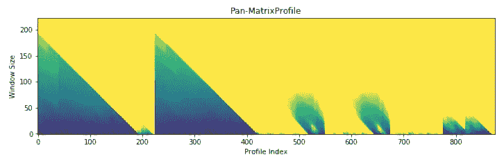
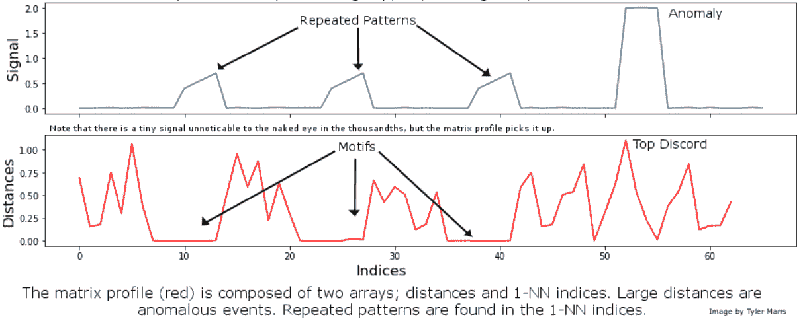
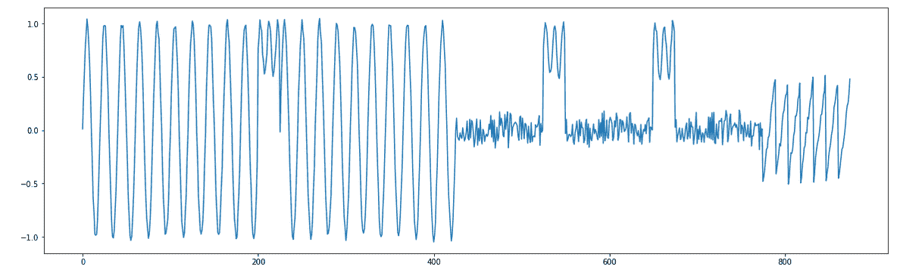
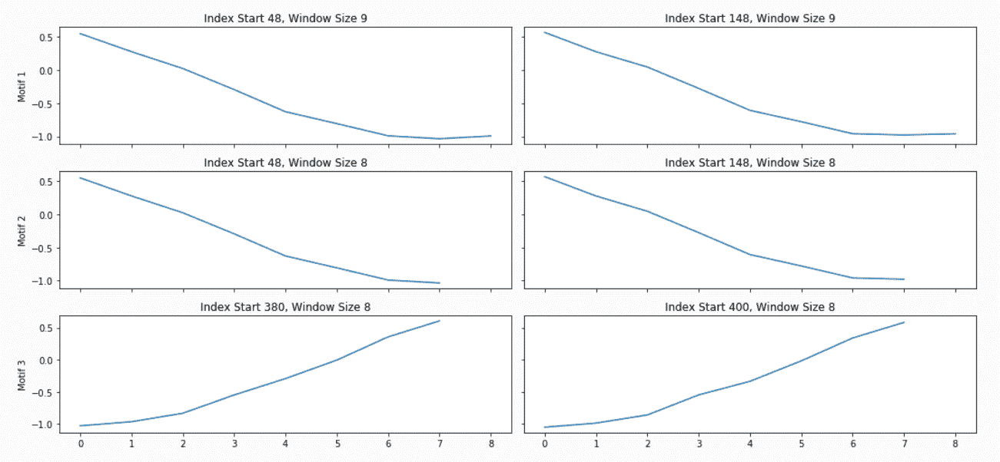
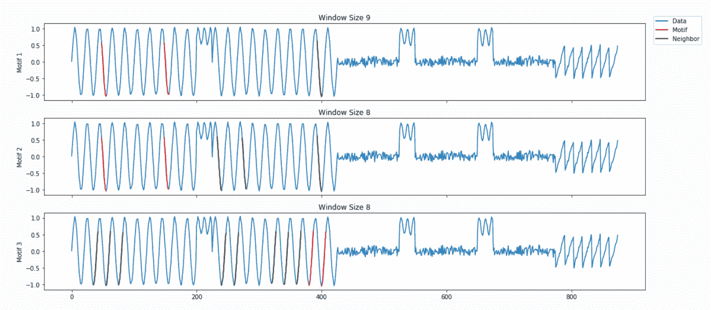
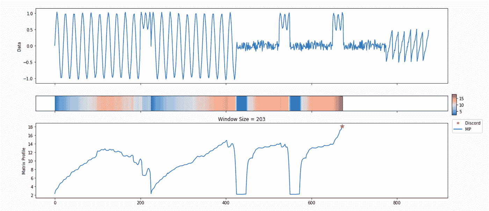
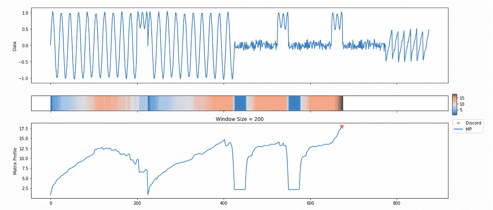
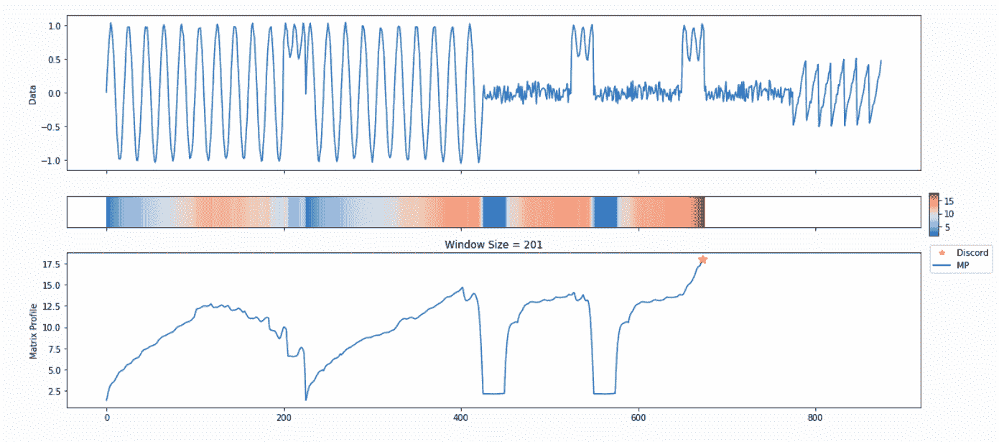

# 如何无痛分析你的时间序列

> 原文：<https://towardsdatascience.com/how-to-painlessly-analyze-your-time-series-f52dab7ea80d?source=collection_archive---------14----------------------->

## MPA 简介:矩阵概要 API

图片来源: [Needpix](https://www.needpix.com/photo/1069812/stock-market-charts-graphs-finance-money-stocks-macbook-computer-laptop)

我们被时间序列数据包围着。从财务到物联网再到营销，许多组织都产生了数千个这样的指标，并挖掘它们来揭示业务关键型洞察力。一个站点可靠性工程师可能会监控来自服务器群的成千上万的时间序列流，以期检测异常事件并防止灾难性故障。或者，实体零售商可能关心识别顾客客流量的模式，并利用它们来指导库存决策。

识别异常事件(或“不一致”)和重复模式(“主题”)是两个基本的时间序列任务。但是如何开始呢？对于这两个问题，有几十种方法，每一种都有独特的优点和缺点。

此外，众所周知，时间序列数据很难分析，数据科学社区的爆炸式增长导致了对更多“黑盒”自动化解决方案的需求，这些解决方案可以由具有广泛技术背景的开发人员利用。

如何在单一图片中分析你的时间序列(图片来源:Matrix Profile Foundation)

我们在[矩阵档案基金会](https://matrixprofile.org/)相信有一个简单的答案。虽然没有免费的午餐，但 Matrix Profile(加州大学河滨分校[基奥研究小组](https://www.cs.ucr.edu/~eamonn/MatrixProfile.html)开发的一套数据结构&相关算法)是一个强大的工具，可以帮助解决异常检测和模体发现的双重问题。Matrix Profile 是健壮的、可扩展的，并且在很大程度上是无参数的:我们已经看到它适用于广泛的指标，包括网站用户数据、订单量和其他业务关键型应用程序。

正如我们将在下面详细介绍的那样，Matrix Profile Foundation 已经在三种最常见的数据科学语言(Python、R 和 Golang)中实现了 Matrix Profile，作为一种易于使用的 API，适用于时间序列新手和专家。

# 那么什么是矩阵轮廓呢？

Matrix Profile 的基本原理很简单:如果我将数据的一部分沿着时间序列的其余部分滑动，它在每个新位置的重叠程度如何？更具体地说，我们可以评估一个子序列和相同长度的每个可能的时间序列片段之间的欧几里德距离，建立所谓的片段的“距离轮廓”

如果子序列在数据中重复自身，将至少有一个完全匹配，并且最小欧几里德距离将为零(或者在存在噪声的情况下接近零)。相反，如果子序列是高度独特的(假设它包含一个重要的离群值)，匹配将很差，所有重叠分数将很高。注意，数据的类型是不相关的:我们只关注一般的模式守恒。

然后我们在时间序列上滑动每一个可能的片段，建立一个距离轮廓的集合。通过对所有距离剖面的每个时间步长取最小值，我们可以构建最终的矩阵剖面。请注意，矩阵轮廓值范围的两端都是有用的。高值表示不寻常的模式或异常事件；相比之下，低值突出了可重复的主题，并为您感兴趣的时间序列提供了有价值的见解。

图片来源:矩阵简介基金会

对于那些感兴趣的人来说，[我们的联合创始人之一](/introduction-to-matrix-profiles-5568f3375d90)的这篇文章提供了一个关于 Matrix 简介的更深入的讨论。

尽管 Matrix Profile 可以改变时间序列分析的游戏规则，但利用它来产生洞察力是一个多步骤的计算过程，其中每一步都需要一定程度的领域经验。然而，我们认为，数据科学中最强有力的突破发生在复杂系统变得可访问的时候。当谈到 Matrix Profile 时，可访问性有三个方面:“开箱即用”的工作实现，对核心概念的温和介绍，这自然会导致更深入的探索，以及多语言可访问性。

今天，我们很自豪地推出 Matrix Profile API (MPA)，这是一个用 R、Python 和 Golang 编写的通用代码库，实现了所有这三个目标。

# **MPA:工作原理**

使用矩阵配置文件包括三个步骤。

首先，你*计算*矩阵轮廓本身。然而，这并不是结束:您需要通过利用您已经创建的矩阵档案来*发现*一些东西。你想找到重复的模式吗？或者发现异常事件？最后，将你的发现可视化是至关重要的，因为时间序列分析极大地受益于某种程度的可视化检查。

通常，你需要通读几页文档(学术的和技术的)来弄清楚如何执行这三个步骤。如果您是一名事先了解矩阵概况的专家，这可能不是一个挑战，但我们已经看到许多用户只是想通过突破方法来分析他们的数据，以达到一个基本的起点。代码可以简单地利用一些合理的默认值来产生一个合理的输出吗？

为了与这种自然的计算流程并行，MPA 由三个核心组件组成:

1.*计算*(计算矩阵轮廓)

*2。发现*(评估 MP 的主题、不一致等)

3.*可视化*(通过基本情节显示结果)

这三个功能被打包成一个叫做*分析*的高级功能。这是一个用户友好的界面，使对 Matrix Profile 的内部工作一无所知的人能够快速利用它来获取自己的数据。随着用户对 MPA 的体验和直觉越来越多，他们可以很容易地深入到三个核心组件中的任何一个，以获得更多的功能。

# **MPA:一个玩具例子**

作为一个例子，我们将使用 MPA 的 [Python 风格来分析如下所示的合成时间序列:](https://github.com/matrix-profile-foundation/matrixprofile)

图片来源:矩阵简介基金会

目测表明，既有模式，也有不一致。然而，一个直接的问题是你选择的子序列长度将会改变你的基序的数量和位置！指数 0-500 之间是否只有两个正弦图案，还是每个周期都是该图案的一个实例？让我们看看 MPA 如何应对这一挑战:

图片来源:矩阵简介基金会

因为我们没有指定任何关于我们的子序列长度的信息，所以“分析”从利用一种称为泛矩阵谱(或 PMP)的强大计算开始，以产生帮助我们评估不同子序列长度的见解。我们将在后面的帖子中讨论 PMP 的细节(或者你可以阅读相关的论文)，但简单地说，它是对所有可能的子序列长度的全局计算*浓缩成一个单一的视觉摘要。X 轴是矩阵轮廓的索引，Y 轴是相应的子序列长度。阴影越暗，该点的欧几里德距离越低。我们可以使用三角形的“峰”来寻找在合成时间序列中视觉呈现的 6 个“大”主题。*

PMP 很好，但是我们承诺了一种简单的方式来理解你的时间序列。为了促进这一点，“分析”将结合 PMP 与引擎盖下的算法，从所有可能的窗口大小中选择合理的主题和不一致。由“分析”创建的附加图形显示了前三个基序和前三个 discords，以及相应的窗口大小和在矩阵轮廓中的位置(以及，通过扩展，您的时间序列)。

图片来源:矩阵简介基金会

图片来源:矩阵简介基金会

图片来源:矩阵简介基金会

图片来源:矩阵简介基金会

图片来源:矩阵简介基金会

毫不奇怪，这是来自默认设置的大量信息。我们的目标是这个核心函数调用可以作为您未来许多分析的起点。例如，PMP 表明在我们的时间序列中有一个长度约为 175 的保守基序。尝试对该子序列长度调用“analyze ”,看看会发生什么！

# **收尾**

我们希望 MPA 能够让你更无痛的分析你的时间序列！欲了解更多信息，请访问我们的[网站](https://matrixprofile.org/)、 [GitHub repos](https://github.com/matrix-profile-foundation) ，或在 [Twitter](https://twitter.com/matrixprofile) 上关注我们。如果你觉得代码有用，请在我们的 GitHub repos 上打星号！MPF 还开设了一个 Discord 频道，您可以通过该频道与 Matrix 档案的其他用户交流并提出问题。快乐的时间系列狩猎！

# **致谢**

感谢 Tyler Marrs、Frankie Cancino、Francisco Bischoff、Austin Ouyang 和杰克·格林审阅本文并协助其创作。最重要的是，感谢埃蒙·基奥、阿卜杜拉·穆恩和他们众多的研究生，感谢他们创建了 Matrix 档案并继续推动其发展。

# **补充**

1.矩阵概况研究论文可在埃蒙·基奥的 UCR 网页上找到:

[https://www.cs.ucr.edu/~eamonn/MatrixProfile.html](https://www.cs.ucr.edu/~eamonn/MatrixProfile.html)

2.矩阵轮廓算法的 Python 实现可在此处找到:

[https://github.com/matrix-profile-foundation/matrixprofile](https://github.com/matrix-profile-foundation/matrixprofile)

3.矩阵分析算法其余实现可在此处找到:

[https://github.com/matrix-profile-foundation/tsmp](https://github.com/matrix-profile-foundation/tsmp)

4.矩阵轮廓算法的 Golang 实现可在此处找到:

[https://github . com/matrix-profile-foundation/go-matrix profile](https://github.com/matrix-profile-foundation/go-matrixprofile)