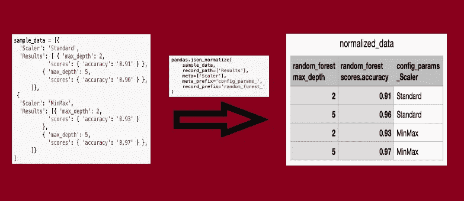
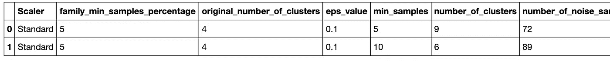
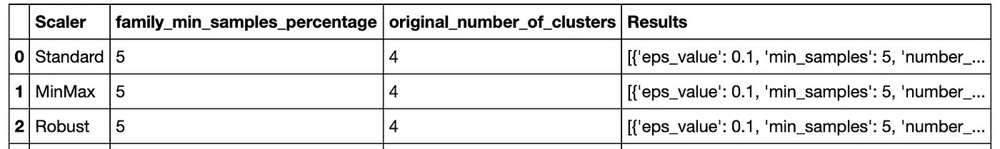
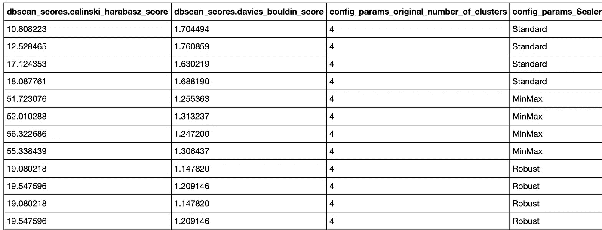

# 如何用 Python 熊猫解析 JSON 数据？

> 原文：<https://towardsdatascience.com/how-to-parse-json-data-with-python-pandas-f84fbd0b1025?source=collection_archive---------0----------------------->

## 使用 Pandas 读取 JSON 数据并将其规范化为平面表的一行程序。



来源:作者图片

如果您正在从事与数据相关的工作，无论是数据工程、数据分析，甚至是数据科学，您肯定会遇到 JSONs。

JSON (JavaScript Object Notation)是在 web 上交换数据最常用的数据格式之一。像 MongoDB 这样基于 NoSQL 的数据库以这种格式存储数据。尽管这种格式很适合存储数据，但需要将其转换成表格形式以便进一步分析。

在这个故事中，我们将看到解析 JSON 数据并将其转换成表格形式是多么容易。您可以从下面提到的 GitHub 资源库下载示例数据。此外，请查看笔记本，了解有关所用数据和 API 的更多详细信息。

[](https://github.com/ankitgoel1602/data-science/tree/master/json-data) [## ankitgoel 1602/数据科学

### 此时您不能执行该操作。您已使用另一个标签页或窗口登录。您已在另一个选项卡中注销，或者…

github.com](https://github.com/ankitgoel1602/data-science/tree/master/json-data) 

## 数据细节

我将使用我在处理机器学习聚类问题时生成的数据。不必担心这些数据没有意义，因为它们仅用于演示目的。我将使用两种不同的 JSON

1.  没有嵌套列表/字典的简单 JSON。

这已经是扁平化的 JSON，只需要最少的处理。

```
Sample Record:
{
    "Scaler": "Standard",
    "family_min_samples_percentage": 5,
    "original_number_of_clusters": 4,
    "eps_value": 0.1,
    "min_samples": 5,
    "number_of_clusters": 9,
    "number_of_noise_samples": 72,
    "adjusted_rand_index": 0.001,
    "adjusted_mutual_info_score": 0.009,
    "homogeneity_score": 0.330,
    "completeness_score": 0.999,
    "v_measure_score": 0.497,
    "fowlkes_mallows_score": 0.0282,
    "silhouette_coefficient": 0.653,
    "calinski_harabasz_score": 10.81,
    "davies_bouldin_score": 1.70
}
```

2.带有嵌套列表/字典的 JSON。

这可能看起来有点复杂，一般来说，需要你写一个扁平化的脚本。稍后，我们将看到如何用一行代码将它转换成 DataFrame。

```
Sample Record:
{
  'Scaler': 'Standard',
  'family_min_samples_percentage': 5,
  'original_number_of_clusters': 4,
  'Results': 
  [
      {
        'eps_value': 0.1,
        'min_samples': 5,
        'number_of_clusters': 9,
        'number_of_noise_samples': 72,
        'scores': 
            {
             'adjusted_rand_index': 0.001,
             'adjusted_mutual_info_score': 0.009,
             'homogeneity_score': 0.331,
             'completeness_score': 0.999,
             'v_measure_score': 0.497,
             'fowlkes_mallows_score': 0.028,
             'silhouette_coefficient': 0.653,
             'calinski_harabasz_score': 10.81,
             'davies_bouldin_score': 1.70
            }
      },
      {
        'eps_value': 0.1,
        'min_samples': 10,
        'number_of_clusters': 6,
        'number_of_noise_samples': 89,
        'scores': 
            {
             'adjusted_rand_index': 0.001,
             'adjusted_mutual_info_score': 0.008,
             'homogeneity_score': 0.294,
             'completeness_score': 0.999,
             'v_measure_score': 0.455,
             'fowlkes_mallows_score': 0.026,
             'silhouette_coefficient': 0.561,
             'calinski_harabasz_score': 12.528,
             'davies_bouldin_score': 1.760
            }
      }
  ]
}
```

## 熊猫阅读 _json()

Pandas 的这个 API 有助于读取 JSON 数据，对于已经扁平化的数据非常有用，就像我们在示例 1 中看到的那样。你可以从[这里](https://github.com/ankitgoel1602/data-science/blob/master/json-data/level_1.json)下载 JSON。

```
# Reading JSON
pd.read_json('level_1.json')
```

只是看了 JSON 就把它转换成了下面的平面表。



作者使用 read_json()展平数据

当 JSON 数据是半结构化的，即包含嵌套的列表或字典时，就像我们在示例 2 中看到的那样，这样做效果不好。

```
# Example 2 JSON
pd.read_json('multiple_levels.json')
```

在阅读了这个 JSON 之后，我们可以在下面看到我们的嵌套列表被放在一个单独的列“Results”中。在下一节中，我们将了解如何扁平化这些数据。



来源:作者图片

## 熊猫 json_normalize()

这个 API 主要用于将半结构化的 JSON 数据转换成平面表或数据帧。你可以从[这里](https://github.com/ankitgoel1602/data-science/blob/master/json-data/multiple_levels.json)下载 JSON 的例子。

```
# load data using Python JSON module
with open('multiple_levels.json','r') as f:
    data = json.loads(f.read())# Normalizing data
multiple_level_data = pd.json_normalize(data, record_path =['Results'], meta =['original_number_of_clusters','Scaler','family_min_samples_percentage'], meta_prefix='config_params_', record_prefix='dbscan_')# Saving to CSV format
multiple_level_data.to_csv('multiplelevel_normalized_data.csv', index=False)
```



作者使用 json_normalize()平面化数据

现在，让我们来理解我在这里使用的将 JSON 转换成平面表的一个神奇的代码行。这个 API 提供了不同的参数，你可以在这里阅读更多关于它们的信息[。这里我们使用了-](https://pandas.pydata.org/pandas-docs/stable/reference/api/pandas.json_normalize.html)

*   记录路径
*   记录前缀
*   自指的
*   元前缀

让我们一个一个地看一遍。

**记录 _ 路径 **

这是我们想要展平的嵌套数组或列表的路径。在我们的例子中,“结果”有多个包含算法超参数和度量分数的嵌套字典。

***记录 _ 前缀***

默认情况下，json_normalize 会根据父数据为嵌套字典添加一个前缀(字符串),就像我们的示例中 davies_bouldin_score 转换为 scores.davies_bouldin_score 一样。对于嵌套列表，我们可以使用 record_prefix 添加到扁平数据中。在我们的示例中,“结果”列表中的每个值都与 DBSCAN 算法相关，因此我们可以追加相同的值(dbscan_)。这将把 scores.davies_bouldin_score 转换为 db scan _ scores . Davies _ boul din _ score。

***元***

该参数有助于将每个记录的元数据添加到结果表中。此处，元数据将位于记录路径之外，即 Scaler、original_number_of_clusters 或 family_min_samples_percentage。

***元 _ 前缀***

与 record_prefix 类似，meta_prefix 会将字符串附加到定义为“meta”一部分的元数据中。在我们的例子中，所有的元数据都与 ML 问题的配置参数相关，因此我们在每个元数据后面附加了‘config _ params _’。

我希望这篇文章能在您下次处理 JSON 数据时有所帮助。我过去常常编写 python 脚本来扁平化数据，或者使用各种包来解决问题，而现在只需要 10 秒钟。如果你对数据科学感兴趣，或者想了解一些很酷的 python 库，那么看看我的另一个博客- [今天就开始你的数据科学之旅](https://towardsdatascience.com/swlh/start-your-data-science-journey-today-37366ee463f)。

注意安全！！！继续学习！！！