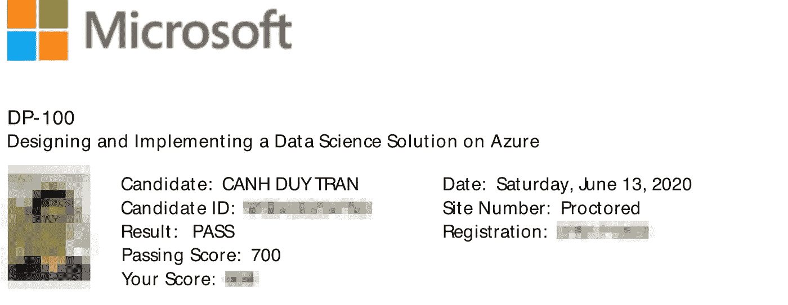

# 如何通过 Azure 数据科学家助理测试

> 原文：<https://towardsdatascience.com/how-to-pass-the-azure-data-scientist-associate-test-ad794794c646?source=collection_archive---------15----------------------->

## 我花了 50 个小时来学习，我做到了

**本文涵盖了最新的考试大纲。我在 2020 年 6 月 13 日参加了考试**

在本指南中，我将解释 Azure Data Scientist Associate 的理念、考试内容、准备工作以及课程结束后带走的一些钥匙。

我的图像

为了拿到证书，我花了大约 50 个小时从几乎零知识开始学习 Azure。关于我的背景，我作为一名数据科学家工作了 2 年，现在我是一名全职数据工程师，有 3 年多的经验。我在这两方面都很熟悉，从为大规模数据建立基础设施，到为生产构建和部署实时模型。我认为这是帮助我通过考试的优势之一。

# 微软 Azure DP-100 考试是什么？

在讨论细节之前，我想回顾一下微软 Azure DP-100。*“在 Azure 上设计和实施数据科学解决方案”(或 DP-100)* 是获得 Azure 数据科学家助理资格的考试。本课程以微软为基础，测试你在数据科学和机器学习方面的知识，在 Azure 上实现和运行机器学习工作负载。考试中测试了 4 项技能

*   设置 Azure 机器学习工作场所(30–35%)。
*   运行实验和训练模型(25–30%)。
*   优化和管理模型(20–25%)。
*   部署和消费模型(20–25%)。

更多细节，考试 55 题(其中 10 题无法复习)。这些问题分为 5 种不同的类型

*   多项选择单项答案
*   多重选择多重答案
*   按正确的顺序排列
*   基于情景的问题
*   通过填写空白处来完成代码

哦，我差点忘了说，考试需要 180 分钟，可以在家参加。

# 我该如何准备？

照片由[里沙布·阿加瓦尔](https://unsplash.com/@rishu556)在[的](https://unsplash.com/)上拍摄

我所有的学习资源都是微软免费提供的。当我第一次注册免费账户时，微软给了我 30 天 200 美元的信用额度。那足够为考试练习了，实际上我花了大约 50 美元。

由于对 Azure 知之甚少，我决定跟随微软在 github 上提供的 DP-100 实验室([https://GitHub . com/Microsoft learning/DP 100/tree/master/labdocs](https://github.com/MicrosoftLearning/DP100/tree/master/labdocs))。我花了大约 20 个小时完成实验室。该实验室分为 10 个模块，但我可以说它涵盖了两个主要工具

*   **Azure Machine Learning Designer**，这是一个拖放工具，可以用来构建、测试和部署预测分析解决方案。
*   使用**Azure Machine Learning SDK**for Python 来构建、运行和部署带有 Azure Machine Learning services 的机器学习工作流。您可以使用 SDK 在任何 Python 环境中与服务进行交互。

在进行实验时，您需要注意理解每一行代码。有很多*【填码】*题，所以你要记住。考试的时候我很纠结，因为大部分答案都有些雷同。

其余时间，我通过阅读和跟随官方文档([https://docs . Microsoft . com/en-us/Azure/Machine-Learning/overview-what-is-Azure-ml](https://docs.microsoft.com/en-us/azure/machine-learning/overview-what-is-azure-ml))来尝试了解 Azure 机器学习工作室。我只是在查找代码中的一个 bug 时找到了文档。幸运的是，它确实对我的考试有帮助，大多数问题都来自文档。文件涵盖了工作室的各个方面，不包括实验室。例如，使用 PyTorch 或时间序列预测进行模型训练，甚至是数据存储的用户权限。

总的来说，更新的考试很短，主要涵盖了 Azure Machine Learning Studio。根据我的记忆，大约有 3-5 个问题需要数据科学知识，如调整参数或选择正确的参数。虽然，这是数据科学的基础知识。

这就是我为准备考试所做的。我并不是说我的方法是正确的，但是如果你没有找到任何材料或者其他方法不起作用，请随意使用我的方法。

# 考完试带走钥匙

在我看来，Azure 数据科学家助理对于那些拥有数据科学知识或者至少训练过几个预测分析模型的人来说是有用的。

通过研究，我们了解了训练模型、构建实验管道以及将模型高效部署到生产中的整个过程。在我看来，这不仅对 Azure 平台有好处，而且有助于你了解真实世界的流程，即使是在其他平台上。

我希望这个指南对那些即将参加考试的人有所帮助，并有望成为他们的信心助推器

祝你好运！