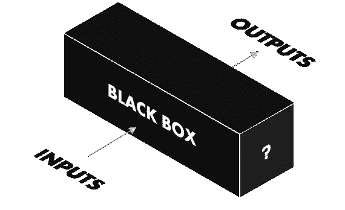
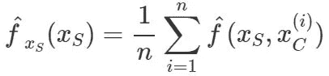
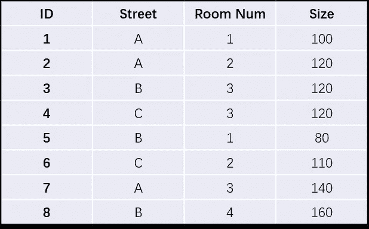
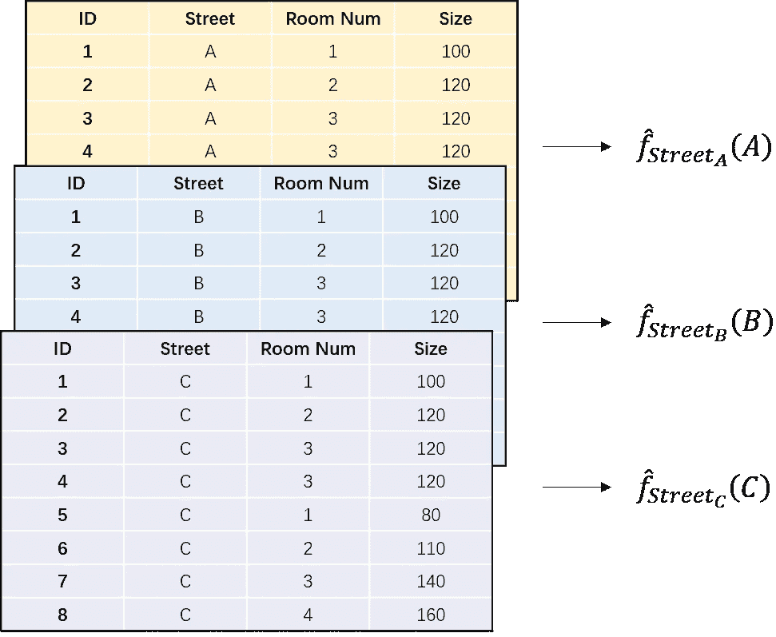
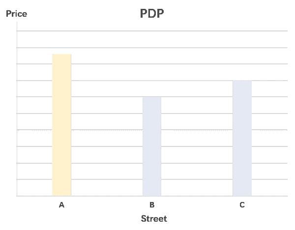
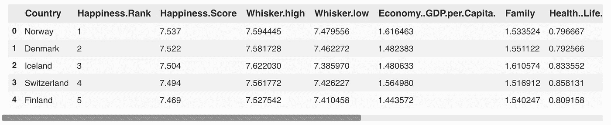
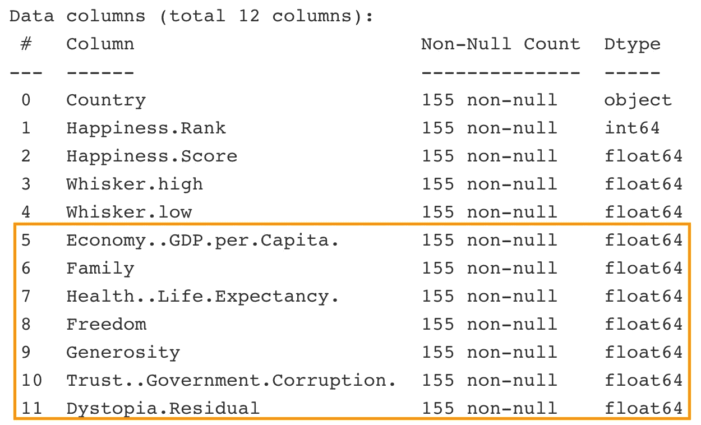
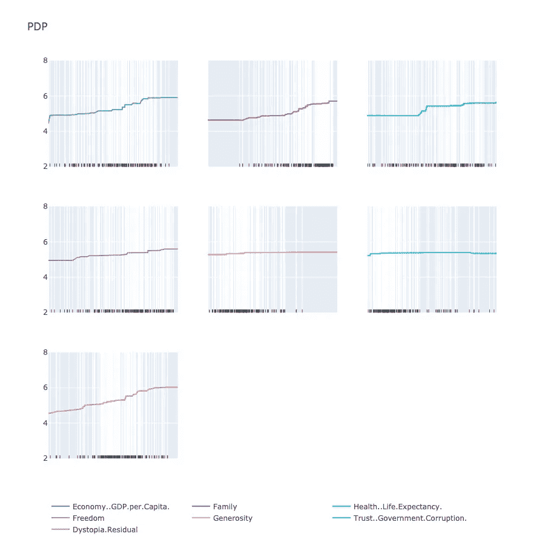
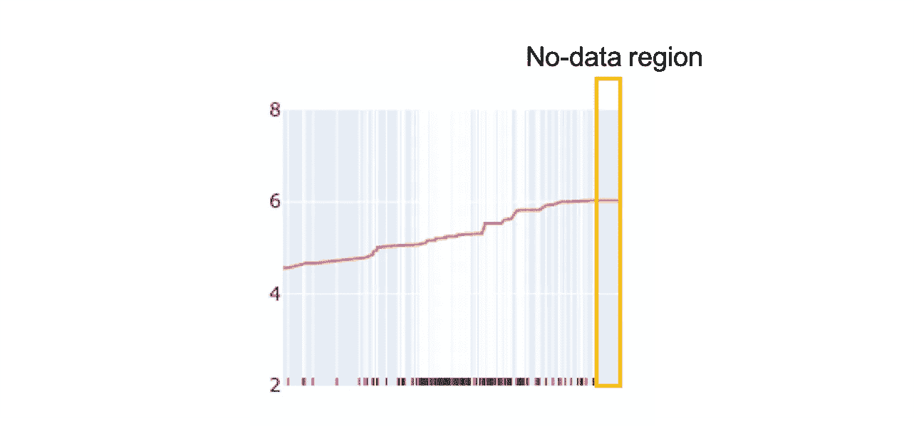
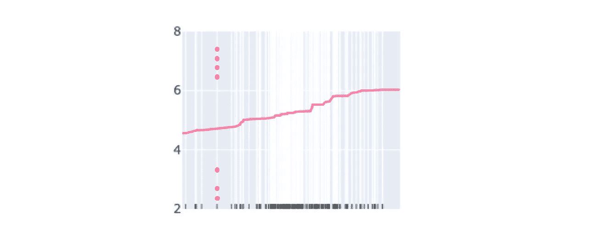

# 如何窥视黑盒模型内部——理解部分依赖图

> 原文：<https://towardsdatascience.com/how-to-peek-inside-a-black-box-model-understand-partial-dependence-plots-17d1b673aafc?source=collection_archive---------34----------------------->

## 使用部分相关图揭示目标特性对黑盒模型的影响。

作者拍摄的照片

在这篇文章中，我们将学习一个工具来揭示黑盒模型的工作机制。但是在我们开始之前，让我们谈点别的。

浣熊是一种非常有趣的动物，喜欢在进食前清洗食物，如下图所示:

让我们洗一些棉花糖(GIF 来自 [Giphy](https://giphy.com/)

这种行为在我们看来可能是正常的，因为卫生问题。但是这对可爱的小浣熊有关系吗？

事实并非如此。为了解开这个神秘的行为，研究人员研究了浣熊的神经纤维和大脑皮层，最终得出了一个可能的解释。浣熊的前爪上有非常敏感的神经群。通过弄湿它们的爪子，它们能够获得更多关于将要吃什么的感官信息。

# 黑箱模型

现在，让我们回到我们的主题。什么是黑盒模型。在计算机科学中，黑盒模型是一个系统，可以根据其输入和输出来查看，而无需了解其内部工作原理。

我们的小科学故事中的浣熊是一个黑箱模型，输入包括食物和水，输出是它们良好的进食习惯。仅从我们的观察来看，我们无法理解他们为什么那样做。因此，我们的好奇心可能会驱使我们进一步探索。除了情感上的自我实现，揭开黑匣子确实有实用价值。

例如，在像航空航天这样的任务关键型行业中，即使黑盒模型可以为我们提供更高的准确性，采用这种解决方案也是值得怀疑的，因为我们不了解它是如何工作的以及会受到什么影响。因此，如果我们能有一些工具来揭示这个神秘的工厂就更好了。其中一个有用的工具叫做部分依赖图(PDP)。

GIF 来自 [Giphy](https://giphy.com/)

# 并行分布处理

部分相关图(PDP)显示了模型预测如何部分依赖于感兴趣的输入变量值。

**通俗地说，就是剧情。从该图中，它将帮助我们了解一个或两个输入特征如何影响模型预测结果。**

你可能会问为什么有一两个特征？因为我们生活在一个三维世界中。我们很难想象更高的维度。

原则上，我们将检查给定训练模型的特征集对预测结果的边际效应。下面的公式明确说明了我们将如何实现这一目标:

左手边的功能 ***f*** 称为部分功能。在右侧，它将对感兴趣的特征 *Xs* 保持不变，并对数据集中其他特征 *Xc* 的所有其他组合进行平均预测。

例如，给定以下数据集:

虚拟房屋特征表(图片由作者提供)

如果我们要检查街道值的边际效应，我们将在日期集中取唯一的街道值 A、B 和 C，并分别替换每个样本的街道值。然后，我们可以使用新生成的数据样本来计算模型的平均预测值:

替换每个样本的街道值(图片由作者提供)

获取每个街道价值的平均预测价格后，我们将能够绘制一个街道价值与平均预测价格的关系图:

街道虚拟 PDP(图片由作者提供)

从该图中，我们知道该模型通常预测街道 A 上的房屋价值较高，而街道 B 上的房屋价值较低。

# **实施**

在理解了 PDP 的整体概念之后，我们将通过一个真实的例子来更深入地探讨这个问题。

以下是 2017 年世界幸福得分的[数据集](https://www.kaggle.com/unsdsn/world-happiness?select=2017.csv)快照。

来自数据集的样本(图片由作者提供)

特写(图片由作者提供)

据此，我建立了一个简单的关于快乐的回归模型。选择 7 个特征对进行评分。模型训练过程的细节可以在下面的笔记本中找到。

2017 年幸福值 XGBoost 回归模型

由于我们使用的是 XGBoost，这是一种集成方法，会产生一个黑盒模型，因此我们可以使用 PDP 来探索和了解每个功能在这个复杂的工厂中是如何发挥作用的。代码可以在下面的笔记本中找到:

为了更好地说明，我使用 Plotly 重新创建了这个图表。代码可以在[这里](https://gist.github.com/fyr91/d29d1bb4ebac97e338dd2286002669d9)找到供你参考。

带有 Plotly 的 PDP(图片由作者提供)

在分析 PDP 之前，我们需要考虑三个预防措施。

**第一个**是**特征关联**。通过使用 PDP，我们假设了目标特性和其余特性之间的独立性。如果存在相关性，替换目标特征值可能会导致其不具有任何实用价值的情况。例如，**健康。预期寿命与经济高度相关。GDP.per.Captita** ，通过改变经济的数值。健康。预期寿命应该相应地改变。然而，当我们检查这两个值的部分相关性时，我们通过修正另一个值来创建在现实生活中不太可能存在的数据点。因此，重要的是要记住这样一个假设，即目标特性应该独立于其他特性。

**第二个**是**数据分配**。您可能会注意到，在 x 轴上，我显示了来自样本数据集的目标特征值的分布。由于我们是从这些值计算部分相关性，不考虑数据分布的分析可能是危险的。在无数据区，我们可能高估了目标特征的影响。

反乌托邦的分布。x 轴上的残差可以帮助识别无数据区域(图片由作者提供)

**第三个**，还有一个诡雷我们需要关心，隐藏的**异质效果**。由于部分相关性是一个平均估计值，因此得到的值可能无法代表给定目标特征的实际边际效应。例如，如下所示:

作者图片

一半的分数高于平均水平，一半低于平均水平。然而，由此产生的部分依赖性却讲述了另一个故事。为了解决这个问题，我们可以使用其他工具，如个人条件期望(ICE)图来提供模型的粗略视图。

考虑到这些，我们可以从模型中提取一些有用的信息。一般来说，**家庭**，**自由**和**反面乌托邦。残差**对从模型中得出的幸福分数有正面影响。尽管经济不景气。人均 GDP 和**健康。预期寿命也可能有潜在的积极影响，它们高度相关，在进一步的研究之前，我们不能相信这一点。**

# **总结**

总之，PDP 是一种模型不可知的方法，有助于理解目标特性如何影响任何派生的模型。它直观且易于实施，但确实有一些限制:

*   一个图(线图或热图图)中只能检查一到两个要素。
*   目标特征应该独立于其他特征。
*   在分析影响时，需要考虑数据分布。
*   情节中可能隐藏着不同的影响，并可能导致错误的结论。

希望这篇帖子有所帮助，帮助你打开神秘世界的大门。敬请期待，再见~

GIF 来自 [Giphy](https://giphy.com/)