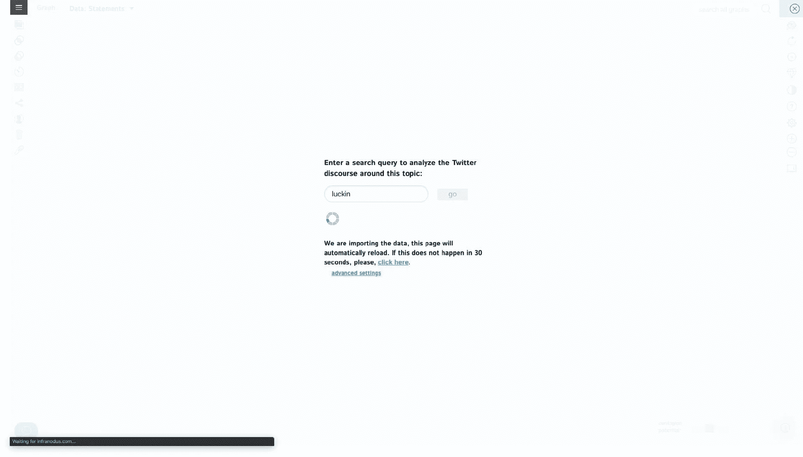
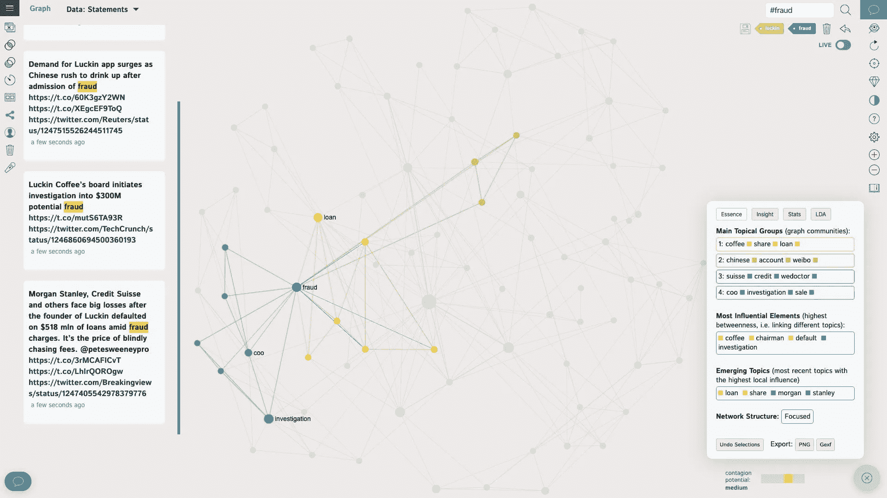

# 如何高效地对 Twitter 中的流行语进行网络分析？

> 原文：<https://towardsdatascience.com/how-to-perform-a-network-analysis-for-buzzwords-in-twitter-efficiently-ebf8e139037d?source=collection_archive---------45----------------------->

## 数据收集、预处理、分析、可视化和交互的一站式解决方案。

作者截图

## 需求

Twitter 拥有大量活跃的用户，并一直以数据可访问性著称。利用 twitter 上的数据分析热点趋势已经是一种成熟的方法。

作者截图来自[谷歌学术](https://scholar.google.com/scholar?hl=zh-TW&as_sdt=0%2C5&q=twitter+sna&btnG=)

但是，以前，如果我们要进行这种分析，我们需要完成以下步骤:

*   数据收集；
*   一系列数据预处理；
*   关键词提取；
*   网络绘图；

对于那些有足够编码技能的人来说，这似乎不是一个很大的挑战。然而，对于编程背景差的社会科学家来说，这可能是一个难以逾越的障碍。

幸运的是，一种新工具将有助于克服这一障碍。

下面的介绍将解释这个新工具如何高效地一站式完成上述一系列操作。

让我们开始吧。

## 演示

首先，请访问[这个链接](https://infranodus.com/)。

作者截图来自 [InfraNodus 主页](https://infranodus.com/)

正如你在这里看到的，这个工具叫做“InfraNodus”注册后，你可以进入几种不同的功能。

作者截图自 [InfraNodus](https://infranodus.com/apps)

现在让我们点击按钮“Twitter 情绪分析”，它在上图中被圈起来。

作者截图来自 [InfraNodus](https://infranodus.com/wshuyi/200410T2317/twitter)

这里会提示您输入一个查询词。比如你对 Luckin coffee 最近的丑闻感兴趣，可以输入“Luckin”。

单击“go ”,请注意加载可能需要几秒钟时间。

作者截图来自 [InfraNodus](https://infranodus.com/wshuyi/200410T2317/twitter)

然后绘图完成并呈现。

作者截图来自 [InfraNodus](https://infranodus.com/wshuyi/200410T2317/twitter)

在这个图中，每个节点代表一个关键词，两个节点之间的线表示这两个词出现在同一个 tweet 中。

由于过滤机制，图中没有显示每个单词。

正如我们所看到的，不同的颜色代表不同的主题，这些主题在右边的对话框中被分类。

例如，第一个类是黄色的集群，包含关键字“咖啡”、“股票”和“贷款”。

这个剧情的一大亮点就是动态性。

假设您对关键词“欺诈”感兴趣，请点击它。

作者截图自 [InfraNodus](https://infranodus.com/wshuyi/200410T2317/twitter)

你会注意到“欺诈”会自动出现在右上角的搜索框中，这意味着你刚刚执行了一次相关性过滤。

现在，您可以看到一些与“欺诈”高度相关的关键词

事实上，“首席运营官”和“调查”显然是高度相关的。

现在点击上面图左上角标有红色的按钮。

作者截图来自 [InfraNodus](https://infranodus.com/wshuyi/200410T2317/twitter)

而所有包含“调查”的推文都在这里。

你可以继续潜心分析，比如继续查看关于调查的推文。

作者截图来自 [InfraNodus](https://infranodus.com/wshuyi/200410T2317/twitter)

只要点击它，

作者截图自 [InfraNodus](https://infranodus.com/wshuyi/200410T2317/twitter)

现在原始推文中只剩下一条相关推文。这样，当你试图理解热点问题时，你可以轻松地瞄准特定的单词来找出主题及其关联。

点击上面带红圈的部分，可以很容易地将 InfraNodus 分析结果导出为 png 格式，或者 gexf 格式。Png 文件可以直接显示，而对于 gexf 格式，我们可以在 Gephi 中得到进一步的分析和高质量的绘图。

到目前为止，InfraNodus 帮助我们做了很多工作。正如我们在开头提到的，有四个基本过程。

*   数据收集；
*   一系列数据预处理；
*   关键词提取；
*   网络绘图；

我们完成了第一、三、四项。此外，还增加了动态交互。

但是，数据预处理怎么样呢？

放轻松，别担心。

我们点击了下图中红色标记的按钮，以了解我们可以在设置中做些什么。

作者截图来自 [InfraNodus](https://infranodus.com/wshuyi/200410T2317/twitter)

请向下滚动。

作者截图来自 [InfraNodus](https://infranodus.com/wshuyi/200410T2317/twitter)

在这里你可以预处理文本。比如什么程度的距离算是“同现词”特别是下面有停用词设置。您可以过滤掉不想在结果中出现的单词。

所以，我说它是一站式的分析工具，是不是有点夸张？

## 延长

我们在本教程中只尝试了 Twitter 分析功能。

作者截图自 [InfraNodus](https://infranodus.com/wshuyi/200410T2317/twitter)

其他部分呢？在我应用到不同领域之后，也是行得通的，无论是新闻，谷歌搜索词汇，甚至是维基百科分析。

当我们有更多的时间时，我们可以进一步解释。

## 发布说明

InfraNodus 在 Github 上为公众提供了一个**免费开源**版本。[这里是链接。](https://github.com/noduslabs/InfraNodus)

作者截图来自 [InfraNodus 的 Github 页面](https://github.com/noduslabs/infranodus)

然而，这个免费版本必须在本地计算机上构建和运行。需要特殊的编码技能。

如果你想立即使用它，你可以付费订阅。目前的订阅费是每月 9 欧元。

作者截图来自 [InfraNodus](https://infranodus.com/#pricing)

我们之前提到过，这个软件主要是赋能社科研究者，所以订阅的方式相对更实用。

## 摘要

最后，如果你想对社交媒体 Twitter 上的特定话题进行词汇共现分析，InfraNodus 可以帮助你一站式完成，为你的研究赋能。

思考问题:

Twitter 的分析仅限于关键词共现吗？能不能分析一下作者，hashtag，甚至几个不同元素的综合评论？

欢迎大家自行尝试，然后将结果反馈给社区。让我们互相学习。

## 相关博客

如果你对这篇博客文章感兴趣，你可能也想看看下面几篇:

*   [如何用 Google Colab 练习 Python？](/how-to-practice-python-with-google-colab-45fc6b7d118b)
*   [如何用 Python 和递归神经网络预测严重堵车？](/how-to-predict-severe-traffic-jams-with-python-and-recurrent-neural-networks-e53b6d411e8d)
*   [如何用不到十行代码用 BERT 做文本二进制分类？](/how-to-do-text-binary-classification-with-bert-f1348a25d905)

## 承认

我要感谢[我以前的本科生 Shelly Yin](https://www.linkedin.com/in/yaxuanyin/) 帮我把中文原版翻译成英文。

以下是她的信息:

*   NYU 数据科学校友
*   天津师范大学管理信息系统校友