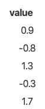
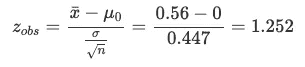
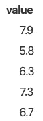
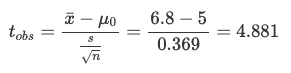
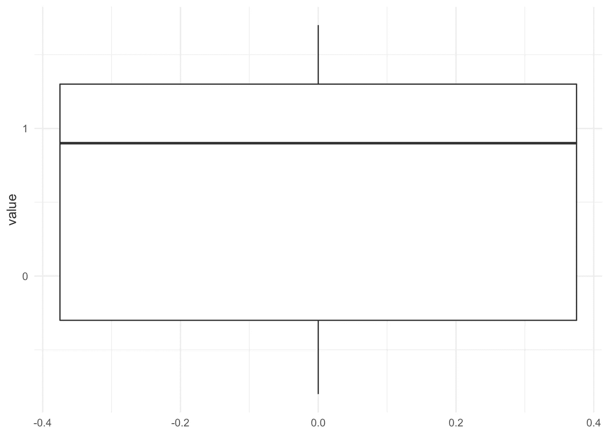
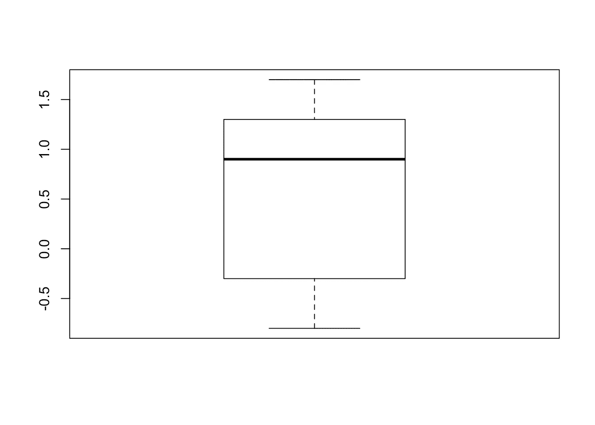
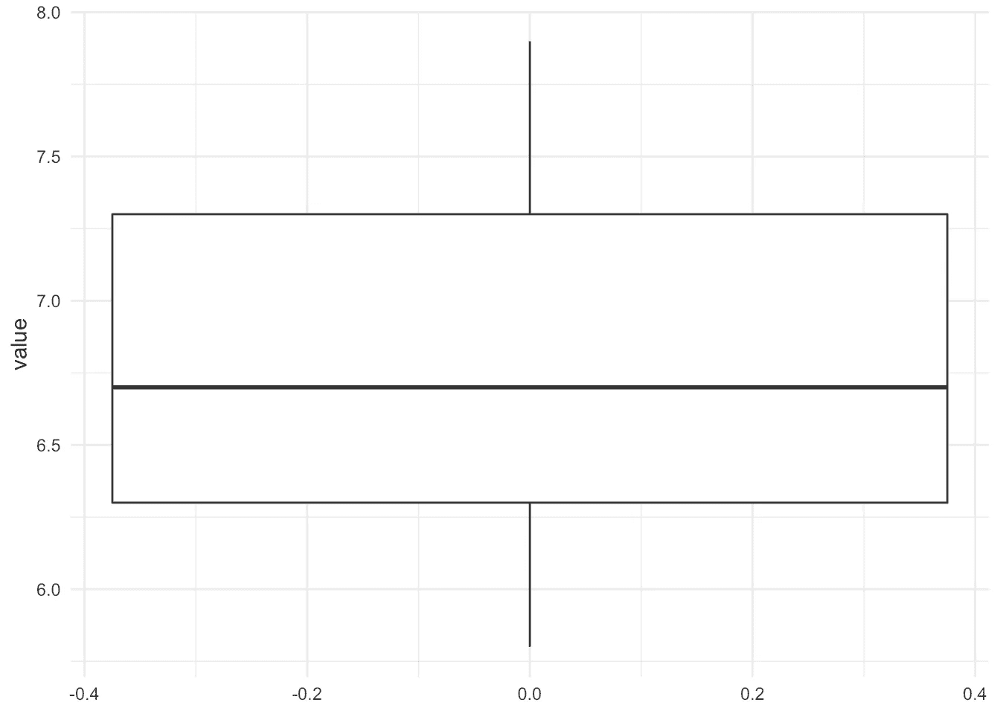

# 如何手动执行一个样本 t 检验，并在一个均值上进行 R:检验

> 原文：<https://towardsdatascience.com/how-to-perform-a-one-sample-t-test-by-hand-and-in-r-test-on-one-mean-70f867c4aa1?source=collection_archive---------18----------------------->

## **一个样本 t 检验用于确定测量变量的平均值是否不同于规定值。**


照片由 [Helloquence](https://unsplash.com/@helloquence?utm_source=medium&utm_medium=referral)

# 介绍

答在写了一篇关于[学生对两个样本](https://www.statsandr.com/blog/student-s-t-test-in-r-and-by-hand-how-to-compare-two-groups-under-different-scenarios/)(独立和配对样本)进行 t 检验的文章后，我认为是时候详细解释如何手工和以 r

单样本 t 检验是推断统计学的重要组成部分(可能是学生学习的第一个统计检验之一)。提醒一下，与[描述性统计](https://www.statsandr.com/blog/descriptive-statistics-by-hand/)不同，推断统计是统计学的一个分支，旨在根据一个或两个[总体](https://www.statsandr.com/blog/what-is-the-difference-between-population-and-sample/)的子集(或两个)得出关于该总体的结论(称为样本)。换句话说，我们首先从总体中随机收集一组观察值，然后计算一些测量值，以便将通过样本发现的信息推广到总体。

在这种情况下，**单样本 t 检验用于确定测量变量的平均值是否不同于指定值**(例如信念或理论预期)。它的工作原理如下:如果样本的均值与指定值(零假设下的值)相差太远，则认为总体的均值与期望的不同。相反，如果样本的均值接近规定值，我们就不能拒绝总体均值等于期望值的假设。

像学生对两个样本的 t 检验和 [ANOVA](https://www.statsandr.com/blog/anova-in-r/) (对 3 个或 3 个以上样本)一样，单样本 t 检验也有不同的版本。幸运的是，这个测试只有两个不同的版本(学生对两个样本的 t 检验有 5 个版本！).一个样本 t 检验的两个版本的区别在于，当总体的方差(不是样本的方差！)是已知的，当总体的方差未知时使用另一个版本。

在本文中，我将首先一步一步地详细说明如何手工执行单样本 t-test 的两个版本。为了说明和方便起见，将对一小组观察值进行分析。然后，我将展示如何用完全相同的数据在 R 中执行这个测试，以便验证手工发现的结果。还将介绍假设检验背后的推理、p 值和结果的解释以及该检验的假设。

请注意，本文的目的是展示如何手动和在 R 中计算单样本 t 检验，因此我们避免测试假设，并假设所有假设都满足本练习。为了完整起见，我们仍然提到假设以及如何测试它们。感兴趣的读者可以看看文章的[结尾，了解更多关于这些假设的信息。](https://www.statsandr.com/blog/how-to-perform-a-one-sample-t-test-by-hand-and-in-r-test-on-one-mean/#assumptions)

# 无效假设和替代假设

在开始手动计算单样本 t 检验之前，让我们回顾一下该检验的无效假设和替代假设:

*   H0: μ=μ0
*   H1:μ≦μ0

其中μ是总体平均值，μ0 是总体平均值的已知值或**假设值**。

这是在一般情况下，我们只想确定总体平均值与假设值相比是否**不同**(就因变量而言)。在这个意义上，我们没有关于总体均值大于或小于假设值的先验信念。这种类型的测试被称为**双边**或双边测试。

如果我们对总体均值大于或小于假设值有一些先验信念，单样本 t 检验也允许检验以下假设:

*   H0: μ=μ0
*   H1: μ>μ0

或者

*   H0: μ=μ0
*   H1: μ

In the first case, we want to test if the population mean is significantly larger than the hypothesized value, while in the latter case, we want to test if the population mean is significantly smaller than the hypothesized value. This type of test is referred as a **单边**或单边测试。

# 假设检验

在统计学中，许多统计检验是以假设检验的形式进行的。假设检验用于根据手头的数据(即样本)确定某个信念是否为真(似是而非)。大多数假设检验可以归结为以下 4 个步骤: [1](https://www.statsandr.com/blog/how-to-perform-a-one-sample-t-test-by-hand-and-in-r-test-on-one-mean/#fn1)

1.  陈述无效假设和替代假设。
2.  计算测试统计量，表示为 t-stat。计算检验统计量的公式在不同版本的单样本 t 检验中有所不同，但它们具有相同的结构。请参见下面的场景 1 和场景 2，了解不同的公式。
3.  给定测试的理论统计分布、分布参数和显著性水平α，找出临界值。对于一个样本 t-检验的两个版本，它要么是正态分布，要么是学生的 t 分布( *t* 表示学生分布， *z* 表示正态分布)。
4.  通过比较 t-stat(在步骤 2 中找到)得出结论。)与临界值(在步骤中找到。3).如果 t-stat 位于拒绝区域(由临界值和测试方向决定)，我们拒绝零假设，否则我们不拒绝零假设。这两个选项(拒绝或不拒绝零假设)是仅有的两个可能的解决方案，我们从不“接受”一个假设。总是根据最初的问题来解释决定也是一个好的做法。

# 一个样本 t 检验的两个版本

一个样本的 t 检验有两个版本，取决于总体的方差(不是样本的方差！)已知或未知。这个标准相当简单，我们要么知道总体的方差，要么不知道。无法计算总体的方差，因为如果您可以计算总体的方差，这意味着您拥有整个总体的数据，那么就没有必要再进行假设检验了…

所以总体的方差要么在语句中给出(在那种情况下使用它们)，要么没有关于方差的信息，在那种情况下，假设方差是未知的。实际上，总体的方差大部分时间是未知的。然而，在假设检验的 4 个步骤之后的下一节中，我们仍然说明了如何手工和在 R 中进行这两个版本的检验。

# 如何手工计算单样本 t 检验？

请注意，这些数据是人为的，并不代表任何真实的变量。此外，提醒可能满足也可能不满足假设。本文的重点是详细说明如何手工和在 R 中计算不同版本的测试，所以所有的假设都被假定为满足。此外，假设所有测试的显著性水平α=5%。

如果你对手工应用这些测试感兴趣，而不需要自己做计算，这里有一个[闪亮的应用程序](https://www.statsandr.com/blog/a-shiny-app-for-inferential-statistics-by-hand)可以帮你做。你只需要输入数据，并通过侧边栏菜单选择合适的测试版本。还有一个图形表示，帮助您可视化测试统计和拒绝区域。希望你会觉得有用！

# 场景 1:总体方差已知

对于第一个场景，假设下面的数据。此外，假设总体方差等于 1，并且我们想要测试总体均值是否不同于 0。



所以我们有:

*   5 次观察:n=5
*   样本的平均值:0.56
*   总体方差:1
*   μ0=0

按照假设检验的 4 个步骤，我们有:

1.  H0:μ=0，H1:μ≠0。(≠因为要检验总体均值是否不同于 0，所以在检验中不强加方向。)
2.  测试统计:



1.  临界值:z(α/2)= z(0.025)= 1.96(如果你很难找到临界值，请参见[如何阅读统计表](https://www.statsandr.com/blog/a-guide-on-how-to-read-statistical-tables)的指南)
2.  结论:因此，拒绝区域从∞到-1.96 和从 1.96 到+∞。检验统计量在拒绝区域之外，所以我们不拒绝零假设 H0。就最初的问题而言:在 5%的显著性水平上，我们不排斥总体均值等于 0 的假设，或者数据中没有足够的证据可以得出总体均值不同于 0 的结论。

# 情景 2:总体的方差未知

对于第二种情况，假设下面的数据。此外，假设总体中的方差是未知的，并且我们想要测试总体均值是否大于 5。



所以我们有:

*   5 次观察:n=5
*   样本的平均值:6.8
*   样本的标准偏差:s=0.825
*   μ0=5

按照假设检验的 4 个步骤，我们有:

1.  H0:μ=5，H1:μ>5。(>因为我们要检验总体均值是否大于 5。)
2.  测试统计:



1.  临界值:t(α，n1)= t(0.05，4)=2.132(如果您很难找到临界值，请参见关于如何阅读统计表的指南
2.  结论:拒绝区域因此从 2.132 到+∞。检验统计量位于拒绝区域内，因此我们拒绝零假设 H0。就最初的问题而言:在 5%的显著性水平上，我们得出总体均值大于 5 的结论。

这就总结了如何手工执行一个样本 t-检验的两个版本。在接下来的小节中，我们将详细介绍如何在 r 中执行完全相同的测试。

# 临界值的不同基础分布

您可能已经注意到，根据总体方差是已知还是未知，用于查找临界值的基本概率分布是不同的。

方差已知时(情景 1)的底层概率分布是正态分布，方差未知时(情景 2)的概率分布是学生的 t 分布。这种差异的部分原因是，当总体的方差未知时，数据中存在更多的“不确定性”，因此我们需要使用学生的 t 分布，而不是正态分布。

注意，当样本量较大时(通常是当 *n > 30* 时)，学生的 t 分布趋于正态分布。方差已知时使用正态分布，方差未知时使用学生 t 分布，这也适用于两个样本的 [t 检验](https://www.statsandr.com/blog/student-s-t-test-in-r-and-by-hand-how-to-compare-two-groups-under-different-scenarios)。

# 如何计算 R 中的单样本 t 检验？

在 R 中进行 t-tests 之前，一个好的实践是借助于[箱线图](https://www.statsandr.com/blog/descriptive-statistics-in-r/#boxplot)(或者[密度图](https://www.statsandr.com/blog/descriptive-statistics-in-r/#density-plot)，或者最终两者)来可视化数据。箱线图给出了关于样本位置的第一个指示，并且因此给出了关于零假设是否可能被拒绝的第一个指示。然而，即使箱线图或密度图能很好地显示样本的分布，只有可靠的统计测试才能证实我们的第一印象。

在数据可视化之后，我们在 R 中复制手工发现的结果。我们将看到，对于具有已知总体方差的 t-test 版本，R 中没有内置的默认函数(至少就我所知，如果我错了，请不要犹豫让我知道)。在这种情况下，编写一个函数来手动复制结果。

请注意，我们对两个场景使用了相同的数据、相同的假设和相同的问题，以便于比较手工测试和 r。

# 场景 1:总体方差已知

对于第一个场景，假设下面的数据。此外，假设总体方差等于 1，并且我们想要测试总体均值是否不同于 0。

```
dat1 <- data.frame(
  value = c(0.9, -0.8, 1.3, -0.3, 1.7)
)dat1##   value
## 1   0.9
## 2  -0.8
## 3   1.3
## 4  -0.3
## 5   1.7library(ggplot2)ggplot(dat1) +
  aes(y = value) +
  geom_boxplot() +
  theme_minimal()
```



注意，如果你想用[包](https://www.statsandr.com/blog/graphics-in-r-with-ggplot2/) `[{ggplot2}](https://www.statsandr.com/blog/graphics-in-r-with-ggplot2/)`画一个方框图而不自己写代码，你可以使用`[{esquisse}](https://www.statsandr.com/blog/rstudio-addins-or-how-to-make-your-coding-life-easier/#esquisse)` [RStudio addin](https://www.statsandr.com/blog/rstudio-addins-or-how-to-make-your-coding-life-easier/#esquisse) 。如果你喜欢默认图形，使用`boxplot()`功能:

```
boxplot(dat1$value)
```



箱线图表明样本的分布并不远离 0(假设值)，因此我们倾向于认为我们将无法拒绝总体均值等于 0 的零假设。然而，只有正式的统计测试才能证实这一观点。

由于 R 中没有使用已知总体方差来执行 t 检验的函数，因此这里有一个函数，其参数接受样本(`x`)、总体方差(`V`)、零假设下的均值(`m0`，默认为`0`)、显著性水平(`alpha`，默认为`0.05`)和备选项(`alternative`、`"two.sided"`(默认)、`"less"`或`"greater"`):

```
t.test2 <- function(x, V, m0 = 0, alpha = 0.05, alternative = "two.sided") {
  M <- mean(x)
  n <- length(x)
  sigma <- sqrt(V)
  S <- sqrt(V / n)
  statistic <- (M - m0) / S
  p <- if (alternative == "two.sided") {
    2 * pnorm(abs(statistic), lower.tail = FALSE)
  } else if (alternative == "less") {
    pnorm(statistic, lower.tail = TRUE)
  } else {
    pnorm(statistic, lower.tail = FALSE)
  }
  LCL <- (M - S * qnorm(1 - alpha / 2))
  UCL <- (M + S * qnorm(1 - alpha / 2))
  value <- list(mean = M, m0 = m0, sigma = sigma, statistic = statistic, p.value = p, LCL = LCL, UCL = UCL, alternative = alternative)
  # print(sprintf("P-value = %g",p))
  # print(sprintf("Lower %.2f%% Confidence Limit = %g",
  #               alpha, LCL))
  # print(sprintf("Upper %.2f%% Confidence Limit = %g",
  #               alpha, UCL))
  return(value)
}test <- t.test2(dat1$value,
  V = 1
)
test## $mean
## [1] 0.56
## 
## $m0
## [1] 0
## 
## $sigma
## [1] 1
## 
## $statistic
## [1] 1.252198
## 
## $p.value
## [1] 0.2104977
## 
## $LCL
## [1] -0.3165225
## 
## $UCL
## [1] 1.436523
## 
## $alternative
## [1] "two.sided"
```

上面的输出概括了执行测试所需的所有信息:测试统计量、 *p* 值、使用的备选项、样本均值、假设值和总体方差(将 R 中找到的这些结果与手工找到的结果进行比较)。

可以照常提取 *p* 值:

```
test$p.value## [1] 0.2104977
```

*p*-值为 0.21，因此在 5%的显著性水平上，我们不拒绝零假设。数据中没有足够的证据来否定总体均值等于 0 的假设。这个结果证实了我们手工发现的东西。

如果你对*p*-价值的概念不熟悉，我邀请你阅读我关于*p*-价值和显著性水平α 的[笔记。](https://www.statsandr.com/blog/student-s-t-test-in-r-and-by-hand-how-to-compare-two-groups-under-different-scenarios/#a-note-on-p-value-and-significance-level-alpha)

**总结一下**那篇文章中所说的关于*p*-值和显著性水平α:

*   如果 *p* 值小于预定的显著性水平α(通常为 5%)，那么如果 *p* 值<为 0.05，我们拒绝零假设
*   如果 *p* 值大于或等于预定的显著性水平α(通常为 5%)，那么如果 *p* 值≥ 0.05，我们不**拒绝**零假设

这毫无例外地适用于所有的统计测试。当然，无效假设和替代假设会随着测试的不同而变化。

# 情景 2:总体的方差未知

对于第二种情况，假设下面的数据。此外，假设总体中的方差是未知的，并且我们想要测试总体均值是否大于 5。

```
dat2 <- data.frame(
  value = c(7.9, 5.8, 6.3, 7.3, 6.7)
)dat2##   value
## 1   7.9
## 2   5.8
## 3   6.3
## 4   7.3
## 5   6.7ggplot(dat2) +
  aes(y = value) +
  geom_boxplot() +
  theme_minimal()
```



与前面的场景不同，这个盒子与假设值 5 相差甚远。从这个箱线图中，我们可以预期该检验会拒绝总体均值等于 5 的零假设。尽管如此，只有正式的统计测试才能证实这一预期。

R 里面有一个函数，简单来说就是`t.test()`函数。这个版本的测试实际上是一个样本的“标准”t 检验。请注意，在我们的例子中，替代假设是 H1:μ > 5，因此我们需要将参数`mu = 5`和`alternative = "greater"`添加到函数中，因为默认参数是`mu = 0`和双边测试:

```
test <- t.test(dat2$value,
  mu = 5,
  alternative = "greater"
)test## 
##  One Sample t-test
## 
## data:  dat2$value
## t = 4.8809, df = 4, p-value = 0.004078
## alternative hypothesis: true mean is greater than 5
## 95 percent confidence interval:
##  6.013814      Inf
## sample estimates:
## mean of x 
##       6.8
```

上面的输出概括了执行测试所需的所有信息:测试的名称、测试统计、自由度、 *p* 值、使用的替代值、假设值和样本均值(将 R 中的结果与手工得到的结果进行比较)。

可以照常提取*p*-值:

```
test$p.value## [1] 0.004077555
```

p 值为 0.004，因此在 5%的显著性水平上，我们拒绝零假设。

与第一种情况不同，这种情况下的 p 值低于 5%，因此我们拒绝零假设。在 5%的显著性水平上，我们可以得出总体均值显著大于 5 的结论。这个结果证实了我们手工发现的东西。

# 置信区间

注意，置信区间可以用`$conf.int`提取:

```
test$conf.int## [1] 6.013814      Inf
## attr(,"conf.level")
## [1] 0.95
```

可以看到总体均值的 95%置信区间为[6.01；∞]，意味着在显著性水平α=5%时，只要假设值μ0 低于 6.01，我们就拒绝零假设，否则不能拒绝零假设。

# 假设

对于许多统计测试，为了能够解释结果，需要满足一些假设。当一个或几个假设不满足时，尽管技术上可以进行这些测试，但解释结果是不正确的。以下是单样本 t 检验的假设以及如何检验它们:

*   从总人口中有代表性的和随机选择的部分收集的数据应该是相互独立的。
*   因变量(即测量变量)必须是连续的。
*   正态性:在小样本情况下(通常为 n < 30), observations should follow a [**正态分布**](https://www.statsandr.com/blog/do-my-data-follow-a-normal-distribution-a-note-on-the-most-widely-used-distribution-and-how-to-test-for-normality-in-r/) )。正态性假设可以通过直方图和 QQ 图进行直观测试，和/或通过夏皮罗-维尔克或科尔莫戈罗夫-斯米尔诺夫测试等正态性测试进行正式测试(参见更多关于正态性假设以及如何测试的信息[这里](https://www.statsandr.com/blog/do-my-data-follow-a-normal-distribution-a-note-on-the-most-widely-used-distribution-and-how-to-test-for-normality-in-r/#how-to-test-the-normality-assumption))。可以对观察值应用一些变换，例如取对数、平方根或 Box-Cox 变换，以变换数据，使其更好地符合正态分布。对于大样本量(n ≥ 30)，**不需要数据的正态性**(这是一个常见的误解！).根据[中心极限定理](https://en.wikipedia.org/wiki/Central_limit_theorem)，即使数据不是正态分布，大样本的样本均值通常也是正态分布的近似值。

感谢阅读。我希望这篇文章能帮助你理解不同版本的样本 t-test 是如何工作的，以及如何在 r 中手动执行它们。如果你感兴趣，这里有一个[闪亮的应用程序](https://www.statsandr.com/blog/a-shiny-app-for-inferential-statistics-by-hand/)可以轻松地手动执行这些测试(你只需要输入你的数据，并通过侧边栏菜单选择合适的测试版本)。此外，如果你想知道如何计算学生的 t 检验，请阅读[这篇文章](https://www.statsandr.com/blog/student-s-t-test-in-r-and-by-hand-how-to-compare-two-groups-under-different-scenarios/)，但这次是针对两个样本——为了比较两个相依或独立的组——或者如果你想使用方差分析比较 3 个或更多组，请阅读[这篇文章](https://www.statsandr.com/blog/anova-in-r/)。

和往常一样，如果您有与本文主题相关的问题或建议，请将其添加为评论，以便其他读者可以从讨论中受益。

**相关文章:**

*   [每个数据科学家都应该知道的概率中的 9 个概念和公式](https://www.statsandr.com/blog/the-9-concepts-and-formulas-in-probability-that-every-data-scientist-should-know/)
*   [学生的 R 和手工 t 检验:如何在不同场景下比较两组](https://www.statsandr.com/blog/student-s-t-test-in-r-and-by-hand-how-to-compare-two-groups-under-different-scenarios/)
*   [R 中的相关图:如何突出显示数据集中最相关的变量](https://www.statsandr.com/blog/correlogram-in-r-how-to-highlight-the-most-correlated-variables-in-a-dataset/)
*   [R markdown 入门](https://www.statsandr.com/blog/getting-started-in-r-markdown/)
*   [聚类分析完全指南:k-means 和手动和 in R 系统聚类](https://www.statsandr.com/blog/clustering-analysis-k-means-and-hierarchical-clustering-by-hand-and-in-r/)

1.  这至少是关于参数假设检验的情况。参数测试意味着它是基于理论统计分布，这取决于一些定义的参数。在单样本 t-检验的情况下，它是基于具有单个参数的学生 t 分布、自由度(df = n1，其中 n 是样本大小)或正态分布。 [↩](https://www.statsandr.com/blog/how-to-perform-a-one-sample-t-test-by-hand-and-in-r-test-on-one-mean/#fnref1)

*原载于 2020 年 3 月 9 日*[*【https://statsandr.com】*](https://statsandr.com/blog/how-to-perform-a-one-sample-t-test-by-hand-and-in-r-test-on-one-mean/)*。*