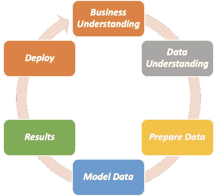
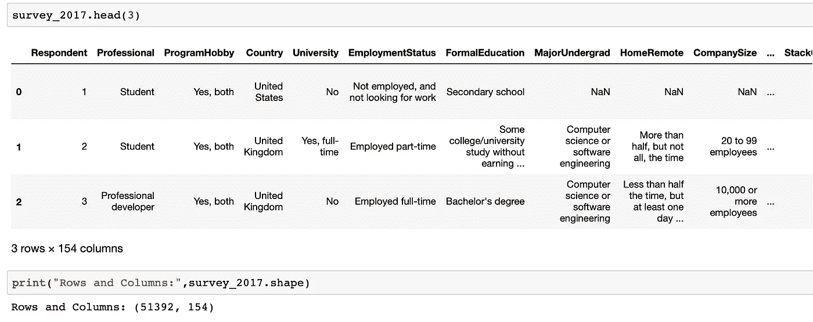
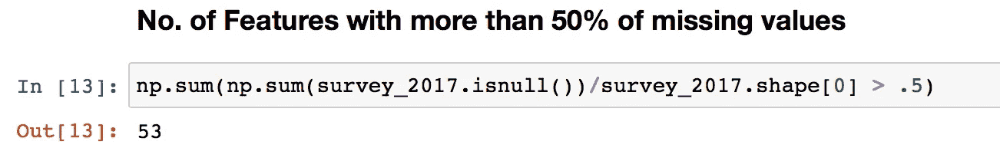
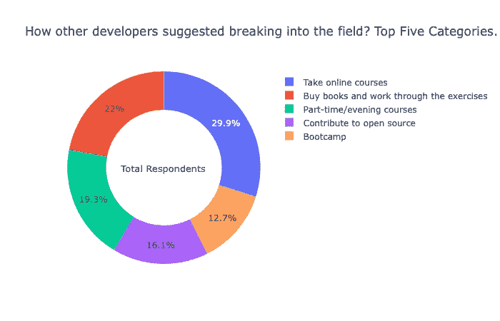
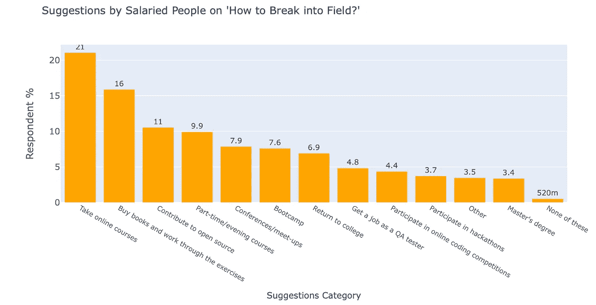
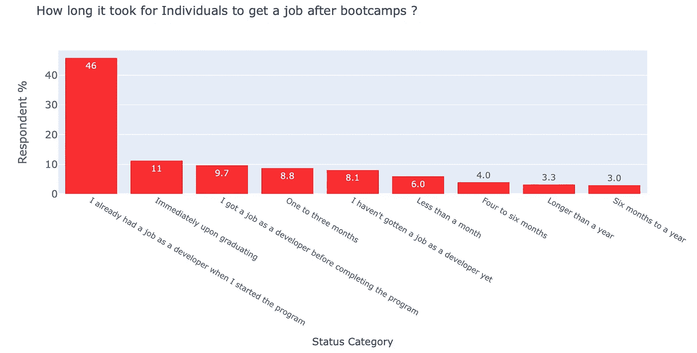

# 如何使用 CRISP-DM 方法进行数据分析？

> 原文：<https://towardsdatascience.com/how-to-perform-data-analysis-using-the-crisp-dm-approach-201708f220b2?source=collection_archive---------12----------------------->

## CRISP-DM 代表数据挖掘的跨行业标准流程。

费尔南多·巴切斯基在 [Unsplash](https://unsplash.com/s/photos/programming?utm_source=unsplash&utm_medium=referral&utm_content=creditCopyText) 上拍摄的照片

*首先让我们把这个想法搞清楚，如果你上过一些数据科学领域的在线课程，读过一些相关的书籍，会编码，或者对如何探索/分析数据集有足够的了解，那么你就是一名数据科学家，我会把你称为数据科学家。所以当我提到数据科学家时，你知道我说的是你，而不是两年后的你。*

# 介绍

对于数据科学家来说，以一种非常随意的方式花费大部分时间探索和清理数据是非常常见的，并且不遵循一个明确的指导方针，尽管投入时间让您的代码保持在[干燥(不要重复)](https://en.wikipedia.org/wiki/Don%27t_repeat_yourself)指导方针中是有帮助的，并且遵循一个过程以保持头脑中的大图，这就是 CRISP-DM 出现的地方。

CRISP-DM 流程可以使您的项目简化、易于理解，并为部署做好准备。

*为了让 CRISP-DM 流程更容易理解，我使用了对* [*StackOverflow 开发者调查 2017*](https://insights.stackoverflow.com/survey/2017) *数据集进行的数据分析的见解。*

# CRISP-DM 阶段:

CRISP-DM 的阶段

CRISP-DM 阶段非常灵活，并不一定要按照所示的顺序进行。例如，在对数据建模后，您对数据的理解可能会发生变化。任何新的业务理解都可以改进您准备数据的方式，因此您可能需要采用各种策略来处理丢失的数据或您之前面临的任何其他数据问题。

*这些阶段是不言自明的，但是我想在 StackOverflow 分析中展示它们的价值。*

# 商业理解

一般来说，作为业务问题解决的一部分，我们需要一些问题的结果。我将从 [StackOverflow 开发者调查 2017](https://insights.stackoverflow.com/survey/2017) 数据集中回答以下 3 个问题，以更好地解释这一流程。

1.  其他开发者是如何建议进入这个领域的(从事什么教育)？
2.  个人的哪些因素对工资有影响？
3.  *帮助个人进入开发人员角色的训练营情况如何？*

这些问题向数据科学家提出了一个问题陈述，他们需要利用数据来提出见解，以便业务用户可以做出决策。

# 数据理解

这个舞台对我的挑战最大。对我来说，正确的选择是对整个数据集进行一次整体检查，并为我勾勒出一条路径，以最大限度地发挥数据的潜力来解决公布的问题。

您可以选择这样做，或者从几个基本步骤开始学习数据:

1.  *数据量有多大？有多少行和多少列？*
2.  *有多少数据丢失了？*
3.  有多少列包含文本、数值或分类值？(用数值以外的值转换数据需要更多时间。)
4.  *如果所有列包含不相关的信息，可以删除哪些列？*

….以及更多类似的问题。

测量数据:数据视图

调查数据:缺失数据统计- 53 列缺失超过 50%的数据

# 准备数据

数据科学家一般花 80%的时间准备数据。我已经执行了以下步骤来做数据准备。

1.  输入缺失值
2.  数据争论
3.  数据转换

我可以做更多的事情来转换数据，但是我们必须从某个地方开始，然后我们总是可以迭代。尽量遵循[干](https://en.wikipedia.org/wiki/Don%27t_repeat_yourself)的原则。

# 模型数据

最后，我们使用像 scikit-learn 这样的机器学习库来训练一个模型，以选择一个合适的算法，并建立一个可以使用验证集进行预测的模型，在您期望的精度内。

一旦我们达到可接受预测精度，我们就可以最终确定部署的模型。目前，我没有在这个数据集中使用预测分析进行演示。

# 结果

沟通是数据科学家角色中非常重要的一部分。此时，您通常会使用一些可视化或统计数据来分享您的分析结果。有时，您可能会根据结果更改建模算法或数据准备技术。让我们跳到我在 [StackOverflow 开发者调查 2017](https://insights.stackoverflow.com/survey/2017) 上做的 EDA 的结果。

> **其他开发者是如何建议打入该领域的(追求什么教育)？**

调查结果

近 30%的开发人员推荐参加在线课程是成为开发人员的一种方式，只有 12.7%的开发人员认为训练营是进入 IT 领域的一种方式。

> **个人的哪些因素对工资有贡献？**

工薪阶层的建议

已经就业的开发人员中，21%推荐参加在线课程是成为开发人员的最佳解决方案，只有 7.6%的开发人员考虑进入 IT 领域。

> 帮助个人进入开发人员角色的训练营是什么样的？

训练营经验持有者的就业状况

*一般来说，我们认为训练营是为那些失业者和寻找开发者工作的人准备的。这些统计数据显示，46%的 Bootcamp 毕业生已经被开发人员聘用。36.5%的人在毕业后的 3 个月内找到了开发人员的工作。*

# 部署

部署可以通过将您的方法投入生产或使用您的结果说服公司内的其他人根据结果采取行动来实现。

一旦你到了这个阶段，你可能会认为“*我的工作已经完成了，我现在需要做的就是将这段代码投入生产，然后用“*结束它。虽然，它不是那么直截了当，但也不是那么复杂。

如果您已经为自己进行了分析，那么您的工作确实已经完成，但是如果您是一名为公司/团队工作的数据科学家，您需要遵循更多的步骤来将代码部署到生产中。例如以下步骤:

1.  将您的代码转换成可执行文件。py 脚本。朱庇特笔记本只是用于分析目的。只需逐行复制您的代码，并将其粘贴到一个文本文件中，然后用扩展名保存。py”。
2.  例如，从代码中删除静态变量；准确性阈值、输入文件名、文件目录或路径，在运行时将这些值作为参数发送。保持你的参数列表在一个可管理的范围内。
3.  简单地按照 [PEP 8 风格指南](https://www.python.org/dev/peps/pep-0008/)在 python 脚本中添加注释形式的指令。这有助于其他开发人员理解您的代码，并在必要时做出更改。
4.  您可以选择为您的函数创建单独的 python 脚本，然后将这些脚本作为库导入，就像我们导入 pandas、NumPy 等一样。

一旦您的代码准备好部署，请始终检查目标 python 环境是否安装了您的数据科学库。如果没有，您需要创建一个虚拟环境，并在部署代码之前安装所有必需的库。

如果你想让你的代码按计划运行，那么你可能需要一个像 Autosys，Cron 或者基于 Windows 的调度器这样的调度器。

# 结论

在本文中，我们研究了 CRISP-DM 如何在进行数据分析或训练机器学习模型时帮助维护更大的画面。来自[stack overflow 2017 年开发者调查](https://insights.stackoverflow.com/survey/2017)支持的见解，了解 CRISP-DM 流程的理念。

> 本文是 Udacity 数据科学家纳米学位项目的一部分。要了解更多关于这个分析的信息，请点击这里的链接。

*这是我第一篇关于媒介的文章，希望你喜欢。感谢阅读。*