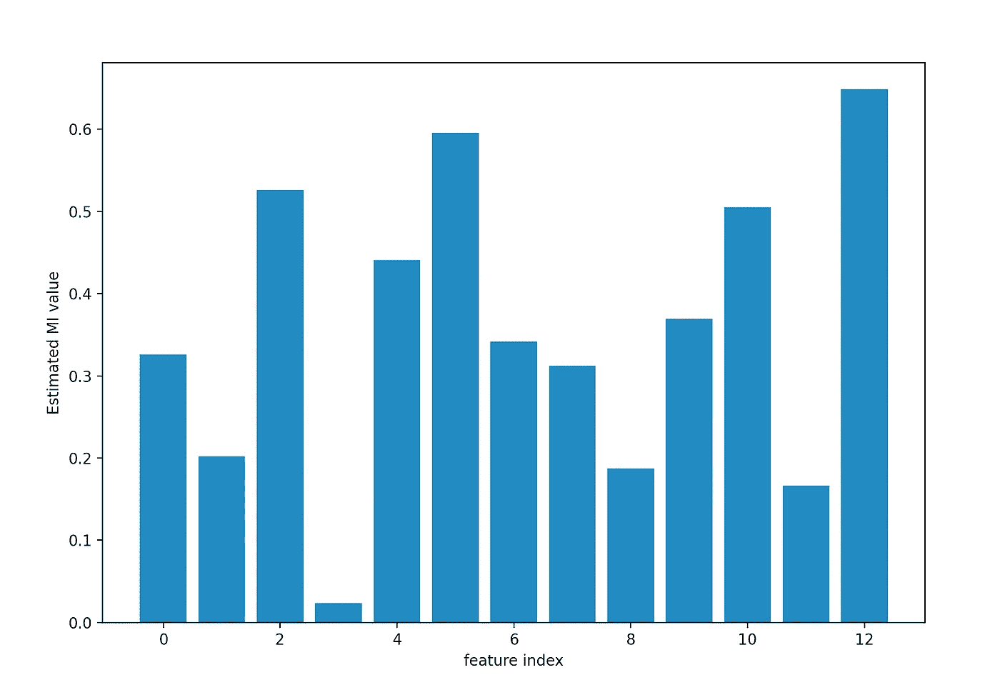

# 如何对回归问题进行特征选择

> 原文：<https://towardsdatascience.com/how-to-perform-feature-selection-for-regression-problems-c928e527bbfa?source=collection_archive---------8----------------------->

## 在本文中，我将解释什么是特征选择，以及在用 Python 训练回归模型之前如何进行特征选择。


# 1.介绍

## 什么是**特征选择**？

> **特征选择**是从**输入** **变量**中选择与目标变量(我们希望预测的)最相关的**子集**(所有可用变量中的一部分)的过程。

**目标变量**这里的是指我们希望**预测**的**变量**。

对于本文，我们将假设我们只有数字输入变量和回归预测建模的数字目标。假设，我们可以很容易地估计每个**输入**变量和**目标**变量之间的**关系**。这种关系可以通过计算诸如相关值的度量来建立。

如果你想在交互式路线图和活跃的学习社区的支持下自学数据科学，看看这个资源:[https://aigents.co/learn](https://aigents.co/learn)

# 2.主要的数值特征选择方法

可用于数字输入数据和数字目标变量的两种最著名的特征选择技术如下:

*   相关性(皮尔森、斯皮尔曼)
*   互信息(MI，归一化 MI)

相关性是衡量两个变量如何一起变化的指标。最广泛使用的相关性度量是皮尔逊相关性，它假设每个变量为高斯分布，并检测数值变量之间的线性关系。

这分两步完成:

1.  计算每个回归变量与目标之间的**相关性**，即((X[:，i] — mean(X[:，I)))*(y—mean _ y))/(STD(X[:，I))* STD(y))。
2.  它被转换成一个 **F 值**，然后被转换成一个 **p 值**。

**互信息**源于信息论领域。其思想是应用信息增益(通常在决策树的构造中使用)来执行特征选择。在给定一个变量的已知值的情况下，计算两个变量和测量之间的互信息，作为一个变量的不确定性的减少。

# 3.数据集

我们将使用**波斯顿** **房屋** - **价格** **数据集**。该数据集包含由美国人口普查局收集的有关马萨诸塞州波士顿地区住房的信息。数据集由以下变量组成:

1.  CRIM——城镇人均犯罪率
2.  ZN——面积超过 25，000 平方英尺的住宅用地比例
3.  印度河——每个城镇非零售商业用地的比例。
4.  CHAS——查尔斯河虚拟变量(1 如果区域边界为河流；否则为 0)
5.  NOX——氮氧化物浓度(百万分之一)
6.  RM——每个住宅的平均房间数
7.  年龄——1940 年之前建造的业主自用单元的比例
8.  到五个波士顿就业中心的 DIS 加权距离
9.  RAD——放射状公路可达性指数
10.  税收—每 10，000 美元的全价值财产税税率
11.  pt ratio——按城镇分列的学生-教师比率
12.  B — 1000(Bk — 0.63)，其中 Bk 是按城镇划分的黑人比例
13.  LSTAT —人口中地位较低的百分比
14.  MEDV——以千美元为单位的自有住房的中值

# 4.Python 代码和工作示例

让我们加载数据集并将其分为训练集(70%)和测试集(30%)。

```
from sklearn.datasets import load_boston
from sklearn.model_selection import train_test_split
from sklearn.feature_selection import SelectKBest
from sklearn.feature_selection import f_regression
import matplotlib.pyplot as plt
from sklearn.feature_selection import mutual_info_regression# load the data
X, y = load_boston(return_X_y=True)# split into train and test sets
X_train, X_test, y_train, y_test = train_test_split(X, y, test_size=0.30, random_state=0)
```

我们将使用众所周知的 scikit-learn 机器库。

## 情况 1:使用相关性度量的特征选择

对于**相关性统计**，我们将使用 [f_regression()函数](https://scikit-learn.org/stable/modules/generated/sklearn.feature_selection.f_regression.html)。该功能可用于特征选择策略，如通过[选择最佳类别](https://scikit-learn.org/stable/modules/generated/sklearn.feature_selection.SelectKBest.html)选择前 k 个最相关的特征(最大值)。

```
# feature selection
f_selector = SelectKBest(score_func=f_regression, k='all')# learn relationship from training data
f_selector.fit(X_train, y_train)# transform train input data
X_train_fs = f_selector.transform(X_train)# transform test input data
X_test_fs = f_selector.transform(X_test)# Plot the scores for the features
plt.bar([i for i in range(len(f_selector.scores_))], f_selector.scores_)plt.xlabel("feature index")
plt.ylabel("F-value (transformed from the correlation values)")
plt.show()
```

**提醒**:对于关联统计情况:

1.  计算每个回归变量与目标之间的相关性，即((X[:，i] — mean(X[:，I))*(y—mean _ y))/(STD(X[:，I))* STD(y))。
2.  它被转换成一个 **F 分数**，然后被转换成一个 **p 值**。


特征重要性图

**上图显示，特性 6 和 13 比其他特性更重要。y 轴表示根据相关值估计的 F 值。**

## 情况 2:使用互信息度量的特征选择

scikit-learn 机器学习库通过 [mutual_info_regression()函数](https://scikit-learn.org/stable/modules/generated/sklearn.feature_selection.mutual_info_regression.html)为带有数字输入和输出变量的特征选择提供了**互信息**的实现。

```
# feature selection
f_selector = SelectKBest(score_func=mutual_info_regression, k='all')# learn relationship from training data
f_selector.fit(X_train, y_train)# transform train input data
X_train_fs = f_selector.transform(X_train)# transform test input data
X_test_fs = f_selector.transform(X_test)# Plot the scores for the features
plt.bar([i for i in range(len(f_selector.scores_))], f_selector.scores_)plt.xlabel("feature index")
plt.ylabel("Estimated MI value")
plt.show()
```



特征重要性图

**y 轴表示每个特征和目标变量之间的估计互信息。与相关性特征选择方法相比，我们可以清楚地看到更多的特征被评分为相关。这可能是因为数据集中可能存在统计噪声。**

# 5.结论

在这篇文章中，我提供了两种方法来执行特性选择。**特征选择**是选择与目标变量最相关的输入变量子集(所有可用变量中的一部分)的程序。**目标变量**这里的是指我们希望**预测**的**变量**。

使用**相关性**度量或者**相互** **信息**度量，我们可以很容易地估计每个**输入**变量和**目标**变量之间的**关系**。

**相关性** **vs** **互** **信息:**与相关性特征选择方法相比，我们可以清楚地看到更多的特征被评分为相关。这可能是因为数据集中可能存在统计噪声。

## 您可能还喜欢:

[](/lstm-time-series-forecasting-predicting-stock-prices-using-an-lstm-model-6223e9644a2f) [## LSTM 时间序列预测:使用 LSTM 模型预测股票价格

### 在这篇文章中，我将向你展示如何使用预测 LSTM 模型来预测股票价格

towardsdatascience.com](/lstm-time-series-forecasting-predicting-stock-prices-using-an-lstm-model-6223e9644a2f) [](/time-series-forecasting-predicting-stock-prices-using-an-arima-model-2e3b3080bd70) [## 时间序列预测:使用 ARIMA 模型预测股票价格

### 在这篇文章中，我将向你展示如何使用预测 ARIMA 模型来预测特斯拉的股票价格

towardsdatascience.com](/time-series-forecasting-predicting-stock-prices-using-an-arima-model-2e3b3080bd70) 

# 敬请关注并支持这一努力

如果你喜欢这篇文章，并且觉得它有用，那么**关注**我就可以看到我所有的新帖子。

有问题吗？把它们作为评论贴出来，我会尽快回复。

# 最新帖子

[](https://medium.com/@seralouk/the-best-free-data-science-resources-free-books-online-courses-9c4a2df194e5) [## 最佳免费数据科学资源:免费书籍和在线课程

### 最有用的免费书籍和在线课程，适合想了解更多数据科学知识的人。

medium.com](https://medium.com/@seralouk/the-best-free-data-science-resources-free-books-online-courses-9c4a2df194e5) [](/roc-curve-explained-using-a-covid-19-hypothetical-example-binary-multi-class-classification-bab188ea869c) [## 用新冠肺炎假设的例子解释 ROC 曲线:二分类和多分类…

### 在这篇文章中，我清楚地解释了什么是 ROC 曲线以及如何阅读它。我用一个新冠肺炎的例子来说明我的观点，我…

towardsdatascience.com](/roc-curve-explained-using-a-covid-19-hypothetical-example-binary-multi-class-classification-bab188ea869c) [](/support-vector-machines-svm-clearly-explained-a-python-tutorial-for-classification-problems-29c539f3ad8) [## 支持向量机(SVM)解释清楚:分类问题的 python 教程…

### 在这篇文章中，我解释了支持向量机的核心，为什么以及如何使用它们。此外，我还展示了如何绘制支持…

towardsdatascience.com](/support-vector-machines-svm-clearly-explained-a-python-tutorial-for-classification-problems-29c539f3ad8) [](/pca-clearly-explained-how-when-why-to-use-it-and-feature-importance-a-guide-in-python-7c274582c37e) [## PCA 清楚地解释了——如何、何时、为什么使用它以及特性的重要性:Python 指南

### 在这篇文章中，我解释了什么是 PCA，何时以及为什么使用它，以及如何使用 scikit-learn 在 Python 中实现它。还有…

towardsdatascience.com](/pca-clearly-explained-how-when-why-to-use-it-and-feature-importance-a-guide-in-python-7c274582c37e) [](/everything-you-need-to-know-about-min-max-normalization-in-python-b79592732b79) [## 关于 Python 中的最小-最大规范化，您需要知道的一切

### 在这篇文章中，我将解释什么是最小-最大缩放，什么时候使用它，以及如何使用 scikit 在 Python 中实现它

towardsdatascience.com](/everything-you-need-to-know-about-min-max-normalization-in-python-b79592732b79) [](/how-and-why-to-standardize-your-data-996926c2c832) [## Scikit-Learn 的标准定标器如何工作

### 在这篇文章中，我将解释为什么以及如何使用 scikit-learn 应用标准化

towardsdatascience.com](/how-and-why-to-standardize-your-data-996926c2c832) 

# 和我联系

*   **LinkedIn**:【https://www.linkedin.com/in/serafeim-loukas/ 
*   https://www.researchgate.net/profile/Serafeim_Loukas**研究之门**:[](https://www.researchgate.net/profile/Serafeim_Loukas)
*   **https://people.epfl.ch/serafeim.loukas**EPFL**简介**:
*   **堆栈** **溢出**:[https://stackoverflow.com/users/5025009/seralouk](https://stackoverflow.com/users/5025009/seralouk)