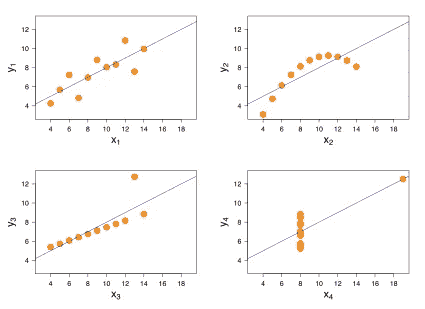
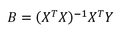

# 如何满怀信心地执行线性回归

> 原文：<https://towardsdatascience.com/how-to-perform-linear-regression-with-confidence-5ed8fc0bb9fe?source=collection_archive---------11----------------------->

## 它的工作原理和失败之处

由 [Unsplash](https://unsplash.com?utm_source=medium&utm_medium=referral) 上 [Greg Rakozy](https://unsplash.com/@grakozy?utm_source=medium&utm_medium=referral) 拍摄的照片

线性回归可能是建模关系最广泛使用的方法之一。它的主要吸引力在于它很容易向非技术读者解释，并且假设关系是线性的。

在这篇文章中，我们将解释线性回归的理论和假设，并实现产生类似于[scipy . stats . Lin regression](https://docs.scipy.org/doc/scipy-0.14.0/reference/generated/scipy.stats.linregress.html)结果的代码。

代码用 Python 3.x 编写，整个工作流程可以在这里找到:[*https://github . com/NadimKawwa/Statistics/blob/master/linear _ regression . ipynb*](https://github.com/NadimKawwa/Statistics/blob/master/linear_regression.ipynb)

# 假设

以下是关于[预测变量](https://methods.sagepub.com/reference/encyc-of-research-design/n329.xml)、[响应变量](https://www.quora.com/What-is-a-response-variable-in-statistics)以及它们之间关系的假设:

*   弱[外生性](https://en.wikipedia.org/wiki/Exogeny):我们假设预测变量是无误差的，例如没有现场测量误差。
*   线性:响应变量的平均值是参数和预测变量的线性组合。
*   [同方差](https://en.wikipedia.org/wiki/Homoscedasticity):响应变量的不同值在其误差中具有相同的方差(方差齐性)。
*   误差的独立性:响应变量的误差彼此不相关。
*   缺乏完美的多重共线性:对于最小二乘估计方法，设计矩阵 X 必须具有[满秩](https://en.wikipedia.org/wiki/Rank_(linear_algebra)#Main_definitions)，否则可能意味着一个预测变量被给出两次。

# 最小二乘法

## 理论

在实践中，有许多问题，其中一组配对数据给出回归是线性的指示，其中我们不知道所考虑的随机变量的[联合分布](https://en.wikipedia.org/wiki/Joint_probability_distribution)。

最小二乘法的[法是一种近似线性关系的曲线拟合方法。](https://en.wikipedia.org/wiki/Least_squares)

请看下表，该表显示了随机抽取的 10 名学生的考试成绩和学习时间:

在下图中，我们展示了学习时间与考试分数的分散情况:

我们得到的印象是，直线提供了相当好的拟合，因此估计的回归线给出如下:

假设我们拟合了一条任意的线，这条线很好地估计了线性关系。我们如何确定拟合优度？设**ei表示一个点到估计回归线的垂直偏差。因此，我们希望最小化关于 ***α*** 和 ***β*** 的量 q:**

我们不详细讨论 q 相对于α和β的部分微分，而是直接跳到解，并引入以下符号来简化未来的计算:

给定样本数据(xi，易)，最小二乘系数α和β为:

## 履行

在下面的代码中，我们实现了这个简单的线性回归。我们首先定义一个助手函数 getPairStats 来计算 Sxx、Syy 和 Sxy:

实施线性回归现在变得简单明了:

为了更深入地了解我们正在做的事情，请考虑下面的图表，其中显示了拟合直线和垂直偏差的结果。

# 假设检验

## 理论

在正态回归分析中，假设对于每个固定的 Xi，相应的随机变量 Yi 的条件密度是正态密度:

这样，α、β和σ对于每个 I 都是相同的。给定配对数据的随机样本，正态回归分析涉及σ和回归系数α和β的估计，以及关于这些参数的假设检验。

σ的最大似然估计由下式给出:

更多的时候，我们感兴趣的是测试斜率β。我们注意到β hat 具有正态分布，在正态回归分析的假设下，具有(N2)自由度的 t 分布的随机变量的值计算如下:

为了建立参数β的(1-α)置信区间:

## 履行

现在让我们测试以下关于学习时间与分数的假设:

*   H0: β=3
*   H1: β>3
*   设置显著性水平α=0.01

下面的函数基于上一节中的配对回归函数，如果我们没有拒绝 H0，则返回 False，否则返回 True。

参考相同的数据，我们可以为β构建 95%的置信区间:

在截距保持不变的情况下，我们的回归看起来如何？下面的图提供了一个可视化。

# 正态相关分析

## 理论

样本相关系数表示为 r，衡量两组数据 X 和 y 之间的线性关系强度。当 r=0 时，随机变量不相关。该系数计算如下:

使用辅助函数 getPairStats，计算 r 非常简单:

# 陷阱

线性回归的局限性在假设中是显而易见的。此外，我们必须记住，相关性并不意味着必然的因果关系。

[Anscombe 的四重奏](https://en.wikipedia.org/wiki/Anscombe%27s_quartet)是 11 个数据点(x，y ),它们被设计成具有几乎相同的均值、标准差和相关性。结果是相同的回归线，证明了在绘制图形之前绘制数据的必要性以及异常值的影响。

[安斯康贝的四重奏](https://en.wikipedia.org/wiki/Anscombe%27s_quartet)

另一个考虑因素是季节性，特别是对于时间序列图。对所有时间跨度使用一个斜率系数可能没有意义。

# 多元线性回归

## 理论

在实际应用中，我们将面临许多使用多个变量来逼近目标结果的情况。在这一节中，我们将简单的线性回归推广到多元线性模型。

我们可以使用矩阵符号来求解多元线性回归。设 X 是一个由给定值组成的(n，k+1)矩阵，第一列附加了常数项。y 是由 y 的观察值组成的(n，1)矩阵，即列向量。B 是由回归系数的最小二乘估计组成的(k+1，1)矩阵。

在矩阵格式中，X、Y 和 B 写为:

多元回归系数的最小二乘估计由下式给出:

## 履行

考虑使用卧室数量和浴室数量来预测房屋价格的尝试:

为了节省以后的计算时间，我们定义了一个辅助函数 calculate (X.T X)-。在下一节中，这个术语将被证明是重要的:

上面的等式在下面的紧凑函数中解释:

# 多重假设检验

对于多个系数，需要针对无效假设测试每个系数。在上面的例子中，系数 B1=15，314 意味着每间卧室在要价上增加了大约 15，000 美元。

具有(n-k-1)个自由度测试统计量由下式给出:

使得 c_ii 是矩阵(X.T X)的第 I 行和第 I 列；

## 履行

假设我们希望测试以下假设:

*   H0: B1=9500
*   H1: B1>9500
*   设置显著性水平α=0.05

在函数中实现它:

我们得出的结论是，平均每间卧室会给房子的要价增加 9500 美元以上。

# 结论

线性回归是近似关系的有用工具，广泛应用于所有科学领域。它的简单和易于解释使它成为向技术观众和外行人传达结果的首选。

当然还有更多回归方法，如 KNN 回归和随机森林回归。

# 参考

约翰·e·弗罗因德，*数理统计及其应用*，第 8 版

 [## 简单线性回归

### 在统计学中，简单线性回归是只有一个解释变量的线性回归模型。那就是，它…

en.wikipedia.org](https://en.wikipedia.org/wiki/Simple_linear_regression)  [## 线性回归

### 在统计学中，线性回归是一种建模标量响应(或变量)之间关系的线性方法

en.wikipedia.org](https://en.wikipedia.org/wiki/Linear_regression)