# 如何在 Python 中执行金融投资组合的场景分析

> 原文：<https://towardsdatascience.com/how-to-perform-scenario-analysis-of-a-financial-portfolio-in-python-c2a68f05dd1f?source=collection_archive---------11----------------------->

## 蒙特卡罗模拟在金融投资组合情景分析中的应用


由[马库斯·斯皮斯克](https://unsplash.com/@markusspiske?utm_source=medium&utm_medium=referral)在 [Unsplash](https://unsplash.com?utm_source=medium&utm_medium=referral) 上拍摄的照片

金融投资者知道没有人能预测未来，但他们也知道他们必须至少对未来的可能性有一个概念。这就是为什么情景分析是投资者工具箱中非常强大的工具。

# 情况分析

情景分析是一门学科，它试图给出与一种现象相关的未来可能发生的情景的概率观点。

在上一篇文章中，我已经向您展示了如何使用遗传算法在 R 中执行投资组合优化。虽然投资组合优化是一门科学，但情景分析几乎就像一门艺术。它通常从一些假设开始，然后使用蒙特卡罗技术模拟许多未来情景。模拟场景的数量越多，精确度越高。最后，对所有仿真结果进行了分析。例如，金融投资组合的典型情景分析可以与风险相关(例如，我们的投资组合在 30 天内损失 3%的概率是多少)。

在本文中，我将向您展示如何将情景分析应用于金融投资组合。对于这个例子，我们将使用 2010 年 1 月 1 日至 2019 年 1 2 月 31 日的每日历史数据，模拟由微软(50%)、苹果(20%)和谷歌(30%)股票组成的投资组合。我们将以比过去更悲观的方式修正他们的平均回报率，并计算我们投资组合的累积预期回报率、置信区间和预期夏普比率。

一切都将在 Python 中完成。你可以在这里获得 GitHub 上的完整笔记本:[https://GitHub . com/gianlucamalato/machine learning/blob/master/Portfolio _ scenario _ analysis . ipynb](https://github.com/gianlucamalato/machinelearning/blob/master/Portfolio_scenario_analysis.ipynb)

# 数据收集

首先，我们需要安装`yfinance`库。它允许我们直接从笔记本上下载股票价格。

```
!pip install yfinance
```

然后我们可以导入一些有用的库:

```
import yfinance
import pandas as pd
import numpy as np
import matplotlib.pyplot as plt
```

对于每只股票，我们要计算从第 *t* 天到第 *t+1* 天的收盘价 *P* 的日收益，定义为

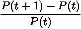

幸运的是，Python 系列提供了有用的 *pct_change* 方法，为我们计算这个公式。

让我们来定义投资组合的组成和用每只股票的日收益填充熊猫数据框的循环。

```
portfolio_composition = [('MSFT',0.5),('AAPL',0.2),('GOOG',0.3)]
returns = pd.DataFrame({})for t in portfolio_composition:
  name = t[0]
  ticker = yfinance.Ticker(name)
  data = ticker.history(interval="1d",
     start="2010-01-01",end="2019-12-31")

  data['return_%s' % (name)] = data['Close'].pct_change(1) returns = returns.join(data[['return_%s' % (name)]],
     how="outer").dropna()
```

`returns`数据帧如下所示:

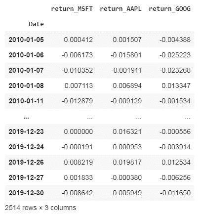

现在我们准备模拟我们的数据。

# 单一股票的蒙特卡罗模拟

如果我们想在未来模拟 *m* 天，我们只需要:

*   以一只股票的原始收益时间序列为例
*   选择替换的 *m* 值，随机均匀取值

就是这样。它与 bootstrap 非常相似，bootstrap 是一种重采样技术。这种方法假设未来收益是对过去收益的随机重采样。这是一个很强的近似值，但它可以是一个很好的起点。

这种模拟可以通过下面函数中的一行代码轻松完成:

```
def simulate_returns(historical_returns,forecast_days):
  return historical_returns.sample(n = forecast_days, 
                replace = True).reset_index(drop = True)
```

如果我们尝试模拟 1000 天，我们会得到:

```
simulate_returns(returns['return_AAPL'],1000)
```

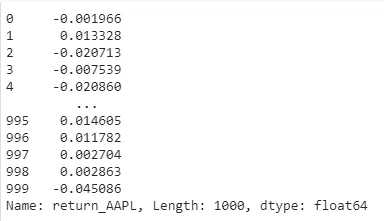

现在让我们为模拟投资组合创建必要的函数。

# 投资组合的蒙特卡罗模拟

投资组合是收益和权重的组合。给定第 *i-* 只股票的收益 *R* ᵢ，给定投资组合中每只股票的权重 *w* ᵢ(所有权重总和必须为 1)，投资组合收益 *R* 可以表示为:

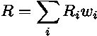

这是股票收益的加权和。

这是从我们之前创建的`returns`数据帧开始执行所有计算的函数:

```
def simulate_portfolio(historical_returns, 
   composition, 
   forecast_days):
  result = 0
  for t in composition:
    name,weight = t[0],t[1]
    s = simulate_returns(historical_returns['return_%s' % (name)], 
      forecast_days)
    result = result + s * weight

  return(result)
```

让我们看看如果我们模拟 10 天的投资组合会发生什么:

```
simulate_portfolio(returns,portfolio_composition,10)
```

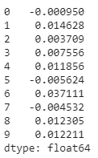

对于投资组合模拟来说，这可能已经足够了，但是我们还需要更多，那就是假设分析。

# 假设分析

如果我们像之前那样进行投资组合模拟，我们只是说未来收益是过去收益的随机样本。我们已经知道这并不完全正确。此外，也许我们正在进行情景分析，因为我们想知道如果某些条件将会发生什么。比如，如果每只股票的日均收益低于其历史价值，会发生什么？

历史平均回报率为:

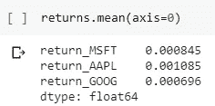

让我们试着模拟一下，如果 MSFT 的平均回报率下降-0.0001，AAPL 下降-0.001，谷歌下降-0.0005，会发生什么。我们必须从每只股票中减去这些数量，然后用修改后的新数据模拟未来的投资组合。

我们将把这些修正直接添加到`portfolio_composition`列表中(它们是每个元组的第三个组件):

```
portfolio_composition = [
   ('MSFT', 0.5,-0.0001), 
   ('AAPL', 0.2,-0.001), 
   ('GOOG', 0.3,-0.0005)
]
```

然后我们可以重新定义所有先前定义的函数。

这是模拟修改股票的功能:

```
def simulate_modified_returns(
      historical_returns,
      forecast_days,
      correct_mean_by): h = historical_returns.copy() new_series = h + correct_mean_by return new_series.sample(n=forecast_days,  
     replace = True).reset_index(drop=True)
```

这是模拟修改后的投资组合的函数:

```
def simulate_modified_portfolio(
   historical_returns,
   composition,
   forecast_days):

  result = 0

  for t in composition:
    name,weight,correction = t[0],t[1],t[2]
    s = simulate_modified_returns(
       historical_returns['return_%s' % (name)], 
       forecast_days,correction
    )

    result = result + s * weight

  return(result)
```

最后，我们可以定义一个多次执行投资组合模拟的函数，生成许多可能的场景:

```
def simulation(
  historical_returns,
  composition,
  forecast_days,
  n_iterations):

   simulated_portfolios = None for i in range(n_iterations):
       sim = simulate_modified_portfolio(
         historical_returns,
         composition,
         forecast_days
       ) sim_port = pd.DataFrame({'returns_%d' % (i) : sim}) if simulated_portfolios is None:
         simulated_portfolios = sim_port
   else:
         simulated_portfolios = simulated_portfolios.join(sim_port)

   return simulated_portfolios
```

现在我们准备开始我们的模拟和分析结果。

# 模拟和结果

让我们模拟未来 20 天，计算 200 个不同场景的统计数据。

```
forecast_days = 20
n_iterations = 200
```

我们现在可以运行模拟:

```
simulated_portfolios = simulation(returns,
    portfolio_composition,forecast_days,n_iterations)
```

如果迭代次数很多，此功能可能需要几秒钟甚至几分钟。

这是结果:

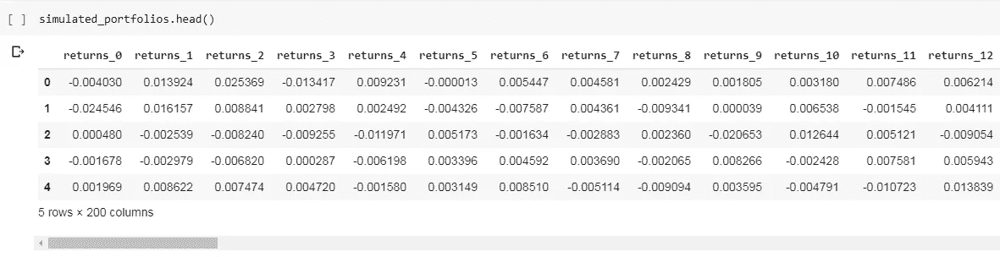

每一列是一个模拟投资组合的场景，每一行是未来的一天。

以投资组合的每日收益为例，我们可以用复利公式计算出 *N* 天后的收益:

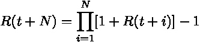

由于回报是非常小的数字，我们可以将该表达式近似为:

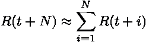

即 *N* 天后的收益是 *N* 天的收益之和。

我们现在可以从这个数据集计算一些可观测量。

## 未来回报的置信区间

情景分析可以用作风险管理工具。为此，我们可能要计算未来累积回报的第 5 个和第 95 个百分位数。前者告诉你，我们的投资组合有 5%的机会跑输这个价值，后者告诉你，你的投资组合有 5%的机会跑赢这个价值。我们还想了解投资组合的平均表现。

下面是计算这三条曲线的代码。

```
percentile_5th = simulated_portfolios.cumsum().apply(lambda x : np.percentile(x,5),axis=1)percentile_95th = simulated_portfolios.cumsum().apply(lambda x : np.percentile(x,95),axis=1)average_port = simulated_portfolios.cumsum().apply(lambda x : np.mean(x),axis=1)
```

情节是这样的。

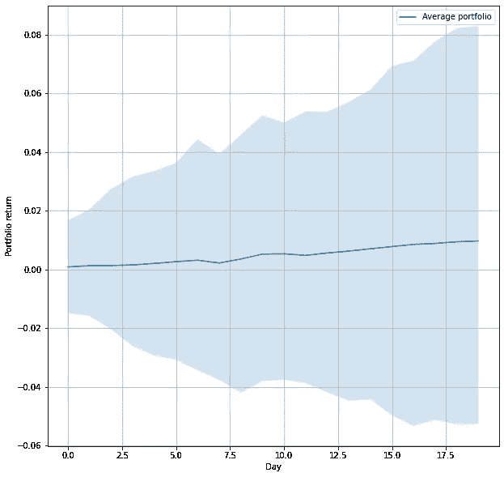

波段是百分位数，实线是平均投资组合。如你所见，20 天后，我们的投资组合有 5%的可能性会损失 5.3%(低波段)，有 5%的可能性我们的投资组合回报会高于 8.3%(高波段)。平均而言，我们预计我们的投资组合有 1%的回报率(实线)。

## 达到目标回报的概率

我们可以进行的另一种分析是，作为未来一天的函数，我们的投资组合跑赢目标回报的概率。

由于概率是一个可观测的值，我们也想计算它的标准误差。

如果我们有一个样本概率 *p* (即肯定事件的数量除以场景的数量 *N* )，其标准误差的估计值为:

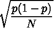

我们可以使用每天计算的这个值，在图表中显示误差线。

假设我们有一个 2%的目标。达到这一目标的概率计算如下:

```
target_return = 0.02target_prob_port = simulated_portfolios.cumsum().apply(
      lambda x : np.mean(x > target_return)
   ,axis=1)
```

误差线的大小用标准误差公式计算:

```
err_bars = np.sqrt(
   target_prob_port * (1-target_prob_port) / n_iterations
)
```

最后，我们可以绘制结果:

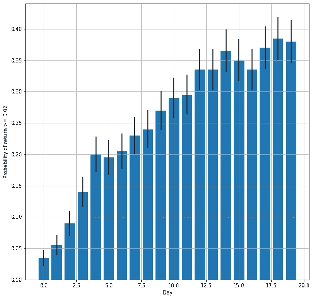

正如你所看到的，超额完成我们的目标回报的可能性随着时间的推移而增加(这显然是正确的，因为我们的投资组合有正的平均回报)。20 天后，我们的投资组合将以 38.0 +/- 3.4%的概率跑赢 2%的目标。

## 夏普比率的期望值和直方图

最后，我们可以计算一些与夏普比率相关的统计量。这是一个非常受欢迎的投资组合绩效指标，对于本例，我们可以计算投资组合的夏普比率回报率 *R* 如下:

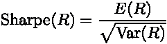

其中 *E(x)* 是期望值， *Var(x)* 是方差。

我们的 200 个投资组合场景中的每一个都有自己的夏普比率，所以我们可以计算出每一个的夏普比率。然后我们可以绘制直方图并计算平均值。

```
sharpe_indices = simulated_portfolios.apply(
   lambda x : np.mean(x)/np.std(x)
)
```

直方图为:

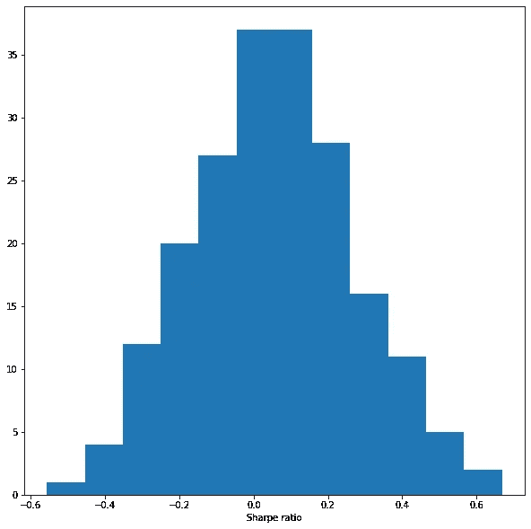

平均值为:

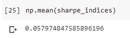

# **结论**

在本文中，我向您展示了如何用 Python 对金融投资组合进行简单的场景分析。这种方法可以适用于许多问题和情景(例如，波动性增加、黑天鹅、某些行业的危机)，以评估投资组合未来可能的风险及其成长能力。

这个工具可以很容易地与投资组合优化混合，以评估金融资产配置的完整分析。

# 参考

[1]吉安卢卡·马拉托。利用遗传算法进行 R 中的投资组合优化。交易科学家。[https://medium . com/the-trading-scientist/portfolio-optimization-in-r-using-a-genetic-algorithm-8726 EC 985 b 6 f](https://medium.com/the-trading-scientist/portfolio-optimization-in-r-using-a-genetic-algorithm-8726ec985b6f)

[2]吉安卢卡·马拉托。*自举。任何数据科学家的瑞士军刀*。数据科学记者。https://medium . com/data-science-reporter/the-bootstrap-the-Swiss-army-knife-of-any-data-scientist-acd6e 592 be 13

[3] *二项分布页。*维基百科*。*[https://en.wikipedia.org/wiki/Binomial_distribution](https://en.wikipedia.org/wiki/Binomial_distribution)

[4] *夏普比率页*。维基百科。[https://en.wikipedia.org/wiki/Sharpe_ratio](https://en.wikipedia.org/wiki/Sharpe_ratio)