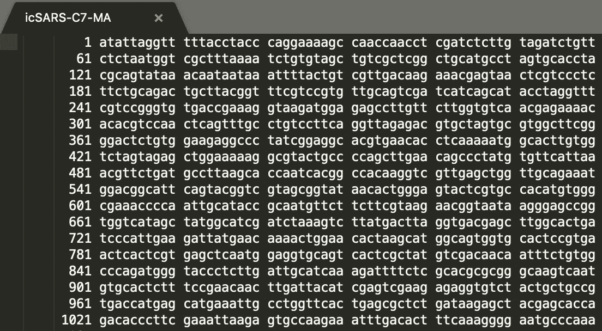
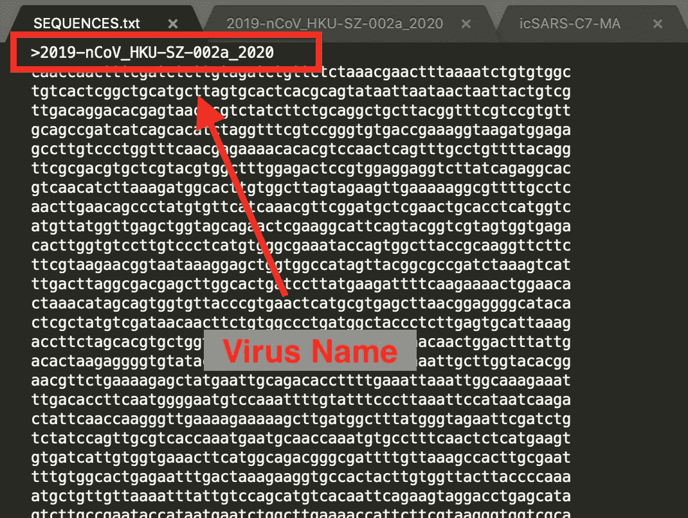
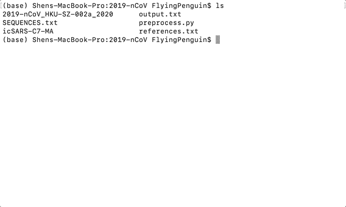
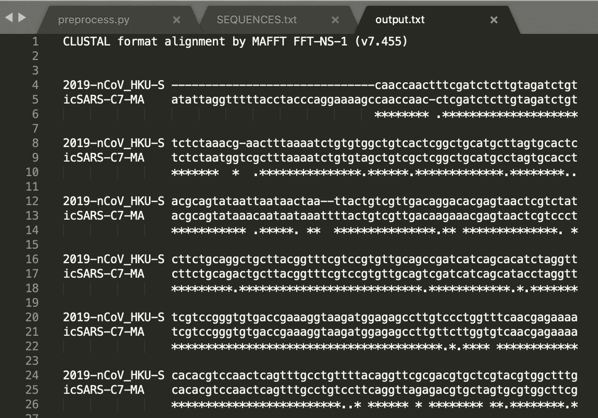

# 如何利用 MAFFT 对 2019-nCoV 执行序列对齐

> 原文：<https://towardsdatascience.com/how-to-perform-sequence-alignment-on-2019-ncov-with-mafft-96c1944da8c6?source=collection_archive---------20----------------------->

## 截至 2020 年 1 月 26 日，2019-nCoV 已经在中国武汉造成 76 人死亡。作为一种针对人类呼吸系统的冠状病毒，2019-nCoV 具有很高的传染性，尤其是在潮湿和寒冷的季节。


DNA，图片来自 [Pixabay](https://pixabay.com/illustrations/dna-biology-medicine-gene-163466/)

呼吸系统相关的病原体可以随着体液从喷嚏中高速射出。它们可以通过多种方式感染人类，最常见的是通过接触嘴、鼻子和眼睛。为避免感染，建议避免户外活动，尤其是在人群密集的地方。经常消毒双手，不要用手揉眼睛也很重要。

人们开玩笑说，他们现在只要躺在家里的沙发上就可以为社会做贡献。我在农历新年期间的所有会议计划现在都取消了。所以我决定分享一个教程，如何获取 2019-nCoV 的基因序列数据，并用 MAFFT 对其进行序列比对。我希望这篇文章提高了人们对生物信息学研究的兴趣，并有助于我们对抗下一场流行病。

# 什么是序列比对和 MAFFT？

**序列比对**是一种排列 DNA、RNA 或蛋白质以识别相似区域的方法，这可能揭示序列之间的功能、结构或进化关系。最近[的一份出版物](https://onlinelibrary.wiley.com/doi/epdf/10.1002/jmv.25682)提出，借助于 MAFFT 的序列比对，蛇可以跨物种传播给人类。

MAFFT(**M**multiple**A**alignment using**F**ast**F**ourier**T**transform)是 2002 年发表的一个多序列比对程序。它可用于 RNA 序列的序列比对。**冠状病毒**是例如具有单链 RNA 的病毒，该单链 RNA 被包裹在来源于宿主细胞膜的外壳中。关于 MAFFT 算法的细节可以在找到。

# 从哪里获取 RNA 序列数据？

2019-nCoV 的最新更新可以在 [NGDC](https://bigd.big.ac.cn/ncov#about) (中国国家基因组数据中心)上找到。在本教程中，我们将分析在 NCBI(国家生物技术信息中心)数据库内发现的 [2019-nCoV](https://www.ncbi.nlm.nih.gov/nuccore/MN938384) 病毒和 [SARS-CoV](https://www.ncbi.nlm.nih.gov/nuccore/MK062184) 病毒。SARS-CoV，众所周知的 SARS(严重急性呼吸综合征),在 2020 年左右在 17 个报告的国家中导致 774 人死亡。



我有一份拷贝，并将数据粘贴到一个以病毒名称命名的文件中。它们应该类似于上面的内容，一个索引号后跟一批 10 个代码，每行 60 个代码，用空格分隔。我已经上传了这个分析的相关文件，并在本文末尾附上了链接。

# 如何用 MAFFT 对 2019-nCoV 进行序列比对？

首先，我们需要安装 MAFFT。我们可以用下面的命令通过 Anaconda 安装它。不同操作系统的手动安装可以在[maftt 官网](https://mafft.cbrc.jp/alignment/software/)找到。

```
conda install mafft
```

MAFFT 非常容易使用，但是它以一种特殊的格式处理数据。我们将需要对我们获得的数据进行预处理，以便它可以通过 MAFFT 进行校准。下面是执行此操作的 Python 脚本:

```
import sys
import re
output = ""
for filename in sys.argv[1:]:
 infile = open(filename)
 data = infile.read()
 data = " ".join(re.split("[^atcg\n]", data))
 data = data.replace(" ", "")
 output = output + ">" + filename + "\n" + data + "\n"
print(output)
outfile = open('SEQUENCES.txt', 'w+')
outfile.write(output)
```

我们可以将上面的 Python 代码保存到一个名为“preprocess.py”的文件中，与我的病毒 RNA 数据放在同一个文件夹中。然后我们可以在文件夹中运行下面的 bash 命令来预处理数据。

```
python3 preprocess.py 2019-nCoV_HKU-SZ-002a_2020 icSARS-C7-MA
```

名为“SEQUENCES.txt”的输出文件现在应该如下所示。由于病毒名称附加在文件的前面，空格和索引号也被去掉。



现在，我们可以通过以下步骤在我们的终端下使用 MAFFT 执行序列比对:

1.  定位到工作文件夹。
2.  在终端内呼叫“mafft”。
3.  对于输入文件，输入“SEQUENCES.txt”。
4.  对于输出文件，输入“output.txt”。
5.  为“Clustal 格式”选择“1”作为输出格式。
6.  选择“1”作为“自动”策略。
7.  为附加参数保留空白。



在我们按下回车键后，我们只需要等待 MAFFT 来排列我们的 RNA 代码。成品应该看起来像下面的东西。“-”用于移动代码，下面的“*”表示类似的顺序。



恭喜你，你已经学会了如何使用 MAFFT 进行序列比对！现在你可以玩基因代码，并利用你喜欢的排列信息！

# 附录(相关文件的链接)

[](https://github.com/shenhuang/shenhuang.github.io/tree/master/2019-nCoV) [## 黄慎/shenhuang.github.io

### 此时您不能执行该操作。您已使用另一个标签页或窗口登录。您已在另一个选项卡中注销，或者…

github.com](https://github.com/shenhuang/shenhuang.github.io/tree/master/2019-nCoV) 

作为开发人员、数据科学家等，帮助武汉抗击致命疾病:

[https://github.com/wuhan2020/wuhan2020](https://github.com/wuhan2020/wuhan2020)