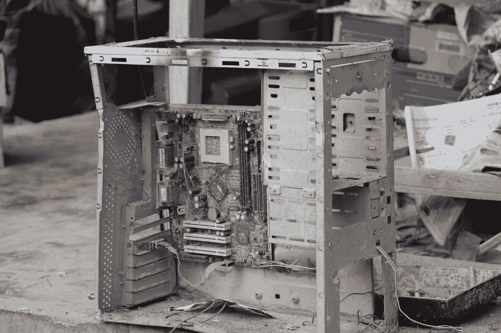
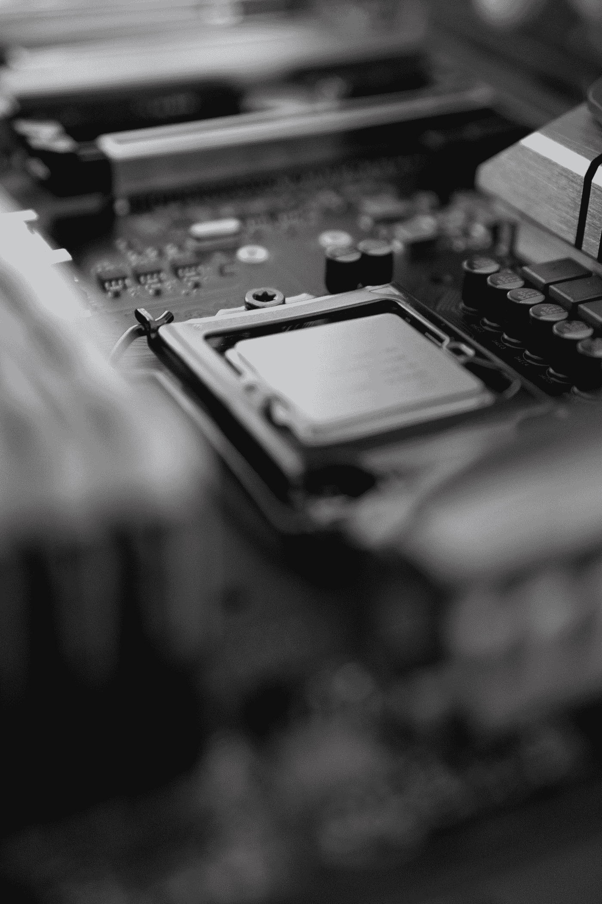
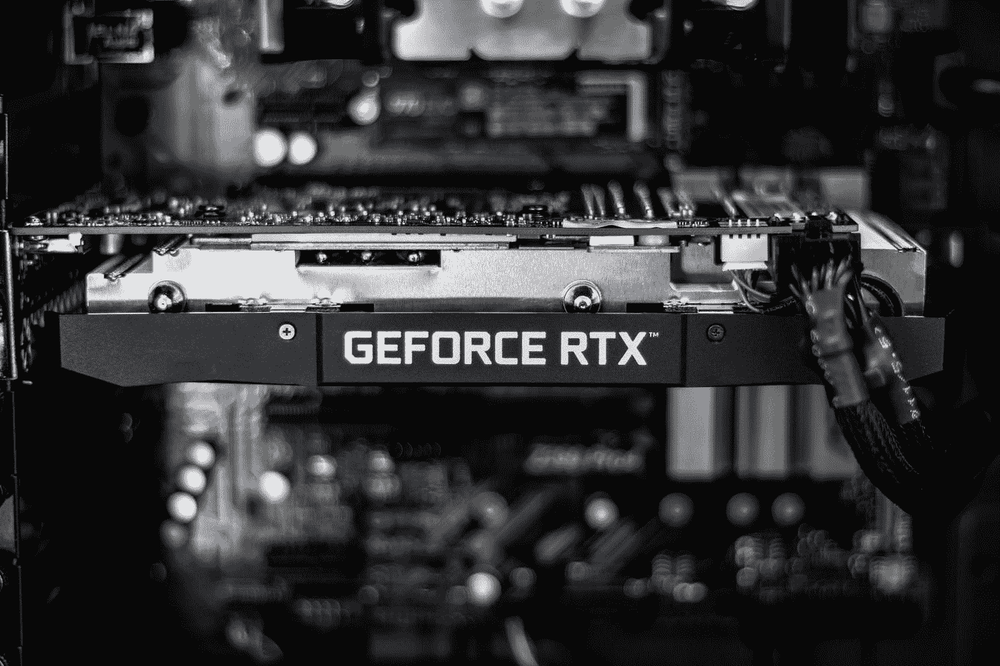
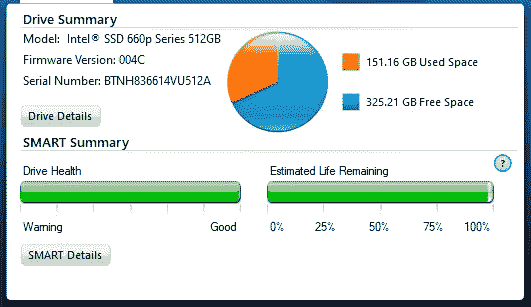
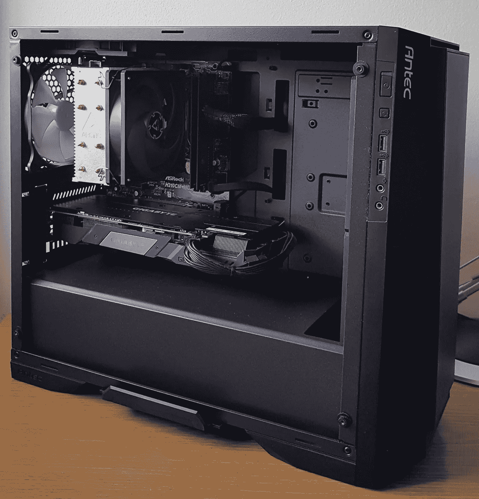

# 在预算有限的情况下，如何为深度学习 PC 挑选零件？

> 原文：<https://towardsdatascience.com/how-to-pick-parts-for-a-deep-learning-pc-when-on-a-budget-d50457f9fd37?source=collection_archive---------19----------------------->

照片由 [Tistio](https://unsplash.com/@tistio?utm_source=medium&utm_medium=referral) 在 [Unsplash](https://unsplash.com?utm_source=medium&utm_medium=referral) 上拍摄

## 介绍

我想我不需要提及这样一个事实，即像大多数人一样，我们研究人员，或者更准确地说，博士生在考虑计算机设备时是有预算的。我不能代表其他国家，但在克罗地亚，作为一名助教，你可以期待一台像样的中档笔记本电脑。对于大多数人来说，这很好，因为我认识的大多数博士生都在实验室工作或进行实地实验，对他们来说，一台能够运行 excel、R 和/或 Python 的基本统计脚本、一些 GIS 软件或 AutoCAD 的像样的笔记本电脑就足够了。

在相当长的一段时间里，我认为一台像样的笔记本电脑将非常适合我的水文学和水文模型相关的研究。这真的很棒，一切都运行得又快又好(多亏了固态硬盘和 16g 内存)。随着我开始处理大量数据，尤其是格式不太好的数据([在我的另一篇文章](https://medium.com/analytics-vidhya/how-to-extract-time-series-data-from-tabular-strings-e5b2d83fc711)中找到如何解决这个问题)。在我的导师和一位也在类似职位工作的朋友的建议下，我越来越开始认为我需要学习编程，以缩短与数据格式化、复制等相关的无聊任务。我决定给 Python 一个机会。

瞬间，我兴奋地发现这是一门多么棒的编程语言，它让我可以轻松完成一些任务，而我通常会在 excel 中浪费 3-4 个小时来完成这些任务。不要误会我的意思，这不是对 excel 的指责，无论如何它对一些快速可视化，数据管理或作为一个简单的数据库来说都是很棒的。但是越来越多的时候，我的任务中，一个写得好、想得好的 Python 脚本只是赢得了游戏，让生活变得更容易。

让我们回到这个故事的主题。当你在网上消费 Python 和 Data Sconce 相关的内容时，你迟早会偶然发现“机器学习”这个术语，因为 Python 在这类任务中很受欢迎。这正是发生在我身上的事情。很快我就迷上了，并开始对这个话题进行更多的研究。

很快，我发现自己注册了 Udacity 课程“用 Python Nanodegree 进行人工智能编程”，在封锁期间，我可以免费使用 Udacity 的某些课程 30 天。课程的最终目标是建立一个花的图像分类器。简而言之，您得到了一个输入图像，代码将它分类到一个定义的标签中。我花了大约一个半月的时间通过了这门课程。

当你开始机器学习任务，特别是深度学习时，你经常会发现一些“绿色果汁”(NVIDIA GPU😉)可以让你的中端笔记本电脑或个人电脑运行得更快。为什么会这样呢？答案是，CUDA 核心。为什么它们如此重要，在此阅读 [**伟大文章**](/what-on-earth-is-a-tensorcore-bad6208a3c62) ！因此，在预算有限的情况下，我开始在电脑爱好者论坛和网站上查找二手硬件的二手零件。

我不会提供任何测试结果，这更多的是一个建议类型的文章，从我的角度和多年的经验购买二手零件的论坛和不同的网站。我将试着解释哪些零件可以买二手货，以节省一些现金，或用同样的钱获得更好的性能，而不冒不必要的风险。

## 中央处理器

[栾卓卡](https://unsplash.com/@luangjokaj?utm_source=medium&utm_medium=referral)在 [Unsplash](https://unsplash.com?utm_source=medium&utm_medium=referral) 上拍照

许多人认为“中央处理器”或简称 CPU 是计算机的心脏。当你一起搜索术语“CPU”和“深度学习”时，最常见的问题是“CPU 对深度学习重要吗？”。这是一个棘手的问题，我找到的最好的答案可能是科林·卡萨迪在 Quora 上的回答，“这和游戏一样重要”。由于 CPU 为 GPU 做数据准备的工作，它必须足够快，以避免所选 GPU 出现瓶颈。CPU 可以被认为是一辆快车，它可以非常快地从主存中获取数据，但它的带宽很低，因此它不能一次处理大量数据。

我发现必须考虑的事情有:a) **内核数量(和时钟速度)**和 b) **价格(当你预算紧张时很重要)**。

自 2017 年锐龙问世以来，许多人认为它比英特尔更有价值。或许这是真的。尤其是在工作负载方面，锐龙远远超过英特尔。英特尔唯一能大放异彩的是游戏。

我试图找到二手零件之间的最佳交易。我不是在寻找英特尔或 AMD，只是最好的性价比。我发现一款**英特尔 i5 8400** 非常划算，这是一款 6 核 6 线程 CPU，基础时钟为 2.8 GHz，提升为 4.0 GHz。当然，i7 或锐龙肯定会更好，但当时没有好的交易。

我强烈建议你去当地的二手电脑网站看看，比如易趣或者亚马逊，因为 CPU 很少会坏。就物理损坏而言，英特尔可能更难损坏，因为触针在主板上，而 AMD 的触针在 CPU 上。

一如既往，购买二手设备时，最好的选择是亲自移交，以避免欺诈或物理损坏的零件。

## **主板或 MBO**

当你决定哪种 CPU 最适合你的需求时，是时候为它选择合适的 MBO 了。由于我不需要支持多 GPU 或许多硬盘驱动器，一个更基本的板将做这项工作。自从我去了英特尔，他们提供了几种不同的芯片组 [H、B、Q 和 Z](https://www.intel.com/content/www/us/en/gaming/resources/how-to-choose-a-motherboard.html) 。h 和 B 芯片组是基本的，而 Z 提供更多的升级选项和功能，是为发烧友，超频和游戏玩家。我在我的城市附近找不到一个好的二手交易，所以我去当地商店买了一个来自 Asrock board 的 [H310M](https://www.asrock.com/mb/Intel/H310M-HDVM.2/) 板。我个人避免购买二手主板，因为如果不小心处理，很容易损坏英特尔主板上的针脚。此外，对二手汽车的节省也不是很大。

## **GPU**

照片由 [Christian Wiediger](https://unsplash.com/@christianw?utm_source=medium&utm_medium=referral) 在 [Unsplash](https://unsplash.com?utm_source=medium&utm_medium=referral) 上拍摄

我再次做了功课，并开始在网上搜索关于深度学习的 GPU 的最佳“性价比”。有几十个来源，有些在媒体上也很棒。实际上，他们中的许多人都有一年左右的历史，并表示迄今为止最赚钱的 GPU 是 [RTX 2070 或 2060 超级](http://timdettmers.com/2020/09/07/which-gpu-for-deep-learning/)。我需要提到的是，在我构建 PC 的时候，RTX30XX 系列还没有推出，我链接的文章已经更新了 RTX30XX 系列的结果。

我在商店里找不到一个好的 RTX 2070 交易，也不是二手的，所以从一个论坛上选择了一个全新的技嘉 RTX 2060 超级游戏。卖家通过旧故障卡的 RMA 流程获得了该卡。GPU 的可以买二手，但要注意保修。此外，用于加密挖掘的 GPU 不是最佳选择。

有很多关于如何为深度学习选择合适的 GPU 的主题和文章，所以我强烈建议查看一下。在[培养基](/what-is-a-gpu-and-do-you-need-one-in-deep-learning-718b9597aa0d)上也有一些好的。

## 程序存储单元(Program Storage Unit)

PSU 有三种类型。非模块化、半模块化和全模块化。如果你不喜欢太多的电缆，你当然可以选择模块化的。我喜欢半模块化 PSU，因为它们通常有硬连线的 24 针 MBO、8 针 CPU 和一根用于 GPU 的 6 针 PCI-EX 电缆。所有这些都是需要的，所以这样的单位是完全适合我的。我看不出有必要为一个完全模块化的单元支付额外的费用，因为我肯定不会拆下一根 24 针的电缆。

RTX 2060 Super 在满负荷时需要大约 180W，加上系统中的 CPU 和所有“小”用户，我们在满负荷时大约需要 250-275 W。我是一个有点沉默的怪胎，所以一个能持续几年的高于平均水平的 PSU 是必须的。Seasonic 可能是世界上最受欢迎的 PSU 制造商，也有很好的声誉。他们的 PSU 我从来没有问题。谢天谢地，我在当地的一家商店买到了一辆保修 7 年的 Seasonic [核心 GM-650](https://seasonic.com/core-gm?__cf_chl_jschl_tk__=a9c38e0f12c7989c3143891120385913dc5580c3-1600375618-0-AV_uODyqDMgyuXbb9DX8GtaofoPWwmhjYlvytVKLZWQE4cedwXEg3w5Aib9enSkuV08WbqTwbmHDWsqegEMkOOYvI9SEZX5TnQFcF1_GL4GZOjP8BmcGJp-q7V30-xfGwvLSH7JyXF2KWMGwWUcQoAbNCguYzk-Ke945W0ZghCQsxrtOJlYh-JctlkfwZVDh5Qr-5PiYA4LSBhbGh6t2SND-arT8G6aicTNHE-fJrQjtnXYohpJMXWlM1M-kuBTYZW3KMP2n-2Zxr0ekxMUl9vA#) 。

PSU 是一个可以买到二手的部分，如果你确定它不是用于电力加密采矿机。此外，如果是二手的，确保它至少有 4-5 年的保修期，因为 PSU 不是经常更换的部件。

## 固态硬盘(或硬盘)

由于我们生活在 2020 年，系统中的一个 SSD 对我来说是必不可少的，至少是 250 GB 的操作系统。在硬盘上装有操作系统的 PC 或笔记本电脑上工作是非常痛苦的，Windows 加载时间大约为 1 分钟，或者浏览器需要 20 秒才能打开。在亚马逊上，250 GB 的固态硬盘从 30 美元起，到目前为止，这是配置你的电脑时最划算的 30 美元。没有任何其他部件能比固态硬盘提供更大的性能提升，只需 30 美元。

现代 SSD 支持两种标准，SATA 和 m.2。我不会深入研究它们之间的差异，因为这超出了本文的范围。[点击这里了解更多信息](https://www.enterprisestorageforum.com/storage-hardware/m2-vs-sata-storage-showdown.html)。

就我而言，我在二手市场上找到了很多东西，我买了一台英特尔 660p 的 m.2 设备，还找到了一台 Kingston A400 sata 设备，两者的大小都是 500GB。英特尔 one 作为系统驱动器，因为它的读/写速度更快。在购买之前，请检查机器学习模型的空间要求以及您计划用机器做的任何其他工作。对我来说，有 1 TB 的可用空间就足够了。

*SSD 在几个月的日常使用后的统计数据(图片由作者提供)*

固态硬盘可以购买二手，但一定要检查写入的数据量，因为固态硬盘的缺点是“有限”的生命周期。正如在我的例子中看到的，我在使用水文模型时对它进行了一些磨损，这些模型往往会对驱动器进行大量的写入。

## 情况

在这里，我寻找一个体面的情况下，不会打破银行。对我来说，外表排在第二位，建筑质量和空气流通排在第一位。遗憾的是，二手箱子的市场并不大。通常情况下，情况并不乐观。此外，由于一个好的情况下可以找到像 70 美元，我去了当地的 PC 零件经销商，并得到了一个安泰克 P6 m-atx 的情况下，折扣为 39 美元。该案件有体面的气流结合高于平均水平的外观(至少在我看来)和足够的空间固态硬盘。我喜欢整洁的外观，因此在管理线缆时格外小心。

## 其他部分

我们忘记了什么？如上所述，通过机箱的气流是很重要的，因此请确保您的机箱预装了风扇，或者在售后加装了风扇。我选择了北极 P14 风扇，因为他们的性价比很高。此外，售后 CPU 冷却器是一个好主意，如果你喜欢安静。这里，使用了北极冷冻机 34。这是一个 20 美元的 CPU 冷却器，非常适合中高端 CPU(如果不是超频的话)。水冷也是一个选择，如果你想要一个更狂热的建筑。对于中档建筑，像这样的，空气冷却就足够了。

## 结论和最终想法

*最终建成(图片由作者提供)*

在这里，我提出了我对在考虑预算的情况下构建深度学习机器这一主题的想法。我想给我的意见，哪些部分和为什么可以买到二手。最后的结果可以在这里看到。我设法用不到 1000 美元的预算建造了一台像样的深度学习 PC，仅在 CPU 和 GPU 上我就节省了近 300 美元。总共大约 400 美元。这是一个很好的节省，它使我的构建延迟了 3-4 周，并花费了我一些努力去寻找好的交易。

但是，我再次建议，你只去二手的某些组件，只有当你可以确定这个特定的部分没有损坏，并有适当的保证。应避免使用无保修的零件。

如果你喜欢我的文章，欢迎在[媒体](https://medium.com/@Karlo_Leskovar)或 [LinkedIn](https://www.linkedin.com/in/karlo-leskovar-a8612b105/) 上关注我。干杯！