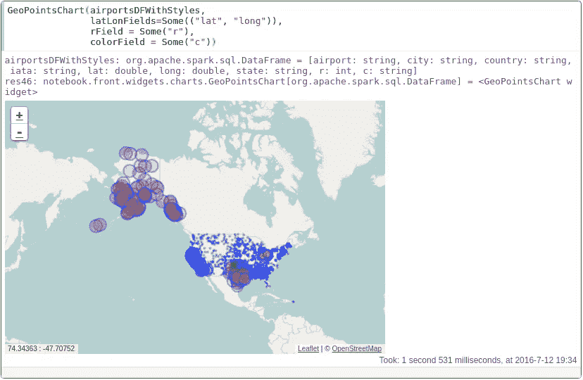
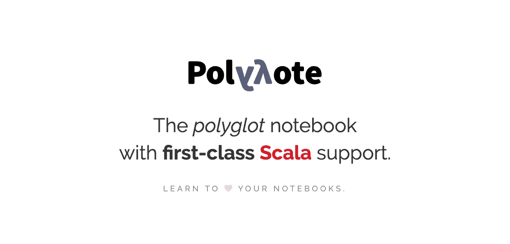

# 如何为数据科学选择合适的笔记本电脑

> 原文：<https://towardsdatascience.com/how-to-pick-the-right-notebook-for-data-science-7dc418c4da57?source=collection_archive---------13----------------------->

## [数据工程 101](https://towardsdatascience.com/tagged/data-engineering-101)

## 流行的开源笔记本框架的深入比较。

照片由[思想目录](https://unsplash.com/@thoughtcatalog?utm_source=unsplash&utm_medium=referral&utm_content=creditCopyText)在 [Unsplash](https://unsplash.com/s/photos/notebook?utm_source=unsplash&utm_medium=referral&utm_content=creditCopyText) 上拍摄

如果你是一个大数据爱好者，你可能使用过(或者至少听说过) [Jupyter Notebook](https://jupyter.org/) ，这是数据科学社区中事实上的开源笔记本框架。但是，您知道其他可能更适合您的数据科学项目的笔记本工具吗？

在这篇博文中，我将比较一系列开源笔记本，包括 Jupyter、Zeppelin、Spark Notebook 和 Polynote，以帮助您选择最适合您的分析用例的笔记本。

## 在我们开始之前…

以下是我们将对每个笔记本选项进行评估的主要功能列表:

*   **内核**:我可以使用哪些编程语言？我可以在同一个笔记本中用多种语言编写代码吗？
*   **版本控制**:笔记本和 Git 集成的怎么样？
*   **数据可视化**:绘图的灵活性如何？
*   **社区**:虽然社区大小不是产品的特性，但是一个大的用户社区意味着更好的文档，更成熟的插件，以及当你需要帮助时更容易排除故障。

## Jupyter 笔记本

来源: [Jupyter 笔记本](https://jupyter.org/)

截至今天，Jupyter 无疑是最受欢迎的笔记本框架。它支持超过 40 种编程语言，包括 Python、R、Julia 和 Scala。虽然基本的 IPython 内核不允许在单元之间切换语言，但是你可以安装一个第三方工具，比如 BeakerX 和 SoS 来实现这个特性。

自从朱庇特笔记本(。ipynb)本质上是 JSON 文件，用户可以使用 Git 轻松地控制笔记本的版本，Github 可以在浏览器上非常好地显示笔记本。如果您更喜欢使用[Jupyter Lab](https://jupyterlab.readthedocs.io/en/stable/)(Jupyter 的一个扩展的类似 IDE 的用户界面)，您可以添加一个 [Github 扩展](https://github.com/jupyterlab/jupyterlab-github)来使您的 Git 工作流更加容易。像 [matplotlib](https://matplotlib.org/) 和 plotly 这样的流行绘图库与 Jupyter Notebook 很好地集成在一起。

在所有可用的开源笔记本框架中，Jupyter 拥有最大的用户群体。截至 2018 年 9 月，GitHub 托管了超过[250 万](https://www.nature.com/articles/d41586-018-07196-1)台公共 Jupyter 笔记本。超过 15，000 个与 Jupyter 相关的问题在 [Stackoverflow](https://stackoverflow.com/tags) 上得到回答。JupyterCon 是一个致力于 Jupyter 社区的系列会议，每年由 Project Jupyter 和 O'Reilly Media 主办。

## 阿帕奇齐柏林飞艇

来源:[阿帕奇·泽普林](https://zeppelin.apache.org/)

[Apache Zeppelin](https://zeppelin.apache.org/) 可能是分析社区中第二受欢迎的笔记本电脑。Zeppelin 支持三种编程语言:Python、R 和 SQL。它与 [Apache Spark](https://zeppelin.apache.org/docs/0.8.2/interpreter/spark.html) 有着惊人的内置集成，允许用户使用 [JDBC](https://zeppelin.apache.org/docs/0.8.2/interpreter/jdbc.html) 无缝查询许多数据库系统。Zeppelin 还支持同一笔记本中的多种解释器/语言。

齐柏林笔记本(。json)可以由 Git 进行版本控制，但不幸的是，Github 目前只将它们显示为纯文本文件，这使得没有本地或托管实例的笔记本很难共享。然而， [ZEPL](https://www.zepl.com/explore) 可用于在浏览器中重新呈现公共笔记本。

Zeppelin 的一个独一无二的特性是，它让用户可以像 BI 仪表板一样调整和排列笔记本单元格，而在其他笔记本框架中，用户根本不允许移动单元格。

## 火花笔记本

来源:[星火笔记本](https://github.com/spark-notebook/spark-notebook)

Spark Notebook 构建在用于内存数据处理的顶级分析引擎 [Apache Spark](https://spark.apache.org/) 之上。Scala 是 Apache Spark 唯一支持的编程语言。SparkContext 是现成的，它为每个 Spark 会话生成单独的 JVM，以避免潜在的冲突。

目前 Github 无法显示 Spark 笔记本(。snb)而且目前还没有共享 live 笔记本的托管服务。数据可视化选项似乎也很有限。

截至目前，Spark Notebook 的用户群体相对较小，因为很难在网上找到示例和指南。

## 波利诺特

来源:[开源的 Polynote:一个 IDE 启发的多语言笔记本](https://netflixtechblog.com/open-sourcing-polynote-an-ide-inspired-polyglot-notebook-7f929d3f447)

[Polynote](https://polynote.org/) 是网飞在 2019 年末开源的一款全新笔记本工具。用户可以用 Scala(有一流的支持)、Python 和 Polynote 中的 SQL 编写代码，并且可以在单元格之间切换语言和共享变量(又名 *polyglot* )。

Polynote 共享相同的文件扩展名(。ipynb ),这样它们也可以被版本控制并显示在 Github 上。

Polynote 已经内置了与 matplotlib 和 [Vega](https://vega.github.io/vega/) 的集成。此外，它有一个自动完成的编辑器来提高您的工作效率，还有一个额外的内核状态面板来让您更清楚地了解正在运行的作业。

Polynote 仍处于早期阶段，但许多数据科学爱好者已经在尝试它了。就我个人而言，我非常期待看到它变得更加稳定，增加更多的功能。

*想了解更多关于数据工程的知识？查看我的* [*数据工程 101*](https://towardsdatascience.com/tagged/data-engineering-101) *专栏关于走向数据科学:*

 [## 数据工程 101 -走向数据科学

### 阅读《走向数据科学》中关于数据工程 101 的文章。分享概念、想法和…

towardsdatascience.com](https://towardsdatascience.com/tagged/data-engineering-101)