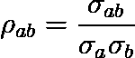
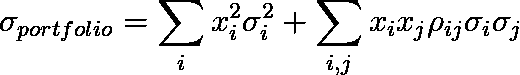
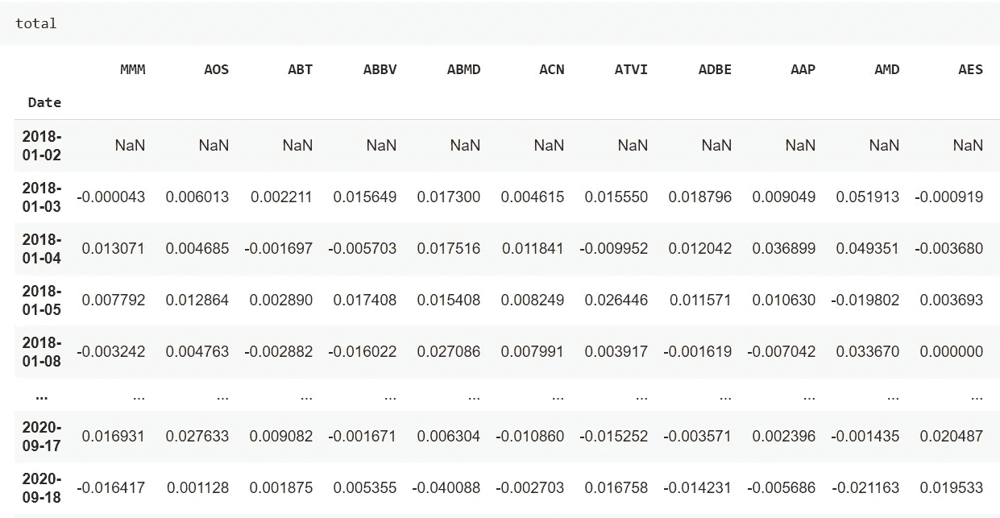
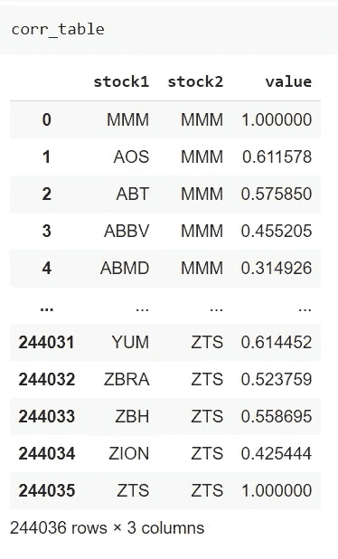
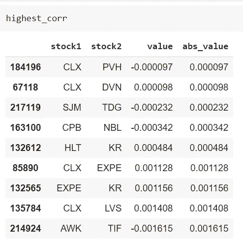

# 如何在 Python 中为投资组合挑选不相关的股票

> 原文：<https://towardsdatascience.com/how-to-pick-uncorrelated-stocks-for-an-investment-portfolio-in-python-d75867d1c11e?source=collection_archive---------27----------------------->

## 一个简单的 Python 代码，用来挑选标准普尔 500 相关性最低的股票

马库斯·温克勒在 [Unsplash](https://unsplash.com?utm_source=medium&utm_medium=referral) 上的照片

有价证券投资是一种迷人的投资，有可能带来令人满意的回报。根据现代投资组合理论，选择相关性低的股票或 ETF 总是一个好主意。

让我们看看为什么以及如何在 Python 中测量股票相关性来选择股票。

***来自《走向数据科学》编辑的提示:*** *虽然我们允许独立作者根据我们的* [*规则和指导方针*](/questions-96667b06af5) *发表文章，但我们并不认可每个作者的贡献。你不应该在没有寻求专业建议的情况下依赖一个作者的作品。详见我们的* [*读者术语*](/readers-terms-b5d780a700a4) *。*

# 什么是线性相关？

股票之间的相关性是衡量一只股票的回报如何影响另一只股票的回报。如果两只股票高度相关，它们可能会同向波动(即，如果一只股票价格上涨，另一只股票价格也会上涨)或反向波动。

从数学上讲，两只股票之间的线性相关指数，比如说 *a* 和 *b* ，定义为:

其中分子是股票之间的协方差，分母是标准差的乘积。

这个数字的范围是从-1 到 1。如果它是-1，股票向相反的方向移动(即，如果一只股票上涨，另一只股票下跌)，如果它等于 1，股票完全向同一方向移动。如果它等于 0，股票是不相关的，它们的运动是相互独立的。我们必须寻找这些不相关的股票。

# 为什么要选择不相关的股票？

如果我们建立一个由一些股票组成的投资组合，它们的权重是 *x* ，投资组合的方差是:

因此，只要股票之间的相关性为正，我们投资组合的方差相对于方差之和就会增加，其风险也会增加。有些人可能会说，我们会喜欢负相关的股票，但在这种情况下，不会有任何回报，因为如果一只股票上涨，另一只股票下跌，净回报为 0。

所以，我们的想法是保持我们的股票不相关，以消除第二项，避免更高的方差。这是现代投资组合理论的一个分支的目的，有数学工具允许我们根据权重 *x* 优化方差。在这篇文章中，我们将重点选择那些线性相关性的绝对值几乎等于 0 的股票。

# 代码

在文章的这一部分，我们将研究标准普尔 500 股票，我们将找出相互关联度较低的几只股票。一切都可以在我的 GitHub 资源库中找到:[https://GitHub . com/gianlucamalato/machine learning/blob/master/Stocks _ correlation . ipynb](https://github.com/gianlucamalato/machinelearning/blob/master/Stocks_correlation.ipynb)

我们将使用 *pandas* 库来执行所有的计算，而 S & P 成分的列表将从这个 GitHub 存储库下载:[https://GitHub . com/datasets/S-and-P-500-companies/tree/master/data](https://github.com/datasets/s-and-p-500-companies/tree/master/data)

首先，让我们导入一些有用的库:

然后，我们希望获得历史时间范围内的所有标准普尔 500 股票，例如从 2018 年到 2019 年。让我们先下载标准普尔 500 的历史数据，以获得这一时期的有效交易日。

现在，我们可以滚动 tickers 数据框并下载每个符号的历史数据。由于我们列表中的一些股票可能已经被摘牌，或者可能太新，我们检查每只股票是否在标准普尔 500 的交易日进行过交易。如果没有，我们丢弃库存。如果股票不再是标准普尔 500 的一部分，或者根据我们的历史时间范围，它太新，就会发生这种情况。因为我们想有一个均匀的时间间隔，我们丢弃这样的股票。

然后，对于每只股票，我们计算每日百分比回报。

这是总数据帧。每一列都是股票的每日收益，股票的名称就是列的名称。索引是日期。

我们现在可以使用 Pandas 的“corr”方法计算每只股票之间的线性相关性，然后我们可以使用“melt”方法将列转置为行来规范化该表。

如你所见，我们有每只股票与自身的相关性(显然是 1)，我们得到股票 A 与股票 B 的相关性，以及股票 B 与股票 A 的相关性，这是相同的，因为相关性是对称的。我们可以去掉这些无用的记录，计算相关指数的绝对值。

然后，我们可以按绝对值升序对表进行排序，这样我们在第一条记录中就有了相关性较低的股票对。

最后，这是 2018-2019 年期间标准普尔 500 相关性较低的股票对的表格。

# 结论

计算股票之间的相关性是有用的，每个投资组合投资者都必须这样做。然而，相关性可能会随着时间的推移而变化，因此定期计算它可能会有助于调整投资组合，使其不会遭受可能会增加整体风险的突然相关性。