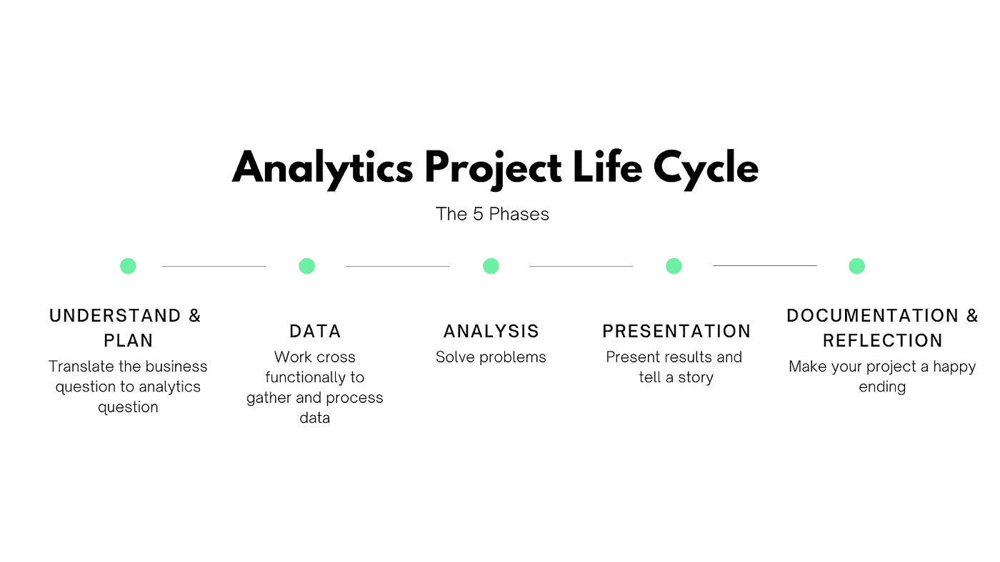
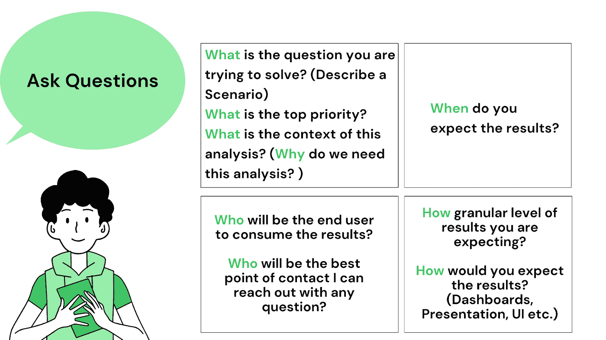
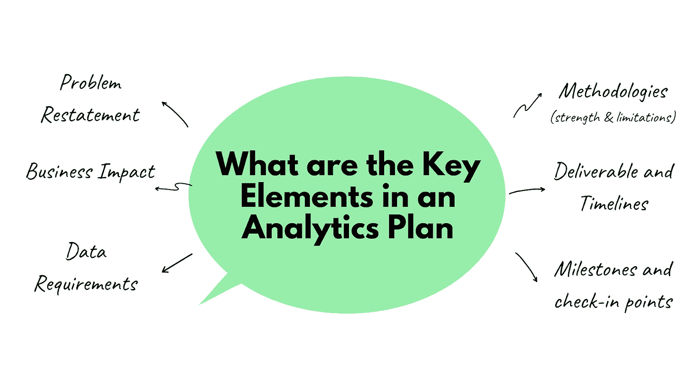
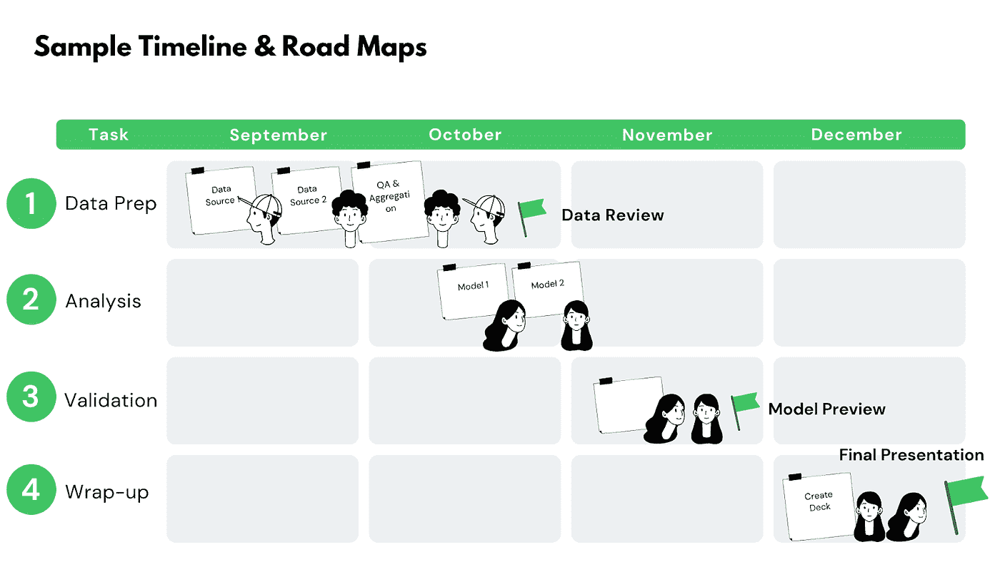
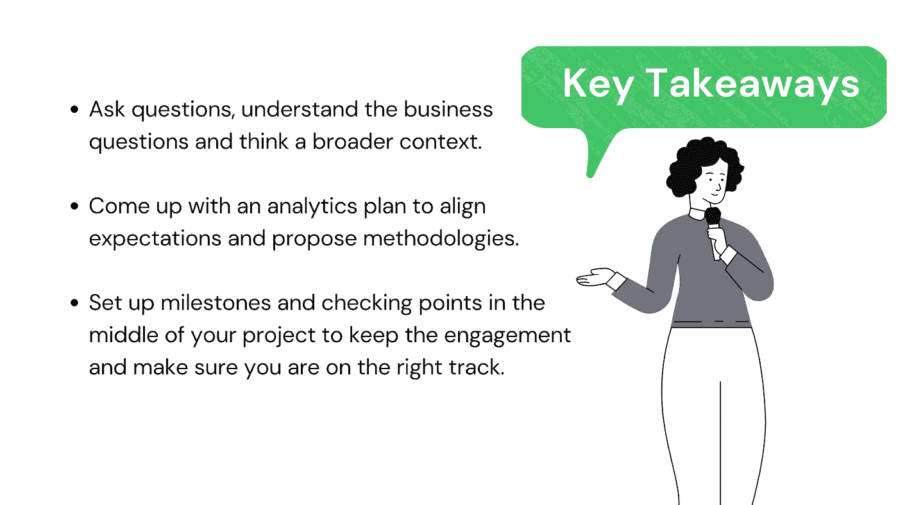
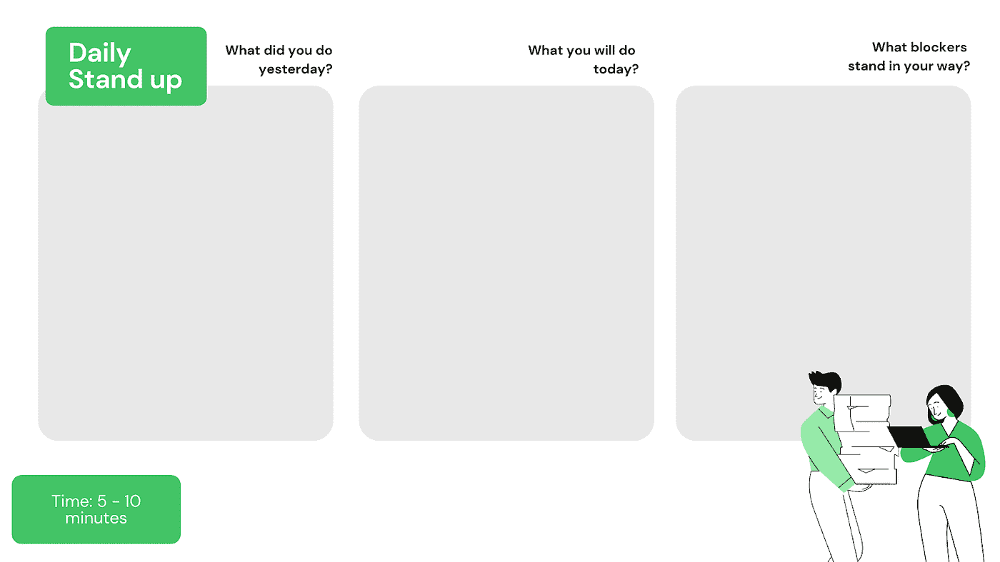
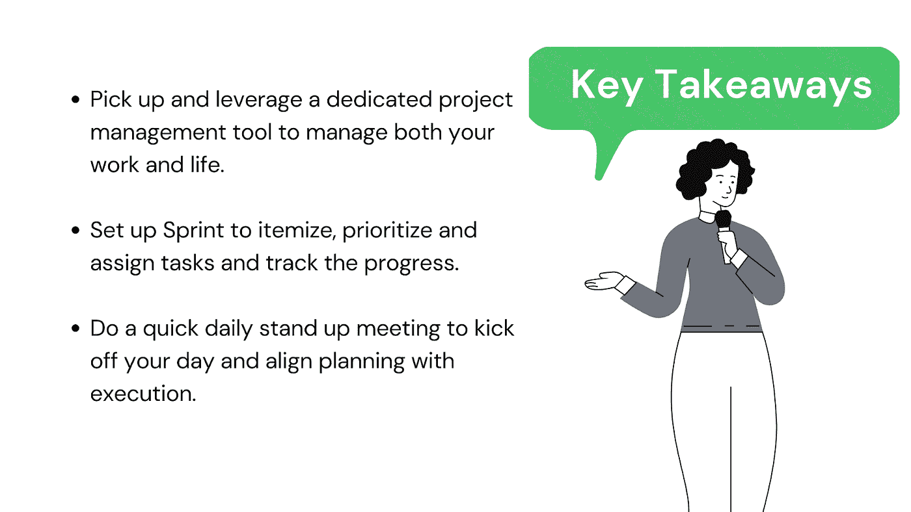
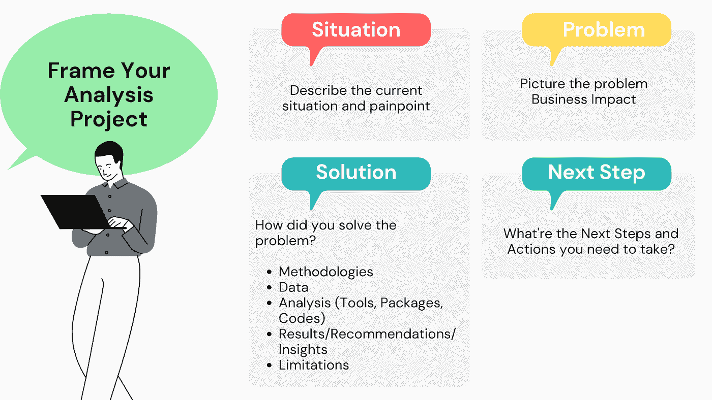
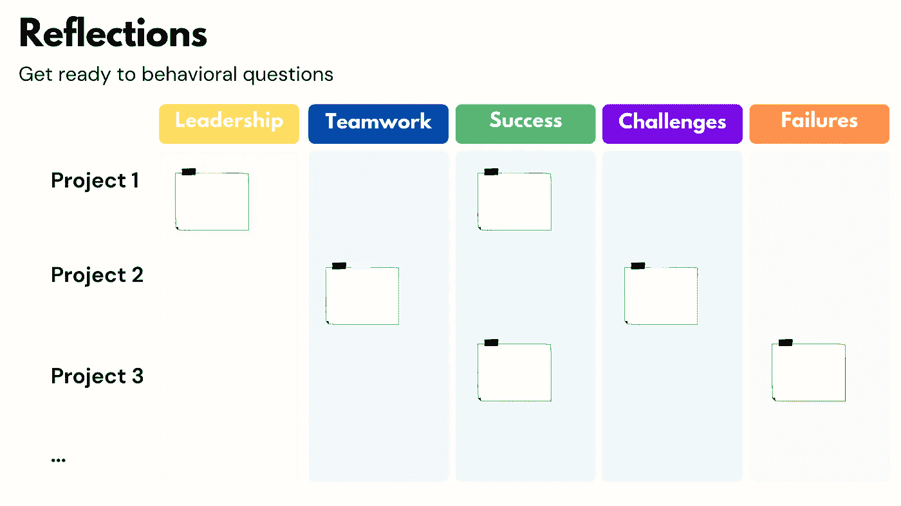

# 如何规划和组织数据科学/分析项目？

> 原文：<https://towardsdatascience.com/how-to-plan-and-organize-a-data-science-analytics-project-a9418c12c808?source=collection_archive---------5----------------------->

开展数据科学/分析项目总是需要时间，而且从来都不容易。一个成功而全面的分析项目远远不止编码。相反，它涉及复杂的计划和大量的沟通。

照片由[屋大维丹](https://unsplash.com/@octadan?utm_source=medium&utm_medium=referral)在 [Unsplash](https://unsplash.com?utm_source=medium&utm_medium=referral)

**分析项目的生命周期是怎样的？**

要完成一个数据科学/分析项目，您可能需要经历五个主要阶段，从了解问题和设计项目开始，到收集数据、运行分析、展示结果、做文档和自我反思。

由作者创建

我有一种强烈的感觉，运行一个分析项目非常类似于建造一座房子。首先，架构师会见他/她的客户，了解他们的需求，并提出一个可行的蓝图(理解和计划)。

然后需要收集建筑材料，如水泥、钢材、砖块等。你必须了解建筑材料的特性，选择合适的建筑材料。否则，你最终可能会拥有一个很容易倒塌的房子。这就像一个数据收集过程，你必须做一些 EDA 或功能工程来理解数据，并找到正确的数据来解决你的分析问题，否则你可能无法从你的分析中获得可靠或具体的结果！

有了建筑材料和蓝图，你就可以开始建房子了(运行分析)。施工完成后，需要进行房屋检查和质量检查，以确保安全。同样，我们需要记录我们关于方法、结论和限制的分析项目。

**了解&计划**

如果问我整个周期最关键的阶段，我会毫不犹豫地说理解和规划，因为数据科学和分析的主要目的不是用花哨的技术创建项目，而是解决实际问题。因此，分析项目的成功在很大程度上取决于您对情况的了解程度、对问题的定义以及将业务问题转化为分析问题的能力。从这个角度来看，花时间思考您的分析项目的更广泛的背景总是值得的。

*   **提问**

通常情况下，一个分析项目始于一个与业务合作伙伴会面的启动会议。他们会提供一些背景信息，并简单谈谈他们在寻找什么。问聪明的问题总是会让你更好地理解业务涉众的痛点和需求。这里有一些你可以问的问题。

由作者创建

*   **分析计划**

在开始分析之前，让我们制定一个分析计划，并召开另一次跟进会议来回顾问题并强化预期。

它将提供该计划的高层次概述，给出接下来步骤的清晰画面，并从业务方面绘制技术行动和更大画面之间的联系。以下是我的分析计划中的一些关键要素:

由作者创建

不要让数据科技成为一个谜。尝试用通俗易懂的语言对方法进行简要描述，概述用例及场景，并总结优点和局限性。避免复杂的公式或函数，而是专注于该方法如何帮助解决问题。

完成一个分析项目可能需要几周时间，有时甚至更长。一个项目持续的时间越长，一些变量在工作中捣乱的可能性就越大。因此，在你的项目开始之前，第一件事是解开你完成项目必须做的所有步骤。然后估计完成这些任务所需的时间框架，并标记一些里程碑。

由作者创建

建议你不要只做一个最终演示，而是在项目中间设立一些检查点，与你的利益相关者接触并获得他们的反馈，这样你就可以及时进行调整。

由作者创建

**如何组织项目并跟踪进度**

*   **利用项目管理工具**

当你在处理一个复杂的分析项目，并且需要与多个团队合作时，比如工程、产品和业务等，简单的待办事项列表或基于 excel 的跟踪工具是不够的。

Jo Szczepanska 在 [Unsplash](https://unsplash.com?utm_source=medium&utm_medium=referral) 上拍摄的照片

但是，您可以利用专用的项目管理工具和软件。如果你去谷歌简单地搜索项目管理工具，许多工具会抓住你的注意力，如 Asana，Trello，Monday.com JIRA 等。我打赌你会根据你的团队规模和你喜欢的工作方式找到合适的工具。但是，idea 赢得了我的心，因为它是一个一体化的工作空间，将几个工作应用程序融为一体。我真的很讨厌有多种工具用于不同的目的，所以你可以想象，“多合一”是最有效的营销信息来转换我。

对我来说，在一个地方做计划、跟踪、知识分享和写博客是一个很棒的选择。信不信由你，它还提供模板，以方便旅行计划，并协助您跟踪工作申请的进展。

*   **冲刺规划**

你有一个强大的工具。就像你的私人助理。如何保证协作，让轮子运转起来？先说冲刺规划。

对于那些不熟悉 sprint 概念的人来说，sprint 是一个短暂的、有时间限制的时期，团队在这个时期努力完成一定数量的工作。

> **sprint 让项目更容易管理，让团队更快更频繁地交付高质量的工作，并给他们更多的灵活性来适应变化。**

进行冲刺规划的首要任务是决定冲刺的长度。尽管没有硬性规定每个 sprint 应该持续多长时间，但它必须足够长以确保任务可以完成，同时它也应该足够短以使需求和目标保持不变。

在 sprint 规划会议上，整个团队将调整即将到来的 sprint 的目标，并计划有助于实现该目标的工作。这些任务将被逐项列出，按优先顺序排列，分配给团队成员，并记录到即将到来的 sprint 的板上。

*   **每日一站**

Sprint 规划是为了定义要实现的目标和要交付的任务，以推动项目的进展，而 5 到 10 分钟的每日例会将有助于规划与执行相一致。更具体地说，就是让团队达成共识，明确优先级，避免一些常见的障碍。

由作者创建

长话短说，这里有三个大家都会回答的基本问题:

*   你昨天做了什么？
*   你今天要做什么？
*   什么阻碍了你的发展？

由作者创建

**不要忽视文档和反思的重要性**

我在数据分析/数据科学领域已经工作了六年多。我希望在我开始职业生涯时就知道的一件事是，文档和反思与分析本身同等重要。由于你所做的所有分析项目都有可能作为一个闪亮的项目进入你的简历，然后它们将成为面试的谈话点，一旦完成，总结和框定你的分析工作对你刷新记忆、巩固所有材料和构建故事非常有益。

*   **记录并框定你的分析**

你可以遵循这个框架，包括情况、问题、解决方案和后续步骤(SPSN)。

由作者创建

首先，描述当前的状态和痛点，然后描述问题并大声说出该项目的业务影响。

最关键的部分是解决方案，在这里您概括了高层次的方法，并逐步提供关于数据和分析的细节。然后记录从您的分析中得出的结果、见解和可行的建议。

请注意，没有完美的数据科学项目。开诚布公地谈论你的项目的注意事项和局限性。大声说出你的分析可以解决的问题是很好的，同时了解什么样的问题不能回答也是很有价值的。

最后一部分是下一步。潜在的下一步将是测试新的方法以提高准确性，包括新的数据源，或者自动化整个过程以使结果每天都显示出来等。

同时，不要忘记通过创建一个故事网格来进行自我反思，并将你在每个分析项目中遇到的一些例子和情况映射到以下五个类别中。

由作者创建

希望它有助于促进您的分析/数据科学项目的整个过程！