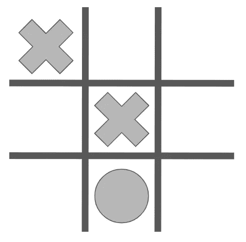
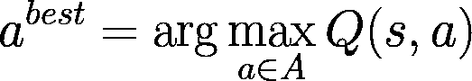
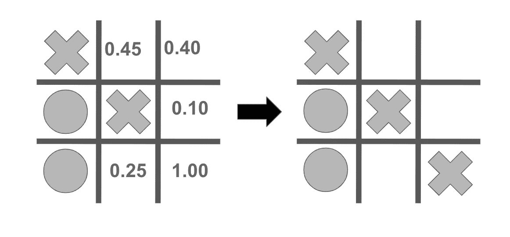
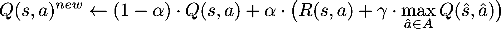

# 如何利用强化学习玩井字游戏

> 原文：<https://towardsdatascience.com/how-to-play-tic-tac-toe-using-reinforcement-learning-9604130e56f6?source=collection_archive---------23----------------------->

## 关于 Q-learning 的简单教程

**Q-learning** 是一种出色而基本的强化学习方法，由于深度学习革命，它最近取得了很多成功。虽然本教程不会解释什么是深度 Q 学习，但我们将通过原始的 Q 学习算法来教一个代理如何玩一个**井字游戏**。尽管它很简单，但我们会看到它能给出极好的结果。

首先，我们将通过一些必要的背景知识来快速了解强化学习，然后我们将介绍 Q-learning 算法，最后是如何实现它来教代理玩井字游戏。

为了理解本教程，不需要有任何关于强化学习的知识，但它将有助于对微积分和线性代数有一个基本的了解。最后，我分享了我自己的 Github 知识库，里面有我解释的东西，你可以免费查看，如果你感兴趣，点击[这里](https://github.com/RickardKarl/bill-the-bot)。

## 强化学习概述

强化学习的目标是当智能体在不同状态的环境中运行时，根据某种奖励函数优化智能体的行为。对于本教程，环境是井字游戏，它有明确定义的动作，代理必须决定选择什么动作来赢得游戏。此外，代理人将因赢得游戏而获得奖励，这鼓励它在游戏中学习好的策略。

强化学习的一个常见框架是(有限)**马尔可夫决策过程** (MDP)。它帮助我们定义一组动作和状态，代理的决策是基于这些动作和状态的。

一个 MDP 包括

*   一组有限的动作*(在游戏板上放置标记的位置)*
*   *状态的有限集合*(游戏板的给定配置)**
*   **一个奖励函数 ***R(s，a)*** ，该函数基于在状态 ***s*** *中执行动作 ***a*** 来返回值。***
*   *一个转移函数 ***T(s，a，s’)****

*当执行动作*时，转换函数给出从状态 ***s*** 移动到***s’****的概率。当我们处在一个不确定某项行动是否总能产生预期结果的环境中时，这是必要的。然而，在井字游戏中，我们确切地知道每个动作会做什么，所以我们不会使用这个。***

******

***状态空间由所有可能的游戏配置组成。在每个状态下，我们可以执行一组可用的操作。在这个例子中，当前玩家有六个可能的动作要执行。(图由作者提供)***

***MDP 框架帮助我们形式化了这个问题，根据当前的状态，确定哪些行为将使代理人在游戏中的总报酬最大化。奖励函数 ***R(s，a)*** 会非常简单:***

*   **如果代理人从*执行一个赢得游戏的动作***—****，那么 ***R(s，β)= 1***。****
*   **否则，如果代理犯了一个错误，选择了错误的动作*从而输掉了游戏，那么 ***R(s，γ)=-1***。***
*   **否则，当上述情况都没有发生时，奖励简单来说就是 ***R(s，a) = 0。*****

**在强化学习中，我们找到了一个最优策略，代理使用它来决定采取哪些行动。由于我们使用 Q-learning，我们将简单地把我们的策略表示为当代理处于状态 ***s*** 时最大化函数***【s，a】***的动作*。这是 Q-learning 的核心，所以让我们来看看如何计算这个函数。***

******

***对于游戏中的每个状态，每个动作都与一个 **Q** 值相关联。最佳策略是选择价值最高的行动。在这个具有状态 **s** 的例子中，下一轮属于玩家 X，并且很明显哪个动作具有最高的预期奖励，因为 X 即将获胜。***

## ***用贝尔曼方程更新***

******Q(s，a)*** 的解释是:如果代理人在状态 ***s*** 中拾取动作 ***a*** 则 ***Q*** 是游戏结束时给出的期望奖励。由于代理人想使其报酬最大化，它想选择使 ***Q*** 最大化的行动。***

****

**在游戏的这种状态下，我们显示当前玩家 X 的 ***Q*** 值的场景示例。通过将下一个标记放置在最大值所在的位置，玩家将赢得游戏并获得奖励。(图由作者提供)**

**为了计算 ***Q(s，a)*** ，代理必须探索所有可能的状态和动作对，同时从奖励函数***【R(s，a)*** 获得反馈。在井字游戏的情况下，我们通过让代理与对手玩许多游戏来迭代更新 ***Q(s，a)*** 。利用 Q 学习算法，用于更新 ***Q*** 的等式如下:**

****

*   **我们执行一个动作 ***一个*** 当前状态 ***s.*****
*   **最后一项展望未来并返回可用的最大 ***Q*** 值，***【ŝ】***是执行动作*后的新状态。然后，动作***—***是下一个状态 ***ŝ*** 的最佳动作。***
*   **学习率 **α** 决定我们在多大程度上覆盖旧值，我们将使用 **α = 0.1** 。**
*   **折扣因子 **γ** 决定了与当前时间步长 **t** 的奖励相比，未来奖励的权重。我们将使用 **γ = 0.9** 。**

**这个等式基于强化学习中众所周知的等式，称为贝尔曼等式*。让我们看看如何使用这个等式来教导我们的代理。***

## **Q 学习算法的实现**

**要得到一个训练有素的代理，我们需要学习 ***Q(s，a)*** 的值。这将通过让两个代理相互竞争来实现。我们将引入一个概率 **ε** 每个智能体挑选一个随机动作，否则它将根据 ***Q(s，a)*** *挑选最佳动作。*用这种方式*，*我们确保到平衡学习，使得代理有时探索新的动作，而其他时候利用代理已经学习的信息。**

**这个训练阶段可以用 Q 学习算法的下列伪代码来描述:**

```
**Initialise: Q(s,a) = 0, starting state s, 
            starting player P, iterations Nfor t = 0 : N With probability **ε** :P picks random action a
   Else, pick action a that maximise Q(s,a) Observe new state ŝ and reward R(s,a) If current player is our agent, 
   update Q(s,a) = (1-α)Q(s,a) + α[R(s,a) + γ**max(*Q(ŝ,â)*)*] s = ŝ
   Switch turn, P = the other player**
```

**注意迭代次数 ***N*** 一定比较大，我一直用 50 万左右。另外， ***Q(s，a)*** 可以实现为 Python 字典，或者如果我们将 ***(s，a)*** 表示为整数，则可以实现为二维数组。最后，可以随时间改变概率 **ε** ，以强调早期迭代中的更多随机探索，这可能会加快学习。**

**在你用算法训练了你的代理之后，你可以保存***【Q(s，a)】***的值，当你想和代理对战的时候加载它。然后，代理人只需通过选择最大化***【s，a】***的行动来遵循最优策略。虽然代理并没有因为井字游戏的简单而变得非常聪明，但是如果你想学习如何实现 Q-learning 并看到它的工作，尝试一下仍然很有趣。**

## **摘要**

**总之，本教程首先解释了马尔可夫决策过程(MDP)框架，以及它是如何用于强化学习的。我们用状态、动作和奖励函数模拟了井字游戏。在此基础上，我们定义了函数 ***Q(s，a)*** ，该函数通过在状态***【s***中选择动作*来量化期望的奖励，并通过反复玩游戏展示了计算***【Q(s，a)*** 的公式。***

**我希望你喜欢这个教程，如果你有任何问题，欢迎在这里或通过 [Twitter](https://twitter.com/RdKarlsson) 联系我。最后，如果你想看看这在实践中是如何工作的，那就在下面链接的我的 Github 资源库中查看我的实现。**

**[https://github.com/RickardKarl/bill-the-bot](https://github.com/RickardKarl/bill-the-bot)**