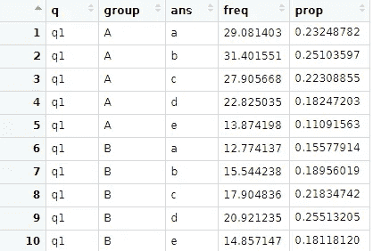
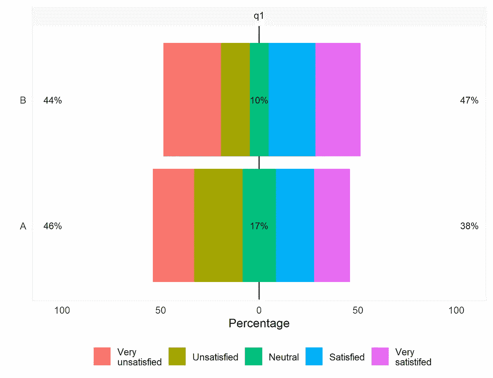
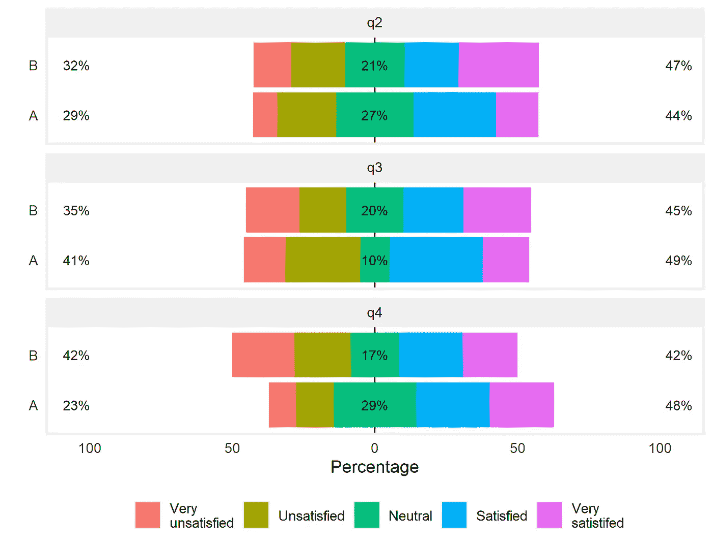
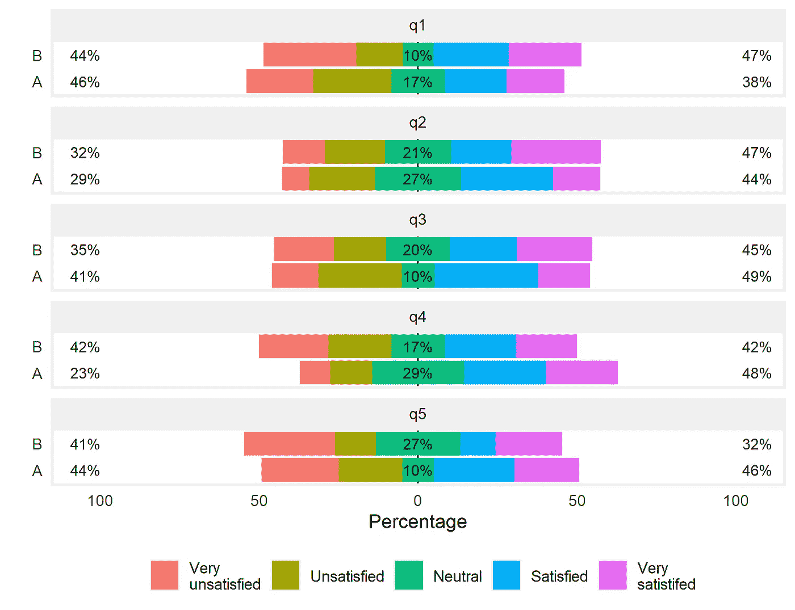

# 如何以友好的方式用加权调查绘制李克特量表

> 原文：<https://towardsdatascience.com/how-to-plot-likert-scales-with-a-weighted-survey-in-a-dplyr-friendly-way-68df600881a?source=collection_archive---------28----------------------->

如果你在 R 中使用过 Likert scale 可视化，你可能知道 Jason Bryer 的 Likert [包](https://github.com/jbryer/likert)。尽管这是一个很棒的包，但它在处理加权调查时的能力是有限的。在寻找解决方法时，我发现了这个[的好帖子](http://rnotr.com/likert/ggplot/barometer/likert-plots/)，它解释了这个过程，但是使用了很多我不太熟悉的 base R 函数。最后，我设法以一种适合我的工作流程的 [dplyr](https://dplyr.tidyverse.org/) 友好的方式复制了这个过程，并认为它可能对面临同样问题的其他 R 用户有用。在这里我会指导你整个过程。

## 数据

为了使这成为一个非常普遍的情况，让我们生成一些您可以在加权调查中找到的随机数据。我们的数据框将包含每个回答者的 id、他们对 5 个不同问题的 Likert 量表的回答、一个表示他们所代表的群体的字母，以及分配给每个回答者的权重。

```
library(tidyverse)n_sample <- 100sample_data <- tibble(
  id = seq(1, n_sample, 1),
  q1 = sample.int(5, n_sample, replace = TRUE),
  q2 = sample.int(5, n_sample, replace = TRUE),
  q3 = sample.int(5, n_sample, replace = TRUE),
  q4 = sample.int(5, n_sample, replace = TRUE),
  q5 = sample.int(5, n_sample, replace = TRUE),
  group = sample(c("A","B"), n_sample, replace = TRUE),
  weight = runif(n_sample, 1, 3)
)
```

## 获得加权结果

我们这里的主要目标是对我们的结果进行加权(否则我们会直接使用 Likert 包)。为此，您可以使用超级有用的[调查包](http://r-survey.r-forge.r-project.org/survey/)，它为您提供了许多处理调查数据的工具。这个包与我通常使用的 tidyverse 工具不太兼容，但幸运的是，我们可以使用 [srvyr 包](https://github.com/gergness/srvyr)，它允许我们使用 dplyr 语法处理调查包函数。

首先，我们将把数据转换成一个调查对象。然后，我们将定义一个函数来提取单个问题的加权结果，最后，我们将应用这个函数来获得每个问题的结果。

```
library(srvyr)# Tranform sample data into survey data
survey_data <- sample_data %>%
  as_survey_design(id = 1,
                   weights = weight)# Function that gets the weighted frequency of answers for a single question
get_weighted_results <- function(q, survey_data){
  survey_data %>%
    group_by(group) %>%
    summarize(a = survey_total(get(q) == 1),
              b = survey_total(get(q) == 2),
              c = survey_total(get(q) == 3),
              d = survey_total(get(q) == 4),
              e = survey_total(get(q) == 5)) %>%
    pivot_longer(-group,
                 names_to = "ans",
                 values_to = "freq") %>%
    filter(!str_detect(ans, "se")) 
}# Apply function to each question and calculate proportion
likert_results <- tibble(q = c("q1", "q2", "q3", "q4", "q5")) %>%
  mutate(results = map(q, get_weighted_results, survey_data)) %>%
  unnest(results) %>%
  group_by(q, group) %>%
  mutate(prop = freq / sum(freq)) %>%
  ungroup()
```

让我们花点时间来研究一下我们的新函数有什么作用:

1.  获取您的调查数据并按预定义的变量对其进行分组。这里我假设你有一个分组变量:如果没有，就忽略这一步。
2.  汇总得到每个可能答案在李克特量表上的加权频率。请注意，我将每个答案保存在不同的信中。稍后我们将把这些信件翻译成文本。
3.  将我们的数据框转换为整齐的格式。当我们开始用 ggplot2 绘图时，这将很有帮助。
4.  过滤包含“se”的行。默认情况下，survey_total 函数也将返回总数的标准误差。我们不会在这里使用它，但是如果需要的话，你可以把它留下。

然后，我们从头开始创建一个新的数据框，其中有一列包含我们的 Likert 问题的变量名。我们将函数应用于该列，对结果进行去嵌套，并计算我们将要绘制的比例。您应该会得到如下所示的数据框:



我们将要绘制的整洁的数据框应该如下所示

## 制作我们的绘图功能

在我的例子中，我有许多李克特量表问题要在不同的分组中显示，所以我认为最方便的解决方案是创建一个函数来绘制我需要的任何问题。这个函数很长，但是不要害怕，我会一步一步地指导你。让我们来看看吧。

```
plot_weighted_likert <- function(x, my_labels, likert_results) {
  # Filter data for questions needed
  likert_results2 <- likert_results %>%
    filter(q %in% x)
  # Create data frame with labels
  prop_labels <- likert_results2 %>%
    mutate(
      position = case_when(
        ans == "a" | ans == "b" ~ "left",
        ans == "c" ~ "center",
        ans == "d" | ans == "e" ~ "right"
      )
    ) %>%
    group_by(q, group, position) %>%
    summarize(label = sum(prop * 100)) %>%
    pivot_wider(names_from = position,
                values_from = label)
  # Data frame with right side values
  high_columns <- likert_results2 %>%
    filter(ans == "c" | ans == "d" | ans == "e") %>%
    mutate(prop = case_when(ans == "c" ~ prop / 2 * 100,
                            ans == "d" ~ prop * 100,
                            ans == "e" ~ prop * 100,)) %>%
    arrange(ans)
  # Data frame with left side values
  low_columns <- likert_results2 %>%
    filter(ans == "a" | ans == "b" | ans == "c") %>%
    mutate(prop = case_when(ans == "a" ~ prop * 100,
                            ans == "b" ~ prop * 100,
                            ans == "c" ~ prop / 2 * 100)) %>%
    arrange(ans)
  # Define empty ggplot object
  p <- ggplot() +
    # Add central black line
    geom_hline(yintercept = 0) +
    # Add right side columns
    geom_bar(
      data = high_columns,
      mapping = aes(x = group,
                    y = prop,
                    fill = ans),
      position = position_stack(reverse = TRUE),
      stat = "identity"
    ) +
    # Add left side columns
    geom_bar(
      data = low_columns,
      mapping = aes(x = group,
                    y = -prop,
                    fill = ans),
      position = "stack",
      stat = "identity"
    ) +
    # Left side labels
    geom_text(
      data = prop_labels,
      mapping = aes(
        x = group,
        y = -100,
        label = paste(round(left) , "%", sep = "")),
        hjust = 1,
        color = "black",
        size = 3
    ) +
    # Central labels
    geom_text(
      data = prop_labels,
      mapping = aes(
        x = group,
        y = 0,
        label = paste(round(center) , "%", sep = "")),
        hjust = 0.5,
        color = "black",
        size = 3
    ) +
    # Right side labels
    geom_text(
      data = prop_labels,
      mapping = aes(
        x = group,
        y = 100,
        label = paste(round(right) , "%", sep = "")),
        hjust = -0.2,
        color = "black",
        size = 3
    )  +
    # Scale formatting
    scale_y_continuous(
      breaks = seq(-100, 100, 50),
      limits = c(-105, 105),
      labels = abs
    )  +
    # More formatting
    theme(legend.title = element_blank(),
          legend.position = "bottom",
          axis.ticks = element_blank(),
          strip.background = element_rect(fill = "#F0F0F0",
                                          color = "#F0F0F0"),
          panel.background = element_blank(),
          panel.border = element_rect(
            colour = "#F0F0F0",
            fill = NA,
            size = 1.5)
          ) +
    facet_wrap(~ q, ncol = 1) +
    coord_flip() +
    ylab("Proportion") +
    xlab("") +
    # Change Likert labels
    scale_fill_discrete(labels = my_labels)
  # Print the plot
  p
}
```

好吧，那么，我们在这里做什么？

1.  我们的函数将采用一个包含我们要绘制的问题名称的字符向量，另一个包含我们的 Likert 量表标签的字符向量，以及我们创建的数据框。
2.  第一步是过滤数据框，因为我们只对给定的一组问题感兴趣。
3.  然后，我们计算将出现在绘图左侧、中间和右侧的标签。和最初的 Likert 包一样，在每一边，我们都要显示极端答案的百分比。为此，我们创建一个名为 position(左、右或中心)的新列，计算每个位置的比例总和，最后将数据框转换为更宽的格式，以便于使用。
4.  现在，我们将准备绘制两个新的数据框，分别包含较低和较高的值。中心值将除以 2，每一半将放入其中一个数据框中。我们必须按“ans”列排列每个数据框，以便在我们的绘图中正确堆叠值。
5.  我们准备好开始策划了。首先，我们创建一个空的 ggplot 对象并添加我们的中心线。
6.  然后我们添加两个`geom_bar`，用于我们的左列和右列。这里要注意两点:对于左侧的值，我们将`-value`绘制为我们的 y 美学，并且我们在右侧的条中指定了`position_stack(reverse = TRUE)`,因此它们按照我们想要的顺序堆叠。
7.  然后我们添加三个`geom_text`来绘制百分比标签。由于我们的标签目前是十进制数字，我们将它们四舍五入，并粘贴一个百分号。对于`hjust`参数，我只是使用了最初的 Likert 包中的默认值。
8.  接下来，我们对 y 轴进行格式化。这里我在`labels`参数中传递了`abs`函数，所以我们的标签从 100 到 0 再到 100。
9.  然后我用`theme`做一些格式化。在这种情况下，我选择了一个与原来略有不同的面板边框，因为我更喜欢它。之后，我加上刻面，翻转天平，加上标签，
10.  最后，我添加了一个`scale_fill_discrete`来将我的“a，b，c，d，e”标签更改为所需的标签。

## 结果

让我们看一些由此产生的李克特曲线图的例子。(不要忘记定义一个 labels 对象，因为函数中没有默认的对象)。

```
my_labels <- c("Very\nunsatisfied",
               "Unsatisfied",
               "Neutral",
               "Satisfied",
               "Very\nsatistifed")plot_weighted_likert(c("q1"), my_labels, likert_results)
plot_weighted_likert(c("q2", "q3", "q4"), my_labels, likert_results)
plot_weighted_likert(c("q1", "q2", "q3", "q4", "q5"), my_labels, likert_results)
```



只有一个问题的情节



三个问题的情节



五个问题的情节

就是这样！我希望这有所帮助，如果您有任何疑问，请告诉我。

## 一些改进

你可能需要对你的情节做一些我在这里没有提到的改进。我将简要阐述这些问题:

*   个性化的颜色。为此，将`scale_fill_discrete`替换为`scale_fill_manual`，保留 labels 参数，并将一个 5 色矢量添加到`values`参数中。
*   分组顺序。在结果图中，我们将 B 组绘制在 a 组之上。要定义绘制组的顺序，您可以使用`factor`函数并指定组的顺序来改变`group`列。
*   问题标签。这里最简单的方法是让您的`q`列包含问题文本。通过这种方式，该功能将继续按预期工作。您还可以添加一个新的包含问题文本的`text`列。如果你这样做，你将不得不修改函数，以便它在需要时使用`text`而不是`q`作为变量。
*   问题顺序。绘制问题文本时，您的问题可能会以不同于预期的顺序显示。为了解决这个问题，您可以创建一个`text_order`向量，它按照您希望问题显示的顺序包含问题，并使用`factor`函数改变`likert_results2`数据框中的`text`列(在函数内部，在您过滤它之后),并传递这个向量。