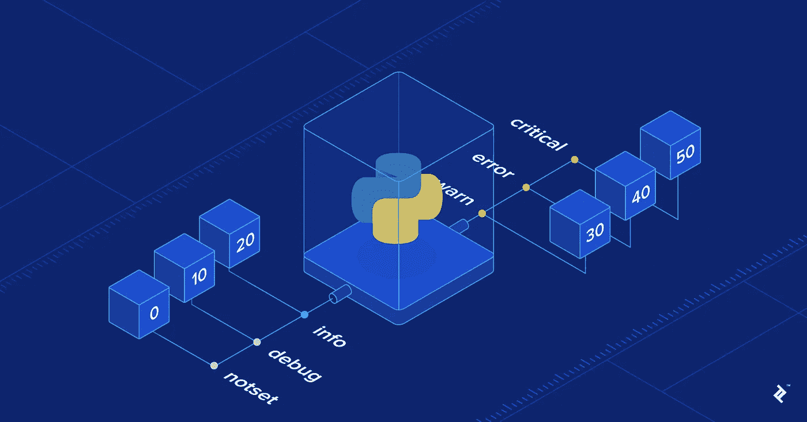
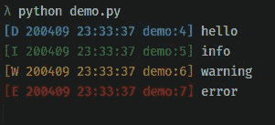

# 如何用 Logzero 练习 Python 中的日志记录

> 原文：<https://towardsdatascience.com/how-to-practice-logging-in-python-with-logzero-82e4f9842a5c?source=collection_archive---------40----------------------->

## 为您的 Python 项目提供强大而有效的日志记录。



[儿子阮金的照片](https://www.toptal.com/resume/son-nguyen-kim?__hstc=753710.17be834d28ba29055621f0833fc6733b.1582400164835.1582400164835.1582400164835.1&__hssc=753710.1.1582400164836&__hsfp=3618320745)

Logzero 是由 [Chris Hager](https://twitter.com/metachris) 创建的 Python 包，它简化了 Python 2 和 3 的日志记录。Logzero 作为打印语句更容易显示信息和调试细节。

如果你想知道**什么是日志记录**，我推荐你阅读我之前写的关于[“如何用 Python 日志记录模块运行机器学习实验”](https://medium.com/analytics-vidhya/how-to-run-machine-learning-experiments-with-python-logging-module-9030fbee120e)的文章，尤其是前 3 节。

在那篇文章中，您将了解到:

*   什么是日志记录？
*   为什么日志记录很重要。
*   测井在不同技术行业中的应用。

Logzero 具有不同的特性，使得它更易于在 Python 项目中使用。这些功能包括:

*   轻松记录到控制台和/或文件。
*   提供完全配置的标准 Python logger 对象。
*   漂亮的格式，包括控制台中特定级别的**颜色**。
*   适用于各种字符编码和特殊字符。
*   兼容 Python 2 和 3。
*   不再依赖 Python。

# 安装。

使用 pip 运行安装 logzero。

```
pip install -U logzero
```

你也可以从公共 [Github repo](https://github.com/metachris/logzero) 安装 logzero:

```
git clone https://github.com/metachris/logzero.git
cd logzero
python setup.py install
```

## 基本例子。

我们将从一个基本的例子开始。在 python 文件中，我们将从 logzero 导入日志记录器，并尝试 4 种不同的日志记录级别示例。

```
#import logger from logzero
from logzero import loggerlogger.debug(“hello”)
logger.info(“info”)
logger.warning(“warning”)
logger.error(“error”)
```

输出是彩色的，易于阅读。



对数零输出

如你所见，每一关都有自己的颜色。这意味着您可以通过检查颜色轻松识别级别。

# 将日志写入文件

大多数时候 Python 用户倾向于在文件中写日志。系统运行时，您可以将日志保存在文件中，并查看它们以进行错误检查和维护。您还可以设置一个文件来保存 legzero 中的所有日志条目。

我们将从 logezero 导入日志记录器和日志文件。logfile 方法将帮助我们配置日志文件来保存我们的日志条目。

现在，您的日志条目将被记录到名为 my_logfile.log 的文件中。

```
#import logger and logfile
from logzero import logger, logfile

#set logfile path
logfile('my_logfile.log')

# Log messages
logger.info("This log message saved in the log file")
```

my_logfile.log 中的输出包含日志级别标签(对于标记为“I”的信息级别)、日期、时间、python 文件名、行号和消息本身。

```
[I 200409 23:49:59 demo:8] This log message saved in the log file
```

## 旋转日志文件。

您不需要一个单独的日志文件来保存所有的日志条目。这导致系统打开和关闭大量日志文件。

您可以使用 **maxBytes** 和 **backupCount** 参数来允许文件以预定的大小翻转。当大小即将超出时，文件将被关闭，并自动打开一个新文件进行输出。每当当前日志文件的长度接近 maxBytes 时，就会发生翻转。如果 maxBytes 或 backupCount 为零，则永远不会发生翻转。

在下面的例子中，我们将 maxBytes 设置为 **1000000 字节(1 MB)。**这意味着当文件大小超过 1MB 时，文件将被关闭，并打开一个新文件来保存日志条目。要保留的备份数量设置为 3。

```
# Set a rotating logfile
logzero.logfile("my_logfile.log", maxBytes=1000000, backupCount=3)
```

## 设置最低日志记录级别。

日志级别是指设置给定日志消息的重要性级别。您还可以通过使用 logfile 方法中的 log level 参数为文件处理程序设置不同的日志级别**。**

在下面的例子中，我们将 loglevel 设置为`warning`。这意味着低于**警告级别**的所有日志条目将不会保存到日志文件中。

```
#import logzero package
from logzero import logger, logfile
import logging

# You can also set a different loglevel for the file handler
logfile("my_logfile.log", loglevel=logging.WARNING)

# Log messages
logger.info("This log message saved in the log file")
logger.warning("This log message saved in the log file")
```

## 设置自定义格式化程序。

如何格式化日志记录由您决定。有不同的方法可以格式化你的日志记录。您可以在格式中包含日期、时间和日志记录级别，这样您就可以知道日志是何时发送的以及在什么级别发送的。

以下示例显示了如何配置日志记录的格式。

```
#import logzero package
import logzero
from logzero import logger, logfile
import logging

#set file path
logfile("my_logfile.log")

# Set a custom formatter
my_formatter = logging.Formatter('%(filename)s - %(asctime)s - %(levelname)s: %(message)s');
logzero.formatter(my_formatter)

# Log messages
logger.info("This log message saved in the log file")
logger.warning("This log message saved in the log file")
```

在上面的例子中，我们配置了日志格式，包括*文件名、日期、时间、日志级别名称、*和*消息。*

这是 my_logfile.log 中的输出:

```
demo.py — 2020–04–10 00:51:44,706 — INFO: This log message saved in the log file
demo.py — 2020–04–10 00:51:44,707 — WARNING: This log message saved in the log file
```

## 自定义记录器实例

除了使用默认的记录器，您还可以使用 **logzero.setup_logger(..)**。您可以使用不同的参数配置并返回一个完全配置的 logger 实例，如*名称、日志文件名称、格式化程序、最大字节数、备份计数、*和*日志记录级别。*

这是一个如何使用自定义记录器实例设置日志记录的工作示例:

```
import logzero package
from logzero import logger, logfile, setup_logger
import logging

# Set a custom formatter
my_formatter = logging.Formatter('%(filename)s - %(asctime)s - %(levelname)s: %(message)s');

#create custom logger instance
custom_logger = setup_logger(
 name="My Custom Logger",
 logfile="my_logfile.log",
 formatter=my_formatter,
 maxBytes=1000000,
 backupCount=3,level=logging.INFO)

# Log messages
custom_logger.info("This log message saved in the log file")
custom_logger.warning("This log message saved in the log file")
```

在上面的例子中，我们已经用不同的配置参数值设置了一个名为 **custom_logger** 的自定义记录器实例。

# 包裹

在本文中，您已经学习了如何使用 Logezero Python 包的基础知识和一些示例。您可以在[文档](https://logzero.readthedocs.io/en/latest/#)中了解更多可用功能。现在您可以开始在下一个 [python 项目](https://realpython.com/intermediate-python-project-ideas/)中实现 logzero 包了。

如果你学到了新的东西或者喜欢阅读这篇文章，请分享给其他人看。在那之前，下期帖子再见！也可以通过 Twitter [@Davis_McDavid](https://twitter.com/Davis_McDavid) 找到我

你可以阅读 [freecodecamp 的原文。](https://www.freecodecamp.org/news/good-logging-practice-in-python-with-logzero/)

***最后一件事:*** *在以下链接中阅读更多类似这样的文章。*

[](https://medium.com/analytics-vidhya/why-you-need-to-explore-your-data-how-you-can-start-13de6f29c8c1) [## 为什么您需要探索您的数据以及如何开始

### 探索性数据分析逐步指南。

medium.com](https://medium.com/analytics-vidhya/why-you-need-to-explore-your-data-how-you-can-start-13de6f29c8c1) [](https://medium.com/analytics-vidhya/feature-selection-by-using-voting-approach-e0d1c7182a21) [## 使用投票方法的特征选择

### 如何应用多种技术来选择 Xverse 包的特性？

medium.com](https://medium.com/analytics-vidhya/feature-selection-by-using-voting-approach-e0d1c7182a21) [](https://medium.com/analytics-vidhya/how-to-run-machine-learning-experiments-with-python-logging-module-9030fbee120e) [## 如何用 Python 日志模块运行机器学习实验

### 有时候“打印”并不是一个好主意

medium.com](https://medium.com/analytics-vidhya/how-to-run-machine-learning-experiments-with-python-logging-module-9030fbee120e)