# 如何在 AWS 上免费练习 SQL

> 原文：<https://towardsdatascience.com/how-to-practice-sql-on-aws-for-free-dde1bc461e10?source=collection_archive---------12----------------------->

## 通过在真实数据库上练习来提高您的 SQL 技能

弗洛里安·克拉姆在 [Unsplash](https://unsplash.com/s/photos/server?utm_source=unsplash&utm_medium=referral&utm_content=creditCopyText) 上拍摄的照片

数据科学家的必备技能之一是使用 SQL 处理数据库。你可能会说这是数据工程师的工作，但数据科学家的角色更倾向于全栈。此外，作为一名数据科学家，你不会希望依赖数据工程师从数据库中检索数据。

有很多教程解释 SQL 语法来完成某些操作。您甚至可以在示例数据库上练习和测试您的查询。然而，这并不是一种非常有效的学习方法。

在你自己的数据库上工作，用 RDBMS(例如 MySQL)运行 SQL 查询，在提高你的技能方面要有效得多。在本文中，我们将在 AWS 上创建一个 MySQL 数据库，并使用 MySQL Workbench 连接到它。

大纲如下:

1.  使用 Amazon RDS 创建一个 MySQL 数据库
2.  使用 MySQL Workbench 连接到数据库
3.  实践部分

你首先需要在 AWS 上创建一个[自由层](https://aws.amazon.com/free/?trk=ps_a134p000003yLV5AAM&trkCampaign=acq_paid_search_brand&sc_channel=PS&sc_campaign=acquisition_TR&sc_publisher=Google&sc_category=Core&sc_country=TR&sc_geo=EMEA&sc_outcome=acq&sc_detail=%2Baws%20%2Bfree&sc_content=Cost_bmm&sc_segment=444593201226&sc_medium=ACQ-P|PS-GO|Brand|Desktop|SU|AWS|Core|TR|EN|Text&s_kwcid=AL!4422!3!444593201226!b!!g!!%2Baws%20%2Bfree&ef_id=Cj0KCQjw28T8BRDbARIsAEOMBcyJihEPHLTrk5ps-eBexSUS8Sx2PZ-bce7F6bU0pqjnR5kwunHDzE4aAukWEALw_wcB:G:s&s_kwcid=AL!4422!3!444593201226!b!!g!!%2Baws%20%2Bfree&all-free-tier.sort-by=item.additionalFields.SortRank&all-free-tier.sort-order=asc)账户。这是非常简单的创建，你不会被收取一毛钱，如果你留在免费层的限制。免费层的范围对于学习来说已经足够了。

如果您已经有一个 AWS 帐户或刚刚创建了一个免费的一级帐户，我们准备开始下面的部分。

# **1。使用亚马逊 RDS** 创建一个 MySQL 数据库

我们将使用 Amazon RDS(关系数据库服务),可以通过在控制台上键入 RDS 来访问它。

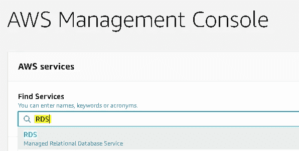

(图片由作者提供)

向下滚动一点，点击“创建数据库”框。

(图片由作者提供)

您需要选择标准选项和 MySQL 作为引擎选项。

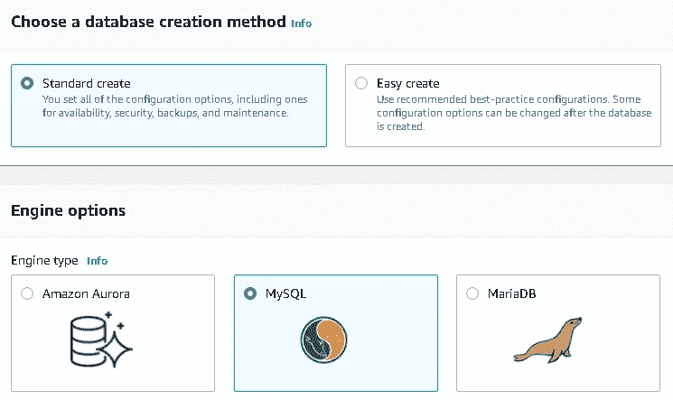

(图片由作者提供)

你不需要改变版本。确保选择模板下的“自由层”。

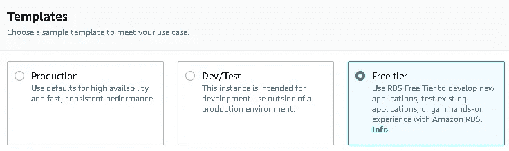

(图片由作者提供)

在模板下的 settings 部分中，键入数据库实例的名称、主用户的登录 ID，并创建密码。

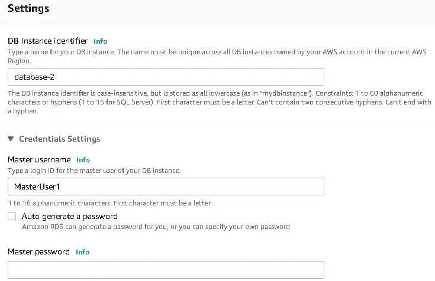

(图片由作者提供)

对于数据库实例大小，空闲层只有一个选项，即 db.t2.micro。

对于存储，只需选择通用和默认的 20 GB。确保取消选中“启用存储自动缩放”选项。

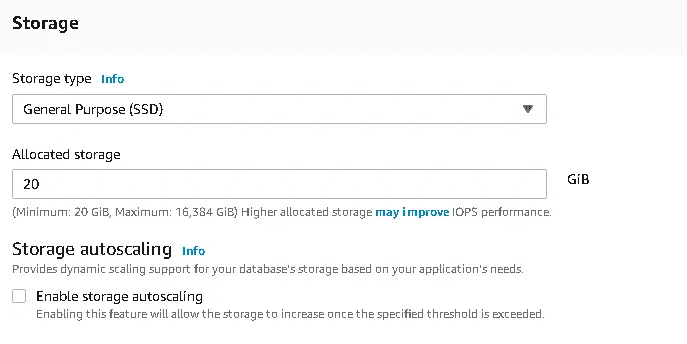

(图片由作者提供)

多 AZ 部署不适用于自由层，因此我们将跳过它。

下一部分是“连接性”。选择默认的 VPC。确保为公共访问选择“是”,并创建一个新的 VPC 组。

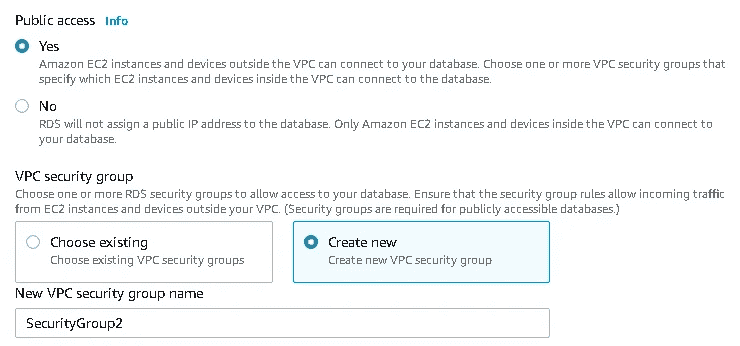

(图片由作者提供)

创建新的 VPC 组非常重要，因为这将创建一个安全组，允许从您当前使用的设备的 IP 地址连接到所创建的数据库。

对于数据库端口，保留默认值 3306。

在 additional configuration 部分，键入一个初始数据库名称，并将其他两个选项保留为默认设置。

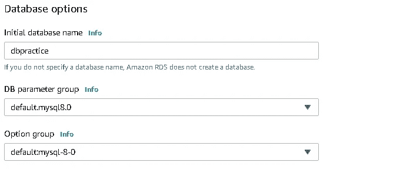

(图片由作者提供)

对于其余的配置部分，默认选择就可以了。确保未选择“监控”选项。

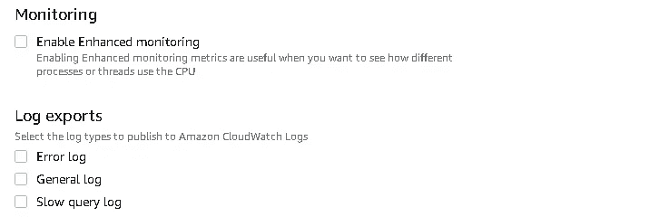

(图片由作者提供)

现在，您可以向下滚动到页面的末尾，并单击“创建数据库”框。

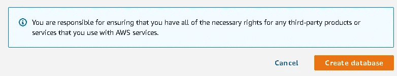

(图片由作者提供)

点击“创建数据库”后，您将被定向到 Amazon RDS 仪表板中的数据库。状态将被视为“正在创建”一段时间，然后变为“可用”。

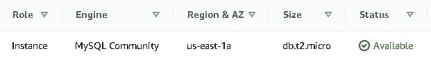

(图片由作者提供)

# **2。使用 MySQL Workbench** 连接到数据库

下一步是下载同样免费的 [MySQL 工作台](https://dev.mysql.com/downloads/workbench/)。

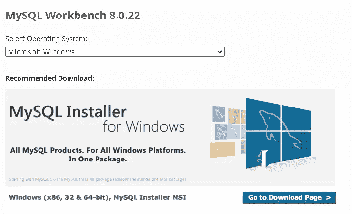

(图片由作者提供)

为您的计算机选择合适的版本，下载，然后安装。

在 MySQL Workbench 控制台上，单击顶部“数据库”部分下的“连接到数据库”。

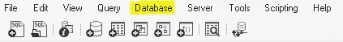

(图片由作者提供)

将弹出以下屏幕。

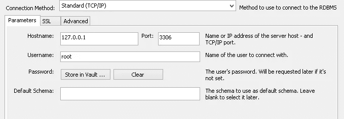

(图片由作者提供)

*   主机名:数据库的端点。当您单击数据库实例时，可以看到端点。

(图片由作者提供)

*   端口:3306
*   用户名:创建数据库时输入的用户名(我输入的是 MasterUser1)
*   密码:点击“存储在保险库中”并输入您创建的密码

然后，点击“确定”。

恭喜你！现在，您已经连接到 AWS 上的数据库。MySQL Workbench 将打开一个 SQL 编辑器，这样您就可以开始练习和运行查询了。

在运行查询之前，还有最后一件事要做。单击“schemas ”,然后双击要使用的数据库。现在只有一个。

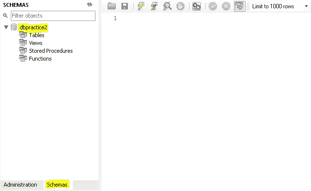

(图片由作者提供)

# **3。练习部分**

我们现在准备走了。让我们运行几个简单的 SQL 查询。

## 创建表格

在编辑器中键入以下 SQL 代码，然后单击 run。

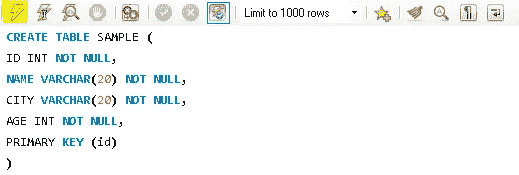

(图片由作者提供)

现在，您的数据库中有了一个表。该表的名称是“sample ”,它有 4 列。

要获得该表的概述，在编辑器中键入“DESC 示例”,并运行它。

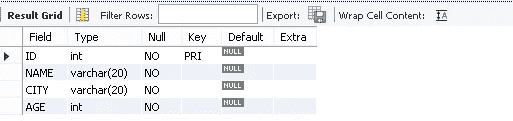

(图片由作者提供)

## **插入一行**

“样本”表现在是空的。我们可以使用 insert 函数添加条目。

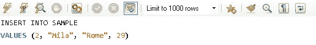

(图片由作者提供)

我已经使用上面的插入查询添加了两个条目。

## 从表中选择

我们现在可以看到表中的条目。下面的 select 查询将查询表中的所有行。

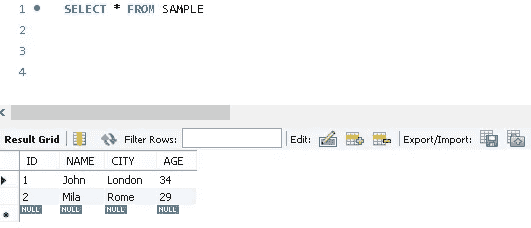

(图片由作者提供)

# **结论**

我们使用 Amazon RDS 服务在 AWS 上创建了一个 MySQL 数据库，并使用 MySQL Workbench 连接到它。

我们现在可以通过在真实数据库上练习来提高我们的 SQL 技能。它模拟了现实生活中的工作场景，我认为这会激励你，让你更容易学习 SQL。

感谢您的阅读。如果您有任何反馈，请告诉我。