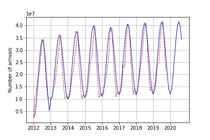
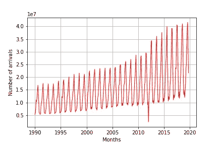
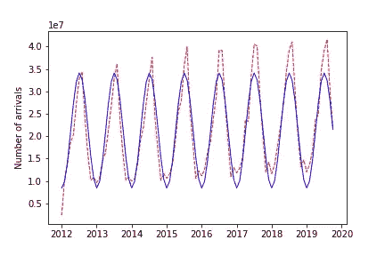
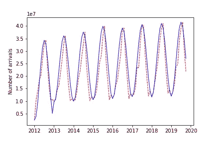
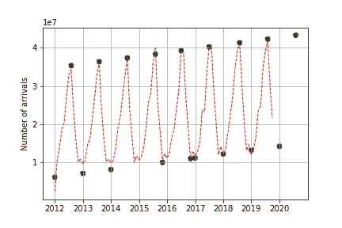

# 如何在 Python 中预测可变正弦曲线

> 原文：<https://towardsdatascience.com/how-to-predict-a-variable-sinusoid-in-python-4a21404dc061?source=collection_archive---------19----------------------->

## 数据分析

## 基于数学的预测 Python 中可变正弦曲线的方法。



本教程描述了如何用 Python 预测一个可变正弦曲线。首先，从 CSV 文件加载一些正弦数据。然后，通过正弦曲线对数据进行整形。之后，使用线性回归对最小和最大峰值进行建模。最后，建模的线用于计算下一个峰值。

完整的代码可以从我的 [Github 库](https://github.com/alod83/data-science/tree/master/DataAnalysis/tourism)下载。

分析的数据:旅游住宿机构的到达人数摘自[https://ec.europa.eu/eurostat/web/tourism/data/database](https://ec.europa.eu/eurostat/web/tourism/data/database)

# 数据导入和清理

## 从 CSV 加载数据并清除它们

首先，我们读取 CSV 文件，我们只选择与意大利(`df[df['geo'] == 'IT']`)相关的数据，以数字(`df[df['unit'] == 'NR']`)的形式，并参考所有可用数据的总和(内部和外部到达)(`df[df['c_resid'] == 'TOTAL']`)。

然后我们通过函数`drop()`删除无用的列。注意，我们通过参数`inplace=True`将效果存储在原始变量`df`中。

```
import pandas as pd
df = pd.read_csv(‘data/eurostat.csv’)
df = df[df[‘geo’] == ‘IT’]
df = df[df[‘unit’] == ‘NR’]
df = df[df[‘c_resid’] == ‘TOTAL’]
df.drop([‘c_resid’, ‘unit’, ‘nace_r2’, ‘2019M11’, ‘geo’],axis=1, inplace=True)
df = df.reset_index()
df.drop([‘index’],axis=1, inplace=True)
```

现在我们可以纠正数据中的一些错误:一些行包含字符`:`，这意味着没有可用的数据。其他行包含字母`b`。我们改变了`0`中的`:`，并删除了字母`b`。

```
columns = df.columns[::-1]
for column in columns:
 for row in range(1, len(df[column])):
 if “b” in df[column][row]:
 df[column] = df[column][row][:-2]
 if “:” in df[column][row]:
 df[column][row] = “0”
```

现在我们计算各列的总和，以获得每个月的总到达人数。我们将结果存储在变量`y`中。

```
y = []
for column in columns:
 df[column] = df[column].astype(str).astype(int)
 y.append(df[column].sum())
```

# 初步分析

## 绘制数据以了解数据趋势

我们绘制`y`来理解趋势线。我们构建辅助向量`X`，它包含所有的月份。0 月指的是 1990 年 1 月。为了每 5 年在图中显示 x 标签，我们构建了两个辅助变量，`x_ticks`和`x_labels`。

```
import matplotlib.pyplot as plt
import matplotlib
import numpy as np
X = np.arange(0, len(columns))step = 5
x_ticks = np.arange(0, len(columns)+step, step=12*step)
x_labels = []
x_labels.append(1990)
for i in range(1, len(x_tick)+1):
 x_labels.append(x_labels[i-1]+step)
plt.xticks(x_ticks, x_labels)
plt.plot(X, y, color=”red”, linewidth=1)plt.grid()
plt.xlabel(‘Months’)
plt.ylabel(‘Number of arrivals’)plt.show()
```



我们注意到，与前几年相比，在过去的 8 年中，最大峰值有所增加。因此，我们限制了过去 8 年的分析。这意味着我们应该跳过最初的 22 年。我们将`X`和`y`重置为仅适用于最近几年。

```
skip = 22*12
X = X[skip:]
y = y[skip:]
```

# 数据近似值

## 用正弦曲线逼近数据

现在我们可以用正弦曲线来近似数据。正弦曲线的方程式为`A*np.sin(omega*x+phase) + offset`，其中:

*   | `A` |表示振幅，即函数最大值和最小值之间距离的一半
*   `omega`是 0 到 2pi 之间的循环数。周期 T 是 2pi/ω
*   `phase`是水平移动
*   `offset`是垂直位移，即最小峰值和振幅之和。下面是一些关于偏移的细节:[https://www . ck12 . org/book/CK-12-precalculus-concepts/section/5.4/](https://www.ck12.org/book/ck-12-precalculus-concepts/section/5.4/)

关于正弦曲线的更多细节，可以给看看:[https://mathbitsnotebook . com/代数 2/trig graphs/TG sinusoid . html](https://mathbitsnotebook.com/Algebra2/TrigGraphs/TGsinusoidal.html)。

```
def sinusoid(x,A,offset,omega,phase):
 return A*np.sin(omega*x+phase) + offset
```

我们还定义了正弦曲线的初始值。我们设置周期`T = 12`，即一年中的月数。如果不知道周期，我们应该计算它。我们可以使用快速傅立叶变换。在这些链接中，你可以找到更多关于这方面的细节:[https://stack overflow . com/questions/16716302/how-do-I-fit-a-sine-curve-to-my-data-with-pylab-and-numpy](https://stackoverflow.com/questions/16716302/how-do-i-fit-a-sine-curve-to-my-data-with-pylab-and-numpy)、[https://www . oreilly . com/library/view/elegant-scipy/9781491922927/ch04 . html](https://www.oreilly.com/library/view/elegant-scipy/9781491922927/ch04.html)

```
T = 12
def get_p0(x, y):

 A0 = (max(y[0:T]) — min(y[0:T]))/2
 offset0 = y[0]
 phase0 = 0
 omega0 = 2.*np.pi/T
 return [A0, offset0,omega0, phase0]
```

现在我们准备用正弦曲线来近似我们的数据。我们使用`scipy`提供的`curve_fit()`函数。我们绘制结果。关于`curve_fit()`功能的更多细节，请看[https://docs . scipy . org/doc/scipy/reference/generated/scipy . optimize . curve _ fit . html](https://docs.scipy.org/doc/scipy/reference/generated/scipy.optimize.curve_fit.html)。

```
from scipy.optimize import curve_fit
import math
param, covariance = curve_fit(sinusoid, X, y, p0=get_p0(X,y))step = 1
x_ticks = np.arange(skip, skip+len(X)+step+12, step=12*step)
x_labels = []
x_labels.append(2012)
for i in range(1, len(x_tick)+13):
 x_labels.append(x_labels[i-1]+step)
plt.xticks(x_ticks, x_labels)
plt.ylabel(‘Number of arrivals’)
plt.plot(X, y, color=”red”, linewidth=1,linestyle=’dashed’)
plt.plot(X, sinusoid(X, *param), color=”blue”, linewidth=1)
plt.show()
```



我们用恒定值为`A`的正弦曲线来近似我们的数据。在我们的例子中，振幅`A`和`offset`都是可变的。这个想法是计算我们数据中所有的最大峰值和最小峰值。然后我们可以使用它们的差来计算振幅的向量，并将它们传递给`sinusoid()`函数。

我们定义了函数`get_peaks()`，它计算一个数组的峰值。我们每隔`T`个元素对数组进行采样，并计算每个`T`内的峰值。

```
def get_peaks(y, metrics):
 n = int(math.ceil(len(y)/T))
 step = 0
 x_peaks = []
 y_peaks = []
 for i in range(0,n):
 peak_index = y.index(metrics(y[step:step+T]))
 x_peaks.append(peak_index + skip)
 y_peaks.append(y[peak_index])
 step = step+T
 return [x_peaks,y_peaks]
```

我们计算最大和最小峰值。

```
min_peaks = get_peaks(y,min)
max_peaks = get_peaks(y,max)
```

现在我们可以计算振幅和偏移的数组。

```
A = []
offset = []
for i in range(0, len(min_peaks[1])):
 c_a = (max_peaks[1][i] — min_peaks[1][i])/2
 c_offset = min_peaks[1][i] + c_a
 for j in range(0,T):
 A.append(c_a)
 offset.append(c_offset)
# last two months of 2019 are not available
A = A[:-2]
offset = offset[:-2]
```

由于`A`和`offset`是新特性，我们应该把它们作为变量添加进去。因此，我们定义了一个新变量`features`，它定义了我们模型的新输入特性。然后我们定义函数`variable_sinusoid()`，它将特性作为输入。

我们的模型返回的唯一参数是`omega`和`phase`，因此我们也用初始值`omega`和`phase`修改函数`get_p0()`。新功能称为`variable_get_p0()`。

```
features = [X, A, offset]
def variable_sinusoid(features,omega,phase):
 x = features[0]
 A = features[1]
 offset = features[2]
 return A*np.sin(omega*x+phase) + offsetdef variable_get_p0(x, y): 
 phase0 = 0
 omega0 = 2.*np.pi/T
 return [omega0, phase0]
```

我们拟合模型并绘制结果。

```
param, covariance = curve_fit(variable_sinusoid, features, y, p0=variable_get_p0(X,y))
plt.xticks(x_ticks, x_labels)
plt.ylabel(‘Number of arrivals’)
plt.plot(X, y, color=”red”, linewidth=1,linestyle=’dashed’)
plt.plot(X, variable_sinusoid(features, *param), color=”blue”, linewidth=1)
plt.show()
```



# 预测未来趋势线

## 预测可变正弦曲线的未来值

下一步包括预测下一个正弦曲线，即 2020 年的正弦曲线。为此，我们需要计算下一个最大和最小峰值。我们可以通过用两个线性回归分别逼近最大和最小峰值的向量来做到这一点。然后，我们可以计算出瞬时 2020 年 8 月)的最大峰值，作为瞬时(i-1) + pi (i-1 代表 2019 年 8 月)给出的最大线性回归的 y 值。同样，我们可以计算出 2020 年的最小峰值。

首先，我们对要传递给线性模型的峰值进行整形。然后，我们使用`sklearn`类`LinearRegression()`建立两个线性模型，每条预测线一个。之后，我们使用`fit()`函数拟合每个模型。

```
from sklearn import linear_model
# reshape x_peaks
x_min_peaks = list(map(lambda el:[el], min_peaks[0])) 
x_max_peaks = list(map(lambda el:[el], max_peaks[0]))# min model
model_min = linear_model.LinearRegression()
model_min.fit(x_min_peaks,min_peaks[1])
# max model
model_max = linear_model.LinearRegression()
model_max.fit(x_max_peaks,max_peaks[1])
```

我们将下一个峰值添加到`x_max_peaks`和`x_min_peaks`，然后通过`predict()`函数预测最大和最小峰值。

```
x_min_peaks.append([x_min_peaks[len(x_min_peaks) -1][0] + T])
x_max_peaks.append([x_max_peaks[len(x_max_peaks) -1][0] + T])
y_pred_min = model_min.predict(x_min_peaks)
y_pred_max = model_max.predict(x_max_peaks)
```

我们绘制了两条预测线。

```
plt.xticks(x_ticks, x_labels)
plt.plot(X, y, color=”red”, linewidth=1,linestyle=’dashed’)
plt.scatter(x_min_peaks, y_pred_min, color=”green”, linewidth=1,linestyle=’dashed’)
plt.scatter(x_max_peaks, y_pred_max, color=”green”, linewidth=1,linestyle=’dashed’)
plt.ylabel(‘Number of arrivals’)
plt.grid()
plt.show()
```



我们计算所有周期的正弦曲线，包括 2020 年。我们构建一个变量`X_pred`，它包含`X`和 2020 年的 12 个月。

```
X_pred = np.array(X)
month = X_pred[len(X_pred)-1]
for i in range(0,T):
 X_pred = np.append(X_pred,month)
 month = month + 1
```

现在，我们可以更新要传递给`variable_sinusoid()`函数的变量`features_pred`。首先，我们用新值更新振幅`A`和`offset`，然后我们更新`features_pred`变量。

```
index = len(max_peaks[0])-1
c_a = (max_peaks[1][index] — min_peaks[1][index])/2
c_offset = min_peaks[1][index] + c_a
for j in range(0,T):
 A.append(c_a)
 offset.append(c_offset)
features_pred = [X_pred,A,offset]
```

最后，我们绘制图表。

```
plt.xticks(x_ticks, x_labels)
plt.plot(X, y, color=”red”, linewidth=1,linestyle=’dashed’)
plt.plot(X_pred, variable_sinusoid(features_pred, *param), color=”blue”, linewidth=1)
plt.grid()
plt.ylabel(‘Number of arrivals’)
plt.savefig(“data/sinusoid.png”)
plt.show()
```


# 吸取的教训

在本教程中，我介绍了一种通过可变正弦曲线来逼近正弦趋势数据的方法。然后我描述了预测下一个数据值的机制。

所描述的方法可以推广到所有类型的曲线:

*   加载和清理数据
*   绘制数据以了解趋势线
*   通过`curve_fit()`功能用曲线逼近趋势线
*   绘制近似结果，并与原始数据趋势线进行比较
*   如果需要，改进近似趋势线
*   重复前两步，直到你得到一个好的近似值
*   计算(线性、多项式、…)回归以预测未来值
*   使用预测值更新近似趋势线。

如果你读到这里，对我来说，今天已经很多了。谢谢！你可以在[这个链接](https://alod83.medium.com/my-most-trending-articles-4fbfbe107fb)阅读我的趋势文章。

# 相关文章

[](/a-complete-data-analysis-workflow-in-python-pycaret-9a13c0fa51d4) [## Python PyCaret 中的完整数据分析工作流

### 这是一个现成的教程，利用了我用过的最好的机器学习库。

towardsdatascience.com](/a-complete-data-analysis-workflow-in-python-pycaret-9a13c0fa51d4) [](/a-complete-data-analysis-workflow-in-python-and-scikit-learn-9a77f7c283d3) [## Python 和 scikit 中的完整数据分析工作流程-学习

towardsdatascience.com](/a-complete-data-analysis-workflow-in-python-and-scikit-learn-9a77f7c283d3) [](/an-overview-of-visual-techniques-for-exploratory-data-analysis-in-python-d35703d43faf) [## Python 中探索性数据分析的可视化技术概述

### 关于如何在 seaborn 和 matplotlib 中为 Visual EDA 绘制最常见图形的教程

towardsdatascience.com](/an-overview-of-visual-techniques-for-exploratory-data-analysis-in-python-d35703d43faf) 

# 在等待机器学习算法的输出时，你在做什么？

数据科学家的工作非常具有挑战性:你的知识必须涵盖从数据挖掘到数据分析，直到数据可视化。**你从不停止**。

然而，当你启动一个繁重的计算时，比如一个大数据集上的机器学习算法，会发生什么呢？你停下来等待结果。你可能会盯着屏幕看几个小时，希望你的剧本能完成。

不管怎么说，这不是消磨时间的最佳方式。你应该做些别的事情。你不能坐下来等待结果。

在这里继续阅读。

# 保持联系！

*   在[媒体](https://medium.com/@alod83?source=about_page-------------------------------------)上跟随我
*   注册我的[简讯](https://medium.com/subscribe?source=about_page-------------------------------------)
*   在 [LinkedIn](https://www.linkedin.com/in/angelicaloduca/?source=about_page-------------------------------------) 上连接
*   在推特上关注我
*   跟着我上[脸书](https://www.facebook.com/alod83?source=about_page-------------------------------------)
*   在 [Github](https://github.com/alod83?source=about_page-------------------------------------) 上关注我