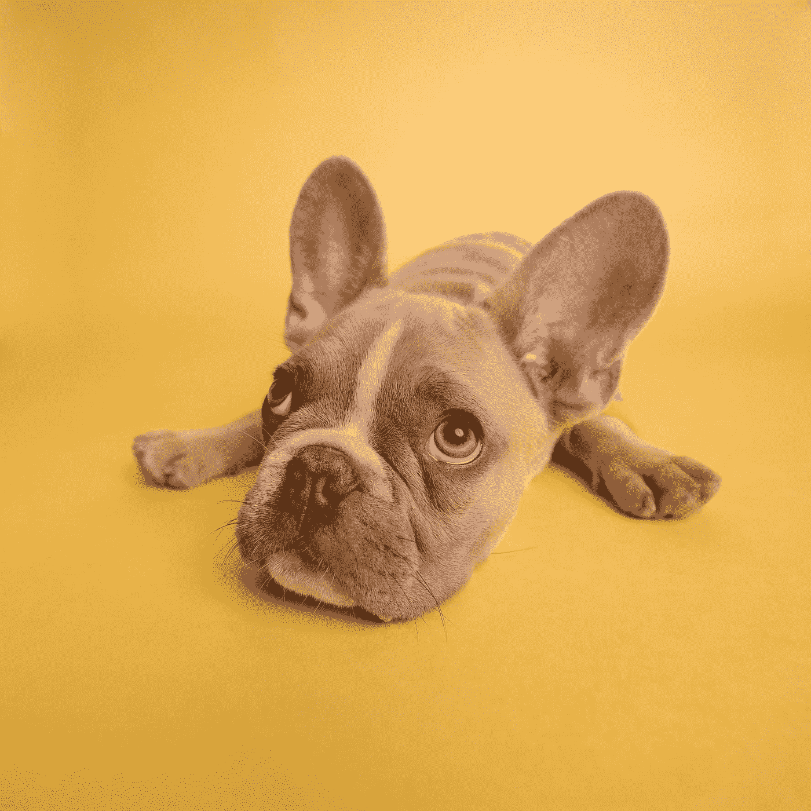
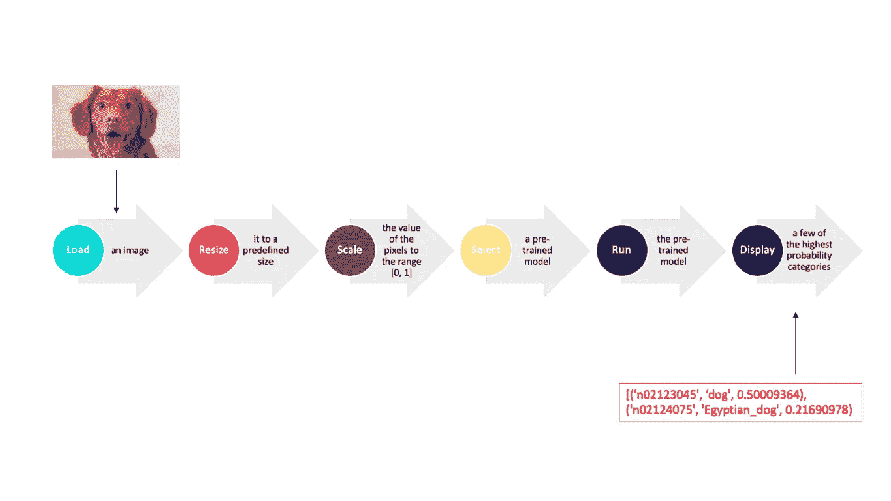
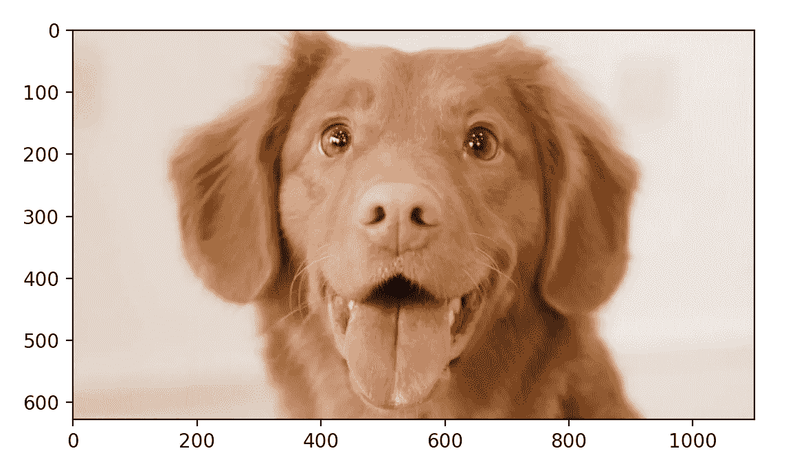
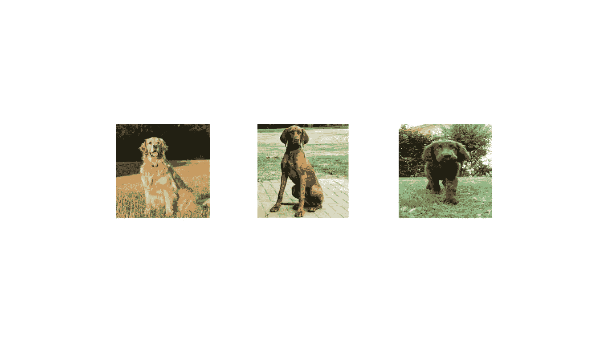

# 如何用带有 Keras 的 CNN 预测一个图像？

> 原文：<https://towardsdatascience.com/how-to-predict-an-image-with-keras-ca97d9cd4817?source=collection_archive---------0----------------------->

## 图片里有什么？



由[卡斯滕·怀恩格特](https://unsplash.com/@karsten116?utm_source=medium&utm_medium=referral)在 [Unsplash](https://unsplash.com?utm_source=medium&utm_medium=referral) 上拍摄的照片

# 如何预测图像的类型？

确定图像包含什么对象有以下六个步骤？

*   加载图像。
*   将其调整为预定义的大小，如 224 x 224 像素。
*   将像素值缩放到范围[0，255]。
*   选择预先训练的模型。
*   运行预先训练的模型。
*   显示结果。



如何预测图像的类型

# 使用 Keras 实施解决方案

## 要求

安装 TensorFlow 和 Keras。

```
pip install tensorflow
```

## 设置您的环境

首先，我们设置环境。

```
# TensorFlow and tf.kerasimport tensorflow as tf
from tensorflow.keras.applications.resnet50 import preprocess_input, decode_predictions
from tensorflow.keras.preprocessing import image# Helper libraries
import numpy as np
import matplotlib.pyplot as plprint(tf.__version__)
```

## 加载图像

然后，我们加载并尝试显示我们想要预测的图像。

```
img_path = "./samples/dog_1100x628.jpg"plt.imshow(img)
plt.show()
```

它展示了一只维兹拉狗，那么我们的模型如何预测这个图像呢？



## 调整图像大小

请记住，在将任何图像输入 Keras 之前，我们需要将其转换为标准格式，因为预先训练的模型希望输入具有特定的大小。在这种情况下，我们需要将图像的大小调整为 224 x 224 像素。

```
img = image.load_img(img_path, target_size=(224, 224))
```

第二是大多数深度学习模型期望一批图像作为输入。在这种情况下，我们创建一批一个图像。

```
img_array = image.img_to_array(img)
img_batch = np.expand_dims(img_array, axis=0)
```

## 将像素值缩放到一致的范围

第三，当数据在一个一致的范围内时，模型表现良好。在这种情况下，图像像素值的范围是从 0 到 255。因此，如果我们在输入图像上运行 Keras 的`preprocess_input()`函数，就会将每个像素标准化到一个标准范围。

```
img_preprocessed = preprocess_input(img_batch)
```

## 选择预先训练的模型

这里，我们将使用一个名为 ResNet-50 的 CNN 网络。

```
model = tf.keras.applications.resnet50.ResNet50()
```

## 运行预先训练的模型

```
prediction = model.predict(img_preprocessed)
```

## 显示结果

Keras 还提供了`decode_predictions`函数，它告诉我们图像中包含的每一类对象的概率。

```
print(decode_predictions(prediction, top=3)[0])
```

下面是运行这个程序时的输出。

```
[(‘n02099601’, ‘golden_retriever’, 0.75317645), 
(‘n02100583’, ‘vizsla’, 0.061531797), 
(‘n02099267’, ‘flat-coated_retriever’, 0.04048888)]
```

该图像的预测类别是各种类型的狗。



三种狗

完整的源代码完成。

很简单，对吧？

# 参考

[https://github . com/house cricket/how _ to _ predict _ an _ image _ with _ keras](https://github.com/housecricket/how_to_predict_an_image_with_keras)