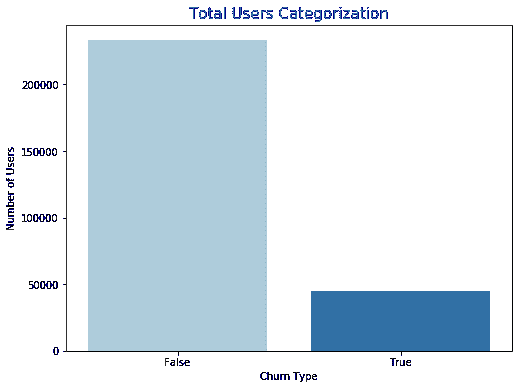
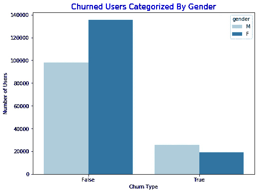
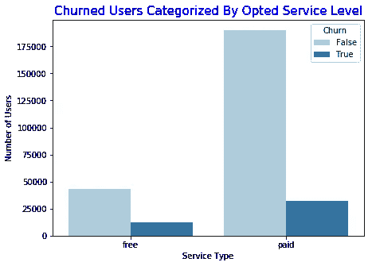
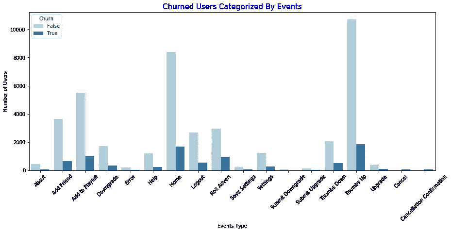
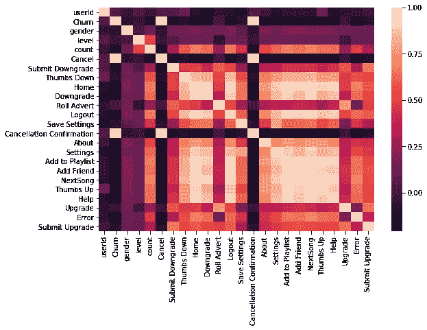
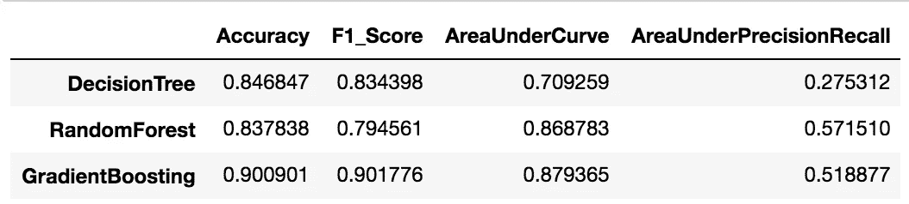

# 如何在 Spark 上使用机器学习模型预测客户流失？

> 原文：<https://towardsdatascience.com/how-to-predict-customer-churn-using-machine-learning-model-on-spark-99f5277993b7?source=collection_archive---------34----------------------->

## 使用 Spark 探索您的大数据，这是一种初学者方法。


Oleg Gratilo 在 [Unsplash](https://unsplash.com/s/photos/spark-in-nature?utm_source=unsplash&utm_medium=referral&utm_content=creditCopyText) 上拍摄的照片

*如果你以前处理过机器学习模型，你就会知道处理庞大数据集时的感受。在某些时候，我们都意识到了这一障碍，并选择使用较小部分的数据，从数据分析和训练模型开始。*

# 介绍

大数据非常模糊，但我们都同意，每当我们感觉到笔记本电脑或机器的计算能力受到限制时，由于数据集的巨大规模，我们会将其视为大数据问题。而且，让我们面对现实吧，像 [pandas](/why-and-how-to-use-pandas-with-large-data-9594dda2ea4c) 这样的 python 数据分析库，由于其本地内存限制和性能问题，在处理大型数据集时有其自身的局限性。

# 商业理解

Sparkify 是一个虚构的音乐流媒体服务，就像 Spotify 或 Pandora 一样，我将使用 *Sparkify 流失预测*作为问题陈述来详细解释这篇文章。我将在这个项目中使用 PySpark。

***注*** *: Sparkify 数据集由 Udacity 数据科学家纳米学位项目提供，本文是我的顶点项目的一部分。*

# 数据理解

我在本地机器上用 Udacity 提供的小型 Sparkify 数据集开始进行探索性数据分析。

```
*# loading dataset*
df = spark.read.json("mini_sparkify_event_data.json")*# columns in dataset*
df.printSchema()root
 |-- artist: string (nullable = true)
 |-- auth: string (nullable = true)
 |-- firstName: string (nullable = true)
 |-- gender: string (nullable = true)
 |-- itemInSession: long (nullable = true)
 |-- lastName: string (nullable = true)
 |-- length: double (nullable = true)
 |-- level: string (nullable = true)
 |-- location: string (nullable = true)
 |-- method: string (nullable = true)
 |-- page: string (nullable = true)
 |-- registration: long (nullable = true)
 |-- sessionId: long (nullable = true)
 |-- song: string (nullable = true)
 |-- status: long (nullable = true)
 |-- ts: long (nullable = true)
 |-- userAgent: string (nullable = true)
 |-- userId: string (nullable = true)*# Number of Rows*
df.count()286500# *showing types of events in dataset or pages a user might visit while using the Sparkify app.*df.select("page").dropDuplicates().show()+--------------------+
|                page|
+--------------------+
|              Cancel|
|    Submit Downgrade|
|         Thumbs Down|
|                Home|
|           Downgrade|
|         Roll Advert|
|              Logout|
|       Save Settings|
|Cancellation Conf...|
|               About|
|            Settings|
|     Add to Playlist|
|          Add Friend|
|            NextSong|
|           Thumbs Up|
|                Help|
|             Upgrade|
|               Error|
|      Submit Upgrade|
+--------------------+
```

# 数据准备

在数据准备期间，我处理了一些数据挑战，比如缺失值、数据清理、输入分类变量以及确定一个目标变量来预测流失的客户。

为了准确预测流失的客户，我们需要他们的 ***userId*** 信息，因此通过删除 ***userId*** 为 null 或空的所有行来清理数据。

添加一个目标变量为*。如果用户访问了“ ***取消确认*** ”页面，则*列的值为 1，否则为 0。**

## **数据可视化**

***让我们通过可视化方式更深入地了解 Sparkify 客户。***

********

**按流失类型划分的总客户分布**

****

**基于服务水平的总客户分布**

> **Sparkify 有两种服务，一种是免费的广告服务，另一种是付费服务。我们的目标是在付费客户停止使用该应用程序之前识别他们。**

*****下面的事件代表了一组非常重要的特征来预测被搅动的顾客。*****

****

**总事件分布**

## **特征工程**

**是时候选择重要的特征来训练我们的机器学习模型了。**

```
****['gender', 'level', 'page', 'userId', 'Churn']****
```

*****页面的*** 列将进一步划分为它的事件。**

```
**df.groupBy(["userId", "Churn", "gender", "level"]).count().show()+------+-----+------+-----+-----+
|userId|Churn|gender|level|count|
+------+-----+------+-----+-----+
|200008|    0|     1|    1| 1988|
|    93|    0|     0|    0|  566|
|100013|    1|     1|    0|  303|
|    91|    0|     0|    1| 2862|
|     4|    0|     0|    0|  141|
|300021|    0|     1|    1| 4650|
|100019|    1|     0|    0|   89|
|100021|    1|     0|    0|  319|
|   140|    0|     1|    1| 5662|
|    73|    1|     1|    0|   16|
|    59|    0|     0|    1|  693|
|200025|    0|     0|    0|  597|
|    41|    0|     1|    1| 2220|
|    37|    0|     0|    0|   79|
|    54|    1|     1|    1| 2859|
|    69|    0|     1|    0|   39|
|200024|    1|     0|    0|  342|
|300005|    0|     1|    0|   64|
|    27|    0|     0|    0|  291|
|   101|    1|     0|    0|   76|
+------+-----+------+-----+-----+
only showing top 20 rowsEvent_list = [(row['page']) for row in df.select('page').dropDuplicates().collect()]
for event in Event_list:
    df_temp = df.filter(df.page==event).groupBy(df.userId).count()
    df_temp = df_temp.withColumnRenamed('count', event)
    df_sparkify = df_sparkify.join(df_temp, 'userId', how='left')**
```

***将* ***页面*** *事件分发到自己的类别中作为一列后，dataframe 看起来是这样的。***

```
**df_sparkify.printSchema()root
 |-- userId: integer (nullable = true)
 |-- Churn: integer (nullable = true)
 |-- gender: integer (nullable = true)
 |-- level: integer (nullable = true)
 |-- count: long (nullable = false)
 |-- Cancel: long (nullable = true)
 |-- Submit Downgrade: long (nullable = true)
 |-- Thumbs Down: long (nullable = true)
 |-- Home: long (nullable = true)
 |-- Downgrade: long (nullable = true)
 |-- Roll Advert: long (nullable = true)
 |-- Logout: long (nullable = true)
 |-- Save Settings: long (nullable = true)
 |-- Cancellation Confirmation: long (nullable = true)
 |-- About: long (nullable = true)
 |-- Settings: long (nullable = true)
 |-- Add to Playlist: long (nullable = true)
 |-- Add Friend: long (nullable = true)
 |-- NextSong: long (nullable = true)
 |-- Thumbs Up: long (nullable = true)
 |-- Help: long (nullable = true)
 |-- Upgrade: long (nullable = true)
 |-- Error: long (nullable = true)
 |-- Submit Upgrade: long (nullable = true)**
```

****

**相关性—热图**

*****注意*** *: Dataframe 可能看起来与全数据集不同，在 AWS Spark 上运行。***

**将所有列字符串值更改为数字形式后，dataframe 就可以进行建模了。**

***注:为了防止* [*数据在建模过程中泄露*](https://machinelearningmastery.com/data-leakage-machine-learning/) *，删除了“取消”和“取消确认”栏。***

# **建模**

**AWS Spark MLlib 库支持很多有监督和无监督的机器学习算法。我使用了决策树分类器、随机森林分类器和梯度推进分类器来训练三个模型，并在选择获胜模型之前比较结果。**

## ****列车测试分割****

```
**# spliting in 70% training and 30% testing settrain_data,test_data = final_data.randomSplit([0.7,0.3])**
```

## **分类器**

```
**# Using three classifiers before finalizing best performerdtc=DecisionTreeClassifier(labelCol='Churn',featuresCol='features')
rfc=RandomForestClassifier(labelCol='Churn',featuresCol='features', numTrees=300)
gbt=GBTClassifier(labelCol='Churn',featuresCol='features')# fit the models
dtc_model = dtc.fit(train_data)
rfc_model = rfc.fit(train_data)
gbt_model = gbt.fit(train_data)# transform the models
dtc_predictions = dtc_model.transform(test_data)
rfc_predictions = rfc_model.transform(test_data)
gbt_predictions = gbt_model.transform(test_data)**
```

## **评估指标**

**在 pySpark 中，我们可以不打印混淆矩阵，而是要用***multiclassacrificationevaluator***来评估 ***准确度*** 和 ***f1_score*** 。我们也可以使用 BinaryClassificationEvaluator 来计算[*ROC 曲线下的面积和 Precision-Recall 下的面积。*](https://stats.stackexchange.com/questions/90779/area-under-the-roc-curve-or-area-under-the-pr-curve-for-imbalanced-data)**

```
**# calculating accuracy
acc_evaluator = MulticlassClassificationEvaluator(labelCol="Churn",predictionCol="prediction",metricName="accuracy")# calculating f1 score
f1_evaluator = MulticlassClassificationEvaluator(labelCol="Churn",predictionCol="prediction", metricName="f1")areaUnderROC = BinaryClassificationEvaluator(labelCol='Churn',metricName='areaUnderROC')areaUnderPR = BinaryClassificationEvaluator(labelCol='Churn',metricName='areaUnderPR')dtc_acc = acc_evaluator.evaluate(dtc_predictions)
rfc_acc = acc_evaluator.evaluate(rfc_predictions)
gbt_acc = acc_evaluator.evaluate(gbt_predictions)dtc_f1 = f1_evaluator.evaluate(dtc_predictions)
rfc_f1 = f1_evaluator.evaluate(rfc_predictions)
gbt_f1 = f1_evaluator.evaluate(gbt_predictions)dtc_auc = areaUnderROC.evaluate(dtc_predictions)
rfc_auc = areaUnderROC.evaluate(rfc_predictions)
gbt_auc = areaUnderROC.evaluate(gbt_predictions)dtc_aupr = areaUnderPR.evaluate(dtc_predictions)
rfc_aupr = areaUnderPR.evaluate(rfc_predictions)
gbt_aupr = areaUnderPR.evaluate(gbt_predictions)**
```

****

**比较所有模型的评估**

# **结果**

**预测和防止客户流失对每个公司来说都意味着巨大的额外潜在利益来源。我们的目标从一开始就是识别那些 Sparkify 客户。**

**在不同评价指标上比较所有模型后，**梯度提升**表现优于其他两个。您可以看到梯度增强算法的 f1 值为 0.90，而随机森林的 f1 值为 0.79。**

**我相信一个模型有更高的回忆分数[](https://datascience.stackexchange.com/questions/30881/when-is-precision-more-important-over-recall)**用于积极的客户流失分类。用 Lehman 的话来说，选择一个能够预测较少假阴性(类别为 1 但预测为 0 的情况)而不是假阳性(类别为 0 但预测为 1 的情况)的模型，以成功识别流失客户。****

****我将选择梯度推进分类器作为我现在的最终模型。****

# ****部署****

****作为我未来的工作，我将在 AWS Spark Cluster 上运行这段代码。但是，我现在不会在任何地方部署这个模型。****

## ****未来作品****

1.  ****在未来，我可以尝试将整个数据集分离成每月或每周的数据，并预测下个月或下个星期的客户。****
2.  ****我可以通过结合两种或更多种算法来使用更先进的机器学习技术，以提高整体预测率。****
3.  ****我可以在 AWS 集群上运行这个来查看模型性能，并使用交叉验证来获得更好的 f1 分数。****

*****附注:在我的数据科学项目中，我总是试图遵循 CRISP-DM 方法。*****

*****本文是 Udacity 数据科学家纳米学位项目的一部分。要查看更多关于此分析的内容，请在此处* *查看我的 Github 可用链接* [*。*](https://github.com/Minsifye/Sparkify/blob/master/Sparkify.ipynb)****