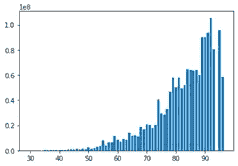
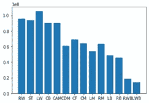
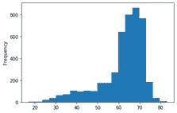
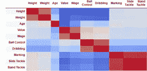
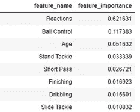

# 用随机森林模型估计国际足联球员的价值

> 原文：<https://towardsdatascience.com/how-to-predict-fifa-players-value-with-random-forest-model-8869daa4263c?source=collection_archive---------56----------------------->


米奇·罗森在 [Unsplash](https://unsplash.com/?utm_source=medium&utm_medium=referral) 上的照片

**背景:**

每年，EA Sports 都会根据每位国际足联球员目前的状态发布其评级。为了确保数据库中的每个球员都得到适当的评级，EA Sports 会在在线赛季的实时数据库中更新整个赛季的球员评级。

对于数据科学家和足球迷(恰好是我自己)来说，这是一个很好的数据资源。每个国际足联的球员都被赋予了一个分数，包括运球、速度、加速度等等。更重要的是，它为每个球员提供了市场价值和工资。因此，我有兴趣看看我是否可以应用机器学习技术来发现模式，识别和排列特征的重要性，并预测未来新玩家的价值。

虽然球员的价值和工资可能是真实的，但每个属性的评级都是主观的，来自 EA Sports，该公司推广自己的视频游戏 FIFA 2020。尽管有这样的免责声明，但这仍然是一个值得探索的有趣实践。完整的代码可以在这里找到。

**数据收集:**

所有数据来自 fifaindex.com。使用 BeautifulSoup，我通过迭代获得每个玩家的 ID，然后循环进入每个玩家的页面，收集这些属性的评级。数据被用作下一步的输出。

**数据探索:**

与任何数据科学项目一样，我必须清理数据，例如删除“”并将字符串转换为数值。由于大多数属性是针对场上球员的，所以我缩小了范围，排除了那些守门员。同时，我创建了几个我认为更相关的新的派生属性。例如，身体质量指数可能是一个比体重或身高更好的指标。

在所有数据清理之后，数据集中有 17，286 名球员。每个玩家都有自己的价值和 39 个属性。目标是创建一个模型来预测基于这些属性的价值。

接下来，我探索了球员的价值与一些属性如速度、敏捷等之间的关系。他们中的许多人都表现出了很强的人际关系。我还检查了那些分类特征，比如“首选位置”，看看它是否对价值有影响(确实有)。

```
plt.bar(df['Acceleration '], df['Value '])
plt.show()
```



加速度与数值

```
plt.bar(df['Preferred Positions '], df['Value '])
plt.show()
```



位置与价值

对于这些属性，直方图是检查数据是否遵循正态分布的好方法。还检查了相关性。通过颜色编码，可以非常直观地显示哪些属性是正相关/负相关的。

```
df['Dribbling '].plot(kind='hist', bins=20)
plt.show()
```



运球直方图

```
corr = df.corr(method ='pearson')
corr.style.background_gradient(cmap='coolwarm').set_properties(**{'font-size': '0pt'})
```



特征相关性(仅部分显示)

**建立模型:**

为了便于说明，我删除了“工资”和“交易”，它们可以用于单独的练习。作为例行工作的一部分，数据被分成训练和测试两部分。

```
X, y = df.drop(['Value ','Wage ','Deal'], axis=1), df['Value ']
X_train, X_test, y_train, y_test = train_test_split(X, y, test_size=0.2)
```

因为我们的属性包括数值和分类数据，所以引入了两种类型的数据转换(MinMaxScaler 和 OneHotEncoder)。MinMaxScaler 本质上是将不同尺度的数值数据转换成从 0 到 1 的特征范围。OneHotEncoder 用于将分类数据转换为虚拟变量数组。使用 ColumnTransformer，我在一个步骤中转换了所有输入数据，以便进行后续的模型构建。

```
numerical_ix = X_train.select_dtypes(include=['int64', 'float64']).columns
categorical_ix = X_train.select_dtypes(include=['object', 'bool']).columns
t = [('cat', ce.OneHotEncoder(use_cat_names=True), categorical_ix), ('num', MinMaxScaler(), numerical_ix)]
col_transform = ColumnTransformer(transformers=t)
```

为了得到更准确的模型，我应用 KFold 作为交叉估值，将训练数据随机拆分 X 次，分别运行。

```
cv = KFold(n_splits=5, shuffle=True, random_state=0)
```

我使用了 RandomForestRegressor 来开发模型。给定几十个参数组合，我为迭代创建 grid_param，然后引入 GridSearchCV 来运行整个过程。这种迭代将使用一系列不同的参数进行模型拟合，在 5 重交叉验证的基础上，自动找到最佳值。

```
grid_param = {
"m__n_estimators"      : [100, 300, 500],
"m__max_features"      : ["auto", "sqrt", "log2"],
"m__min_samples_split" : [2,4,8],
"m__bootstrap": [True, False],
}gd_sr = GridSearchCV(pipeline,
param_grid=grid_param,
scoring='r2',
cv=cv,
n_jobs=3)
```

一旦最佳模型符合数据，我就将它应用于测试数据。通过比较预测值和真实测试值，我能够得到准确性分数。结果相当令人满意，相关系数为 0.91。

```
y_pred = gd_sr.predict(X_test)
from sklearn.metrics import r2_score
test_score = r2_score(y_test, y_pred)
print(test_score)
```

然后，我进一步检查了特征的重要性，令人惊讶的是，最重要的特征是“反应”,它的价值远远高于任何其他特征，如“冲刺速度”和“击球力量”,我之前怀疑这些特征的重要性很高。另一个最重要的特征是“年龄”，这与国际足联球员的价值呈负相关。这是理所当然但可悲的事实😊。

```
feature_importance = gd_sr.best_estimator_.named_steps['m'].feature_importances_
output = pd.DataFrame(list(zip(feature_name,feature_importance)))
output.columns = ['feature_name','feature_importance']
output.sort_values(by='feature_importance', ascending=False)
```



顶级功能

我尝试了第二个模型梯度推进回归树，另一个健壮的回归模型。同样的交叉估价程序也已实施。结果甚至更好，r 接近 0.94。与随机森林相似，最重要的特征也是“反应”,其他顶级特征也相似。

**结论:**

就像典型的数据科学项目一样，我经历了数据收集、可视化探索、特征转换、交叉估值、参数搜索、模型拟合和测试的过程。最后，我认为参数合适的梯度推进模型是预测国际足联球员价值的最佳模型。

目前，这种模式是所有人的混合体。同时，为不同位置的球员探索和开发不同的模式是值得的。对进攻球员来说，诸如“滑铲”等属性的评分并不像防守球员那样重要。按位置划分球员将有助于建立一个更加精确的模型。