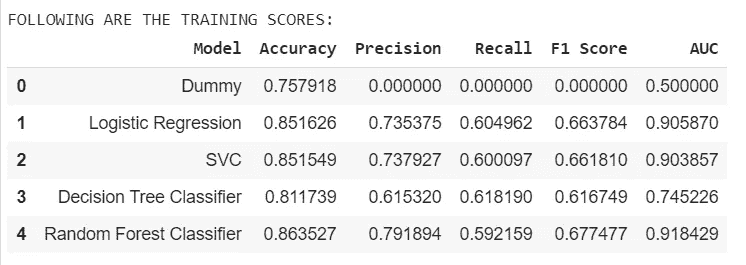

# 房产经纪如何预测美国家庭收入？

> 原文：<https://towardsdatascience.com/how-to-predict-us-household-income-for-real-estate-brokerage-ac86ff581b4e?source=collection_archive---------82----------------------->

## 一个 ML 框架，以潜在买家为目标，并在新冠肺炎驱动的住房危机中促进低成本住房选择

蒂埃拉·马洛卡在 [Unsplash](https://unsplash.com?utm_source=medium&utm_medium=referral) 上拍摄的照片

*一个* ***框架*** *利用数据解决现实世界的商业问题…*

# 思维能力

哈佛大学住房研究联合中心最近的一份报告谈到了美国高成本租金的强劲增长是如何与低成本住房的急剧下降同时发生的。它还谈到了住房不稳定性的增加，其中，2018 年，收入在 3 万美元至 44，999 美元之间的租房者每月剩余 2，010 美元用于非住房支出——比 2001 年每月减少近 9%，或一年内总共减少 2，300 美元。

在新冠肺炎·疫情之后，根据布鲁金斯学会的数据，形势已经恶化，

> 甚至在新冠肺炎疫情之前，数百万美国人就缺乏稳定、负担得起的住房。现在，这场危机凸显了安全网中这一关键缺口的社会和经济成本。居住在质量差、拥挤或不稳定的住房中的人——或者根本没有家的人——无法按照公共卫生指令安全地“就地避难”因此，他们感染这种病毒以及其他慢性疾病的风险要大得多。

因此，考虑到人们不像以前那样有强大的购买力，利用新时代的数据分析不仅可以帮助普通美国人，还可以帮助房地产经纪公司应对未售出房屋的令人难以置信的挑战，这变得非常重要。

# 测量和实验——一个 ML 框架

收入是最重要的变量，有助于决定他或她能买得起哪种房地产。这种买方水平的信息可以很容易地从 UCI 的人口普查收入数据集中得到。这个数据可以很容易地替换为经纪公司可能获得的最新收入数据。ML 框架将在 **Google Colab** 上实现，包括以下要点:

*   **业务简介:**房地产经纪公司
*   **问题类型:**未售出房产
*   **工作单位:**住房单位
*   **价值指标:**房屋销售收入
*   **目标:**锁定潜在买家
*   **数据来源:** UCI 人口普查数据(存储在 **AWS S3** )
*   **唯一标识符:**公民个人
*   **客观问题:**预测收入是否 50K 美元
*   信号:收入，年龄，职业，国籍，工作级别，婚姻状况，教育，种族，性别

## 使用的算法:

由于我们需要预测收入是> 50K 还是≤50K，这是一个二元分类问题。因此，我们将使用以下机器学习算法:

*   逻辑回归
*   SVM
*   决策图表
*   随机森林

在此之后，我们需要按照网格搜索微调超参数，以便模型理解这种关系，并能够预测此人的收入是否超过 5 万美元。收到的高 AUC 分数证实所选模型工作正常。

图一。分析中使用的 ML 算法的训练分数

## 为什么选择谷歌合作实验室？

Colaboratory，简称“Colab ”,允许您在浏览器中编写和执行 Python，使用

*   不需要配置
*   免费访问 GPU
*   轻松分享

在我们的业务用例中，它将允许经纪公司充分利用流行的 Python 库来分析和可视化数据。

## 为什么选择亚马逊 S3？

亚马逊简单存储服务(亚马逊 S3)是一种对象存储服务，提供行业领先的可扩展性、数据可用性、安全性和性能。这意味着各种规模和行业的客户都可以使用它来存储和保护各种使用情形下的任意数量的数据，例如网站、移动应用程序、备份和恢复、归档、企业应用程序、物联网设备和大数据分析。

在我们的业务用例中，亚马逊 S3 将为房地产公司提供易于使用的管理功能，以组织数据和配置微调的访问控制，从而满足特定的业务、组织和法规遵从性需求。

# 沟通

从分析中可以得出以下关键业务见解:

*   大多数人收入不到 50K
*   受过高等教育的人收入超过 5 万
*   男性的收入比女性高
*   更多的已婚人士收入超过 5 万英镑
*   **目标人群收入低于 5 万英镑，可选择低价住房**

# 未来范围

诸如信用历史、储蓄或流动债务等其他参数也可以包括在内，以更全面地了解个人的购买力和负债。

# 结论

本文的目的是提供一个框架，从**构思- >测量- >实验- >沟通**，说明如何使用数据科学工具和机器学习来解决现实世界的业务问题，尤其是在一个受到疫情打击的世界正在应对各种挑战的时候，其中之一是美国的住房危机，以及为面临高失业风险的人提供负担得起的住房选项的需要。

**注** : *这篇文章的代码文件可以在这里***找到，以供参考。**