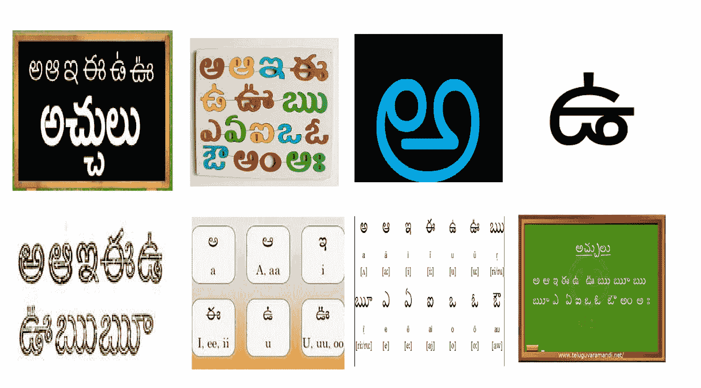

# 如何准备用于字符识别和分割的自定义数据集？

> 原文：<https://towardsdatascience.com/how-to-prepare-a-custom-dataset-for-character-recognition-and-segmentation-c39f6bf3690?source=collection_archive---------30----------------------->

## 详细说明

照片由[德鲁·比默](https://unsplash.com/@drew_beamer?utm_source=medium&utm_medium=referral)在 [Unsplash](https://unsplash.com?utm_source=medium&utm_medium=referral) 上拍摄

> 本文是对**泰卢固文字识别**研究的一部分。它的重点是为字符识别创建一个自定义数据集，不用担心，你可以用它来为“对象识别”和“分割”任务创建你自己的数据集。
> 
> 我们开始吧，

# 目录

*   **简介**
*   **所需工具**
*   **创建数据集**

# 介绍

**字符识别**用于识别来自不同来源的字符，如阅读邮政地址、银行支票、表格、招牌等。它广泛应用于银行、教育、国防、信息技术等领域，不胜枚举。

我们将开发一个包含**泰卢固语**的前 6 个元音的数据集。这是一张泰卢固语元音的图片，带有发音和辅助符号。“创建数据集的过程与此类似，因此您可以使用它来创建自己的数据集”。

泰卢固语是印度第四大通用语言，有 8110 万人使用。它由 60 个符号组成，16 个**元音**，3 个**元音**修饰语，41 个**辅音。这项研究将继续开发泰卢固语的 OCR 系统。**

# 所需工具

我们将使用 **python** 编程语言来创建用于字符识别和分割的数据集。使用的工具/包是:

*   标签 4.2.10
*   数字版本 1.17.2
*   枕头 5.3.0
*   OpenCV 4.0.0.21

# 创建数据集

开源平台上有很多数据集可用，比如 [Kaggle](https://www.kaggle.com/datasets) 、 [Google Datasets](https://datasetsearch.research.google.com/) 。你可以使用 Adrian Rosebrock 的这些信息丰富的博客来自动收集图像。

 [## 如何(快速)建立深度学习图像数据集——PyImageSearch

### 我小时候是个超级口袋妖怪迷。我收集了交易卡，玩了游戏机，看了…

www.pyimagesearch.com](https://www.pyimagesearch.com/2018/04/09/how-to-quickly-build-a-deep-learning-image-dataset/)  [## 如何使用 Google Images 创建深度学习数据集- PyImageSearch

### PyImageSearch 读者 José提问:嗨，Adrian，感谢你将计算机视觉的深度学习与 Python 结合在一起…

www.pyimagesearch.com](https://www.pyimagesearch.com/2017/12/04/how-to-create-a-deep-learning-dataset-using-google-images/) 

# **1。收集数据**

桑德拉·格鲁内瓦尔德在 [Unsplash](https://unsplash.com?utm_source=medium&utm_medium=referral) 上的照片

**收集数据**以创建定制数据集成为一项劳动密集型任务，直到数据/图像不可用，因为泰卢固语字符图像不广泛可用，所以我手动收集图像。将采集到的图像预处理成 400×400 的形状。

您可以使用下面的代码来实现这个目的，它采用两个参数 path 到要处理的图像的文件夹，并采用一个空的文件夹名来存储预处理后的图像。

我已经收集了将近 200 张**图片，其中每张图片至少有泰卢固语前 6 个元音中的一个。以下是收集的几个数据示例。**

收集数据中的少量图片—作者提供的图片

# 2.标签数据

因为我们正在创建用于字符识别和分割的数据集，所以我们需要标记已经收集的每个图像中的数据。为了完成这项任务，我们将使用 **LabelMe** ，这是一个应用程序来标记图像。您可以通过在命令提示符下键入 *labelme* 来启动应用程序。

LabelMe 应用程序界面—作者图片

以下是标记图像的步骤:

1.  ‘打开目录’—打开包含预处理图像的目录。
2.  在左窗格中选择“创建多边形”,在图像中的角色周围画一个边界框，并分别标记它们，最后保存。
3.  选择“下一张图像”并继续步骤 2，直到所有图像都被标记。
4.  为每个图像创建一个 Javascript 对象符号(JSON)文件，该文件包含图像的信息，例如文件名、边界框坐标、图像的高度和宽度以及每个边界框的标签等

完成上述步骤后，下面显示了一个样本图片。

标签后的样本图像—作者提供的图像

如上图所示标记图像后创建的 JSON 文件如下所示:

要使用任何识别和分割算法，如掩蔽递归神经网络(MaskRNN)，您只需查看一次(YOLO)。需要上下文中的公共对象(COCO)格式的 JSON 文件来训练所提到的算法。

因为我们有单独的 JSON 文件 w.r.t 图像，所以我们需要组合并制作一个 COCO 格式的注释 JSON 文件。下面的代码可以满足这个目的，因为它只需要两个参数，即图像和 JSON 文件的目录路径和保存结果 JSON 文件的输出路径。

下图显示了标记数据后的几幅样本图像。

作者图片

# 最终想法和未来范围

*   本文有助于为识别和分段任务创建自定义数据集。
*   此外，我们可以使用这种类型的数据集为泰卢固语字符开发字符识别和分割系统。

# 参考

 [## 拉贝梅

### 使用 Python Labelme 的图像多边形注释是一个图形图像注释工具，灵感来自于…

pypi.org](https://pypi.org/project/labelme/)  [## COCO -上下文中的常见对象

### 编辑描述

cocodataset.org](http://cocodataset.org/#home)