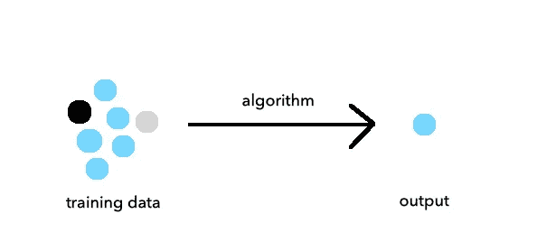
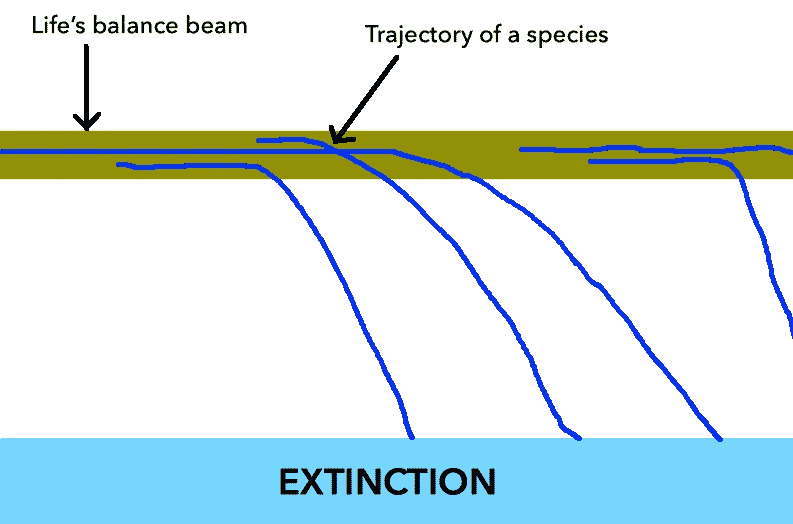

# 如何准备 AI

> 原文：<https://towardsdatascience.com/how-to-prepare-for-ai-4dbf87cbc2e1?source=collection_archive---------52----------------------->

## 当人工超级智能迫使我们失去平衡时，永生的生存指南。

# 人工智能的出现

人工智能还没有到来，它已经来了。已经有文章和书籍将人工智能拟人化，列出其失败模式，并证明人类将努力应对与新范式相关的错综复杂的道德和伦理问题。有些因揭示了人类尚未面对的社会问题而受到称赞；其他人则因未经请求和未经支持的散布恐惧而受到批评。

这些参考文献在很大程度上涵盖了人工通用智能(AGI)领域，指的是一种能够在各种环境下执行高阶心理功能的机器，如人类。关于我们什么时候能在社会上看到 AGI，专家们有不同的观点——但是有一个普遍的共识，那就是这不是一个是否的问题，而是什么时候的问题。

与此同时，人工狭义智能(ANI)——指的是机器或算法可以完成的专门任务——就在这里，而且非常好。它可以像人类一样完成一些任务(比如[区分小狗和松饼](https://www.freecodecamp.org/news/chihuahua-or-muffin-my-search-for-the-best-computer-vision-api-cbda4d6b425d/))和一些比人类更好的任务(比如下棋)。

## **为什么这很重要？**

*   **认知含义:**每个人都需要花费数年时间来发展理解松饼概念所必需的知觉、感觉和认知技能，从多个角度观看松饼时感知松饼，并在看到松饼时检索相关单词“muffin”。然而，一旦建立了图像分类器，该算法可以通过一次软件更新立即在数千台机器上实施——人类需要几年才能获得的东西，机器可以在几分钟内完成。
*   **经济影响**:失业被认为是一系列行业中 ANI 的重要影响，包括娱乐和新闻媒体、战争、法律、体育、交通和金融市场。近年来，人工智能研究人员、企业家和政策制定者提出了多种解决方案来对抗与人工智能发展相关的外部性，从普遍基本收入到全州监管。

## AGI 是最聪明的人工智能吗？

否——引入超级智能。

雷·库兹韦尔提出了智能爆炸的概念——人工智能变得足够聪明以改善自己。一个基于软件的 AGI 将进入一个自我改进循环的递归回路，导致一个甚至超过人类智能的**智能爆炸**——超级智能(ASI)

[像素](https://www.pexels.com/@pixabay)通过[像素](https://www.pexels.com/photo/abstract-art-blur-bright-373543/) (CC0)

# 如何准备 AI

这篇文章旨在提供一个指南，告诉你可以部署哪些策略来为 AI 时代做好准备。

## **理解与人工狭义智能、人工广义智能和人工超智能相关的风险。这包括:**

1.  理解当前机器学习算法的范围，以及它们如何改变经济和扰乱行业。
2.  辨别由[无监督学习算法](https://intellipaat.com/blog/supervised-learning-vs-unsupervised-learning-vs-reinforcement-learning/)产生的人类无法理解的相关性

3.理解算法偏差是如何发生的:

*   不具代表性的**训练数据可能会产生算法偏差**

例如，从训练数据集中没有足够多的深色皮肤的人的训练数据集中，导致[面部识别系统不能识别少数民族](https://www.ted.com/talks/joy_buolamwini_how_i_m_fighting_bias_in_algorithms)

*   算法偏差可能由**有偏差的训练数据**引起

例如，通过使用书写数据的语料库来改进算法——在一项[研究中，](https://papers.nips.cc/paper/6228-man-is-to-computer-programmer-as-woman-is-to-homemaker-debiasing-word-embeddings.pdf)句子“男人对于医生来说，就像女人对于……”由预测性 NLP 算法用“护士”来完成。

## **围绕新技术发布后的伦理和道德含义展开对话**

个人、企业家、公司和政策制定者都有责任围绕新技术范式展开富有成效的、批判性的辩论。这将导致公众意识到当前技术的范围，防止类似真相的案例发生——一个假设人类灭绝的思想实验，由最初被编程为书写机器的东西引发。

在公司拥有的 ani 层面，个人可以通过了解他们的数据如何被收集(例如:当你访问网站时的 cookies)、使用(例如:定向广告)、存储(例如:Snapchat 在其服务器上存储数据)，以及在各个层面有偏见的(例如:有偏见的训练数据，导致服务无法在边缘情况下工作)来最好地准备自己。)

在 ASI 的层次上，人类可以被解释为生命平衡木上的另一个物种，它的绊网正在接近；ASI 的出现可能将我们推向灭绝或永生。广受赞誉的人工智能研究员尼克·博斯特罗姆提出了一个**平衡木**模型的概念。所有物种突然出现，在平衡木上摇摇晃晃，然后陷入灭绝——博斯特罗姆称灭绝为**吸引状态**。

除了灭绝，还有另一个吸引子——状态——永生。因此，吸引子状态由物种灭绝和物种永生组成。到目前为止，所有的物种最终都灭绝了——但是有可能一个物种会掉到平衡木的另一边，变成永生

**绊网**是指一个物种存在的阈值。对于一个物种来说，撞上绊网是一个巨大的变革性事件，就像一个世界性的疫情或小行星。或者人工超级智能。

哲学家认为 ASI 可能是人类的绊网，让我们要么走向灭绝，要么走向永生。因此，在更大的范围内，人工智能是否会对人类产生积极影响，这是一个与我们的生存问题密不可分的问题。

在这段不确定时期，个人最大的财富是知识。这包括理解人工智能的各种理论，意识到与人工智能发展相关的挑战和风险，以及合理化结合人工智能、生物技术和纳米技术等各种快速发展领域的创新可能带来的潜在结果。

作为创新者，我们应该意识到资本主义的激励结构，这种结构以牺牲人性为代价，促进创新，奖励对快速发展技术的投资。对于 ASI 这样的高影响力技术，我们应该专注于稳定的开发，在每个阶段测试功能，以避免智能爆炸，而不是快速移动的破坏。

作为个人和人类，我们有权游说为追求 AGI 的公司和研究机构设立“检查站”级别的政策——对创新、研究和开发实践透明的公司有潜在的财政利益——从而激励人工智能技术的规范发展，并在全球范围内校准进展水平。