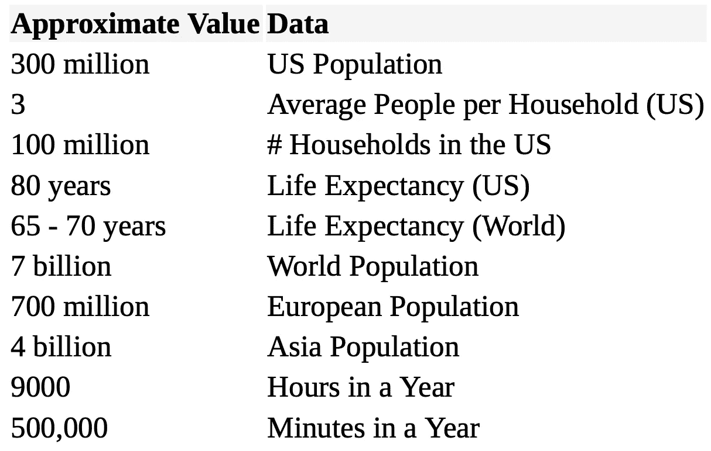

# 作为分析师，如何赢得案例研究面试

> 原文：<https://towardsdatascience.com/how-to-prepare-for-business-case-interview-as-an-analyst-6e9d68ce2fd8?source=collection_archive---------2----------------------->

## 咨询案例研究 101

## 案例研究面试准备终极指南

Clem Onojeghuo 在 [Unsplash](https://unsplash.com/s/photos/job-interview?utm_source=unsplash&utm_medium=referral&utm_content=creditCopyText) 拍摄的照片

作为数据分析师或数据科学家，我们不仅需要知道概率和统计、机器学习算法、编码，最重要的是，我们需要知道如何使用这些技术来解决任何业务问题。大多数情况下，你将有 30-45 分钟的时间与一位数据科学家或招聘经理面谈，在面谈中，你将回答一个可能与组织日常工作相关的多方面业务问题。

当我第一次开始准备案例研究面试时，我不知道有不同类型的案例研究。成为案例研究专家的最快方法是了解解决不同类型案例研究的所有框架。案例研究面试可以帮助面试官评估候选人是否适合这个职位。有时，他们甚至会问你一个他们实际遇到的问题。了解面试官在寻找什么可以帮助你更好地准备你的回答。

# 他们在面试中寻找什么？

**📌逻辑和可操作的思维过程**

▶️:面试官关心你的思维过程，以及你如何得到解决方案。如果你能够在没有任何框架的情况下得到答案，面试官可能会认为这只是你的幸运日，下次你就不能解决问题了。

**📌适应性**

▶️:有时候，如果你走错了方向，面试官可能会问你一些问题来帮助你回到正轨。如果这发生在你的面试中，你很可能错过了他们认为重要的东西。

**📌信心**

▶️:求职面试时紧张是正常的。但是，作为一个分析师，你自己都不相信自己，别人怎么会相信你呢？

**📌清晰通信**

▶️:作为一名分析师，分析数据和解释结果的能力非常重要。根据您的公司，一些分析师确实需要向利益相关者展示他们的分析。

# 如何总能得到他们想要的答案

## 📣结构

他们想知道你是否能采取系统的方法来解决问题，并且你能清楚地描述它。例如，他们可能会问你:“这个月活跃用户账户增加了 xx%，你能告诉我们是怎么回事吗？”

要回答这类问题，你不必马上准备好答案。最重要的是你的思维过程。不要马上告诉他们你的任何猜测或假设。用一个框架来回答。向他们提问，表明你了解这个行业。

## 📣综合性

他们想知道你的回答是否涵盖了问题的所有方面。例如，他们可能会给你一个情况，并问你一些问题，如“看起来怎么样”、“当前的问题是什么”、“我们如何改进”等。

有许多方法可以回答这类问题。得到完美答案的关键是要简洁，并在最后提供一个推荐。假设营销副总裁问你“看起来怎么样？”在 2 分钟内，您可以通过陈述当前的目标是什么、我们目前所处的位置、我们距离公司的目标有多远、我们下一步计划做什么来达到目标(建议)以及我们需要多长时间才能达到目标来回答这个问题。

## 📣可行性

他们想看看你的回答是否实用，是否能切实可行。要更精准；尽可能使用数字。

我注意到很多分析师经常忘记用数字来支持他们的观点。如果你想让经理知道根据你的计算不可能达到特定的目标，你应该用你的分析数据来证明为什么会这样。使用数字可以帮助你的建议更有说服力和可靠性。

## 📣观众

有时，他们可能会要求你对不同的人(你的经理、CEO 等)回答一个模糊的问题，比如“看起来怎么样”。).这类似于当招聘人员问，“告诉我关于你自己的情况”，你不想认真对待你所做项目的本质，因为你的招聘人员可能会失去兴趣。另一方面，招聘经理可能希望你多谈谈你过去的项目。

这也适用于案例研究面试。知道谁是你的观众是非常重要的。如果你和销售副总裁交谈，他或她可能更关心顾客的数量。相反，如果你与营销副总裁交谈，他或她可能不像销售副总裁那样关心潜在客户的数量，相反，他们可能关心如何提高回复率和转化率。

# 什么是完美的框架

1.  澄清问题
2.  分解问题
3.  解决每一块
4.  将它们整合到最终结果中

这给了你一个如何得到完美解决方案的总体思路。然而，对于每种类型的案例研究问题，我们可以有一个不同的框架。

# 案例研究类型

案例研究有几种类型。以下是案例研究面试问题的主要类型:

*   损益
*   进入新市场
*   增长和销售增长
*   市场规模估计

## 损益

面试官喜欢问案例研究问题的原因之一是，咨询师经常需要帮助客户解决一个模糊的问题，而不知道从哪里开始。客户陈述了他们面临的盈利/亏损问题，他们希望你能帮助他们找出发生这种情况的原因。一个典型的情况是，一家公司在过去几年中相对盈利，但最近利润突然下降。他们应该怎么做？

你可以把这个问题分成两部分——收入和成本。我们知道利润等于收入减去成本。如果利润下降而成本保持不变，那么收入就是问题。我们需要考虑如何增加收入。如果是反过来，那么我们就需要想出一个降低成本的方案，比如削减产量和劳动力成本。

## 进入新市场

向新市场扩张是发展业务的有效途径。因此，一些客户可能会问顾问，进入一个新市场是否是个好主意。

在回答是或否之前，你应该问一些澄清性的问题，以更多地了解客户的公司。

以下是一些你可以问的澄清性问题:

*   公司的目标是什么？它符合我们的整体战略吗？
*   我们需要增加投资吗？(分销渠道、生产、新员工..)
*   现在和未来的市场是什么样的？(新兴？成熟？下降)
*   客户群会与现有的不同吗？
*   竞争对手是谁？他们的市场份额有多大？
*   他们的产品和我们的有什么不同？
*   有进入/退出的障碍吗？

## 增长和销售增长

我希望有一种终极方法来增加所有公司的销售额。不幸的是，根据行业和市场规模的不同，发展公司和增加销售的方式会有所不同。

这里有一些公司可以尝试发展业务的方法:

⛳️调查公司和行业:我们需要知道行业是否在增长。如果有，公司可以投入多少资金来扩大公司规模？相对于行业/竞争对手，公司的发展如何？我们的价格与竞争对手一致吗？谁是我们的目标市场？

⛳️选择最合适的增长战略:一旦我们对公司及其行业有了更多的了解，我们就可以相应地推荐最合适的增长战略。例如，如果客户想收购一家完全不同行业的公司，这可能不值得，因为目标受众完全不同。

## 市场规模估计

作为一名分析师，做出合理估计的能力至关重要。你的面试官可能会问这样的问题:在美国每个月要吃掉多少平方英尺的比萨饼？

这是一个经典的猜测问题。回答这类问题的诀窍是将问题分成不同的部分，为了便于计算，将任何数字向上或向下取整，并解释你为什么要估计你正在估计的东西。我决定把问题分成 4 部分。

1.  美国有多少人吃披萨？

让我们假设大约 2/3 的美国人都吃披萨。美国大约有 3.2 亿人口。然而，我们可以用 300 来简化计算，而不是用 2/3 乘以 320。现在我们知道美国有 2 亿人吃披萨。

2.普通美国人一个月吃多少比萨饼？

我们可以估计，平均来说，一个美国人每月吃一次披萨。假设人们通常每餐吃 3-4 片比萨饼，我们可以估计每人平均消费 4 片比萨饼。现在我们需要把比萨饼切片转换成平方英尺。

3.比萨饼切成平方英尺

如果一片比萨饼底长 4 英寸，长 5 英寸，那么面积就是 10 平方英寸(1/2 *底*高=4*5/2)。因为平均来说，一个人每月吃 4 片比萨饼，所以一个吃比萨饼的人每月的比萨饼面积是 40 平方英寸。乘以 2 亿人(美国吃比萨饼的人口)，现在我们得到 80 亿(2 亿* 40)平方英寸。最后，在将平方英寸转换成平方英尺(除以 144 →四舍五入到 100)后，现在我们每月可以得到大约 8000 万平方英尺的比萨饼。

# 方便的信息

事先了解一些方便的信息可以帮助我们更好地估计市场规模。以下是《破解 PM 面试[*一书中列举的一些随手可得的信息:*](https://www.amazon.com/Cracking-PM-Interview-Product-Technology/dp/0984782818)

来自破解 PM 采访本的截图

# 最终提示

1.  确保你理解了被问到的问题；如果你需要澄清问题，不要害怕提问。但是要记住！注意，试着总结面试官告诉你的话。
2.  花时间思考问题，建立一个框架。例如，你可以谈论问题陈述，比如组织面临的问题是什么；然后你可以总结你提出的所有建议，并解释每一条建议。
3.  陈述你的假设，但不要做出愚蠢的假设，比如某人表现得不够好。
4.  熟能生巧！多读一些案例研究的例子，从中学习。

# 资源

以下是我用来准备案例研究面试的资源清单。

## 书

📚破解 PM 面试:如何获得技术领域的产品经理职位

📚第 10 点案例:完成案例面试准备

📚面试数学:超过 60 个问题和定量案例面试问题的解决方案

## 网站

 [## 我的咨询教练

### 我认为能够提出一个好的框架是成功进行案例面试的最重要的因素…

www.myconsultingcoach.com](https://www.myconsultingcoach.com/)  [## 星状细胞

### “StellarPeers 是一个由伟大的人组成的网络，我很高兴成为这个团体的一员。我真的很喜欢模拟面试…

stellarpeers.com](https://stellarpeers.com/) 

## 播客

 [## 案例面试准备和管理咨询|战略|对苹果的批判性思考…

### 咨询公司在麦肯锡、波士顿咨询集团和贝恩公司内部为客户提供服务的成功率保持在 80%。这是最高的…

podcasts.apple.com](https://podcasts.apple.com/us/podcast/case-interview-preparation-management-consulting-strategy/id904509526) 

## 油管（国外视频网站）

 [## 案例访谈

### 欣赏您喜爱的视频和音乐，上传原创内容，并在上与朋友、家人和全世界分享这些内容…

www.youtube.com](https://www.youtube.com/channel/UC-YKX7L2GNNA-IHrhMpwzWA)