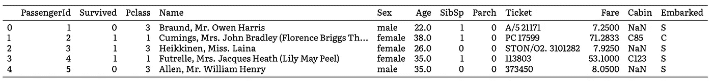

# 如何为机器学习准备数据

> 原文：<https://towardsdatascience.com/how-to-prepare-your-data-for-machine-learning-307cc556af48?source=collection_archive---------31----------------------->

## 预测泰坦尼克号上的幸存者

***TL；博士*** :这篇文章涵盖了泰坦尼克号沉船数据集的完整准备。

本帖是本书的一部分: [**用 Python 动手做量子机器学习**](https://www.pyqml.com/page?ref=medium_prepare&dest=/)


作者弗兰克·齐克特的图片

泰坦尼克号的沉没是历史上最臭名昭著的海难之一。

1912 年 4 月 15 日，泰坦尼克号与冰山相撞后沉没。被认为是不沉的，没有足够的救生艇给船上的每个人。当晚 2224 名乘客和机组人员中有 1502 人死亡。

当然，722 名幸存者一定有一些运气。但是似乎某些人群比其他人群有更好的生存机会。

因此，泰坦尼克号的沉没也成为任何对机器学习感兴趣的人的著名起点。

如果你有一些机器学习的经验，你可能会知道 Kaggle 提供的传说中的泰坦尼克号 ML 比赛。

如果你还不知道 Kaggle，Kaggle 是世界上最大的数据科学社区之一。它提供了许多有趣的数据集，因此，它是一个开始的好地方。

要解决的问题很简单。使用机器学习创建一个模型，根据乘客数据，预测哪些乘客在泰坦尼克号沉船中幸存。

# 获取数据集

为了获得数据集，你需要创建一个 Kaggle 帐户(它是免费的)并加入竞争。即使 Kaggle 完全是关于竞争的，你也不需要通过上传你的解决方案来积极参与其中。

当你参加比赛时，你需要接受并遵守规则，这些规则规定了你每天可以提交多少份作品，最大团队规模，以及其他比赛的具体细节。

您可以在竞赛页面顶部的[数据选项卡](https://www.kaggle.com/c/titanic/data)中找到竞赛数据。然后，向下滚动以找到文件列表。

数据中有三个文件:

*   `train.csv`
*   `test.csv`
*   `gender_submission.csv`

文件`train.csv`包含泰坦尼克号乘客子集的数据。这个文件应该作为你的算法的基础，以了解一名乘客是否幸存。

文件`test.csv`包含另一个乘客子集的数据。它决定了你的算法执行的有多好。

`gender_submission.csv`文件是一个例子，它展示了如果您打算将预测提交给 Kaggle，您应该如何构建预测。因为我们在这里开始学习，还没有准备好竞争，我们将跳过这个文件。

下载文件`train.csv`和`test.csv`。

# 看数据

我们需要做的第一件事是加载数据。我们用熊猫来表示。它在机器学习社区中以数据处理而闻名。它提供了各种有用的功能，比如加载`.csv`-文件的功能:`read_csv`。

从 csv 文件加载数据

我们将数据加载到`train`和`test`中。这些是熊猫。

A `DataFrame`将数据保存在带有标签的二维结构中。例如数据库表或电子表格。它提供了许多现成的有用属性和功能。

例如，`DataFrame`的属性`shape`提供了一个由两个整数组成的元组，表示行数和列数。

让我们来看看:

泰坦尼克号数据集的形状

```
train has 891 rows and 12 columns
test has 418 rows and 11 columns
```

我们可以看到我们有 891 个培训和 418 个测试条目。更有趣的是，`train`数据集比`test`数据集多一列。

`DataFrame`的`info()`方法显示了一些更详细的信息。看一下`train`数据集。

```
train.info()
```


训练数据集的结构

`info`方法返回列的列表:它们的索引、名称、有多少条目有实际值(不是`null`)以及值的类型。

让我们也来看看`test`数据集。

```
test.info()
```


测试数据集的结构

当比较这两个信息时，我们可以看到`test`数据集遗漏了列`Survived`，该列指示一名乘客是幸存还是死亡。

正如 Kaggle 指出的，他们使用`test`数据集来评估提交的内容。如果他们提供了正确的答案，那就不再是什么竞赛了，不是吗？我们的任务是预测正确的标签。

由于我们不打算将我们的预测提交给 Kaggle，以获得对我们算法执行情况的评估，`test`数据集对我们来说毫无用处。

因此，我们专注于`train`数据集。

`info`输出非常抽象。能看到一些实际数据不是很好吗？没问题。这就是`head`方法的用途。

`head`方法显示列标题和前五行。有了这个印象，我们再来过列。你也可以在 Kaggle 页面上看到解释。

```
train.head()
```



每一列代表我们数据的一个特征。`PassengerId`是识别每一行的连续数字。`Survived`是乘客是否幸存的指示器(0 =否，1 =是)。`Pclass`是票类(1 = 1 号，2 = 2 号，3 = 3 号)。然后我们有不言自明的`Name`、`Sex`和`Age`。

表示该乘客在泰坦尼克号上的兄弟姐妹或配偶的数量。`Parch`表示泰坦尼克号上该乘客父母或子女的编号。

然后就是乘客付费的`Fare`，号码`Cabin`和登船港口(`embarked` ) (C =瑟堡，Q =皇后镇，S =南安普顿)。

# 数据准备和清理

我们的数据有不同的类型。有数字数据，如`Age`、`SibSp`、`Parch`、`Fare`。有分类数据。一些类别由数字表示(`Survived`、`Pclass`)。有些用文字表示(`Sex`、`Embarked`)。还有文字资料(`Name`、`Ticket`、`Cabin`)。

这真是一团糟。为了一台电脑。此外，当再次查看`train.info()`的结果时，您可以看到不同列的计数有所不同。虽然大多数列有 891 个值，但只有 714 个用于`Age`，204 个用于`Cabin`，889 个用于`Embarked`。

在我们可以将数据输入任何机器学习算法之前，我们需要清理。

# 缺少值

大多数机器学习算法在缺失值的情况下效果不佳。有三种方法可以解决这个问题:

*   去掉相应的行(不考虑乘客)
*   去除整个列(去除所有乘客的整个特征)
*   填充缺失的值(例如，用零、平均值或中值)

应对缺失值


我们可以使用`DataFrame`的`dropna()`、`drop()`和`fillna()`方法轻松完成这些事情。一般来说，没有一个最佳选择。但是你要仔细考虑具体的语境。

只有两个乘客的出发港口我们不知道。这些占我们数据不到 1%。如果我们完全忽略这两个乘客，我们不会看到完全不同的结果。因此，我们用`dropna`方法删除这些行(第 3 行)。

`dropna`-方法将列(`"Embarked"`)作为命名参数`subset`。此参数指定确定是否删除行(乘客)的列。如果这些列中至少有一个值缺失，该行将被删除。

关于`Cabin`，情况有所不同。我们只有 991 名乘客中 204 人的信息。这是否足以从中得到任何信息是值得怀疑的。我们不知道为什么这些值会丢失。即使我们发现`Cabin`与乘客的生存高度相关，我们也不知道这种相关性是否可以推广到所有乘客，或者是否存在选择偏差，这意味着我们知道`Cabin`的事实取决于一些其他方面。

我们用方法`drop`删除整个列。我们提供想要移除的列(`Cabin`)作为定位参数。我们作为命名参数`axis`提供的值`1`指定我们想要移除整个列。

接下来我们知道 714 乘客的`Age`。将我们不认识的所有乘客排除在考虑范围之外似乎不是一个选项，因为他们占了我们数据的大约 22%，相当重要的一部分。移除整个列似乎也不是一个好的选择。首先，我们知道大多数乘客的`Age`，直觉表明`Age`可能对某人的生存机会很重要。

我们用`fillna`方法填充缺失的值(第 13 行)。因为我们只想填充`Age`列中缺失的值，所以我们在该列上调用这个函数，而不是整个`DataFrame`。我们提供想要设置的值作为参数。这是我们之前计算的所有乘客的平均年龄(第 12 行)。

太好了。我们现在有 889 行，10 列，不再有丢失的数据。

# 标识符

机器学习的目标是创建一个能够预测数据的算法。或者，就像我们之前说的:给一个东西贴上标签。虽然我们在构建算法时使用了已经标记的数据，但我们的目标是预测我们还不知道的标签。

我们没有告诉我们的算法它如何决定选择哪个标签。而是我们告诉算法，“这是数据，你自己算出来”。也就是说，一个精明的算法可能能够记住你提供给它的所有数据。这被称为过度拟合。结果是算法在已知数据上表现良好，但在未知数据上表现不佳。

如果我们的目标是只预测我们已经知道的标签，我们能做的最好的事情就是记住所有的乘客以及他们是否幸存。但是，如果我们想要创建一个即使在未知数据上也能表现良好的算法，我们需要防止记忆。

我们甚至还没有开始构建我们的算法。然而，我们为算法提供的基本功能会影响算法是否能够记忆数据。因为我们的数据中有潜在的标识符。

当查看数据集的前五个条目时，有三列看起来可疑:第`PassengerId`、`Name`和`Ticket`。

`PassengerId`是一个后续数字。数字有多大和有没有乘客生还应该没有联系。

乘客的名字或车票上的号码也不应该成为生存的决定性因素。相反，这些是识别单个乘客的数据。让我们验证这个假设。

让我们看看这些列中有多少唯一值。

列中的唯一值

```
There are 889 different (unique) PassengerIds in the data
There are 889 different (unique) names in the data
There are 680 different (unique) ticket numbers in the data
```

`Name`和`PassengerId`是完美的标识符。在我们的数据集中，889 行中的每一行都有一个唯一的值。

并且有 680 个不同的`Ticket`号。`Ticket`不是完美标识符的一个可能解释是家庭票。然而，基于这一数据的预测似乎支持记忆，而不是学习可转移的洞察力。

我们移除这些柱子。

删除识别数据


# 处理文本和分类属性

正如我们将在本书中看到的，所有的算法，包括经典算法和量子算法，都与数字有关。除了数字什么都没有。如果我们想使用文本数据，我们需要把它转换成数字。

Scikit-Learn 为此任务提供了一个名为`LabelEncoder`的转换器。

将文本数据转换为数字


首先，我们导入`LabelEncoder`(第 1 行)并初始化一个实例(第 2 行)。我们用文本数据(`Sex`和`Embarked`)遍历列(第 4 行)。对于每一列，我们需要`fit`将列中的数据(第 5 行)编码，然后才能转换值(第 6 行)。

最后，让我们再看看我们的`DataFrame`。可以看到，`Sex`和`Embarked`现在都是数字(`int64`)。在我们的例子中，`0`表示男性，`1`表示女性乘客。但是当您再次运行转换时，您可能会产生不同的赋值。

# 特征缩放

机器学习算法只对数字起作用。此外，他们通常使用相同比例的数字。如果数字具有不同的标度，算法可能会认为标度越高的数字越重要。

尽管我们所有的数据都是数字，但还没有统一的比例。大多数列的值在`0`和`3`之间。但是`Age`和`Fare`的规模要大得多。

`max`方法返回一列中的最大值。我们可以看到，年龄最大的乘客 80 岁，最高票价约 512。

最大值

```
The maximum age is 80.0
The maximum fare is 512.3292
```

处理不同比例数据的一种常用方法是最小-最大比例(也称为归一化)。这个过程会移动和重新调整值，使它们最终的范围从`0`到`1`。它从每个值中减去最小值，然后除以最大值减去最小值。

`Scikit-Learn`为我们提供了`MinMaxScaler`转换器来完成这项工作。

数据的标准化

```
The minimum value is 0.0 and the maximum value is 1.0
```

同样，我们首先导入转换器(第 1 行)并初始化它(第 3 行)。然后，我们`fit`转换我们的数据(第 4 行)并转换它(第 5 行)。

因此，我们数据集中的所有数据都在`0.0`和`1.0`之间。

> scaler 返回一个 Numpy 数组，而不是 Pandas 数据帧

# 培训和测试

我们已经提到了构建一个算法的目标，该算法不仅对已知数据表现良好，而且还能预测未知数据的标签。

这就是为什么将数据分为训练集和测试集非常重要。我们使用训练集来构建我们的算法。我们使用测试集来验证它的性能。

尽管 Kaggle 提供了一个测试集，但我们跳过了它，因为它没有包含`Survived`列。每次我们想验证它的时候，我们都需要问 Kaggle。为了保持简单，并且能够自己进行验证，我们宁愿从 Kaggle 训练集中抽出一些行来进行测试。

分离一个`test`集合相当简单。Scikit-learn 也为此提供了一个有用的方法。这是`train_test_split`。

此外，我们需要将输入数据与我们想要预测的结果标签分离开来。

将输入从标签中分离出来，将训练从测试集中分离出来

```
We have 711 training and 178 testing rows There are 7 input columns
```

我们用 Python 数组索引将输入列与标签分开(第 3–4 行)。第一列(位置`0`)包含我们想要预测的`Survived`标志。其他列包含我们用作输入的数据。

`train_test_split`将训练与测试数据集分开。参数`test_size = 0.2` (= 20%)指定了我们希望测试集拥有的部分。

我们可以看到我们的训练数据集包含 711 个条目。因此，我们的测试集由 178 个条目组成。我们有 7 列输入和一列输出。

让我们保存我们准备好的数据，这样我们就可以在将来使用它，而不需要重复所有这些步骤。

将数据保存到文件系统

本帖是本书的一部分: [**用 Python 动手做量子机器学习。**](https://www.pyqml.com/page?ref=medium_prepare&dest=/)


在这里免费获得前三章。