# 如何在 Python 中呈现多个变量之间的关系

> 原文：<https://towardsdatascience.com/how-to-present-the-relationships-amongst-multiple-variables-in-python-70f1b5693f5?source=collection_archive---------16----------------------->


Jonah Pettrich 在 [Unsplash](https://unsplash.com?utm_source=medium&utm_medium=referral) 上的照片

## 了解如何使用 Python 中的多元图表和绘图来呈现要素之间的关系

处理大型数据集时，了解要素之间的关系非常重要。这是数据分析的一大部分。这些关系可以是两个变量之间的关系，也可以是几个变量之间的关系。在本文中，我将讨论如何用一些简单的技巧来呈现多个变量之间的关系。我将使用 Python 的 Numpy、Pandas、Matplotlib 和 Seaborn 库。

首先，导入必要的包和数据集。

```
%matplotlib inline
import matplotlib.pyplot as plt
import seaborn as sns
import pandas as pd
import numpy as np
df = pd.read_csv("nhanes_2015_2016.csv")
```

这个数据集非常大。至少大到不能在这里截图。以下是该数据集中的列。

```
df.columns
#Output:
Index(['SEQN', 'ALQ101', 'ALQ110', 'ALQ130', 'SMQ020', 'RIAGENDR', 'RIDAGEYR',        'RIDRETH1', 'DMDCITZN', 'DMDEDUC2', 'DMDMARTL', 'DMDHHSIZ', 'WTINT2YR',        'SDMVPSU', 'SDMVSTRA', 'INDFMPIR', 'BPXSY1', 'BPXDI1', 'BPXSY2',        'BPXDI2', 'BMXWT', 'BMXHT', 'BMXBMI', 'BMXLEG', 'BMXARML', 'BMXARMC',        'BMXWAIST', 'HIQ210'],       dtype='object')
```

现在，让我们用几列来缩小数据集。所以，在本文中更容易处理和展示。

```
df = df[['SMQ020', 'RIAGENDR', 'RIDAGEYR','DMDCITZN', 
         'DMDEDUC2', 'DMDMARTL', 'DMDHHSIZ','SDMVPSU', 
         'BPXSY1', 'BPXDI1', 'BPXSY2', 'BPXDI2', 'RIDRETH1']]
df.head()
```

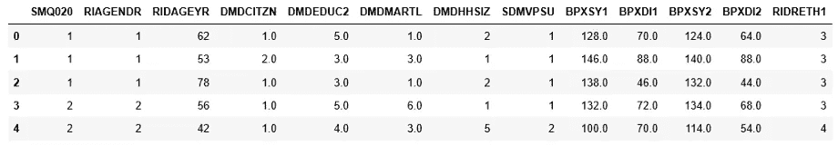

您可能会觉得列名很奇怪。当我们继续使用它们时，我会继续解释。

1.  在这个数据集中，我们有两个收缩压数据(' BPXSY1 '，' BPXSY2 ')和两个舒张压数据(' BPXDI1 '，' BPXDI2 ')。这两者之间是否有关系值得研究。观察第一次和第二次收缩压之间的关系。

为了找出两个变量之间的关系，散点图已经被使用了很长时间。这是看待两个变量之间关系的最流行、最基本、最容易理解的方式。

```
sns.regplot(x = "BPXSY1", y="BPXSY2", data=df, fit_reg = False, scatter_kws={"alpha": 0.2})
```

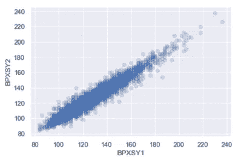

两个收缩压之间的关系是正线性的。在图中观察到许多重叠。

2.为了更好地了解收缩压和舒张压数据及其关系，可以制作一个联合图。Jointplot 同时显示数据的密度和两个变量的分布。

```
sns.jointplot(x = "BPXSY1", y="BPXSY2", data=df, kind = 'kde')
```

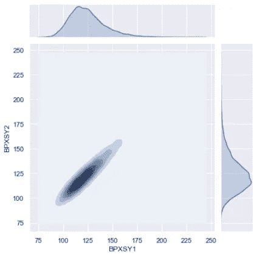

在该图中，它非常清楚地显示了最密集的区域是从 115 到 135。第一和第二收缩压分布都是右偏的。还有，他们两个都有一些离群值。

3.找出男性和女性人群中第一次和第二次收缩压之间的相关性是否不同。

```
df["RIAGENDRx"] = df.RIAGENDR.replace({1: "Male", 2: "Female"}) 
sns.FacetGrid(df, col = "RIAGENDRx").map(plt.scatter, "BPXSY1", "BPXSY2", alpha =0.6).add_legend()
```

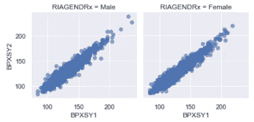

这张图显示，两者的相关性都是正线性的。让我们更清楚地找出相关性。

```
print(df.loc[df.RIAGENDRx=="Female",["BPXSY1", "BPXSY2"]].dropna().corr())
print(df.loc[df.RIAGENDRx=="Male",["BPXSY1", "BPXSY2"]].dropna().corr())
```

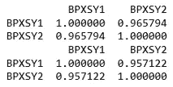

从上面的两个相关图来看，女性人群中两个收缩压之间的相关性比男性高 1%。如果这些东西对你来说是新的，我鼓励你尝试理解两个舒张压或收缩压和舒张压之间的相关性。

4.人类的行为会随着许多不同的因素而改变，如性别、教育水平、种族、经济状况等等。在这个数据集中，我们还有种族(“RIDRETH1”)信息。检查种族和性别对收缩压之间关系的影响。

```
sns.FacetGrid(df, col="RIDRETH1", row="RIAGENDRx").map(plt.scatter, "BPXSY1", "BPXSY2", alpha = 0.5).add_legend()
```

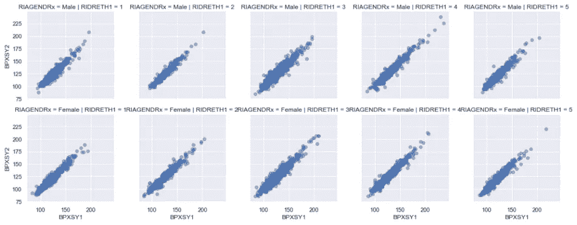

随着种族和性别的不同，相关性似乎会有一点点变化，但通常会像以前一样保持正线性。

5.现在，关注数据集中的其他一些变量。找出教育和婚姻状况之间的关系。

“教育程度”列(“DM deduct 2”)和“婚姻状况”列都是分类的。首先，用有意义的字符串值替换数值。我们还需要去掉那些不会给图表增加有用信息的值。例如，教育栏有一些值“不知道”,婚姻状况栏有一些值“拒绝”。

```
df["DMDEDUC2x"] = df.DMDEDUC2.replace({1: "<9", 2: "9-11", 3: "HS/GED", 4: "Some college/AA", 5: "College", 7: "Refused", 9: "Don't know"})
df["DMDMARTLx"] = df.DMDMARTL.replace({1: "Married", 2: "Widowed", 3: "Divorced", 4: "Separated", 5: "Never married", 6: "Living w/partner", 77: "Refused"})
db = df.loc[(df.DMDEDUC2x != "Don't know") & (df.DMDMARTLx != "Refused"), :]
```

最后，我们得到了这个干净的数据框架，可以用于图表了。

```
x = pd.crosstab(db.DMDEDUC2x, db.DMDMARTLx)
x
```

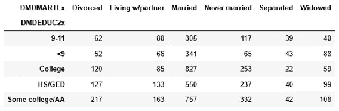

这是结果。这些数字看起来很容易理解。但是一张人口比例的图表会是一个更合适的表述。我得到了基于婚姻状况的人口比例。

```
x.apply(lambda z: z/z.sum(), axis=1)
```

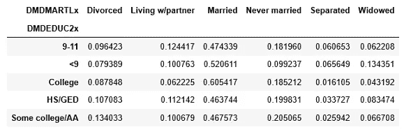

6.找出按种族(' RIDRETH1 ')和教育水平划分的婚姻状况的人口比例。

首先，将“种族”列中的数值替换为有意义的字符串。我是从[疾控中心](https://wwwn.cdc.gov/nchs/nhanes/continuousnhanes/overview.aspx?BeginYear=2015)网站找到这些字符串值的。

```
db.groupby(["RIDRETH1x", "DMDEDUC2x", "DMDMARTLx"]).size().unstack().fillna(0).apply(lambda x: x/x.sum(), axis=1)
```

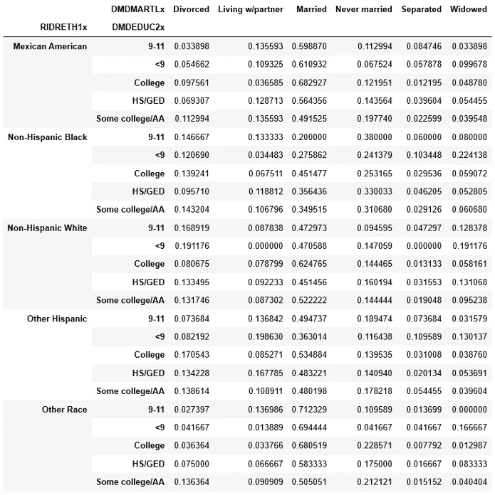

7.观察受教育程度随年龄的差异。

在这里，教育水平是一个分类变量，年龄是一个连续变量。观察教育水平随年龄变化的一个好方法是做一个箱线图。

```
plt.figure(figsize=(12, 4))
a = sns.boxplot(db.DMDEDUC2x, db.RIDAGEYR)
```

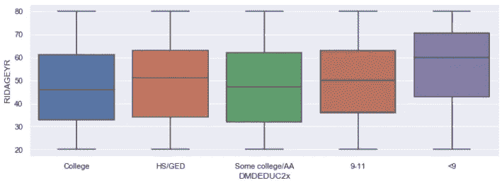

该图显示，年轻人接受大学教育的比率较高。小提琴情节可能会提供一个更好的画面。

```
plt.figure(figsize=(12, 4))
a = sns.violinplot(db.DMDEDUC2x, db.RIDAGEYR)
```

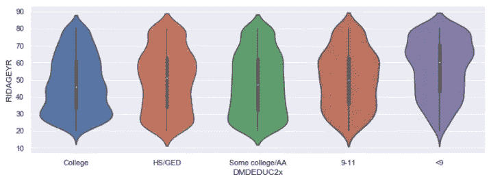

所以，小提琴图显示了一个分布。受过大学教育最多的人在 30 岁左右。与此同时，大多数不到 9 年级的人，大约是 68 到 88 岁。

8.显示按性别分布和隔离的婚姻状况。

```
fig, ax = plt.subplots(figsize = (12,4))
ax = sns.violinplot(x= "DMDMARTLx", y="RIDAGEYR", hue="RIAGENDRx", data= db, scale="count", split=True, ax=ax)
```

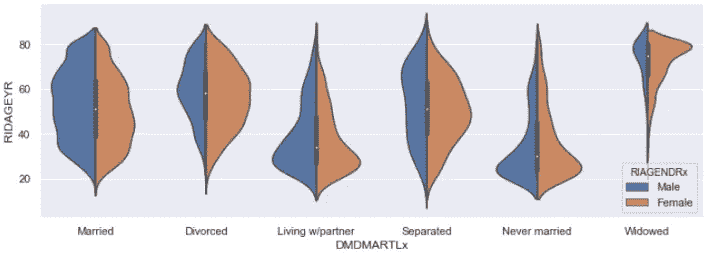

这里，蓝色表示男性人口分布，橙色表示女性人口分布。只有“从未结过婚”和“与伴侣同居”这两个类别在男性和女性人口中的分布相似。其他类别在男性和女性人口中有显著差异。

我希望它有帮助。请随时在[推特](https://twitter.com/rashida048)上关注我，并喜欢我的[脸书](https://www.facebook.com/Regenerative-149425692134498/)页面。

以下是我在本文中使用的数据集:

[](https://github.com/rashida048/Datasets/blob/master/nhanes_2015_2016.csv) [## rashida 048/数据集

### 在 GitHub 上创建一个帐户，为 rashida048/Datasets 开发做出贡献。

github.com](https://github.com/rashida048/Datasets/blob/master/nhanes_2015_2016.csv) 

## 更多阅读:

[](/great-quality-free-courses-to-learn-machine-learning-and-deep-learning-1029048fd0fc) [## 学习机器学习和深度学习的优质免费课程

### 顶级大学高质量免费课程的链接

towardsdatascience.com](/great-quality-free-courses-to-learn-machine-learning-and-deep-learning-1029048fd0fc) [](/sort-and-segment-your-data-into-bins-to-get-sorted-ranges-pandas-cut-and-qcut-7785931bbfde) [## 数据宁滨与熊猫削减或 Qcut 方法

### 当你在寻找一个范围而不是一个确切的数值，一个等级而不是一个分数

towardsdatascience.com](/sort-and-segment-your-data-into-bins-to-get-sorted-ranges-pandas-cut-and-qcut-7785931bbfde) [](/clear-understanding-of-a-knn-classifier-with-a-project-for-the-beginners-865f56aaf58f) [## 学习使用 Python 的 Scikit_learn 库通过项目开发 KNN 分类器

### 适合机器学习新手

towardsdatascience.com](/clear-understanding-of-a-knn-classifier-with-a-project-for-the-beginners-865f56aaf58f) [](/a-complete-guide-to-numpy-fb9235fb3e9d) [## Numpy 完全指南

### 日常工作中需要的所有数字方法

towardsdatascience.com](/a-complete-guide-to-numpy-fb9235fb3e9d) [](/polynomial-regression-from-scratch-in-python-1f34a3a5f373) [## Python 中从头开始的多项式回归

### 学习用一些简单的 python 代码从头开始实现多项式回归

towardsdatascience.com](/polynomial-regression-from-scratch-in-python-1f34a3a5f373) [](/your-everyday-cheatsheet-for-pythons-matplotlib-c03345ca390d) [## Python Matplotlib 的日常备忘单

### 完整的可视化课程

towardsdatascience.com](/your-everyday-cheatsheet-for-pythons-matplotlib-c03345ca390d) [](/all-the-datasets-you-need-to-practice-data-science-skills-and-make-a-great-portfolio-857a348883b5) [## 练习数据科学技能和制作优秀投资组合所需的所有数据集

### 一些有趣的数据集提升你的技能和投资组合

towardsdatascience.com](/all-the-datasets-you-need-to-practice-data-science-skills-and-make-a-great-portfolio-857a348883b5)