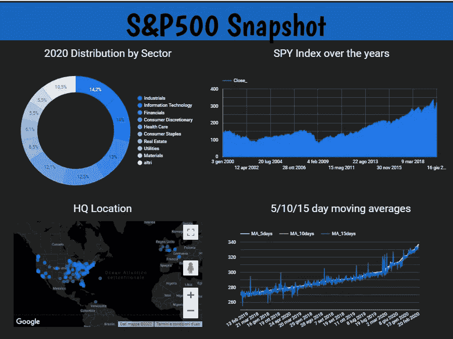

# 如何使用 Big Query & Data Studio 在 Google Cloud 上处理和可视化财务数据

> 原文：<https://towardsdatascience.com/how-to-process-and-visualize-financial-data-on-google-cloud-with-big-query-data-studio-f37c2417d4ef?source=collection_archive---------35----------------------->

## GCP 从业者从金融数据开始的教程


卢卡斯·布拉塞克在 [Unsplash](https://unsplash.com?utm_source=medium&utm_medium=referral) 上的照片

# 介绍

本文将向您展示使用 Google 云平台的 BigQuery 处理股票价格数据的一种方法，并使用 Google Data Studio 在处理后的数据上构建一个简单的仪表板。

学习这样做对于任何希望自动从股票价格洞察中发现结果，并且正在寻找一种高效快速的方法将整个过程存储在云平台上的人来说都是非常有用的。

*这篇文章是上一篇文章的延续，或者说是“第二部分”，在上一篇文章中，我展示了如何使用 API 和 Google Cloud****用 Python 自动收集金融数据。*** *如果您对这个工作流的上游数据导入和脚本自动化方面感兴趣，请随意阅读。如果没有，就跳过并继续阅读。*

# 步骤 1:识别 BigQuery 的数据源

[**Google big query**](https://cloud.google.com/bigquery?hl=it)是 **GoogleCloud** 的数据仓库解决方案(众多解决方案中的一个)，非常适合处理本教程中的关系数据。

在第 1 部分中，我展示了如何使用[云函数](https://cloud.google.com/functions)将数据自动送入 BigQuery。在下一步中，您将使用相同的数据源(来自 S & P500 公司的每日股票价格数据，以及相关的映射表，这将允许我们使用一些分类变量来丰富数据)来构建简单的& neat 处理和数据可视化管道。

*注意:下面的截图将取自我自己的 GCP 控制台(我已经将意大利语设置为默认语言)。我已经记录了每个带有解释的截图，这样每个人都可以用英语理解。*

首先，一旦登录到 BigQuery 的编辑器，并且假设您已经[设置了数据集](https://cloud.google.com/bigquery/docs/datasets)，您可以通过简单地点击编辑器页面左侧的“Resources”选项卡来识别上传的数据源。


作者截图

这允许您立即获得数据集列表以及每个数据集中包含的表。

对于这个练习，我的数据仓库结构如下*(我将忽略上面截图中报告的 USA_SectorViews 表):*

**数据集**:**CSM**

**表格**:

1.  ***sp components****:*标识标准普尔 500 成员公司完整列表的表格(来源:[标准普尔 500 公司列表](https://en.wikipedia.org/wiki/List_of_S%26P_500_companies))

该表中的大多数列与上面的源链接中报告的完全相同，因此您可以直接使用该网页作为参考。


SPComponents 表中的快照

**②*。历史*** *:* 包含从 2000 年到 2020 年 6 月所有标准普尔 500 指数成员公司每日股票价格信息的表格。


SPhistorical 表的快照，包含所有列出的列

# 步骤 2:计算股票指标，并在保存的 SQL 查询中合并分类变量

使用上面的两个表，让我们使用 BigQuery 的 SQL 编辑器处理数据，以导出一个包含股票价格指标和分类变量的综合表。

出于本示例的目的，最终输出表将以下列为特征:

***时间戳*** :每行和每只股票的日期键

***符号*** :每个 S & P500 公司的股票标识符

[***【GICS】***](https://www.msci.com/gics)***_ Sector:***列表示各公司所属的行业(医疗保健、消费等..)

***总部:****各事务所总部所在地*

****百分比 _ 每日 _ 回报:*** 每只股票的每日回报(基于收盘价)*

****MA_5_days:*** 股票前 5 天的移动平均线，期间的参照是当前行的日期。基于接近的价格。*

****MA_10_days:*** 股票前 10 天的移动平均线，其中期间的参照是当前行的日期。基于接近的价格。*

****MA_15_days:*** 股票前 15 天的移动平均线，期间参照为当前行的日期。基于接近的价格。*

**计算移动平均线的周期选择没有内在原因，只是为了走查而计算的。你绝对可以在网上了解更多关于均线的知识，因为有很多* [*有价值的教程*](https://therobusttrader.com/moving-average/) *。**

*使用我们的两个表，您可以看到您有大多数列 ***(时间戳，***[***【GICS】***](https://www.msci.com/gics)***_ 扇区，总部)*** 已经准备就绪。*

*使用 ***历史*** 表中的*收盘*价格列，您可以计算剩余的列(Percentage_Daily_Returns 和股票在 5–10–15 天期间的移动平均值)。*

*首先，让我们计算一下每只股票的日收益率。股票回报的计算方法是任意两天的收盘价之差，用前一天收盘价的百分比表示。*

```
*ROUND(((CAST(Close AS float64)-CAST(LAG(Close,1) OVER(PARTITION BY p.Symbol ORDER BY Timestamp) AS float64))/CAST(Close AS float64))*100,2) AS Percentage_Daily_Return*
```

*您可以使用 *LAG* 函数来识别前一天的*收盘*(仅针对每个股票代码，因为您不想根据不同的股票价格计算收益；因此使用*OVER(PARTITION BY Symbol))*，取其与当天的*收盘*之差，除以当天的*收盘*价格来计算收益。*

*这是计算的本质。然后，您可以使用 *CAST* 函数将文本数据类型转换为浮点数，以便能够对数字进行加法和除法运算，而 *ROUND* 函数将返回两位小数。*

**如果你的数据类型已经是正确的，你可以避免使用 CAST 函数..)**

*股票在 5 天内的移动平均线计算如下:*

```
*AVG(CAST(Close AS float64)) OVER (PARTITION BY p.Symbol ORDER BY Timestamp ROWS BETWEEN 4 PRECEDING AND CURRENT ROW) AS MA_5day*
```

*您可以使用 *AVG* 函数来计算每个不同*符号*的*收盘*价格的平均值，考虑由当天收盘和组成 5 天时间段的前 4 天组成的行窗口。*

*同样的逻辑在 10 天和 15 天内重复。*

```
*AVG(CAST(Close AS float64)) OVER (PARTITION BY p.Symbol ORDER BY Timestamp ROWS BETWEEN 9 PRECEDING AND CURRENT ROW) AS MA_10daysAVG(CAST(Close AS float64)) OVER (PARTITION BY p.Symbol ORDER BY Timestamp ROWS BETWEEN 14 PRECEDING AND CURRENT ROW) AS MA_15days*
```

*将所有内容放在一起，您将获得以下 SQL 查询:*

**

*作者截图*

*总之，该查询从 *SPhistorical* (别名为" *p* ")和 *SPcomponent* s 表(别名为" *c* ")中提取。使用相互的*符号*列作为键来连接这两个表。*

*我使用 *SPhistorical* 表作为两者之间的主要参考表。因此我定义了一个左连接，通过它我从 *SPcomponents* 带来我感兴趣的分类变量( *GICS_Sector &总部*)。*

**时间戳*、*符号*、每日*收盘*均从 *p* 拉取。分类变量*GICS _ 部门*和*总部*从 *c* 中提取。在每日收盘时，将进行上述计算。*

*然后，该表按相关变量分组，并按*符号*和*时间戳*排序。您启动查询，等待 BigQuery 进行计算和执行，并在不久后获得结果。*

**

*作者截图*

*然后，您可以优化您的查询，计算新的指标，并尽可能多次地重新运行，以获得您想要的输出。另外，不要忘记通过点击“执行”按钮旁边的“保存查询”按钮，将您的查询保存为“已保存查询”。点击查看更多信息[。](https://cloud.google.com/bigquery/docs/saving-sharing-queries)*

*完成后，您就可以将查询结果用作 Data Studio 仪表板的数据源层了。*

# *步骤 3:从 Data Studio 中，连接到保存的查询并将数据拖到仪表板上*

***选项 1:***

*你现在可以跳到你的[数据工作室账户](https://cloud.google.com/bi-engine/docs/getting-started-data-studio)上，点击加号开始一个新的报告。*

**

*作者截图*

*在这里，您可以选择各种数据连接器:*

**

*作者截图*

*选择 **BigQuery** 后，您只需点击**导入个性化查询**并粘贴到我们在第 3 步构建的已保存查询中。完成后，点击**添加**。*

**

*作者截图*

*假设您已连接，数据将被提取，然后您将看到一个空白的报告视图，您可以从该视图开始构建您的仪表板。注意如何选择 **BigQuery 作为我的数据源**。*

**

*作者截图*

***选项 2:***

*在 BigQuery 内，你可以点击“探索数据”>“用 Data Studio 探索”。*

**

*作者截图*

*单击此处，将弹出一个 Data Studio 数据探索窗格，您将能够开始绘制和可视化数据。这对于进行快速分析和获得查询结果的直观感觉特别有用。*

**

*作者截图*

# *第 4 步:使用 Google Data Studio 探索数据*

*在这一步，如果您的最终目标是构建一个完整的仪表板或可视化报告，您可能更喜欢选择选项 1。*

*我还会选择这个选项，以便在探索数据时获得更多的灵活性( [space exploration 功能](https://support.google.com/datastudio/answer/9005651?hl=en)在撰写本文时仍处于测试版本)。*

*为了更深入地了解数据并概述 Data Studio 的功能，我将回答以下问题:*

> ***1)2020 年标准普尔 500 指数由哪些主要行业组成？***
> 
> ***2)这些公司在地理上是如何分布的(就总部基地而言)？***
> 
> ***3)历史上** [**间谍**](https://www.etf.com/SPY#overview) ***表现如何？***
> 
> *对于间谍来说，移动平均线的最新趋势如何？*
> 
> **跟踪整个 S&P500 的指数基金。在[第 1 部分](/how-to-automate-financial-data-collection-with-python-using-tiingo-api-and-google-cloud-platform-b11d8c9afaa1?source=your_stories_page---------------------------)中，除了每个 S & P500 个体成员之外，我还包括了间谍，我将在这里使用它*

*总的来说，Data Studio 相当简单地充当了一个直观的拖放界面，用户可以在不同的图表类型中进行选择，并根据自己处理的数据对它们进行样式/格式设置。*

**在* [*这个*](https://support.google.com/datastudio/answer/6378181?hl=en) *链接，你还可以参考一个很棒的指南，它非常详细地说明了它们的整个界面。**

*现在让我们看看不同的图表类型如何帮助回答上述问题。*

> ***1)2020 年构成 S & P500 的主要行业板块有哪些？***

*为了解决第一个问题，饼图似乎是一个不错的选择。有关在 Data Studio 上向空白报告添加图表的详细信息，请参考本[快速指南](https://support.google.com/datastudio/answer/6293184?hl=en) e。*

**

*作者截图*

*S&P500 在各产业部门之间很平衡。按流行程度排列的前三名是工业、信息技术和金融，约占总数的 13-14%。*

> *这些公司在地理上是如何分布的(就总部而言)？*

**

*作者截图*

*就总部所在地而言，正如所料，我们可以看到美国公司占主导地位，也有一些欧洲公司。使用地图时，您可以充分利用工具栏进行放大和缩小，进入全屏模式，以及整体调整地图视图。*

> *[**间谍**](https://www.etf.com/SPY#overview) ***历史表现如何？***

**

*接下来，我用折线图绘制了这些年来的每日收盘图，以了解其趋势。*

*从长远来看，间谍的价值从 150 到 300+左右，稳定增长。*

> *对于间谍来说，移动平均线的最新趋势如何？*

*然后我画出最近 5/10/15 日的移动平均线，看它们如何相互叠加。在为这三个指标选择了相似的时间尺度后，您可以看到，总体而言，它们倾向于非常紧密地相互跟踪，15 天周期的平均值显示了围绕总体趋势线的更多可变性。*

**

**计算移动平均线的周期选择没有内在原因，只是为了绘制而进行计算。你肯定可以在网上了解更多关于均线的知识，因为有很多* [*有价值的教程*](https://therobusttrader.com/moving-average/) *。**

*将所有内容放在一起，您可以为您的报告添加标题，并获得类似于以下内容的内容:*

**

*作者截图*

*这允许您获得您感兴趣的数据和指标的完整快照。*

*正如您所看到的，Data Studio 使用起来非常简单，并且提供了很好的数据连接器和交互性。*

# *后续步骤*

*您的工作流程正式建立。您可以保存所有的 BigQuery SQL 查询和 Data Studio 报告，并在新数据到来时刷新/扩展资源。*

*我希望给你看了一些有用的东西。你可以使用 [GCP 的免费账户](https://cloud.google.com/free/?utm_source=google&utm_medium=cpc&utm_campaign=emea-gb-all-en-dr-bkws-all-all-trial-e-gcp-1008073&utm_content=text-ad-none-any-DEV_c-CRE_431053247446-ADGP_Hybrid+%7C+AW+SEM+%7C+BKWS+~+EXA_M:1_GB_EN_General_Cloud_gcp+free+tier-KWID_43700053279219280-aud-606988878374:kwd-310728589823-userloc_9045999&utm_term=KW_gcp%20free%20tier-NET_g-PLAC_&gclid=Cj0KCQjwwr32BRD4ARIsAAJNf_3F3Fl-IXzaeYmwDyaiogohf87-x3pMWRVqc_MEEvGdgeNLjBIEHawaAl7kEALw_wcB)开始用你自己的数据构建你的谷歌云解决方案。*

*非常感谢您的阅读！*

***访问我的免费数据科学资源清单** [**这里**](https://landing.mailerlite.com/webforms/landing/k1n3r2)*

*[](https://edo-romani1.medium.com/membership) [## 通过我的推荐链接加入 Medium-Edoardo Romani

### 作为一个媒体会员，你的会员费的一部分会给你阅读的作家，你可以完全接触到每一个故事…

edo-romani1.medium.com](https://edo-romani1.medium.com/membership)*